# Creating Custom Autonomous Control Mode in PX4 Minimal

## Table of Contents
1. [Overview](#overview)
2. [Architecture Options](#architecture-options)
3. [Implementation Approaches](#implementation-approaches)
4. [Step-by-Step Implementation](#step-by-step-implementation)
5. [Code Examples](#code-examples)
6. [Integration with Minimal Commander](#integration-with-minimal-commander)
7. [Testing and Debugging](#testing-and-debugging)

---

## Overview

You want to implement **autonomous flight with your own control law** without relying on MAVLink commands. This means creating a **self-contained module** that:

1. ✅ Generates its own setpoints (position, velocity, attitude, or rate)
2. ✅ Implements custom control algorithms
3. ✅ Runs independently after arming
4. ✅ Doesn't require external commands

### Use Cases
- 🎯 Research on novel control algorithms (adaptive, learning-based, optimal)
- 🤖 Autonomous behaviors (circle flying, figure-8, trajectory tracking)
- 🧪 Testing control theory implementations
- 🔬 Academic experiments with repeatable autonomous behavior

---

## Architecture Options

### Option 1: Custom Setpoint Generator Module (Recommended)

**Best for:** Simple geometric trajectories, predefined missions


### Option 2: Custom Controller Module (Advanced)

**Best for:** Novel control algorithms, learning-based control, nonlinear controllers

```mermaid
graph TB
    subgraph "Your Custom Module"
        CUSTOM_CTRL[Custom Controller<br/>YOUR CONTROL LAW<br/>State → Torque/Thrust]
    end
    
    subgraph "Existing Chain"
        ALLOC[Control Allocator]
        MOTORS[Motors]
    end
    
    subgraph "Estimation"
        EKF[EKF2<br/>State Estimation]
        SENSORS[Sensors]
    end
    
    SENSORS --> EKF
    EKF -->|vehicle_attitude<br/>vehicle_angular_velocity<br/>vehicle_local_position| CUSTOM_CTRL
    
    CUSTOM_CTRL -->|vehicle_torque_setpoint<br/>OR<br/>vehicle_thrust_setpoint| ALLOC
    ALLOC -->|actuator_motors| MOTORS
    
    style CUSTOM_CTRL fill:#ff99cc
```



### Option 3: Hybrid Approach

**Best for:** High-level planning + low-level control


---

## Implementation Approaches

### Approach A: Setpoint Generator (Easiest) ⭐ Recommended for Beginners

**Complexity:** Low  
**Control:** Rate setpoints only  
**Use case:** Predefined trajectories (circle, figure-8, waypoints)

You publish to existing topics, leverage existing rate controller:
- ✅ Minimal code changes
- ✅ Use proven rate controller
- ✅ Quick to implement

### Approach B: Full Custom Controller (Advanced)

**Complexity:** High  
**Control:** Complete control law from state to torque  
**Use case:** Research on novel controllers (MPC, adaptive, neural)

You implement everything from scratch:
- 🎓 Full control over algorithm
- 🔬 Research-grade flexibility
- ⚠️ Must handle edge cases

### Approach C: Replace mc_rate_control (Expert)

**Complexity:** Very High  
**Control:** Complete replacement of rate controller  
**Use case:** Fundamentally different control approach

You replace the existing rate controller entirely:
- 🚀 Maximum flexibility
- ⚠️ Must implement all safety features
- 🧪 Full responsibility for stability

---

## Step-by-Step Implementation

## 🎯 Example: Autonomous Circle Flight

Let's implement **Option A** - A setpoint generator that makes the drone fly in a circle autonomously.

### Step 1: Create Module Structure

```bash
cd /Users/gauravsinghbhati/Documents/PX4_minimal
mkdir -p src/modules/autonomous_circle
```

Create the module files:

**File: `src/modules/autonomous_circle/autonomous_circle.cpp`**

```cpp
/**
 * @file autonomous_circle.cpp
 * Autonomous circle flight - generates rate setpoints autonomously
 */

#include <px4_platform_common/module.h>
#include <px4_platform_common/module_params.h>
#include <px4_platform_common/px4_work_queue/ScheduledWorkItem.hpp>

#include <uORB/Publication.hpp>
#include <uORB/Subscription.hpp>
#include <uORB/topics/vehicle_status.h>
#include <uORB/topics/vehicle_rates_setpoint.h>
#include <uORB/topics/vehicle_attitude.h>
#include <uORB/topics/vehicle_local_position.h>

#include <lib/mathlib/mathlib.h>

using namespace time_literals;

class AutonomousCircle : public ModuleBase<AutonomousCircle>, public ModuleParams,
	public px4::ScheduledWorkItem
{
public:
	AutonomousCircle();
	~AutonomousCircle() override = default;

	/** @see ModuleBase */
	static int task_spawn(int argc, char *argv[]);

	/** @see ModuleBase */
	static int custom_command(int argc, char *argv[]);

	/** @see ModuleBase */
	static int print_usage(const char *reason = nullptr);

	bool init();

private:
	void Run() override;

	// Parameters
	DEFINE_PARAMETERS(
		(ParamFloat<px4::params::CIRCLE_RADIUS>) _param_circle_radius,
		(ParamFloat<px4::params::CIRCLE_SPEED>) _param_circle_speed,
		(ParamFloat<px4::params::CIRCLE_HEIGHT>) _param_circle_height
	)

	// Subscriptions
	uORB::Subscription _vehicle_status_sub{ORB_ID(vehicle_status)};
	uORB::Subscription _vehicle_attitude_sub{ORB_ID(vehicle_attitude)};
	uORB::Subscription _vehicle_local_position_sub{ORB_ID(vehicle_local_position)};

	// Publications
	uORB::Publication<vehicle_rates_setpoint_s> _vehicle_rates_setpoint_pub{ORB_ID(vehicle_rates_setpoint)};

	// State variables
	uint64_t _mission_start_time{0};
	bool _mission_started{false};
	
	// Circle parameters
	float _circle_angle{0.0f}; // Current angle in circle [rad]
	matrix::Vector2f _circle_center{0.0f, 0.0f}; // Circle center in local NED
};

AutonomousCircle::AutonomousCircle() :
	ModuleParams(nullptr),
	ScheduledWorkItem(MODULE_NAME, px4::wq_configurations::rate_ctrl)
{
}

bool AutonomousCircle::init()
{
	ScheduleOnInterval(10_ms); // 100 Hz
	return true;
}

void AutonomousCircle::Run()
{
	if (should_exit()) {
		ScheduleClear();
		exit_and_cleanup();
		return;
	}

	// Check if armed
	vehicle_status_s vehicle_status;
	if (!_vehicle_status_sub.copy(&vehicle_status)) {
		return;
	}

	bool armed = (vehicle_status.arming_state == vehicle_status_s::ARMING_STATE_ARMED);

	if (!armed) {
		// Reset mission when disarmed
		_mission_started = false;
		_mission_start_time = 0;
		_circle_angle = 0.0f;
		return;
	}

	// Get current position
	vehicle_local_position_s local_pos;
	if (!_vehicle_local_position_sub.copy(&local_pos)) {
		return;
	}

	// Start mission on first armed cycle
	if (!_mission_started) {
		_mission_started = true;
		_mission_start_time = hrt_absolute_time();
		
		// Set circle center at current position
		_circle_center(0) = local_pos.x;
		_circle_center(1) = local_pos.y;
		
		PX4_INFO("Autonomous circle mission started!");
		PX4_INFO("Center: (%.2f, %.2f), Radius: %.2f m, Speed: %.2f m/s",
			(double)_circle_center(0), (double)_circle_center(1),
			(double)_param_circle_radius.get(), (double)_param_circle_speed.get());
	}

	// Calculate circle trajectory
	float dt = 0.01f; // 100 Hz
	float radius = _param_circle_radius.get();
	float speed = _param_circle_speed.get();
	float target_height = _param_circle_height.get();
	
	// Angular velocity for circle
	float omega = speed / radius; // rad/s
	_circle_angle += omega * dt;
	
	if (_circle_angle > 2.0f * M_PI_F) {
		_circle_angle -= 2.0f * M_PI_F;
	}

	// Desired position on circle (NED frame)
	float desired_x = _circle_center(0) + radius * cosf(_circle_angle);
	float desired_y = _circle_center(1) + radius * sinf(_circle_angle);
	float desired_z = -target_height; // Negative because NED (down is positive)
	
	// Desired velocity (tangent to circle)
	float desired_vx = -speed * sinf(_circle_angle);
	float desired_vy = speed * cosf(_circle_angle);
	float desired_vz = 0.0f;

	// Simple proportional control for position
	float Kp_pos = 0.5f;
	float Kp_vel = 1.0f;
	
	// Position error
	float error_x = desired_x - local_pos.x;
	float error_y = desired_y - local_pos.y;
	float error_z = desired_z - local_pos.z;
	
	// Velocity error
	float error_vx = desired_vx - local_pos.vx;
	float error_vy = desired_vy - local_pos.vy;
	float error_vz = desired_vz - local_pos.vz;
	
	// Desired acceleration
	float accel_x = Kp_pos * error_x + Kp_vel * error_vx;
	float accel_y = Kp_pos * error_y + Kp_vel * error_vy;
	float accel_z = Kp_pos * error_z + Kp_vel * error_vz;
	
	// Convert acceleration to attitude (simplified)
	// For small angles: roll ≈ -accel_y/g, pitch ≈ accel_x/g
	const float g = 9.81f;
	float desired_roll = -accel_y / g;
	float desired_pitch = accel_x / g;
	float desired_yaw_rate = omega; // Turn at same rate as circle
	
	// Limit tilt angles
	float max_tilt = math::radians(15.0f); // 15 degrees max
	desired_roll = math::constrain(desired_roll, -max_tilt, max_tilt);
	desired_pitch = math::constrain(desired_pitch, -max_tilt, max_tilt);
	
	// Get current attitude
	vehicle_attitude_s attitude;
	if (!_vehicle_attitude_sub.copy(&attitude)) {
		return;
	}
	
	// Convert quaternion to Euler angles
	matrix::Eulerf euler(matrix::Quatf(attitude.q));
	
	// Attitude control (P controller)
	float Kp_att = 2.0f;
	float roll_rate_sp = Kp_att * (desired_roll - euler.phi());
	float pitch_rate_sp = Kp_att * (desired_pitch - euler.theta());
	float yaw_rate_sp = desired_yaw_rate;
	
	// Limit rates
	float max_rate = math::radians(90.0f); // 90 deg/s
	roll_rate_sp = math::constrain(roll_rate_sp, -max_rate, max_rate);
	pitch_rate_sp = math::constrain(pitch_rate_sp, -max_rate, max_rate);
	yaw_rate_sp = math::constrain(yaw_rate_sp, -max_rate, max_rate);
	
	// Calculate thrust (hover thrust + altitude correction)
	float hover_thrust = 0.5f; // Nominal hover
	float Kp_alt = 0.3f;
	float thrust = hover_thrust + Kp_alt * error_z + Kp_vel * error_vz;
	thrust = math::constrain(thrust, 0.1f, 0.9f);

	// Publish rate setpoints
	vehicle_rates_setpoint_s rates_setpoint{};
	rates_setpoint.timestamp = hrt_absolute_time();
	rates_setpoint.roll = roll_rate_sp;
	rates_setpoint.pitch = pitch_rate_sp;
	rates_setpoint.yaw = yaw_rate_sp;
	rates_setpoint.thrust_body[0] = 0.0f;
	rates_setpoint.thrust_body[1] = 0.0f;
	rates_setpoint.thrust_body[2] = -thrust; // Negative because NED
	
	_vehicle_rates_setpoint_pub.publish(rates_setpoint);
}

int AutonomousCircle::task_spawn(int argc, char *argv[])
{
	AutonomousCircle *instance = new AutonomousCircle();

	if (instance) {
		_object.store(instance);
		_task_id = task_id_is_work_queue;

		if (instance->init()) {
			return PX4_OK;
		}

	} else {
		PX4_ERR("alloc failed");
	}

	delete instance;
	_object.store(nullptr);
	_task_id = -1;

	return PX4_ERROR;
}

int AutonomousCircle::custom_command(int argc, char *argv[])
{
	return print_usage("unknown command");
}

int AutonomousCircle::print_usage(const char *reason)
{
	if (reason) {
		PX4_WARN("%s\n", reason);
	}

	PRINT_MODULE_DESCRIPTION(
		R"DESCR_STR(
### Description
Autonomous circle flight controller.
Generates rate setpoints to fly in a circle autonomously after arming.

)DESCR_STR");

	PRINT_MODULE_USAGE_NAME("autonomous_circle", "controller");
	PRINT_MODULE_USAGE_COMMAND("start");
	PRINT_MODULE_USAGE_DEFAULT_COMMANDS();

	return 0;
}

extern "C" __EXPORT int autonomous_circle_main(int argc, char *argv[])
{
	return AutonomousCircle::main(argc, argv);
}
```

---

### Step 2: Create CMakeLists.txt

**File: `src/modules/autonomous_circle/CMakeLists.txt`**

```cmake
############################################################################
#
# Autonomous Circle Module
#
############################################################################

px4_add_module(
	MODULE modules__autonomous_circle
	MAIN autonomous_circle
	SRCS
		autonomous_circle.cpp
	DEPENDS
		px4_work_queue
	MODULE_CONFIG
		module.yaml
)
```

---

### Step 3: Create Parameters File

**File: `src/modules/autonomous_circle/module.yaml`**

```yaml
module_name: Autonomous Circle

parameters:
    - group: Autonomous Circle
      definitions:
          CIRCLE_RADIUS:
              description:
                  short: Circle radius
                  long: Radius of the autonomous circle trajectory in meters
              type: float
              default: 5.0
              min: 1.0
              max: 50.0
              unit: m
              decimal: 1
          
          CIRCLE_SPEED:
              description:
                  short: Circle speed
                  long: Tangential speed around the circle
              type: float
              default: 2.0
              min: 0.5
              max: 10.0
              unit: m/s
              decimal: 1
          
          CIRCLE_HEIGHT:
              description:
                  short: Flight height
                  long: Target altitude above ground for circle flight
              type: float
              default: 2.0
              min: 0.5
              max: 10.0
              unit: m
              decimal: 1
```

---

### Step 4: Enable Module in Board Configuration

**File: `boards/px4/sitl/default.px4board`**

Add your module:

```cmake
# ... existing config ...

CONFIG_MODULES_AUTONOMOUS_CIRCLE=y

# ... rest of config ...
```

---

### Step 5: Add to ROMFS Startup Script

**File: `ROMFS/px4fmu_common/init.d-posix/rcS`** (or your custom startup)

```bash
# Start autonomous circle module
autonomous_circle start

# ... rest of startup ...
```

---

## Alternative: Simpler Approach Without New Module

If you don't want to create a full module, you can **modify minimal_commander** to include autonomous behavior:

### Modified Minimal Commander with Autonomous Mode

```cpp
// Add to minimal_commander.cpp

enum class FlightMode {
    MANUAL,
    OFFBOARD,
    AUTONOMOUS_CIRCLE  // <-- NEW
};

class MinimalCommander {
private:
    FlightMode _flight_mode{FlightMode::MANUAL};
    
    // Circle mission state
    bool _circle_mission_active{false};
    uint64_t _circle_mission_start{0};
    float _circle_angle{0.0f};
    matrix::Vector2f _circle_center{0.0f, 0.0f};
    
    // Publications
    uORB::Publication<vehicle_rates_setpoint_s> _rates_setpoint_pub{ORB_ID(vehicle_rates_setpoint)};
    
    void run_autonomous_circle() {
        // Same circle logic as above
        float dt = 0.01f;
        float radius = 5.0f;  // meters
        float speed = 2.0f;   // m/s
        
        // Generate rate setpoints...
        vehicle_rates_setpoint_s rates_sp{};
        // ... fill in setpoints ...
        _rates_setpoint_pub.publish(rates_sp);
    }
    
public:
    void Run() override {
        // Check mode
        if (_flight_mode == FlightMode::AUTONOMOUS_CIRCLE && _armed) {
            run_autonomous_circle();
        } else if (_flight_mode == FlightMode::OFFBOARD) {
            // Let MAVLink commands control
        }
        
        // Publish status
        publish_vehicle_status();
    }
    
    // Add custom command to switch modes
    void set_autonomous_mode() {
        _flight_mode = FlightMode::AUTONOMOUS_CIRCLE;
        _circle_mission_active = true;
        PX4_INFO("Switched to AUTONOMOUS_CIRCLE mode");
    }
};
```

You can trigger autonomous mode via:
- Custom MAVLink command
- RC switch
- Console command: `commander mode autonomous`

---

## Integration Patterns

### Pattern 1: Mode-Based Switching


### Pattern 2: Priority-Based Control

```cpp
void MinimalCommander::Run() {
    // Priority 1: Emergency stop
    if (emergency_detected()) {
        disarm();
        return;
    }
    
    // Priority 2: Manual override (RC)
    if (rc_manual_override()) {
        // Let RC control
        return;
    }
    
    // Priority 3: Autonomous mission
    if (_autonomous_mission_active && _armed) {
        generate_autonomous_setpoints();
        return;
    }
    
    // Priority 4: Offboard (MAVLink)
    if (_offboard_active) {
        // Let MAVLink control
        return;
    }
    
    // Default: Hover/idle
    generate_hover_setpoints();
}
```

---

## Advanced Examples

### Example 1: Trajectory Tracking with Feedforward

```cpp
void AutonomousTrajectory::generate_trajectory_setpoint(float t) {
    // Reference trajectory (e.g., minimum snap)
    matrix::Vector3f pos_ref = compute_position(t);
    matrix::Vector3f vel_ref = compute_velocity(t);
    matrix::Vector3f accel_ref = compute_acceleration(t);
    matrix::Vector3f jerk_ref = compute_jerk(t);
    
    // Get current state
    matrix::Vector3f pos = get_current_position();
    matrix::Vector3f vel = get_current_velocity();
    
    // Tracking error
    matrix::Vector3f pos_error = pos_ref - pos;
    matrix::Vector3f vel_error = vel_ref - vel;
    
    // PD control with feedforward
    matrix::Vector3f accel_cmd = accel_ref + 
                                 _Kp * pos_error + 
                                 _Kd * vel_error;
    
    // Convert to attitude + thrust
    auto [roll, pitch, thrust] = accel_to_attitude(accel_cmd);
    
    // Attitude to rates (with derivative of reference)
    float yaw_rate = compute_yaw_rate_from_trajectory(t);
    
    // Publish
    publish_rate_setpoint(roll_rate, pitch_rate, yaw_rate, thrust);
}
```

### Example 2: Model Predictive Control (MPC)

```cpp
void MPCController::Run() {
    // Prediction horizon
    const int N = 10;
    const float dt = 0.1f;
    
    // Get current state
    State x0 = get_current_state();
    
    // Solve optimization problem
    // min  Σ (||x_k - x_ref||²_Q + ||u_k||²_R)
    // s.t. x_{k+1} = f(x_k, u_k)
    //      u_min <= u_k <= u_max
    //      constraints on states
    
    OptimizationResult result = solve_mpc(x0, N, dt);
    
    // Apply first control input
    apply_control(result.u[0]);
    
    // Publish rate setpoint
    publish_setpoint(result.u[0]);
}
```

### Example 3: Adaptive Control

```cpp
class AdaptiveController {
private:
    // Parameter estimates
    matrix::Vector<float, 10> _theta_hat;
    
    // Adaptation gain
    float _gamma = 0.1f;
    
public:
    void Run() {
        // Get state
        State x = get_state();
        
        // Reference model
        State x_m = reference_model(x);
        
        // Tracking error
        matrix::Vector3f e = x.pos - x_m.pos;
        
        // Regressor (basis functions)
        matrix::Matrix<float, 3, 10> Phi = compute_regressor(x);
        
        // Control law
        matrix::Vector3f u = -_theta_hat.transpose() * Phi.transpose();
        
        // Adaptation law (gradient descent)
        // θ̇ = -Γ Φᵀ e
        _theta_hat += _gamma * Phi.transpose() * e * dt;
        
        // Apply control
        apply_control(u);
    }
};
```

---

## Testing Your Autonomous Mode

### Test Script

```python
#!/usr/bin/env python3
"""
Test autonomous circle flight
"""

from pymavlink import mavutil
import time

# Connect
master = mavutil.mavlink_connection('udp://127.0.0.1:14540')
master.wait_heartbeat()
print("Heartbeat received")

# Arm
master.mav.command_long_send(
    master.target_system,
    master.target_component,
    mavutil.mavlink.MAV_CMD_COMPONENT_ARM_DISARM,
    0, 1, 0, 0, 0, 0, 0, 0
)
print("Arming...")
time.sleep(2)

# Autonomous mode will start automatically after arming
print("Autonomous circle mission running...")
print("Monitoring for 30 seconds...")

start_time = time.time()
while time.time() - start_time < 30:
    # Monitor position
    msg = master.recv_match(type='LOCAL_POSITION_NED', blocking=True, timeout=1)
    if msg:
        print(f"Position: x={msg.x:.2f}, y={msg.y:.2f}, z={msg.z:.2f}")
    time.sleep(1)

# Disarm
master.mav.command_long_send(
    master.target_system,
    master.target_component,
    mavutil.mavlink.MAV_CMD_COMPONENT_ARM_DISARM,
    0, 0, 0, 0, 0, 0, 0, 0
)
print("Disarmed")
```

---

## Debugging Tips

### 1. Check Module is Running

```bash
# In PX4 console
px4> autonomous_circle status

# Should show:
# Running: yes
# Mission active: yes
# Circle angle: 1.234 rad
```

### 2. Monitor Topics

```bash
# Check rate setpoints being published
px4> listener vehicle_rates_setpoint

# Check position
px4> listener vehicle_local_position
```

### 3. Log Analysis

```bash
# After flight, analyze log
ulog_info log001.ulg | grep autonomous_circle
ulog_params -d log001.ulg | grep CIRCLE
```

### 4. Add Debug Prints

```cpp
// In your module
PX4_INFO("Circle: angle=%.2f, x=%.2f, y=%.2f", 
         (double)_circle_angle, (double)desired_x, (double)desired_y);
```

---

## Comparison: Offboard vs Autonomous Module

| Aspect | Offboard (MAVLink) | Autonomous Module |
|--------|-------------------|-------------------|
| **Latency** | 20-50ms (network) | 0ms (internal) |
| **Reliability** | Depends on link | 100% (no link needed) |
| **Complexity** | Simple (GCS does work) | Higher (PX4 does work) |
| **Flexibility** | Easy to change | Requires rebuild |
| **Repeatable** | Depends on GCS | Perfectly repeatable |
| **Research** | Good for prototyping | Good for final algorithm |

---

## Complete Architecture Comparison

### Before (Offboard Mode)


### After (Autonomous Module)


---

## Summary

### Quick Decision Guide

**Use Autonomous Module if:**
- ✅ You want zero-latency control
- ✅ Mission is repeatable and predefined
- ✅ You don't want external dependencies
- ✅ You're implementing research algorithms
- ✅ You want integrated logging

**Use Offboard Mode if:**
- ✅ You're prototyping
- ✅ Mission changes frequently
- ✅ You want easy debugging (Python)
- ✅ You need GUI/visualization
- ✅ You don't want to rebuild PX4

### Next Steps

1. **Start Simple:** Implement circle flight first
2. **Test Thoroughly:** Verify in SITL before hardware
3. **Add Safety:** Implement geofence, battery checks
4. **Iterate:** Add complexity gradually
5. **Document:** Keep notes on tuning parameters

---

## References

- PX4 Module Template: `src/templates/module`
- Work Queue: `platforms/common/px4_work_queue`
- Rate Controller: `src/modules/mc_rate_control`
- Parameters: `src/lib/parameters`

---

**Ready to implement your autonomous mode?** Start with the circle example and customize from there!
