# PX4 Autopilot Control Architecture Analysis for Quadcopter Vehicles

*Academic Perspective: Understanding Control Hierarchies, Rates, and Low-Level Implementation*

## Table of Contents
1. [Executive Summary](#executive-summary)
2. [PX4 Execution Flow: From Startup to Hardware](#px4-execution-flow-from-startup-to-hardware)
3. [Control Architecture Overview](#control-architecture-overview)
4. [Control Hierarchy Levels](#control-hierarchy-levels)
5. [Control Loop Frequencies and Sensor Rates](#control-loop-frequencies-and-sensor-rates)
6. [Module Architecture and Data Flow](#module-architecture-and-data-flow)
7. [Low-Level Control Implementation Points](#low-level-control-implementation-points)
8. [Academic Implementation Considerations](#academic-implementation-considerations)
9. [Performance Characteristics](#performance-characteristics)
10. [References and Key Files](#references-and-key-files)

## Executive Summary

PX4 Autopilot implements a **4-level cascaded control architecture** for quadcopter vehicles, ranging from high-level mission planning down to low-level actuator control. The system operates with different control rates at each level, optimized for real-time performance while maintaining stability and precision.

**Key Control Levels:**
- **Level 1**: Position Control (~100 Hz)
- **Level 2**: Attitude Control (~250-400 Hz)
- **Level 3**: Rate Control (~400-1000 Hz)
- **Level 4**: Control Allocation/Mixer (~400-1000 Hz)

**Additional Lower Levels Beyond Control Allocation:**
- **Level 5**: PWM Output Driver (50-8000 Hz)
- **Level 6**: Hardware Timer/Register Control (Direct hardware interface)

**Sensor Rates:**
- IMU: 2-8 kHz (raw), 200-1000 Hz (processed)
- Attitude Estimation: ~100-250 Hz
- Position Sensors: 5-100 Hz

## PX4 Execution Flow: From Startup to Hardware

### Complete Execution Chain for Quadcopter

PX4 follows this **exact execution path** from system startup to motor control:


### Key Startup Files (In Execution Order)

#### 1. **Main Entry Point**
```cpp
// File: platforms/posix/src/px4/common/main.cpp
int main(int argc, char **argv) {
    // Platform initialization
    px4::init_once();
    px4::init(argc, argv, "px4");

    // Execute startup script
    ret = run_startup_script(commands_file, absolute_binary_path, instance);
}
```

#### 2. **Startup Script Chain**
- **rcS**: `ROMFS/px4fmu_common/init.d/rcS` - Main startup script
- **rc.vehicle_setup**: Detects vehicle type and loads appropriate apps
- **rc.mc_apps**: Starts multicopter-specific control modules

#### 3. **Critical rc.mc_apps Execution**
```bash
#!/bin/sh
# File: ROMFS/px4fmu_common/init.d/rc.mc_apps
# This is THE MAIN LOOP STARTUP for quadcopters

# Start Control Allocator (Level 4)
control_allocator start

# Start Rate Controller (Level 3) - MAIN CONTROL LOOP
mc_rate_control start

# Start Attitude Controller (Level 2)
mc_att_control start

# Start Position Controller (Level 1)
mc_pos_control start

# Hardware output driver (Level 5+)
# Started separately via board-specific config
```

### Execution Trail to Lowest Level

**Control allocation is NOT the lowest level.** Here's the complete trail:

#### **Level 4: Control Allocation**
- **File**: `src/modules/control_allocator/ControlAllocator.cpp`
- **Function**: `ControlAllocator::Run()` → `allocate()` → `publishActuatorSetpoint()`

#### **Level 5: PWM Output Driver**
- **File**: `src/drivers/pwm_out/PWMOut.cpp`
- **Function**: `PWMOut::updateOutputs()` → `up_pwm_servo_set(i, outputs[i])`

#### **Level 6: Platform Hardware Interface**
- **File**: `platforms/nuttx/src/px4/stm/stm32_common/io_pins/pwm_servo.c`
- **Function**: `up_pwm_servo_set()` → `io_timer_set_ccr(channel, value)`

#### **Level 7: Hardware Timer Registers (LOWEST LEVEL)**
- **File**: `platforms/nuttx/src/px4/stm/stm32_common/include/px4_arch/io_timer_hw_description.h`
- **Function**: Direct hardware register manipulation for STM32 timers
- **Hardware**: Actual PWM signal generation to ESCs/Motors

### The Real "Main Loop" for Quadcopters

The **primary control loop** that runs continuously is in **mc_rate_control**:

```cpp
// File: src/modules/mc_rate_control/MulticopterRateControl.cpp
void MulticopterRateControl::Run() {
    // This runs at 400-1000 Hz and is the HEART of quadcopter control

    // 1. Read IMU data
    // 2. Compute rate control (lowest level controller)
    // 3. Send to control allocator
    // 4. Which sends to PWM output
    // 5. Which drives hardware timers
    // 6. Which generate PWM to ESCs
    // 7. Which spin motors
}
```

## Control Architecture Overview

PX4 employs a **cascaded control structure** where each level generates setpoints for the level below it:


### Control Loop Hierarchy with Frequencies


This architecture provides:
- **Modularity**: Each controller can be tuned independently
- **Flexibility**: Different vehicle types share common lower-level controllers
- **Performance**: High-frequency inner loops ensure fast disturbance rejection
- **Safety**: Multiple levels of constraint enforcement

## Control Hierarchy Levels

### Detailed Control Chain with Module Dependencies


### Level 1: Position Control (`mc_pos_control`)
**Location**: `src/modules/mc_pos_control/`
**Frequency**: ~100 Hz (10ms intervals)
**Purpose**: Translates position commands to attitude setpoints


**Key Characteristics:**
- Implements 3D position control (X, Y, Z)
- Generates thrust and attitude setpoints
- Handles velocity and acceleration constraints
- Contains anti-windup and saturation logic

**Control Law**: PID-based position and velocity control
```cpp
// From MulticopterPositionControl.cpp
_sample_interval_s.update(0.01f); // 100 Hz default
```

**Inputs/Outputs:**
- **Inputs**: Position setpoints, current position/velocity, vehicle status
- **Outputs**: `vehicle_attitude_setpoint`, thrust setpoint

### Level 2: Attitude Control (`mc_att_control`)
**Location**: `src/modules/mc_att_control/`
**Frequency**: Triggered by attitude updates (~250-400 Hz)
**Purpose**: Converts attitude setpoints to angular rate setpoints


**Key Characteristics:**
- Quaternion-based attitude control
- P-controller for angular error
- Implements nonlinear quadrocopter attitude control
- Handles manual flight mode inputs

**Control Law**: Based on research by Brescianini et al. (ETH Zurich)
- *"Nonlinear Quadrocopter Attitude Control (2013)"*

**Inputs/Outputs:**
- **Inputs**: `vehicle_attitude_setpoint`, current attitude
- **Outputs**: `vehicle_rates_setpoint`

### Level 3: Rate Control (`mc_rate_control`)
**Location**: `src/modules/mc_rate_control/`
**Frequency**: ~400-1000 Hz (triggered by gyro updates)
**Purpose**: Innermost control loop - converts rate setpoints to torque commands


**Key Characteristics:**
- **Highest frequency control loop** for fast disturbance rejection
- PID controller with feed-forward terms
- Direct gyroscope feedback for minimal latency
- Battery voltage compensation

**Control Law**: PID with feed-forward
```cpp
// From MulticopterRateControl.cpp
// Runs in rate_ctrl work queue for high priority
WorkItem(MODULE_NAME, px4::wq_configurations::rate_ctrl)
```

**Inputs/Outputs:**
- **Inputs**: `vehicle_rates_setpoint`, `vehicle_angular_velocity`
- **Outputs**: `vehicle_torque_setpoint`, `vehicle_thrust_setpoint`

### Level 4: Control Allocation (`control_allocator`)
**Location**: `src/modules/control_allocator/`
**Frequency**: ~400-1000 Hz (same as rate control)
**Purpose**: Maps control torques/thrust to individual actuator commands


**Key Characteristics:**
- **Lowest level before hardware interface**
- Implements mixing algorithms for different vehicle configurations
- Handles actuator constraints and saturation
- Provides failure handling and redundancy

**Algorithms:**
- Quadratic Programming optimization
- Pseudo-inverse allocation
- Sequential desaturation

**Inputs/Outputs:**
- **Inputs**: Torque/thrust setpoints from rate controller
- **Outputs**: Individual actuator commands (`actuator_outputs`)

## Control Loop Frequencies and Sensor Rates

### IMU and Sensor Rates

**Raw Sensor Rates:**
```cpp
// From various IMU drivers
static constexpr uint32_t GYRO_RATE{8000}; // 8 kHz for ICM42688P
static constexpr uint32_t RATE{2000};      // 2 kHz for BMI085
```

**Processed Sensor Rates:**
- **IMU Integration Rate**: 100-1000 Hz (configurable)
  ```c
  // From imu_parameters.c
  // @value 100 100 Hz
  // @value 200 200 Hz
  // @value 400 400 Hz
  PARAM_DEFINE_INT32(IMU_INTEG_RATE, 200);
  ```

- **Angular Velocity Publication**: 100-2000 Hz
  ```c
  // From imu_gyro_parameters.c
  // @value 400 400 Hz (default)
  // @value 800 800 Hz
  // @value 1000 1000 Hz
  PARAM_DEFINE_INT32(IMU_GYRO_RATEMAX, 400);
  ```

### Control Loop Scheduling

**Work Queue Priorities:**
1. `rate_ctrl` - Highest priority (Rate control)
2. `nav_and_controllers` - Medium priority (Position/Attitude control)
3. `hp_default` - Standard priority

**Typical Frequencies in Practice:**
- **Rate Control**: 400-1000 Hz (limited by IMU_GYRO_RATEMAX)
- **Attitude Control**: 250-400 Hz (triggered by attitude updates)
- **Position Control**: 100 Hz (fixed scheduling)
- **Control Allocation**: Same as rate control

## Module Architecture and Data Flow

### uORB Message System Architecture


### Complete Data Flow with Message Types


### Work Queue Priority Architecture


### Sensor Processing Pipeline


PX4 uses uORB (micro Object Request Broker) for inter-module communication with the key message types shown above.

### Real-Time Scheduling
- **Rate Controller**: Triggered by `vehicle_angular_velocity` updates (callback-based)
- **Attitude Controller**: Triggered by `vehicle_attitude` updates
- **Position Controller**: Fixed 100 Hz scheduling
- **Control Allocator**: Triggered by torque/thrust updates

## Low-Level Control Implementation Points

### Academic Implementation Strategy Decision Tree

```mermaid
flowchart TD
    A[Academic Control Implementation Goal] --> B{Implementation Depth Required?}

    B -->|High-Level Research<br/>Path Planning, Navigation| C[Position Controller<br/>Modification]
    B -->|Mid-Level Research<br/>Attitude Dynamics| D[Attitude Controller<br/>Modification]
    B -->|Low-Level Research<br/>Fast Control, Observers| E[Rate Controller<br/>Modification]
    B -->|Hardware-Level Research<br/>Actuator Control| F[Control Allocator<br/>or Direct Output]

    C --> G[Edit mc_pos_control/<br/>MulticopterPositionControl.cpp<br/>• Custom trajectory tracking<br/>• Advanced path planning<br/>• Obstacle avoidance]

    D --> H[Edit mc_att_control/<br/>MulticopterAttitudeControl.cpp<br/>• Nonlinear attitude control<br/>• Adaptive control<br/>• Robust control methods]

    E --> I[Edit mc_rate_control/<br/>MulticopterRateControl.cpp<br/>• Custom PID variants<br/>• State observers<br/>• Disturbance rejection]

    F --> J[Edit control_allocator/<br/>ControlAllocator.cpp<br/>• Custom mixing laws<br/>• Fault-tolerant allocation<br/>• Actuator dynamics]

    style E fill:#ffcdd2
    style I fill:#ffcdd2
    style F fill:#f8bbd9
    style J fill:#f8bbd9
```



## 🎯 Specific Files for Quadcopter Control Implementation

### **Primary Target Files for Custom Low-Level Controllers**

#### **1. Rate Controller (HIGHEST PRIORITY - RECOMMENDED)**

**File Location & Key Implementation Points:**
```
📁 src/modules/mc_rate_control/MulticopterRateControl.cpp
    ├── Line ~85:  Run() function - Main control loop entry point
    ├── Line ~100: Rate error calculation
    ├── Line ~120: PID control implementation
    ├── Line ~150: Battery voltage compensation
    └── Line ~180: Torque output generation

📁 src/modules/mc_rate_control/MulticopterRateControl.hpp
    ├── Line ~68:  Class definition and member variables
    ├── Line ~135: Parameter definitions (PID gains)
    └── Line ~98:  uORB subscriptions and publications
```

**Why This is the Best Entry Point:**
- ✅ **Highest frequency control loop** (400-1000 Hz)
- ✅ **Direct gyroscope access** with minimal latency
- ✅ **Minimal system integration** required
- ✅ **Real-time execution environment** ready
- ✅ **Safety systems remain active**

**Detailed Code Implementation Guide:**

```cpp
// In src/modules/mc_rate_control/MulticopterRateControl.cpp
void MulticopterRateControl::Run() {
    perf_begin(_loop_perf);

    // STEP 1: Get latest sensor data
    vehicle_angular_velocity_s v_angular_velocity;
    if (_vehicle_angular_velocity_sub.update(&v_angular_velocity)) {

        // STEP 2: Get rate setpoints from attitude controller
        vehicle_rates_setpoint_s v_rates_setpoint;
        _vehicle_rates_setpoint_sub.copy(&v_rates_setpoint);

        // STEP 3: Calculate rate errors
        Vector3f rates_setpoint(v_rates_setpoint.roll, v_rates_setpoint.pitch, v_rates_setpoint.yaw);
        Vector3f rates_current(v_angular_velocity.xyz);
        Vector3f rates_error = rates_setpoint - rates_current;

        // STEP 4: YOUR CUSTOM CONTROL ALGORITHM HERE
        // Replace this section with your custom controller:

        // Example: Custom PID Implementation
        Vector3f control_output = custom_pid_controller(rates_error, rates_current);

        // Example: Neural Network Controller
        // Vector3f control_output = neural_network_controller(rates_error, rates_current);

        // Example: Sliding Mode Controller
        // Vector3f control_output = sliding_mode_controller(rates_error, rates_current);

        // Example: LQR Controller
        // Vector3f control_output = lqr_controller(rates_error, rates_current);

        // STEP 5: Apply battery voltage compensation
        control_output = apply_battery_compensation(control_output);

        // STEP 6: Publish torque commands
        vehicle_torque_setpoint_s v_torque_setpoint{};
        v_torque_setpoint.timestamp = hrt_absolute_time();
        v_torque_setpoint.timestamp_sample = v_angular_velocity.timestamp_sample;
        v_torque_setpoint.xyz[0] = control_output(0); // Roll torque
        v_torque_setpoint.xyz[1] = control_output(1); // Pitch torque
        v_torque_setpoint.xyz[2] = control_output(2); // Yaw torque
        _vehicle_torque_setpoint_pub.publish(v_torque_setpoint);

        // STEP 7: Update performance counters
        updateActuatorControlsStatus(v_torque_setpoint, v_angular_velocity.dt);
    }

    perf_end(_loop_perf);
}

// Add your custom control functions here:
Vector3f MulticopterRateControl::custom_pid_controller(const Vector3f& error, const Vector3f& rates) {
    // Implement your custom PID variant
    // Access to member variables: _param_mc_rollrate_p, _param_mc_rollrate_i, etc.

    // Example custom implementation:
    static Vector3f integral_error(0.0f, 0.0f, 0.0f);
    static Vector3f previous_error(0.0f, 0.0f, 0.0f);

    // Proportional term
    Vector3f p_term = error.emult(Vector3f(_param_mc_rollrate_p.get(),
                                          _param_mc_pitchrate_p.get(),
                                          _param_mc_yawrate_p.get()));

    // Integral term
    integral_error += error * 0.001f; // dt = 1ms for 1000Hz
    Vector3f i_term = integral_error.emult(Vector3f(_param_mc_rollrate_i.get(),
                                                   _param_mc_pitchrate_i.get(),
                                                   _param_mc_yawrate_i.get()));

    // Derivative term
    Vector3f derivative = (error - previous_error) / 0.001f;
    Vector3f d_term = derivative.emult(Vector3f(_param_mc_rollrate_d.get(),
                                               _param_mc_pitchrate_d.get(),
                                               _param_mc_yawrate_d.get()));

    previous_error = error;

    return p_term + i_term + d_term;
}
```

#### **2. Control Allocation (HARDWARE-LEVEL ACCESS)**

**File Location & Key Implementation Points:**
```
📁 src/modules/control_allocator/ControlAllocator.cpp
    ├── Line ~85:  update() function - Main allocation loop
    ├── Line ~150: updateSetpoint() - Input processing
    ├── Line ~200: allocate() - Core allocation algorithm
    ├── Line ~300: updateOutput() - Actuator command generation
    └── Line ~400: Individual motor command mapping

📁 src/modules/control_allocator/ControlAllocator.hpp
    ├── Line ~80:  Class definition and core variables
    ├── Line ~120: Actuator effectiveness matrices
    └── Line ~160: Configuration parameters
```

**Custom Implementation in Control Allocator:**

```cpp
// In src/modules/control_allocator/ControlAllocator.cpp
void ControlAllocator::update() {
    // STEP 1: Get torque/thrust setpoints from rate controller
    vehicle_torque_setpoint_s torque_setpoint;
    vehicle_thrust_setpoint_s thrust_setpoint;

    if (_torque_setpoint_sub.update(&torque_setpoint) ||
        _thrust_setpoint_sub.update(&thrust_setpoint)) {

        // STEP 2: YOUR CUSTOM ALLOCATION ALGORITHM HERE

        // Standard allocation (replace with custom):
        // Matrix allocation using actuator effectiveness
        Vector<float, 4> motor_commands = custom_allocate_motors(
            Vector3f(torque_setpoint.xyz),
            Vector3f(thrust_setpoint.xyz)
        );

        // STEP 3: Apply constraints and saturation
        motor_commands = apply_motor_constraints(motor_commands);

        // STEP 4: Publish individual motor commands
        actuator_outputs_s actuator_outputs{};
        actuator_outputs.timestamp = hrt_absolute_time();
        actuator_outputs.noutputs = 4; // Quadcopter has 4 motors

        for (int i = 0; i < 4; i++) {
            actuator_outputs.output[i] = motor_commands(i);
        }

        _actuator_outputs_pub.publish(actuator_outputs);
    }
}

// Custom allocation function for quadcopter
Vector<float, 4> ControlAllocator::custom_allocate_motors(
    const Vector3f& torque, const Vector3f& thrust) {

    // Quadcopter mixing matrix (X-configuration):
    // Motor layout:  1(FR)  2(BL)
    //                3(FL)  4(BR)
    //
    // Roll:   [+1, +1, -1, -1]  (right roll positive)
    // Pitch:  [-1, +1, +1, -1]  (nose up positive)
    // Yaw:    [-1, +1, -1, +1]  (nose right positive)
    // Thrust: [+1, +1, +1, +1]  (up positive)

    float roll_cmd  = torque(0);
    float pitch_cmd = torque(1);
    float yaw_cmd   = torque(2);
    float thrust_cmd = thrust(2); // Z-axis thrust

    // Custom mixing algorithm (you can modify this):
    Vector<float, 4> motor_outputs;

    // Traditional quadcopter mixing:
    motor_outputs(0) = thrust_cmd + roll_cmd - pitch_cmd - yaw_cmd; // Motor 1 (FR)
    motor_outputs(1) = thrust_cmd + roll_cmd + pitch_cmd + yaw_cmd; // Motor 2 (BL)
    motor_outputs(2) = thrust_cmd - roll_cmd + pitch_cmd - yaw_cmd; // Motor 3 (FL)
    motor_outputs(3) = thrust_cmd - roll_cmd - pitch_cmd + yaw_cmd; // Motor 4 (BR)

    // Alternative: Neural network allocation
    // motor_outputs = neural_network_mixer(torque, thrust);

    // Alternative: Optimal allocation with constraints
    // motor_outputs = quadratic_programming_allocation(torque, thrust);

    return motor_outputs;
}
```

#### **3. Direct Hardware Interface (LOWEST LEVEL)**

**File Location & Key Implementation Points:**
```
📁 src/lib/mixer_module/mixer_module.cpp
    ├── Line ~300: updateOutputs() - Direct PWM output function
    ├── Line ~400: setAndPublishActuatorOutputs() - Hardware interface
    ├── Line ~500: output_limit_calc() - Safety limits
    └── Line ~600: PWM signal generation

📁 src/drivers/pwm_out/ (Hardware-specific PWM drivers)
📁 src/drivers/actuators/ (ESC protocol drivers - PWM, DShot, etc.)
```

**Direct Hardware Control Implementation:**

```cpp
// In src/lib/mixer_module/mixer_module.cpp
bool MixingOutput::updateOutputs(uint16_t outputs[MAX_ACTUATORS],
                                 unsigned num_outputs,
                                 unsigned num_control_groups_updated) {

    // STEP 1: YOUR CUSTOM MOTOR CONTROL HERE

    // Direct motor control bypassing all controllers:
    // Get raw sensor data
    vehicle_angular_velocity_s gyro_data;
    // (subscribe to gyro data in your custom implementation)

    // Implement direct motor control algorithm:
    uint16_t motor_pwm[4];

    // Custom control law (example):
    motor_pwm[0] = direct_motor_control_algorithm(gyro_data, 0); // Motor 1
    motor_pwm[1] = direct_motor_control_algorithm(gyro_data, 1); // Motor 2
    motor_pwm[2] = direct_motor_control_algorithm(gyro_data, 2); // Motor 3
    motor_pwm[3] = direct_motor_control_algorithm(gyro_data, 3); // Motor 4

    // STEP 2: Apply safety constraints
    for (unsigned i = 0; i < 4; i++) {
        // PWM range: 1000-2000 microseconds
        motor_pwm[i] = math::constrain(motor_pwm[i], 1000, 2000);
        outputs[i] = motor_pwm[i];
    }

    // STEP 3: Send to hardware
    return _interface.updateOutputs(outputs, num_outputs, num_control_groups_updated);
}

uint16_t direct_motor_control_algorithm(const vehicle_angular_velocity_s& gyro, int motor_id) {
    // Implement your lowest-level control algorithm here
    // Direct access to gyro measurements
    // Output PWM values (1000-2000 µs)

    // Example: Simple stabilization
    float base_throttle = 1500; // Hover throttle
    float roll_correction = gyro.xyz[0] * 100;  // Roll rate feedback
    float pitch_correction = gyro.xyz[1] * 100; // Pitch rate feedback
    float yaw_correction = gyro.xyz[2] * 50;    // Yaw rate feedback

    // Apply corrections based on motor position
    switch(motor_id) {
        case 0: // Front Right
            return base_throttle + roll_correction - pitch_correction - yaw_correction;
        case 1: // Back Left
            return base_throttle + roll_correction + pitch_correction + yaw_correction;
        case 2: // Front Left
            return base_throttle - roll_correction + pitch_correction - yaw_correction;
        case 3: // Back Right
            return base_throttle - roll_correction - pitch_correction + yaw_correction;
        default:
            return 1000; // Motor off
    }
}
```

### **Custom Module Creation (MOST FLEXIBLE APPROACH)**

**Step-by-Step Module Creation:**

#### **Step 1: Create Module Directory Structure**
```bash
# Create your custom controller module
mkdir -p src/modules/my_custom_controller
cd src/modules/my_custom_controller

# Create necessary files
touch CMakeLists.txt
touch module.yaml
touch MyCustomController.hpp
touch MyCustomController.cpp
touch my_custom_controller_main.cpp
touch my_custom_controller_params.c
```

#### **Step 2: Module Configuration Files**

**CMakeLists.txt:**
```cmake
px4_add_module(
    MODULE modules__my_custom_controller
    MAIN my_custom_controller
    COMPILE_FLAGS
    SRCS
        MyCustomController.cpp
        my_custom_controller_main.cpp
    DEPENDS
        px4_work_queue
        rate_control
        matrix
        mathlib
)
```

**module.yaml:**
```yaml
module_name: My Custom Controller
serial_config:
    - command: my_custom_controller start
      port_config_param:
        name: SENS_CUSTOM_CFG
        group: Sensors

parameters:
    - group: My Custom Controller
      definitions:
        CUSTOM_RATE_P:
            description:
                short: Custom controller proportional gain
            type: float
            default: 0.1
            min: 0.0
            max: 1.0
            decimal: 3
```

#### **Step 3: Custom Controller Implementation**

**MyCustomController.hpp:**
```cpp
#pragma once

#include <px4_platform_common/module.h>
#include <px4_platform_common/module_params.h>
#include <px4_platform_common/px4_work_queue/WorkItem.hpp>

#include <uORB/Subscription.hpp>
#include <uORB/Publication.hpp>
#include <uORB/topics/vehicle_angular_velocity.h>
#include <uORB/topics/vehicle_rates_setpoint.h>
#include <uORB/topics/actuator_outputs.h>

#include <matrix/matrix/math.hpp>
#include <lib/mathlib/mathlib.h>
#include <lib/perf/perf_counter.h>

using namespace matrix;

class MyCustomController : public ModuleBase<MyCustomController>,
                          public ModuleParams,
                          public px4::WorkItem {
public:
    MyCustomController();
    ~MyCustomController() override;

    /** @see ModuleBase */
    static int task_spawn(int argc, char *argv[]);
    static int custom_command(int argc, char *argv[]);
    static int print_usage(const char *reason = nullptr);

    bool init();

private:
    void Run() override;
    void parameters_updated();

    // Your custom control algorithm
    Vector3f custom_control_algorithm(const Vector3f& rates_error,
                                     const Vector3f& rates_current);

    // uORB subscriptions
    uORB::Subscription _vehicle_angular_velocity_sub{ORB_ID(vehicle_angular_velocity)};
    uORB::Subscription _vehicle_rates_setpoint_sub{ORB_ID(vehicle_rates_setpoint)};
    uORB::SubscriptionInterval _parameter_update_sub{ORB_ID(parameter_update), 1_s};

    // uORB publications
    uORB::Publication<actuator_outputs_s> _actuator_outputs_pub{ORB_ID(actuator_outputs)};

    // Performance monitoring
    perf_counter_t _loop_perf;
    perf_counter_t _controller_latency_perf;

    // Parameters
    DEFINE_PARAMETERS(
        (ParamFloat<px4::params::CUSTOM_RATE_P>) _param_custom_rate_p
    )
};
```

**MyCustomController.cpp:**
```cpp
#include "MyCustomController.hpp"

MyCustomController::MyCustomController() :
    ModuleBase(MODULE_NAME),
    ModuleParams(nullptr),
    WorkItem(MODULE_NAME, px4::wq_configurations::rate_ctrl), // High priority
    _loop_perf(perf_alloc(PC_ELAPSED, MODULE_NAME": cycle")),
    _controller_latency_perf(perf_alloc(PC_ELAPSED, MODULE_NAME": latency"))
{
    parameters_updated();
}

MyCustomController::~MyCustomController() {
    perf_free(_loop_perf);
    perf_free(_controller_latency_perf);
}

bool MyCustomController::init() {
    if (!_vehicle_angular_velocity_sub.registerCallback()) {
        PX4_ERR("vehicle_angular_velocity callback registration failed!");
        return false;
    }
    return true;
}

void MyCustomController::parameters_updated() {
    updateParams();
    // Update any internal parameters based on new values
}

void MyCustomController::Run() {
    perf_begin(_loop_perf);

    // Check for parameter updates
    if (_parameter_update_sub.updated()) {
        parameter_update_s param_update;
        _parameter_update_sub.copy(&param_update);
        parameters_updated();
    }

    // Get latest angular velocity data
    vehicle_angular_velocity_s v_angular_velocity;
    if (_vehicle_angular_velocity_sub.update(&v_angular_velocity)) {

        perf_begin(_controller_latency_perf);

        // Get rate setpoints
        vehicle_rates_setpoint_s v_rates_setpoint{};
        _vehicle_rates_setpoint_sub.copy(&v_rates_setpoint);

        // Calculate rate errors
        Vector3f rates_setpoint(v_rates_setpoint.roll, v_rates_setpoint.pitch, v_rates_setpoint.yaw);
        Vector3f rates_current(v_angular_velocity.xyz);
        Vector3f rates_error = rates_setpoint - rates_current;

        // YOUR CUSTOM CONTROL ALGORITHM
        Vector3f control_output = custom_control_algorithm(rates_error, rates_current);

        // Convert to motor commands (quadcopter X-configuration)
        actuator_outputs_s actuator_outputs{};
        actuator_outputs.timestamp = hrt_absolute_time();
        actuator_outputs.noutputs = 4;

        // Quadcopter mixing (modify as needed)
        float thrust_base = 0.5f; // Base thrust
        actuator_outputs.output[0] = thrust_base + control_output(0) - control_output(1) - control_output(2); // FR
        actuator_outputs.output[1] = thrust_base + control_output(0) + control_output(1) + control_output(2); // BL
        actuator_outputs.output[2] = thrust_base - control_output(0) + control_output(1) - control_output(2); // FL
        actuator_outputs.output[3] = thrust_base - control_output(0) - control_output(1) + control_output(2); // BR

        // Constrain outputs
        for (int i = 0; i < 4; i++) {
            actuator_outputs.output[i] = math::constrain(actuator_outputs.output[i], 0.0f, 1.0f);
        }

        _actuator_outputs_pub.publish(actuator_outputs);

        perf_end(_controller_latency_perf);
    }

    perf_end(_loop_perf);
}

Vector3f MyCustomController::custom_control_algorithm(const Vector3f& rates_error,
                                                     const Vector3f& rates_current) {
    // IMPLEMENT YOUR CUSTOM CONTROL ALGORITHM HERE

    // Example 1: Enhanced PID
    static Vector3f integral_error(0.0f, 0.0f, 0.0f);
    static Vector3f previous_error(0.0f, 0.0f, 0.0f);

    float dt = 0.001f; // 1kHz

    // Proportional term
    Vector3f p_term = rates_error * _param_custom_rate_p.get();

    // Integral term with windup protection
    integral_error += rates_error * dt;
    integral_error = integral_error.constrain(-0.1f, 0.1f); // Anti-windup
    Vector3f i_term = integral_error * 0.1f; // I gain

    // Derivative term
    Vector3f d_term = (rates_error - previous_error) / dt * 0.01f; // D gain
    previous_error = rates_error;

    // Example 2: Sliding Mode Controller
    // Vector3f sliding_surface = rates_error + 0.5f * rates_current;
    // Vector3f control_output = -0.1f * sliding_surface.norm() * sliding_surface.normalized();

    // Example 3: Neural Network (placeholder)
    // Vector3f control_output = neural_network_inference(rates_error, rates_current);

    return p_term + i_term + d_term;
}

// Module entry points (in my_custom_controller_main.cpp)
extern "C" __EXPORT int my_custom_controller_main(int argc, char *argv[]);

int my_custom_controller_main(int argc, char *argv[]) {
    return MyCustomController::main(argc, argv);
}
```

#### **Step 4: Integration with Build System**

**Add to board configuration file:**
```
# Edit: boards/px4/fmu-v5/default.px4board
# Add your module to the modules list:

CONFIG_MODULES_MY_CUSTOM_CONTROLLER=y
```

This comprehensive implementation guide provides you with multiple entry points for implementing custom low-level controllers in PX4, from simple rate controller modifications to complete custom modules with direct hardware access.

## 🔍 **Detailed Block-by-Block Analysis of Control Allocator**

### **YES - You CAN Define Custom Thrust Setpoints!**

The Control Allocator receives thrust setpoints via the `vehicle_thrust_setpoint` uORB topic and converts them to individual motor commands. You can inject your own thrust commands by publishing to this topic from any custom module.

### **Control Allocator Architecture - Block by Block**

#### **Block 1: Initialization & Configuration (Lines 1-100)**

```cpp
// Constructor - Sets up work queue and performance monitoring
ControlAllocator::ControlAllocator() :
    ModuleParams(nullptr),
    ScheduledWorkItem(MODULE_NAME, px4::wq_configurations::rate_ctrl), // HIGH PRIORITY
    _loop_perf(perf_alloc(PC_ELAPSED, MODULE_NAME": cycle"))
{
    // Advertise publications for actuator outputs
    _actuator_motors_pub.advertise();    // Motor commands
    _actuator_servos_pub.advertise();    // Servo commands
    _actuator_servos_trim_pub.advertise(); // Servo trim values

    // Setup parameter handles for motor/servo slew rates
    for (int i = 0; i < MAX_NUM_MOTORS; ++i) {
        char buffer[17];
        snprintf(buffer, sizeof(buffer), "CA_R%u_SLEW", i);
        _param_handles.slew_rate_motors[i] = param_find(buffer);
    }
}
```

**What This Block Does:**
- ✅ **High Priority Execution**: Runs in `rate_ctrl` work queue (same as rate controller)
- ✅ **Performance Monitoring**: Tracks execution time and performance
- ✅ **Parameter Management**: Loads slew rate limits for smooth motor transitions
- ✅ **Publisher Setup**: Prepares to publish motor/servo commands

#### **Block 2: Effectiveness Source Selection (Lines 200-280)**

```cpp
bool ControlAllocator::update_effectiveness_source()
{
    const EffectivenessSource source = (EffectivenessSource)_param_ca_airframe.get();

    if (_effectiveness_source_id != source) {
        ActuatorEffectiveness *tmp = nullptr;

        switch (source) {
        case EffectivenessSource::MULTIROTOR:
            tmp = new ActuatorEffectivenessMultirotor(this);
            break;
        case EffectivenessSource::STANDARD_VTOL:
            tmp = new ActuatorEffectivenessStandardVTOL(this);
            break;
        case EffectivenessSource::FIXED_WING:
            tmp = new ActuatorEffectivenessFixedWing(this);
            break;
        case EffectivenessSource::CUSTOM:
            tmp = new ActuatorEffectivenessCustom(this); // 🎯 CUSTOM OPTION!
            break;
        }

        // Replace effectiveness source
        delete _actuator_effectiveness;
        _actuator_effectiveness = tmp;
        _effectiveness_source_id = source;
    }
}
```

**What This Block Does:**
- ✅ **Vehicle Configuration**: Determines mixing matrix based on airframe type
- ✅ **Custom Support**: Allows custom effectiveness matrices for research
- ✅ **Hot-Swappable**: Can change vehicle configuration at runtime
- ✅ **Research Hook**: `CUSTOM` mode allows complete control over mixing

#### **Block 3: Main Control Loop - Run() Function (Lines 300-450)**

```cpp
void ControlAllocator::Run()
{
    // Performance monitoring start
    perf_begin(_loop_perf);

    // STEP 1: Process Vehicle Status
    vehicle_status_s vehicle_status;
    if (_vehicle_status_sub.update(&vehicle_status)) {
        _armed = vehicle_status.arming_state == vehicle_status_s::ARMING_STATE_ARMED;

        // Determine flight phase for effectiveness
        ActuatorEffectiveness::FlightPhase flight_phase;
        if (vehicle_status.vehicle_type == vehicle_status_s::VEHICLE_TYPE_ROTARY_WING) {
            flight_phase = ActuatorEffectiveness::FlightPhase::HOVER_FLIGHT;
        } else {
            flight_phase = ActuatorEffectiveness::FlightPhase::FORWARD_FLIGHT;
        }

        _actuator_effectiveness->setFlightPhase(flight_phase);
    }

    // STEP 2: Read Control Setpoints
    bool do_update = false;
    vehicle_torque_setpoint_s vehicle_torque_setpoint;
    vehicle_thrust_setpoint_s vehicle_thrust_setpoint;

    // 🎯 KEY POINT: Thrust setpoints come from rate controller OR your custom module
    if (_vehicle_torque_setpoint_sub.update(&vehicle_torque_setpoint)) {
        _torque_sp = matrix::Vector3f(vehicle_torque_setpoint.xyz);
        do_update = true;
        _timestamp_sample = vehicle_torque_setpoint.timestamp_sample;
    }

    if (_vehicle_thrust_setpoint_sub.update(&vehicle_thrust_setpoint)) {
        _thrust_sp = matrix::Vector3f(vehicle_thrust_setpoint.xyz); // 🎯 YOUR CUSTOM THRUST HERE
    }

    // STEP 3: Control Allocation
    if (do_update) {
        // Create control vector: [roll_torque, pitch_torque, yaw_torque, thrust_x, thrust_y, thrust_z]
        matrix::Vector<float, NUM_AXES> c[ActuatorEffectiveness::MAX_NUM_MATRICES];
        c[0](0) = _torque_sp(0);  // Roll torque
        c[0](1) = _torque_sp(1);  // Pitch torque
        c[0](2) = _torque_sp(2);  // Yaw torque
        c[0](3) = _thrust_sp(0);  // X thrust (forward/backward)
        c[0](4) = _thrust_sp(1);  // Y thrust (left/right)
        c[0](5) = _thrust_sp(2);  // Z thrust (up/down) - MAIN QUADCOPTER THRUST

        for (int i = 0; i < _num_control_allocation; ++i) {
            _control_allocation[i]->setControlSetpoint(c[i]);

            // 🎯 CORE ALLOCATION: Convert 6DOF control to actuator commands
            _control_allocation[i]->allocate();

            // Apply auxiliary controls (flaps, spoilers, etc.)
            _actuator_effectiveness->allocateAuxilaryControls(dt, i, _control_allocation[i]->_actuator_sp);

            // Update effectiveness matrix and constraints
            _actuator_effectiveness->updateSetpoint(c[i], i, _control_allocation[i]->_actuator_sp,
                                                  _control_allocation[i]->getActuatorMin(),
                                                  _control_allocation[i]->getActuatorMax());

            // Apply slew rate limiting for smooth transitions
            if (_has_slew_rate) {
                _control_allocation[i]->applySlewRateLimit(dt);
            }

            // Final safety clipping
            _control_allocation[i]->clipActuatorSetpoint();
        }
    }

    // STEP 4: Publish Actuator Commands
    publish_actuator_controls(); // Sends commands to motors/servos
}
```

**What This Block Does:**
- ✅ **Multi-Input Processing**: Handles torque AND thrust setpoints
- ✅ **6DOF Control Vector**: `[Tx, Ty, Tz, Fx, Fy, Fz]` - complete control authority
- ✅ **Custom Thrust Injection Point**: Your custom module can publish `vehicle_thrust_setpoint`
- ✅ **Safety Systems**: Slew rate limiting and constraint enforcement
- ✅ **Real-Time Execution**: Optimized for high-frequency operation

#### **Block 4: Effectiveness Matrix Processing (Lines 450-600)**

```cpp
void ControlAllocator::update_effectiveness_matrix_if_needed(EffectivenessUpdateReason reason)
{
    ActuatorEffectiveness::Configuration config{};

    if (_actuator_effectiveness->getEffectivenessMatrix(config, reason)) {

        // Setup actuator limits based on type
        ActuatorEffectiveness::ActuatorVector minimum[ActuatorEffectiveness::MAX_NUM_MATRICES];
        ActuatorEffectiveness::ActuatorVector maximum[ActuatorEffectiveness::MAX_NUM_MATRICES];

        for (int actuator_type = 0; actuator_type < (int)ActuatorType::COUNT; ++actuator_type) {
            for (int actuator_type_idx = 0; actuator_type_idx < config.num_actuators[actuator_type]; ++actuator_type_idx) {

                if ((ActuatorType)actuator_type == ActuatorType::MOTORS) {
                    // Motor constraints: 0-100% for normal, -100% to +100% for reversible
                    if (_param_r_rev.get() & (1u << actuator_type_idx)) {
                        minimum[selected_matrix](actuator_idx_matrix[selected_matrix]) = -1.f; // Reversible
                    } else {
                        minimum[selected_matrix](actuator_idx_matrix[selected_matrix]) = 0.f;  // Standard
                    }

                } else if ((ActuatorType)actuator_type == ActuatorType::SERVOS) {
                    // Servo constraints: -100% to +100% (bidirectional)
                    minimum[selected_matrix](actuator_idx_matrix[selected_matrix]) = -1.f;
                }

                maximum[selected_matrix](actuator_idx_matrix[selected_matrix]) = 1.f;
            }
        }

        // Handle motor failures
        if (_handled_motor_failure_bitmask) {
            // Zero out effectiveness matrix columns for failed motors
            for (int motors_idx = 0; motors_idx < _num_actuators[0]; motors_idx++) {
                if (_handled_motor_failure_bitmask & (1 << motors_idx)) {
                    ActuatorEffectiveness::EffectivenessMatrix &matrix = config.effectiveness_matrices[selected_matrix];
                    for (int i = 0; i < NUM_AXES; i++) {
                        matrix(i, actuator_idx_matrix[selected_matrix]) = 0.0f; // Zero failed motor
                    }
                }
            }
        }

        // Set effectiveness matrix for allocation
        for (int i = 0; i < _num_control_allocation; ++i) {
            _control_allocation[i]->setEffectivenessMatrix(config.effectiveness_matrices[i],
                                                          config.trim[i],
                                                          config.linearization_point[i],
                                                          total_num_actuators,
                                                          reason == EffectivenessUpdateReason::CONFIGURATION_UPDATE);
        }
    }
}
```

**What This Block Does:**
- ✅ **Mixing Matrix Setup**: Defines how 6DOF control maps to individual actuators
- ✅ **Constraint Management**: Enforces actuator physical limits
- ✅ **Fault Tolerance**: Handles motor failures by reconfiguring effectiveness
- ✅ **Dynamic Reconfiguration**: Updates matrices during flight if needed

### **Quadcopter Effectiveness Matrix Example:**

```cpp
// For a standard X-configuration quadcopter:
// Motors: 1(FR), 2(BL), 3(FL), 4(BR)
// Control vector: [roll, pitch, yaw, thrust_x, thrust_y, thrust_z]

Effectiveness Matrix (6x4):
//           M1   M2   M3   M4
//  Roll  [ +1,  +1,  -1,  -1 ]   // Right roll positive
//  Pitch [ -1,  +1,  +1,  -1 ]   // Nose up positive
//  Yaw   [ -1,  +1,  -1,  +1 ]   // CCW positive
//  Fx    [  0,   0,   0,   0 ]   // No forward thrust capability
//  Fy    [  0,   0,   0,   0 ]   // No lateral thrust capability
//  Fz    [ +1,  +1,  +1,  +1 ]   // Vertical thrust (up positive)
```

## 🔍 **Detailed Block-by-Block Analysis of MulticopterRateControl**

### **Rate Controller Architecture - Block by Block**

#### **Block 1: Initialization & Parameter Setup (Lines 1-100)**

```cpp
MulticopterRateControl::MulticopterRateControl(bool vtol) :
    ModuleParams(nullptr),
    WorkItem(MODULE_NAME, px4::wq_configurations::rate_ctrl), // HIGHEST PRIORITY QUEUE
    _vehicle_thrust_setpoint_pub(vtol ? ORB_ID(vehicle_thrust_setpoint_virtual_mc) :
                                       ORB_ID(vehicle_thrust_setpoint)),
    _vehicle_torque_setpoint_pub(vtol ? ORB_ID(vehicle_torque_setpoint_virtual_mc) :
                                       ORB_ID(vehicle_torque_setpoint)),
    _loop_perf(perf_alloc(PC_ELAPSED, MODULE_NAME": cycle"))
{
    _vehicle_status.vehicle_type = vehicle_status_s::VEHICLE_TYPE_ROTARY_WING;
    parameters_updated();
    _controller_status_pub.advertise();
}

void MulticopterRateControl::parameters_updated()
{
    // PID Controller Configuration
    const Vector3f rate_k = Vector3f(_param_mc_rollrate_k.get(),
                                    _param_mc_pitchrate_k.get(),
                                    _param_mc_yawrate_k.get());

    // Set PID gains: P, I, D terms
    _rate_control.setPidGains(
        rate_k.emult(Vector3f(_param_mc_rollrate_p.get(), _param_mc_pitchrate_p.get(), _param_mc_yawrate_p.get())),
        rate_k.emult(Vector3f(_param_mc_rollrate_i.get(), _param_mc_pitchrate_i.get(), _param_mc_yawrate_i.get())),
        rate_k.emult(Vector3f(_param_mc_rollrate_d.get(), _param_mc_pitchrate_d.get(), _param_mc_yawrate_d.get())));

    // Anti-windup limits for integral terms
    _rate_control.setIntegratorLimit(
        Vector3f(_param_mc_rr_int_lim.get(), _param_mc_pr_int_lim.get(), _param_mc_yr_int_lim.get()));

    // Feed-forward gains for improved tracking
    _rate_control.setFeedForwardGain(
        Vector3f(_param_mc_rollrate_ff.get(), _param_mc_pitchrate_ff.get(), _param_mc_yawrate_ff.get()));

    // Manual flight mode limits (ACRO mode)
    _acro_rate_max = Vector3f(radians(_param_mc_acro_r_max.get()),
                             radians(_param_mc_acro_p_max.get()),
                             radians(_param_mc_acro_y_max.get()));

    // Low-pass filter for yaw axis (reduces motor noise)
    _output_lpf_yaw.setCutoffFreq(_param_mc_yaw_tq_cutoff.get());
}
```

**What This Block Does:**
- ✅ **Highest Priority**: Runs in `rate_ctrl` work queue (preempts most other tasks)
- ✅ **PID Configuration**: Sets up proportional, integral, derivative gains
- ✅ **Anti-Windup Protection**: Prevents integral saturation
- ✅ **Feed-Forward Control**: Improves tracking performance
- ✅ **Manual Flight Limits**: Configures ACRO mode rate limits

#### **Block 2: Main Control Loop - Run() Function (Lines 100-200)**

```cpp
void MulticopterRateControl::Run()
{
    perf_begin(_loop_perf);

    // STEP 1: Get Latest Gyro Data (TRIGGER CONDITION)
    vehicle_angular_velocity_s angular_velocity;
    if (_vehicle_angular_velocity_sub.update(&angular_velocity)) {

        // Calculate time step with safety constraints
        const hrt_abstime now = angular_velocity.timestamp_sample;
        const float dt = math::constrain(((now - _last_run) * 1e-6f), 0.000125f, 0.02f);
        _last_run = now;

        // Extract sensor data
        const Vector3f rates{angular_velocity.xyz};            // Current angular rates [rad/s]
        const Vector3f angular_accel{angular_velocity.xyz_derivative}; // Angular acceleration [rad/s²]

        // STEP 2: Update Vehicle State
        _vehicle_control_mode_sub.update(&_vehicle_control_mode);
        _vehicle_status_sub.update(&_vehicle_status);

        // Check landing detection
        if (_vehicle_land_detected_sub.updated()) {
            vehicle_land_detected_s vehicle_land_detected;
            if (_vehicle_land_detected_sub.copy(&vehicle_land_detected)) {
                _landed = vehicle_land_detected.landed;
                _maybe_landed = vehicle_land_detected.maybe_landed;
            }
        }
```

**What This Block Does:**
- ✅ **Event-Driven Execution**: Triggered by new gyro data (400-1000 Hz)
- ✅ **Time Management**: Calculates dt with safety bounds (0.125ms - 20ms)
- ✅ **Sensor Data Extraction**: Gets current rates and angular acceleration
- ✅ **State Monitoring**: Tracks vehicle status and landing state

#### **Block 3: Rate Setpoint Processing (Lines 150-200)**

```cpp
        // STEP 3: Process Rate Setpoints
        vehicle_rates_setpoint_s vehicle_rates_setpoint{};

        if (_vehicle_control_mode.flag_control_manual_enabled &&
            !_vehicle_control_mode.flag_control_attitude_enabled) {

            // MANUAL CONTROL (ACRO MODE)
            manual_control_setpoint_s manual_control_setpoint;
            if (_manual_control_setpoint_sub.update(&manual_control_setpoint)) {

                // Apply expo curves to stick inputs for smoother control
                const Vector3f man_rate_sp{
                    math::superexpo(manual_control_setpoint.roll, _param_mc_acro_expo.get(), _param_mc_acro_supexpo.get()),
                    math::superexpo(-manual_control_setpoint.pitch, _param_mc_acro_expo.get(), _param_mc_acro_supexpo.get()),
                    math::superexpo(manual_control_setpoint.yaw, _param_mc_acro_expo_y.get(), _param_mc_acro_supexpoy.get())
                };

                // Scale to maximum rates
                _rates_setpoint = man_rate_sp.emult(_acro_rate_max);

                // Direct throttle control in manual mode
                _thrust_setpoint(2) = -(manual_control_setpoint.throttle + 1.f) * .5f; // Z-thrust
                _thrust_setpoint(0) = _thrust_setpoint(1) = 0.f; // No X,Y thrust

                // Publish rate setpoint for other modules
                vehicle_rates_setpoint.roll = _rates_setpoint(0);
                vehicle_rates_setpoint.pitch = _rates_setpoint(1);
                vehicle_rates_setpoint.yaw = _rates_setpoint(2);
                _thrust_setpoint.copyTo(vehicle_rates_setpoint.thrust_body);
                vehicle_rates_setpoint.timestamp = hrt_absolute_time();
                _vehicle_rates_setpoint_pub.publish(vehicle_rates_setpoint);
            }

        } else if (_vehicle_rates_setpoint_sub.update(&vehicle_rates_setpoint)) {
            // ATTITUDE CONTROLLER INPUT
            if (_vehicle_rates_setpoint_sub.copy(&vehicle_rates_setpoint)) {
                _rates_setpoint(0) = PX4_ISFINITE(vehicle_rates_setpoint.roll)  ? vehicle_rates_setpoint.roll  : rates(0);
                _rates_setpoint(1) = PX4_ISFINITE(vehicle_rates_setpoint.pitch) ? vehicle_rates_setpoint.pitch : rates(1);
                _rates_setpoint(2) = PX4_ISFINITE(vehicle_rates_setpoint.yaw)   ? vehicle_rates_setpoint.yaw   : rates(2);
                _thrust_setpoint = Vector3f(vehicle_rates_setpoint.thrust_body); // 🎯 THRUST FROM ATTITUDE CONTROLLER
            }
        }
```

**What This Block Does:**
- ✅ **Dual Input Mode**: Handles manual (ACRO) and attitude controller inputs
- ✅ **Expo Curves**: Applies exponential curves for smoother manual control
- ✅ **Rate Scaling**: Converts stick inputs to angular rate setpoints
- ✅ **Thrust Management**: Processes thrust setpoints from multiple sources
- ✅ **Safety Checks**: Validates finite values with fallbacks

#### **Block 4: Core Rate Control Algorithm (Lines 200-280)**

```cpp
        // STEP 4: Execute Rate Controller
        if (_vehicle_control_mode.flag_control_rates_enabled) {

            // Reset integrator when disarmed (prevents windup)
            if (!_vehicle_control_mode.flag_armed ||
                _vehicle_status.vehicle_type != vehicle_status_s::VEHICLE_TYPE_ROTARY_WING) {
                _rate_control.resetIntegral();
            }

            // Process control allocation feedback for anti-windup
            control_allocator_status_s control_allocator_status;
            if (_control_allocator_status_sub.update(&control_allocator_status)) {
                Vector<bool, 3> saturation_positive;
                Vector<bool, 3> saturation_negative;

                if (!control_allocator_status.torque_setpoint_achieved) {
                    for (size_t i = 0; i < 3; i++) {
                        if (control_allocator_status.unallocated_torque[i] > FLT_EPSILON) {
                            saturation_positive(i) = true;
                        } else if (control_allocator_status.unallocated_torque[i] < -FLT_EPSILON) {
                            saturation_negative(i) = true;
                        }
                    }
                }

                // Inform PID controller about saturation for anti-windup
                _rate_control.setSaturationStatus(saturation_positive, saturation_negative);
            }

            // 🎯 CORE CONTROL ALGORITHM
            Vector3f torque_setpoint = _rate_control.update(
                rates,              // Current angular rates [rad/s]
                _rates_setpoint,    // Desired angular rates [rad/s]
                angular_accel,      // Angular acceleration [rad/s²]
                dt,                 // Time step [s]
                _maybe_landed || _landed  // Landing flag for gain scheduling
            );

            // Apply yaw axis low-pass filter (reduces high-frequency noise)
            torque_setpoint(2) = _output_lpf_yaw.update(torque_setpoint(2), dt);

            // Publish controller status for monitoring
            rate_ctrl_status_s rate_ctrl_status{};
            _rate_control.getRateControlStatus(rate_ctrl_status);
            rate_ctrl_status.timestamp = hrt_absolute_time();
            _controller_status_pub.publish(rate_ctrl_status);
```

**What This Block Does:**
- ✅ **PID Control Loop**: Executes main control algorithm
- ✅ **Anti-Windup Logic**: Prevents integral saturation using allocator feedback
- ✅ **Saturation Handling**: Manages actuator limits intelligently
- ✅ **Noise Filtering**: Reduces high-frequency yaw oscillations
- ✅ **Performance Monitoring**: Publishes controller status for analysis

#### **Block 5: Output Processing & Publication (Lines 250-300)**

```cpp
            // STEP 5: Prepare and Publish Outputs
            vehicle_thrust_setpoint_s vehicle_thrust_setpoint{};
            vehicle_torque_setpoint_s vehicle_torque_setpoint{};

            // Copy thrust setpoints (3DOF: X, Y, Z)
            _thrust_setpoint.copyTo(vehicle_thrust_setpoint.xyz);

            // Copy torque setpoints (3DOF: Roll, Pitch, Yaw) with safety checks
            vehicle_torque_setpoint.xyz[0] = PX4_ISFINITE(torque_setpoint(0)) ? torque_setpoint(0) : 0.f;
            vehicle_torque_setpoint.xyz[1] = PX4_ISFINITE(torque_setpoint(1)) ? torque_setpoint(1) : 0.f;
            vehicle_torque_setpoint.xyz[2] = PX4_ISFINITE(torque_setpoint(2)) ? torque_setpoint(2) : 0.f;

            // Battery voltage compensation
            if (_param_mc_bat_scale_en.get()) {
                if (_battery_status_sub.updated()) {
                    battery_status_s battery_status;
                    if (_battery_status_sub.copy(&battery_status) &&
                        battery_status.connected && battery_status.scale > 0.f) {
                        _battery_status_scale = battery_status.scale;
                    }
                }

                // Scale outputs by battery voltage
                if (_battery_status_scale > 0.f) {
                    for (int i = 0; i < 3; i++) {
                        vehicle_thrust_setpoint.xyz[i] = math::constrain(
                            vehicle_thrust_setpoint.xyz[i] * _battery_status_scale, -1.f, 1.f);
                        vehicle_torque_setpoint.xyz[i] = math::constrain(
                            vehicle_torque_setpoint.xyz[i] * _battery_status_scale, -1.f, 1.f);
                    }
                }
            }

            // Add timestamps and publish
            vehicle_thrust_setpoint.timestamp_sample = angular_velocity.timestamp_sample;
            vehicle_thrust_setpoint.timestamp = hrt_absolute_time();
            _vehicle_thrust_setpoint_pub.publish(vehicle_thrust_setpoint); // 🎯 TO CONTROL ALLOCATOR

            vehicle_torque_setpoint.timestamp_sample = angular_velocity.timestamp_sample;
            vehicle_torque_setpoint.timestamp = hrt_absolute_time();
            _vehicle_torque_setpoint_pub.publish(vehicle_torque_setpoint); // 🎯 TO CONTROL ALLOCATOR

            // Update performance metrics
            updateActuatorControlsStatus(vehicle_torque_setpoint, dt);
        }
    }
    perf_end(_loop_perf);
}
```

**What This Block Does:**
- ✅ **Output Formatting**: Prepares torque and thrust commands
- ✅ **Safety Validation**: Checks for finite values with fallbacks
- ✅ **Battery Compensation**: Scales outputs based on battery voltage
- ✅ **Timestamp Management**: Ensures proper temporal tracking
- ✅ **Performance Metrics**: Calculates control energy consumption

## 🚀 **Custom Thrust Control in SITL - Complete Implementation**

### **Method 1: Custom Module with Direct Thrust Control**

```cpp
// File: src/modules/custom_thrust_control/CustomThrustControl.hpp
#pragma once

#include <px4_platform_common/module.h>
#include <px4_platform_common/module_params.h>
#include <px4_platform_common/px4_work_queue/WorkItem.hpp>

#include <uORB/Subscription.hpp>
#include <uORB/Publication.hpp>
#include <uORB/topics/vehicle_angular_velocity.h>
#include <uORB/topics/vehicle_thrust_setpoint.h>
#include <uORB/topics/vehicle_torque_setpoint.h>
#include <uORB/topics/manual_control_setpoint.h>

#include <matrix/matrix/math.hpp>
#include <lib/mathlib/mathlib.h>

using namespace matrix;

class CustomThrustControl : public ModuleBase<CustomThrustControl>,
                           public ModuleParams,
                           public px4::WorkItem {
public:
    CustomThrustControl();
    ~CustomThrustControl() override;

    static int task_spawn(int argc, char *argv[]);
    static int print_usage(const char *reason = nullptr);

    bool init();

private:
    void Run() override;

    // Custom thrust control algorithms
    Vector3f compute_trajectory_thrust(float t);
    Vector3f compute_adaptive_thrust(const Vector3f& rates, const Vector3f& rates_sp);
    Vector3f compute_sinusoidal_thrust(float t, float frequency, float amplitude);

    // uORB subscriptions
    uORB::Subscription _vehicle_angular_velocity_sub{ORB_ID(vehicle_angular_velocity)};
    uORB::Subscription _manual_control_setpoint_sub{ORB_ID(manual_control_setpoint)};

    // uORB publications
    uORB::Publication<vehicle_thrust_setpoint_s> _vehicle_thrust_setpoint_pub{ORB_ID(vehicle_thrust_setpoint)};
    uORB::Publication<vehicle_torque_setpoint_s> _vehicle_torque_setpoint_pub{ORB_ID(vehicle_torque_setpoint)};

    // Control state
    Vector3f _thrust_setpoint{0.f, 0.f, 0.f};
    Vector3f _torque_setpoint{0.f, 0.f, 0.f};

    hrt_abstime _start_time{0};
    float _experiment_time{0.f};

    // Control modes
    enum class ThrustMode {
        MANUAL = 0,
        TRAJECTORY = 1,
        SINUSOIDAL = 2,
        ADAPTIVE = 3
    };

    ThrustMode _current_mode{ThrustMode::MANUAL};

    // Parameters
    DEFINE_PARAMETERS(
        (ParamFloat<px4::params::CUSTOM_THRUST_FREQ>) _param_thrust_freq,
        (ParamFloat<px4::params::CUSTOM_THRUST_AMP>) _param_thrust_amp,
        (ParamInt<px4::params::CUSTOM_THRUST_MODE>) _param_thrust_mode
    )
};

// File: src/modules/custom_thrust_control/CustomThrustControl.cpp
#include "CustomThrustControl.hpp"

CustomThrustControl::CustomThrustControl() :
    ModuleBase(MODULE_NAME),
    ModuleParams(nullptr),
    WorkItem(MODULE_NAME, px4::wq_configurations::rate_ctrl) // High priority execution
{
    _start_time = hrt_absolute_time();
}

CustomThrustControl::~CustomThrustControl() = default;

bool CustomThrustControl::init()
{
    if (!_vehicle_angular_velocity_sub.registerCallback()) {
        PX4_ERR("vehicle_angular_velocity callback registration failed!");
        return false;
    }
    return true;
}

void CustomThrustControl::Run()
{
    // Get current time for trajectory generation
    hrt_abstime now = hrt_absolute_time();
    _experiment_time = (now - _start_time) * 1e-6f; // Convert to seconds

    // Update parameters
    updateParams();
    _current_mode = static_cast<ThrustMode>(_param_thrust_mode.get());

    // Get latest sensor data
    vehicle_angular_velocity_s angular_velocity;
    if (_vehicle_angular_velocity_sub.update(&angular_velocity)) {
        Vector3f rates(angular_velocity.xyz);

        // Get manual control input
        manual_control_setpoint_s manual_control;
        _manual_control_setpoint_sub.update(&manual_control);

        // Compute thrust setpoint based on mode
        switch (_current_mode) {
            case ThrustMode::MANUAL:
                // Manual throttle control
                _thrust_setpoint(2) = -(manual_control.throttle + 1.f) * 0.5f; // Z-thrust
                _thrust_setpoint(0) = manual_control.pitch * 0.1f;             // X-thrust (forward/back)
                _thrust_setpoint(1) = manual_control.roll * 0.1f;              // Y-thrust (left/right)
                break;

            case ThrustMode::TRAJECTORY:
                _thrust_setpoint = compute_trajectory_thrust(_experiment_time);
                break;

            case ThrustMode::SINUSOIDAL:
                _thrust_setpoint = compute_sinusoidal_thrust(_experiment_time,
                                                           _param_thrust_freq.get(),
                                                           _param_thrust_amp.get());
                break;

            case ThrustMode::ADAPTIVE:
                Vector3f rates_sp(0.f, 0.f, 0.f); // Zero rate setpoint for hovering
                _thrust_setpoint = compute_adaptive_thrust(rates, rates_sp);
                break;
        }

        // Publish thrust setpoint
        vehicle_thrust_setpoint_s thrust_sp{};
        thrust_sp.timestamp = hrt_absolute_time();
        thrust_sp.timestamp_sample = angular_velocity.timestamp_sample;
        _thrust_setpoint.copyTo(thrust_sp.xyz);
        _vehicle_thrust_setpoint_pub.publish(thrust_sp);

        // For this example, set zero torque (let attitude controller handle orientation)
        vehicle_torque_setpoint_s torque_sp{};
        torque_sp.timestamp = hrt_absolute_time();
        torque_sp.timestamp_sample = angular_velocity.timestamp_sample;
        _torque_setpoint.copyTo(torque_sp.xyz);
        _vehicle_torque_setpoint_pub.publish(torque_sp);
    }
}

Vector3f CustomThrustControl::compute_trajectory_thrust(float t)
{
    // Example: Square wave trajectory in Z-axis
    Vector3f thrust(0.f, 0.f, 0.f);

    float period = 10.0f; // 10 second period
    float phase = fmod(t, period);

    if (phase < 2.0f) {
        thrust(2) = 0.3f; // Takeoff thrust
    } else if (phase < 4.0f) {
        thrust(2) = 0.45f; // Hover thrust
    } else if (phase < 6.0f) {
        thrust(2) = 0.6f; // Climb thrust
    } else if (phase < 8.0f) {
        thrust(2) = 0.45f; // Hover thrust
    } else {
        thrust(2) = 0.2f; // Descent thrust
    }

    return thrust;
}

Vector3f CustomThrustControl::compute_sinusoidal_thrust(float t, float frequency, float amplitude)
{
    Vector3f thrust(0.f, 0.f, 0.f);

    // Base hovering thrust + sinusoidal variation
    float base_thrust = 0.45f;
    thrust(2) = base_thrust + amplitude * sinf(2.0f * M_PI * frequency * t);

    // Optional: Add lateral thrust patterns
    thrust(0) = 0.05f * sinf(2.0f * M_PI * frequency * 0.5f * t); // Slow forward/back
    thrust(1) = 0.05f * cosf(2.0f * M_PI * frequency * 0.3f * t); // Slow left/right

    return thrust;
}

Vector3f CustomThrustControl::compute_adaptive_thrust(const Vector3f& rates, const Vector3f& rates_sp)
{
    Vector3f thrust(0.f, 0.f, 0.f);

    // Base hovering thrust
    float base_thrust = 0.45f;

    // Adaptive component based on angular rates (simple example)
    // Increase thrust when rotating (to compensate for reduced vertical thrust projection)
    float rate_magnitude = rates.norm();
    float thrust_compensation = 0.1f * rate_magnitude; // Gain * rate magnitude

    thrust(2) = base_thrust + thrust_compensation;

    // Limit thrust to safe range
    thrust(2) = math::constrain(thrust(2), 0.1f, 0.8f);

    return thrust;
}

// Module entry points
extern "C" __EXPORT int custom_thrust_control_main(int argc, char *argv[]);

int custom_thrust_control_main(int argc, char *argv[])
{
    return CustomThrustControl::main(argc, argv);
}
```

### **Method 2: SITL Testing Script**

```bash
#!/bin/bash
# File: test_custom_thrust_sitl.sh

echo "🚀 Starting PX4 SITL with Custom Thrust Control"

# Start PX4 SITL in background
cd /Users/gauravsinghbhati/Documents/PX4-Autopilot
make px4_sitl gazebo-classic_iris &
SITL_PID=$!

# Wait for SITL to start
sleep 10

# Connect to PX4 shell and start custom module
echo "📡 Connecting to PX4 shell..."
sleep 2

# Send commands to PX4
{
    echo "custom_thrust_control start"
    sleep 1
    echo "param set CUSTOM_THRUST_MODE 2"  # Sinusoidal mode
    sleep 1
    echo "param set CUSTOM_THRUST_FREQ 0.5" # 0.5 Hz oscillation
    sleep 1
    echo "param set CUSTOM_THRUST_AMP 0.1"  # 10% amplitude
    sleep 1
    echo "commander takeoff"
    sleep 5
    echo "uorb top vehicle_thrust_setpoint" # Monitor thrust commands
} | make px4_sitl jmavsim_shell

# Keep running for testing
echo "🎯 Custom thrust control active. Press Ctrl+C to stop."
wait $SITL_PID
```

### **Method 3: Python MAVLink Thrust Control**

```python
#!/usr/bin/env python3
# File: custom_thrust_mavlink.py

import asyncio
import math
import time
from mavsdk import System
from mavsdk.offboard import VelocityBodyYawspeed, PositionNedYaw

class CustomThrustController:
    def __init__(self):
        self.drone = System()
        self.start_time = None

    async def connect(self):
        """Connect to PX4 SITL"""
        await self.drone.connect(system_address="udp://:14540")

        print("Waiting for drone to connect...")
        async for state in self.drone.core.connection_state():
            if state.is_connected:
                print(f"-- Connected to drone!")
                break

    async def arm_and_takeoff(self, altitude=2.0):
        """Arm the drone and takeoff"""
        print("-- Arming")
        await self.drone.action.arm()

        print("-- Taking off")
        await self.drone.action.takeoff()

        # Wait to reach target altitude
        await asyncio.sleep(5)

    async def custom_thrust_trajectory(self):
        """Execute custom thrust trajectory"""
        print("-- Starting custom thrust control")
        await self.drone.offboard.start()

        self.start_time = time.time()

        try:
            while True:
                current_time = time.time() - self.start_time

                # Method 1: Position control with custom trajectory
                if current_time < 20:
                    # Sinusoidal vertical motion
                    z_offset = 1.0 * math.sin(0.5 * current_time)  # 1m amplitude, 0.5 Hz
                    x_offset = 0.5 * math.sin(0.2 * current_time)  # 0.5m amplitude, 0.2 Hz

                    position = PositionNedYaw(x_offset, 0.0, -2.0 - z_offset, 0.0)
                    await self.drone.offboard.set_position_ned(position)

                elif current_time < 40:
                    # Method 2: Velocity control (simulates thrust control)
                    vz = 0.5 * math.sin(0.3 * current_time)  # Vertical velocity oscillation
                    vx = 0.2 * math.cos(0.4 * current_time)  # Forward/backward motion

                    velocity = VelocityBodyYawspeed(vx, 0.0, vz, 0.0)
                    await self.drone.offboard.set_velocity_body(velocity)

                else:
                    # Return to hover
                    position = PositionNedYaw(0.0, 0.0, -2.0, 0.0)
                    await self.drone.offboard.set_position_ned(position)

                await asyncio.sleep(0.1)  # 10 Hz control loop

        except KeyboardInterrupt:
            print("-- Stopping custom thrust control")

    async def land_and_disarm(self):
        """Land and disarm the drone"""
        print("-- Landing")
        await self.drone.action.land()

        # Wait for landing
        await asyncio.sleep(10)

        print("-- Disarming")
        await self.drone.action.disarm()

    async def run_mission(self):
        """Run complete mission"""
        await self.connect()
        await self.arm_and_takeoff()
        await self.custom_thrust_trajectory()
        await self.land_and_disarm()

# Usage
async def main():
    controller = CustomThrustController()
    await controller.run_mission()

if __name__ == "__main__":
    print("🚀 Starting Custom Thrust Control Mission")
    asyncio.run(main())
```

### **SITL Testing Commands**

```bash
# Terminal 1: Start SITL
cd /path/to/PX4-Autopilot
make px4_sitl gazebo-classic_iris

# Terminal 2: Connect MAVLink shell
make px4_sitl jmavsim_shell

# In PX4 shell:
# 1. Start custom module
custom_thrust_control start

# 2. Configure parameters
param set CUSTOM_THRUST_MODE 2     # Sinusoidal mode
param set CUSTOM_THRUST_FREQ 0.5   # 0.5 Hz frequency
param set CUSTOM_THRUST_AMP 0.1    # 10% amplitude

# 3. Monitor thrust commands
uorb top vehicle_thrust_setpoint

# 4. Monitor motor outputs
uorb top actuator_outputs

# 5. Takeoff and test
commander takeoff

# 6. Check performance
perf_counter
```

### **Key Points for Custom Thrust Control:**

1. **✅ Multiple Input Points**: You can inject thrust setpoints at rate controller level or directly to control allocator
2. **✅ 6DOF Control**: Control thrust in X, Y, Z directions (not just vertical)
3. **✅ Real-Time Capability**: Runs at 400-1000 Hz for high-performance control
4. **✅ Safety Integration**: Maintains all PX4 safety systems (failsafes, constraints)
5. **✅ Research Flexibility**: Easy to implement custom algorithms (neural networks, adaptive control, etc.)

This gives you complete control over thrust generation while maintaining the safety and performance characteristics of PX4!

### For Academic Low-Level Control Implementation

**1. Rate Controller Modification** (Recommended Entry Point)


- **File**: `src/modules/mc_rate_control/MulticopterRateControl.cpp`
- **Advantages**:
  - Highest frequency control loop
  - Direct access to gyro measurements
  - Minimal system integration required
- **Access Points**:
  ```cpp
  void MulticopterRateControl::Run() {
      // Custom rate control algorithm here
      // Input: _rates_setpoint, vehicle_angular_velocity
      // Output: vehicle_torque_setpoint
  }
  ```

**2. Control Allocation Bypass**


- **File**: `src/modules/control_allocator/ControlAllocator.cpp`
- **Purpose**: Direct actuator control
- **Considerations**: Requires understanding of actuator dynamics

**3. Custom Control Module Architecture**


- Create new module in `src/modules/`
- Subscribe to `vehicle_angular_velocity`
- Publish to `actuator_outputs` directly
- Bypass existing control hierarchy

### Hardware Interface Points

**Direct Hardware Access Architecture**


**PWM Output Interface:**
```cpp
// From mixer_module.cpp
bool updateOutputs(uint16_t outputs[MAX_ACTUATORS],
		   unsigned num_outputs,
		   unsigned num_control_groups_updated)
```

**ESC/Motor Interface:**
- PWM range: 1000-2000 μs (standard)
- Update rates: 50-400 Hz (PWM), up to 8 kHz (DShot)
- Hardware timer groups limit independent control

### Implementation Complexity Matrix

```mermaid
graph TD
    subgraph "Implementation Complexity vs Control Authority"
	A[Low Complexity<br/>High Level] --> B[Position Controller<br/>• Easy integration<br/>• Limited bandwidth<br/>• Trajectory control]

	C[Medium Complexity<br/>Mid Level] --> D[Attitude Controller<br/>• Moderate integration<br/>• Good bandwidth<br/>• Orientation control]

	E[High Complexity<br/>Low Level] --> F[Rate Controller<br/>• Complex integration<br/>• High bandwidth<br/>• Fast dynamics]

	G[Very High Complexity<br/>Hardware Level] --> H[Direct Hardware<br/>• System-level changes<br/>• Maximum bandwidth<br/>• Motor-level control]
    end

    style F fill:#ffcdd2
    style H fill:#f8bbd9
```



## Academic Implementation Considerations

### 1. Real-Time Constraints
- **Hard Real-Time**: Rate control must complete within ~1-2.5ms (400-1000 Hz)
- **Soft Real-Time**: Position control has 10ms budget
- **Priority Inversion**: Use proper work queue assignments

### 2. Computational Limitations
- **ARM Cortex-M processors**: Limited floating-point performance
- **Memory Constraints**: Embedded SRAM limitations
- **Power Consumption**: CPU frequency vs. battery life trade-offs

### 3. Control Theory Implementation
- **Discrete-Time Controllers**: All controllers run in discrete time
- **Anti-Windup**: Essential for integral terms with saturation
- **Actuator Constraints**: Must handle saturation gracefully
- **Sensor Noise**: Proper filtering without excessive delay

### 4. Safety and Fault Tolerance
- **Graceful Degradation**: System must handle sensor failures
- **Bounds Checking**: All control outputs must be bounded
- **Emergency States**: Failsafe behaviors for control saturation

## Performance Characteristics

### Latency Analysis Architecture

```mermaid
gantt
    title PX4 Control Loop Latency Analysis
    dateFormat X
    axisFormat %L ms

    section Sensor-to-Actuator Path
    IMU Sampling           :0, 0.125
    IMU Processing         :0.125, 0.5
    Rate Control           :0.5, 2.5
    Control Allocation     :2.5, 3.5
    PWM Output             :3.5, 4.0

    section Full Position Path
    Position Estimation    :0, 4
    Position Control       :4, 14
    Attitude Control       :14, 16
    Rate Control           :16, 18.5
    Control Allocation     :18.5, 19.5
    PWM Output             :19.5, 20
```

### Control System Bandwidth Characteristics


**Sensor-to-Actuator Latency** (typical):
- Rate Control Path: 2-4 ms
- Full Position Control Path: 10-15 ms

**Computational Load** (typical ARM Cortex-M7 @ 216 MHz):
- Rate Control: ~50-100 μs per cycle
- Attitude Control: ~100-200 μs per cycle
- Position Control: ~200-500 μs per cycle

### Control Bandwidth
**Achievable Bandwidths** (with proper tuning):
- Rate Control: 50-100 Hz (limited by structural modes)
- Attitude Control: 10-30 Hz
- Position Control: 2-10 Hz

### Real-Time Performance Monitoring

```mermaid
graph TD
    subgraph "Performance Metrics"
	A[Control Loop Timing<br/>perf_counter] --> B[Loop Duration<br/>Execution Time]
	A --> C[Loop Frequency<br/>Actual vs Target]
	A --> D[Jitter Analysis<br/>Timing Variance]

	E[System Load<br/>load_mon module] --> F[CPU Utilization<br/>Per Work Queue]
	E --> G[Memory Usage<br/>Stack/Heap]
	E --> H[Task Switching<br/>Context Overhead]

	I[Control Quality<br/>rate_ctrl_status] --> J[Tracking Error<br/>Setpoint Following]
	I --> K[Actuator Saturation<br/>Control Authority]
	I --> L[Sensor Quality<br/>Noise/Vibration]
    end

    style B fill:#e3f2fd
    style F fill:#fff3e0
    style J fill:#f1f8e9
```

## References and Key Files

### PX4 Source Code Architecture

```mermaid
graph TD
    subgraph "Primary Control Modules"
	A[src/modules/mc_pos_control/<br/>📁 Position Control<br/>• MulticopterPositionControl.hpp/cpp<br/>• PositionControl library<br/>• Control math utilities]

	B[src/modules/mc_att_control/<br/>📁 Attitude Control<br/>• mc_att_control.hpp<br/>• mc_att_control_main.cpp<br/>• AttitudeControl library]

	C[src/modules/mc_rate_control/<br/>📁 Rate Control<br/>• MulticopterRateControl.hpp/cpp<br/>• PID rate controllers<br/>• Battery compensation]

	D[src/modules/control_allocator/<br/>📁 Control Allocation<br/>• ControlAllocator.hpp/cpp<br/>• ActuatorEffectiveness classes<br/>• Mixing algorithms]
    end

    subgraph "Supporting Libraries"
	E[src/lib/mixer_module/<br/>📁 Actuator Interface<br/>• mixer_module.hpp/cpp<br/>• OutputModuleInterface<br/>• PWM/ESC drivers]

	F[src/lib/matrix/<br/>📁 Math Library<br/>• Vector/Matrix operations<br/>• Quaternion math<br/>• Control utilities]

	G[src/lib/mathlib/<br/>📁 Mathematical Functions<br/>• Filters (LPF, HPF, Notch)<br/>• Control theory utilities<br/>• Signal processing]

	H[src/lib/pid/<br/>📁 PID Controller<br/>• PID implementation<br/>• Anti-windup logic<br/>• Parameter management]

	I[src/lib/rate_control/<br/>📁 Rate Control Utilities<br/>• Rate limiting<br/>• Feedforward control<br/>• Rate controller base]
    end

    subgraph "Hardware Interfaces"
	J[src/drivers/imu/<br/>📁 IMU Drivers<br/>• invensense/ (ICM series)<br/>• bosch/ (BMI series)<br/>• st/ (LSM series)]

	K[src/drivers/actuators/<br/>📁 Actuator Drivers<br/>• PWM output drivers<br/>• DShot ESC protocols<br/>• UAVCAN actuators]

	L[src/modules/sensors/<br/>📁 Sensor Processing<br/>• vehicle_imu/<br/>• vehicle_angular_velocity/<br/>• Sensor fusion and filtering]
    end

    subgraph "System Integration"
	M[src/modules/ekf2/<br/>📁 State Estimation<br/>• Extended Kalman Filter<br/>• Attitude/Position estimation<br/>• Sensor fusion]

	N[src/modules/mavlink/<br/>📁 Communication<br/>• MAVLink protocol<br/>• Ground station interface<br/>• Telemetry streaming]

	O[platforms/<br/>📁 Hardware Abstraction<br/>• NuttX RTOS interface<br/>• Hardware-specific code<br/>• Board configurations]
    end

    A --> E
    B --> E
    C --> E
    D --> E

    E --> K

    F --> A
    F --> B
    F --> C

    G --> A
    G --> B
    G --> C

    H --> C
    I --> C

    J --> L
    L --> C
    L --> B

    M --> A
    M --> B

    style A fill:#e3f2fd
    style B fill:#fff3e0
    style C fill:#ffcdd2
    style D fill:#f8bbd9
    style E fill:#f1f8e9
```

### File Structure for Academic Implementation

```mermaid
graph LR
    subgraph "Quick Reference: Key Files for Modification"
	A[🎯 Rate Controller<br/>Entry Point<br/>src/modules/mc_rate_control/<br/>MulticopterRateControl.cpp<br/>Line ~85: Run() function]

	B[🎯 Attitude Controller<br/>Mid-level Entry<br/>src/modules/mc_att_control/<br/>mc_att_control_main.cpp<br/>Line ~200: Run() function]

	C[🎯 Position Controller<br/>High-level Entry<br/>src/modules/mc_pos_control/<br/>MulticopterPositionControl.cpp<br/>Line ~400: Run() function]

	D[🎯 Control Allocation<br/>Hardware Interface<br/>src/modules/control_allocator/<br/>ControlAllocator.cpp<br/>Line ~150: update() function]
    end

    style A fill:#ffcdd2
    style B fill:#fff3e0
    style C fill:#e3f2fd
    style D fill:#f8bbd9
```

## 📋 Implementation Summary & Quick Start Guide

### **For Academic Researchers: Recommended Implementation Path**

#### **🚀 Quickest Start (Rate Controller Modification)**
1. **File to Edit**: `src/modules/mc_rate_control/MulticopterRateControl.cpp`
2. **Function**: `Run()` at line ~85
3. **Frequency**: 400-1000 Hz (highest performance)
4. **Complexity**: ⭐⭐☆☆☆ (Medium)
5. **Safety**: ✅ All safety systems remain active

#### **⚡ Lowest Level Access (Control Allocation)**
1. **File to Edit**: `src/modules/control_allocator/ControlAllocator.cpp`
2. **Function**: `update()` at line ~85
3. **Frequency**: 400-1000 Hz (motor-level control)
4. **Complexity**: ⭐⭐⭐⭐☆ (High)
5. **Safety**: ⚠️ Requires careful constraint handling

#### **🛠️ Complete Custom Module**
1. **Directory**: Create `src/modules/my_custom_controller/`
2. **Integration**: Add to build system configuration
3. **Frequency**: Configurable (up to 1000 Hz)
4. **Complexity**: ⭐⭐⭐⭐⭐ (Very High)
5. **Safety**: ⚠️ Full responsibility for safety systems

### **Key Implementation Considerations for Academic Use**

#### **Real-Time Performance Requirements**
- **Rate Control**: Must complete within 1-2.5ms (hard deadline)
- **Memory Usage**: Embedded constraints (~256KB stack)
- **CPU Load**: Monitor with `perf_counter` tools
- **Priority**: Use `rate_ctrl` work queue for highest priority

#### **Safety & Testing Guidelines**
1. **Start with Simulation**: Test in SITL before hardware
2. **Parameter Bounds**: Always constrain control outputs
3. **Failsafe Integration**: Ensure compatibility with existing failsafes
4. **Performance Monitoring**: Use PX4's built-in profiling tools
5. **Backup Controller**: Keep original controller as fallback

#### **Academic Research Applications by Control Level**

| Control Level | Research Applications | Key Benefits | Recommended For |
|---------------|----------------------|---------------|-----------------|
| **Rate Controller** | • Observer design<br/>• Disturbance rejection<br/>• Adaptive control<br/>• Neural networks | • High bandwidth<br/>• Direct sensor access<br/>• Fast dynamics | PhD research, advanced control theory |
| **Control Allocation** | • Fault tolerance<br/>• Actuator optimization<br/>• Hardware-in-loop | • Motor-level control<br/>• Hardware access<br/>• Real actuator dynamics | Hardware research, fault tolerance |
| **Custom Module** | • Complete system design<br/>• Multi-layered control<br/>• Novel architectures | • Full flexibility<br/>• Research integration<br/>• Publication-ready | System-level research, novel algorithms |

### **Build and Test Workflow**

```bash
# 1. Build PX4 with your modifications
make px4_fmu-v5_default

# 2. Test in Software-in-the-Loop (SITL)
make px4_sitl gazebo-classic

# 3. Upload to hardware (when ready)
make px4_fmu-v5_default upload

# 4. Monitor performance
# Connect via MAVLink shell and run:
# perf_counter
# uorb top
```

This implementation guide provides three distinct paths for implementing custom low-level controllers in PX4, each optimized for different research objectives and complexity requirements.

### Academic References
1. **Nonlinear Quadrocopter Attitude Control** (Brescianini et al., ETH Zurich, 2013)
   - Implemented in: `src/modules/mc_att_control/AttitudeControl/`
   - Paper: https://www.research-collection.ethz.ch/handle/20.500.11850/154099

2. **PX4 Technical Documentation**: https://docs.px4.io/main/en/
   - Developer Guide: Flight stack implementation details
   - Module Reference: Complete API documentation

3. **Control System Implementation**: Rate-limited cascaded control theory
   - Real-time systems design principles
   - Embedded control system constraints

### Build System Integration

```mermaid
graph TD
    subgraph "PX4 Build System"
	A[CMakeLists.txt<br/>Top-level build] --> B[boards/<br/>Hardware configurations]
	A --> C[src/modules/<br/>Module definitions]

	B --> D[boards/px4/fmu-v5/<br/>default.px4board<br/>Module selection]

	C --> E[Module CMakeLists.txt<br/>Dependencies & sources]
	E --> F[module.yaml<br/>Parameters & metadata]

	G[Custom Module<br/>Integration Points] --> C
	G --> D
    end

    style G fill:#ffcdd2
```

### Parameter System Architecture

```mermaid
graph LR
    subgraph "Parameter Management"
	A[Parameter Definition<br/>*_params.c files] --> B[Parameter Metadata<br/>module.yaml]
	B --> C[Ground Station<br/>QGroundControl]
	C --> D[Runtime Updates<br/>parameter_update topic]
	D --> E[Module Parameter<br/>Refresh]

	F[Custom Parameters<br/>Academic Implementation] --> A
    end

    style F fill:#ffcdd2
```

---

*This document provides a comprehensive academic perspective on PX4's control architecture for quadcopter vehicles, with detailed Mermaid diagrams illustrating the hierarchical control structure, data flow, and implementation points relevant to researchers seeking to implement low-level control algorithms.*
