# PX4 Hardware Implementation Analysis

*Understanding Actuator Effectiveness, Reference Frames, and Low-Level Control Implementation*

## Table of Contents
1. [Actuator Effectiveness Matrix](#actuator-effectiveness-matrix)
2. [Reference Frames and Coordinate Systems](#reference-frames-and-coordinate-systems)
3. [Thrust and Torque Implementation](#thrust-and-torque-implementation)
4. [Units and Scaling](#units-and-scaling)
5. [Control Loop Integration](#control-loop-integration)
6. [Vehicle-Specific Configurations](#vehicle-specific-configurations)
7. [Hardware Interface Details](#hardware-interface-details)

## Actuator Effectiveness Matrix

### **What is an Actuator Effectiveness Matrix?**

The **Actuator Effectiveness Matrix** defines how individual actuator outputs (motors, servos) contribute to the overall vehicle control authority in 6 degrees of freedom (6DOF). It's essentially a mapping from actuator space to control space.

```mermaid
graph LR
    subgraph "Control Space (6DOF)"
        A[Roll Torque τx]
        B[Pitch Torque τy]
        C[Yaw Torque τz]
        D[X Force Fx]
        E[Y Force Fy]
        F[Z Force Fz]
    end

    subgraph "Actuator Space"
        G[Motor 1]
        H[Motor 2]
        I[Motor 3]
        J[Motor 4]
        K[Servo 1]
        L[Servo 2]
    end

    G --> A
    G --> B
    G --> C
    G --> F
    H --> A
    H --> B
    H --> C
    H --> F
    I --> A
    I --> B
    I --> C
    I --> F
    J --> A
    J --> B
    J --> C
    J --> F

    style A fill:#ffcdd2
    style B fill:#ffcdd2
    style C fill:#ffcdd2
    style D fill:#e1f5fe
    style E fill:#e1f5fe
    style F fill:#e1f5fe
```



### **Mathematical Representation**

```
τ = B × u

Where:
τ = [τx, τy, τz, Fx, Fy, Fz]ᵀ  (6×1 control vector)
B = Effectiveness Matrix         (6×n matrix)
u = [u₁, u₂, ..., uₙ]ᵀ         (n×1 actuator vector)

For a quadcopter (n=4):
B = [b₁₁  b₁₂  b₁₃  b₁₄]  ← Roll effectiveness
    [b₂₁  b₂₂  b₂₃  b₂₄]  ← Pitch effectiveness
    [b₃₁  b₃₂  b₃₃  b₃₄]  ← Yaw effectiveness
    [b₄₁  b₄₂  b₄₃  b₄₄]  ← X-force effectiveness
    [b₅₁  b₅₂  b₅₃  b₅₄]  ← Y-force effectiveness
    [b₆₁  b₆₂  b₆₃  b₆₄]  ← Z-force effectiveness
```

### **How is it Decided for Each Vehicle?**

#### **1. Standard Quadcopter X-Configuration**


**Effectiveness Matrix Calculation:**

```cpp
// From ActuatorEffectivenessRotors.cpp - ACTUAL PX4 IMPLEMENTATION
int ActuatorEffectivenessRotors::computeEffectivenessMatrix(const Geometry &geometry,
		EffectivenessMatrix &effectiveness, int actuator_start_index)
{
	int num_actuators = 0;

	for (int i = 0; i < geometry.num_rotors; i++) {

		// Get rotor axis (thrust direction vector)
		Vector3f axis = geometry.rotors[i].axis;

		// Normalize axis vector
		float axis_norm = axis.norm();
		if (axis_norm > FLT_EPSILON) {
			axis /= axis_norm;
		}

		// Get rotor position relative to center of mass
		const Vector3f &position = geometry.rotors[i].position;

		// Get rotor coefficients
		float ct = geometry.rotors[i].thrust_coef;     // Thrust coefficient
		float km = geometry.rotors[i].moment_ratio;    // Drag-to-thrust ratio

		// 🎯 CORE CALCULATION: Compute forces and torques

		// Thrust force vector = thrust_coefficient × axis_direction
		matrix::Vector3f thrust = ct * axis;

		// Moment vector = position_torque + propeller_drag_torque
		matrix::Vector3f moment = ct * position.cross(axis) - ct * km * axis;
		//                        ↑                           ↑
		//                   Position torque            Propeller drag

		// 🎯 FILL EFFECTIVENESS MATRIX (6×n matrix)
		for (size_t j = 0; j < 3; j++) {
			effectiveness(j, i + actuator_start_index) = moment(j);      // Torques [rows 0-2]
			effectiveness(j + 3, i + actuator_start_index) = thrust(j);  // Forces [rows 3-5]
		}

		// Special case handling
		if (geometry.yaw_by_differential_thrust_disabled) {
			effectiveness(2, i + actuator_start_index) = 0.f;  // No yaw from this motor
		}

		if (geometry.three_dimensional_thrust_disabled) {
			// For tiltrotors: only use thrust magnitude in Z direction
			effectiveness(0 + 3, i + actuator_start_index) = 0.f;   // No X thrust
			effectiveness(1 + 3, i + actuator_start_index) = 0.f;   // No Y thrust
			effectiveness(2 + 3, i + actuator_start_index) = -ct;   // Only Z thrust
		}

		++num_actuators;
	}

	return num_actuators;
}

// EXAMPLE: Standard Quadcopter X-Configuration Parameters
// Motor positions (parameters CA_ROTOR0_PX, CA_ROTOR0_PY, CA_ROTOR0_PZ):
Vector3f motor_positions[4] = {
    { 0.25f, -0.25f, 0.0f},   // Motor 0: Front Right
    {-0.25f,  0.25f, 0.0f},   // Motor 1: Back Left
    { 0.25f,  0.25f, 0.0f},   // Motor 2: Front Left
    {-0.25f, -0.25f, 0.0f}    // Motor 3: Back Right
};

// Motor axes (parameters CA_ROTOR0_AX, CA_ROTOR0_AY, CA_ROTOR0_AZ):
Vector3f motor_axes[4] = {
    {0.0f, 0.0f, -1.0f},      // All pointing upward (-Z direction)
    {0.0f, 0.0f, -1.0f},      // Standard quadcopter configuration
    {0.0f, 0.0f, -1.0f},
    {0.0f, 0.0f, -1.0f}
};

// Thrust coefficients (parameter CA_ROTOR0_CT):
float thrust_coefs[4] = {1.0f, 1.0f, 1.0f, 1.0f};  // Normalized

// Moment ratios (parameter CA_ROTOR0_KM):
float moment_ratios[4] = {0.05f, 0.05f, -0.05f, -0.05f};  // CW: +, CCW: -
//                        CW     CW      CCW      CCW

// RESULTING EFFECTIVENESS MATRIX:
//           M0     M1     M2     M3
// Roll   [-0.25, +0.25, +0.25, -0.25]  ← ct × position_y
// Pitch  [-0.25, +0.25, -0.25, +0.25]  ← ct × (-position_x)
// Yaw    [+0.05, +0.05, -0.05, -0.05]  ← ct × km × direction
// Fx     [ 0.0,   0.0,   0.0,   0.0 ]  ← No lateral thrust
// Fy     [ 0.0,   0.0,   0.0,   0.0 ]  ← No lateral thrust
// Fz     [-1.0,  -1.0,  -1.0,  -1.0 ]  ← ct × axis_z (upward thrust)
```

**Parameter Configuration:**
```cpp
// PX4 parameters for quadcopter effectiveness (set via QGroundControl or shell):

// Motor 0 (Front Right)
CA_ROTOR0_PX = 0.25    // X position [m]
CA_ROTOR0_PY = -0.25   // Y position [m]
CA_ROTOR0_PZ = 0.0     // Z position [m]
CA_ROTOR0_AX = 0.0     // X axis component
CA_ROTOR0_AY = 0.0     // Y axis component
CA_ROTOR0_AZ = -1.0    // Z axis component (upward thrust)
CA_ROTOR0_CT = 1.0     // Thrust coefficient
CA_ROTOR0_KM = 0.05    // Moment ratio (CW rotation)

// Motor 1 (Back Left)
CA_ROTOR1_PX = -0.25   // X position [m]
CA_ROTOR1_PY = 0.25    // Y position [m]
CA_ROTOR1_PZ = 0.0     // Z position [m]
CA_ROTOR1_AX = 0.0     // X axis component
CA_ROTOR1_AY = 0.0     // Y axis component
CA_ROTOR1_AZ = -1.0    // Z axis component (upward thrust)
CA_ROTOR1_CT = 1.0     // Thrust coefficient
CA_ROTOR1_KM = 0.05    // Moment ratio (CW rotation)

// Motor 2 (Front Left)
CA_ROTOR2_PX = 0.25    // X position [m]
CA_ROTOR2_PY = 0.25    // Y position [m]
CA_ROTOR2_PZ = 0.0     // Z position [m]
CA_ROTOR2_AX = 0.0     // X axis component
CA_ROTOR2_AY = 0.0     // Y axis component
CA_ROTOR2_AZ = -1.0    // Z axis component (upward thrust)
CA_ROTOR2_CT = 1.0     // Thrust coefficient
CA_ROTOR2_KM = -0.05   // Moment ratio (CCW rotation)

// Motor 3 (Back Right)
CA_ROTOR3_PX = -0.25   // X position [m]
CA_ROTOR3_PY = -0.25   // Y position [m]
CA_ROTOR3_PZ = 0.0     // Z position [m]
CA_ROTOR3_AX = 0.0     // X axis component
CA_ROTOR3_AY = 0.0     // Y axis component
CA_ROTOR3_AZ = -1.0    // Z axis component (upward thrust)
CA_ROTOR3_CT = 1.0     // Thrust coefficient
CA_ROTOR3_KM = -0.05   // Moment ratio (CCW rotation)

// Vehicle configuration
CA_ROTOR_COUNT = 4     // Number of rotors
CA_AIRFRAME = 0        // Multirotor configuration
CA_METHOD = 1          // Pseudo-inverse allocation method
```

#### **2. Tiltrotor VTOL Configuration**

```mermaid
graph TD
    subgraph "Tiltrotor VTOL Layout"
        A[Tilt Motor 1<br/>Variable angle α₁]
        B[Tilt Motor 2<br/>Variable angle α₂]
        C[Fixed Motor 3<br/>Vertical only]
        D[Fixed Motor 4<br/>Vertical only]
        E[Aileron Left]
        F[Aileron Right]
        G[Elevator]
        H[Rudder]
    end
```



```cpp
// From ActuatorEffectivenessTiltrotorVTOL.cpp
// Tiltrotor effectiveness depends on tilt angle
for (int i = 0; i < num_tilt_motors; i++) {
    float tilt_angle = current_tilt_angle[i];  // 0° = hover, 90° = forward

    // X force varies with tilt angle
    effectiveness(3, i) = sinf(tilt_angle);

    // Z force varies with tilt angle
    effectiveness(5, i) = cosf(tilt_angle);

    // Torques depend on motor position and tilt
    effectiveness(0, i) = motor_pos[i](1) * cosf(tilt_angle);  // Roll
    effectiveness(1, i) = -motor_pos[i](0) * cosf(tilt_angle); // Pitch
}

// Control surfaces (ailerons, elevator, rudder)
// effectiveness(0, aileron_idx) = aileron_roll_effectiveness;
// effectiveness(1, elevator_idx) = elevator_pitch_effectiveness;
// effectiveness(2, rudder_idx) = rudder_yaw_effectiveness;
```

#### **3. Fixed-Wing Configuration**

```cpp
// From ActuatorEffectivenessFixedWing.cpp
// Control surfaces only (no direct thrust control)
//           Aileron_L  Aileron_R  Elevator  Rudder  Motor
// Roll     [   +1,       -1,        0,       0,     0  ]
// Pitch    [    0,        0,       +1,       0,     0  ]
// Yaw      [    0,        0,        0,      +1,     0  ]
// Fx       [    0,        0,        0,       0,    +1  ]  (forward thrust)
// Fy       [    0,        0,        0,       0,     0  ]
// Fz       [    0,        0,        0,       0,     0  ]
```

### **Dynamic Effectiveness Matrix Updates**


**Update Triggers:**
- ✅ **Tilt angle changes** (VTOL transition)
- ✅ **Airspeed changes** (control surface authority)
- ✅ **Motor failures** (zero out failed motor columns)
- ✅ **Configuration changes** (parameter updates)

## Reference Frames and Coordinate Systems

### **PX4 Reference Frame Hierarchy**

```mermaid
graph TD
    subgraph "Reference Frame Hierarchy"
        A[NED Frame<br/>North-East-Down<br/>Earth-Fixed]
        B[Body Frame<br/>Forward-Right-Down<br/>Vehicle-Fixed]
        C[Sensor Frame<br/>Specific to each sensor<br/>IMU/GPS/etc.]

        A -->|Rotation Matrix R_NB| B
        B -->|Sensor Mounting| C

        D[Control Commands<br/>Generated in Body Frame]
        E[Thrust Vector T_body]
        F[Torque Vector τ_body]

        B --> D
        D --> E
        D --> F
    end

    style B fill:#ffcdd2
    style E fill:#e1f5fe
    style F fill:#e1f5fe
```



### **Body Frame Definition (FRD - Forward, Right, Down)**

```
X-axis: Forward (nose direction)
Y-axis: Right (starboard)
Z-axis: Down (towards ground)

Right-hand rule: X × Y = Z
```



```mermaid
graph LR
    subgraph "Vehicle Body Frame (Top View)"
        A[Nose<br/>+X Forward]
        B[Left Wing<br/>-Y Port]
        C[Right Wing<br/>+Y Starboard]
        D[Tail<br/>-X Aft]
        E[Center<br/>Origin]

        E --> A
        E --> C
        B --> E
        D --> E

        F[+Z Down<br/>into page ⊗]
    end

    style A fill:#e1f5fe
    style C fill:#ffcdd2
```

### **Thrust and Torque Reference Frames**

#### **Thrust Vector Definition**

```cpp
// In vehicle_thrust_setpoint_s message
struct vehicle_thrust_setpoint_s {
    uint64_t timestamp;
    uint64_t timestamp_sample;
    float xyz[3];  // [Fx, Fy, Fz] in body frame (Newtons or normalized)
};

// Body frame thrust components:
// xyz[0] = Fx = Forward thrust (+X direction)
// xyz[1] = Fy = Right thrust (+Y direction)
// xyz[2] = Fz = Downward thrust (+Z direction)
```

**Thrust Frame Visualization:**


#### **Torque Vector Definition**

```cpp
// In vehicle_torque_setpoint_s message
struct vehicle_torque_setpoint_s {
    uint64_t timestamp;
    uint64_t timestamp_sample;
    float xyz[3];  // [τx, τy, τz] in body frame (N⋅m or normalized)
};

// Body frame torque components:
// xyz[0] = τx = Roll torque (rotation about X-axis)
// xyz[1] = τy = Pitch torque (rotation about Y-axis)
// xyz[2] = τz = Yaw torque (rotation about Z-axis)
```

**Torque Frame Visualization:**


## Thrust and Torque Implementation

### **Control Loop Integration Architecture**

```mermaid
sequenceDiagram
    participant ATT as Attitude Controller
    participant RATE as Rate Controller
    participant ALLOC as Control Allocator
    participant MIX as Mixer
    participant ESC as ESC/Motor

    Note over ATT,ESC: Control Flow with Reference Frames

    ATT->>RATE: vehicle_rates_setpoint<br/>[rad/s] in body frame

    Note over RATE: Rate Control Algorithm
    RATE->>RATE: PID(ω_current, ω_setpoint)
    RATE->>ALLOC: vehicle_torque_setpoint<br/>[N⋅m] in body frame
    RATE->>ALLOC: vehicle_thrust_setpoint<br/>[N] in body frame

    Note over ALLOC: Control Allocation
    ALLOC->>ALLOC: B⁻¹ × [τx,τy,τz,Fx,Fy,Fz]ᵀ
    ALLOC->>MIX: actuator_outputs<br/>[-1,+1] normalized

    Note over MIX: PWM Generation
    MIX->>ESC: PWM signals<br/>[1000-2000] μs
    ESC->>ESC: Motor speed [RPM]
```



### **Detailed Implementation in Rate Controller**

```cpp
// From MulticopterRateControl.cpp - Core control loop
void MulticopterRateControl::Run()
{
    vehicle_angular_velocity_s angular_velocity;
    if (_vehicle_angular_velocity_sub.update(&angular_velocity)) {

        // Current angular rates in body frame [rad/s]
        const Vector3f rates{angular_velocity.xyz};  // [ωx, ωy, ωz]

        // Rate setpoints from attitude controller [rad/s]
        const Vector3f rates_setpoint = _rates_setpoint;  // [ωx_sp, ωy_sp, ωz_sp]

        // 🎯 CORE CONTROL ALGORITHM
        Vector3f torque_setpoint = _rate_control.update(
            rates,           // Current rates [rad/s] - body frame
            rates_setpoint,  // Desired rates [rad/s] - body frame
            angular_accel,   // Angular acceleration [rad/s²] - body frame
            dt,              // Time step [s]
            landed_flag      // Landing detection
        );

        // Torque output in body frame [N⋅m or normalized]
        // torque_setpoint = [τx, τy, τz]
        // τx = Roll torque (about X-axis)
        // τy = Pitch torque (about Y-axis)
        // τz = Yaw torque (about Z-axis)

        // Thrust setpoint (from position/attitude controllers)
        // _thrust_setpoint = [Fx, Fy, Fz] in body frame
        // For quadcopter: Fx=0, Fy=0, Fz=main_thrust

        // Publish control outputs
        vehicle_torque_setpoint_s vehicle_torque_setpoint{};
        vehicle_thrust_setpoint_s vehicle_thrust_setpoint{};

        // Copy to uORB messages (body frame)
        torque_setpoint.copyTo(vehicle_torque_setpoint.xyz);    // [N⋅m]
        _thrust_setpoint.copyTo(vehicle_thrust_setpoint.xyz);   // [N]

        // Send to control allocator
        _vehicle_torque_setpoint_pub.publish(vehicle_torque_setpoint);
        _vehicle_thrust_setpoint_pub.publish(vehicle_thrust_setpoint);
    }
}
```

### **Control Allocation Implementation**

```cpp
// From ControlAllocator.cpp - Allocation algorithm
void ControlAllocator::Run()
{
    vehicle_torque_setpoint_s vehicle_torque_setpoint;
    vehicle_thrust_setpoint_s vehicle_thrust_setpoint;

    if (_vehicle_torque_setpoint_sub.update(&vehicle_torque_setpoint)) {
        // Receive control demands in body frame
        _torque_sp = matrix::Vector3f(vehicle_torque_setpoint.xyz);  // [N⋅m]
    }

    if (_vehicle_thrust_setpoint_sub.update(&vehicle_thrust_setpoint)) {
        _thrust_sp = matrix::Vector3f(vehicle_thrust_setpoint.xyz);  // [N]
    }

    // Construct 6DOF control vector (body frame)
    matrix::Vector<float, NUM_AXES> control_sp;
    control_sp(0) = _torque_sp(0);  // Roll torque τx [N⋅m]
    control_sp(1) = _torque_sp(1);  // Pitch torque τy [N⋅m]
    control_sp(2) = _torque_sp(2);  // Yaw torque τz [N⋅m]
    control_sp(3) = _thrust_sp(0);  // X force Fx [N]
    control_sp(4) = _thrust_sp(1);  // Y force Fy [N]
    control_sp(5) = _thrust_sp(2);  // Z force Fz [N]

    // 🎯 CONTROL ALLOCATION: control_sp = B × actuator_sp
    // Solve for actuator_sp: actuator_sp = B⁻¹ × control_sp
    _control_allocation[0]->setControlSetpoint(control_sp);
    _control_allocation[0]->allocate();  // Pseudo-inverse or QP solver

    // Get actuator commands [-1, +1] normalized
    ActuatorVector actuator_sp = _control_allocation[0]->getActuatorSetpoint();

    // Publish to mixer/motor drivers
    publish_actuator_controls(actuator_sp);
}
```

## Units and Scaling

### **Unit Definitions Throughout Control Stack**

| Stage | Quantity | Units | Range | Notes |
|-------|----------|-------|-------|-------|
| **Sensor Input** | Angular Velocity | rad/s | ±20 rad/s | From gyroscope |
| **Rate Setpoint** | Angular Velocity | rad/s | ±10 rad/s | From attitude controller |
| **Rate Controller Output** | Torque | **Normalized** | [-1, +1] | Unitless, scaled by effectiveness |
| **Thrust Setpoint** | Force | **Normalized** | [-1, +1] | Unitless, scaled by max thrust |
| **Control Allocation Input** | Torque/Force | **Normalized** | [-1, +1] | 6DOF control vector |
| **Actuator Output** | Actuator Command | **Normalized** | [-1, +1] | Sent to mixer |
| **PWM Output** | Pulse Width | μs | [1000, 2000] | ESC command |
| **Motor Output** | RPM/Thrust | Motor-specific | [0, Max] | Physical output |

### **Normalization and Scaling**

#### **Torque Normalization**

```cpp
// From RateControl library
Vector3f RateControl::update(const Vector3f &rate, const Vector3f &rate_sp,
                           const Vector3f &angular_accel, const float dt, bool landed)
{
    // PID calculation produces torque in "control units"
    Vector3f torque_output = pid_calculation(rate_error, dt);

    // Normalization happens here - output is [-1, +1]
    // The effectiveness matrix handles conversion to actual torque
    return torque_output;  // Normalized torque commands
}
```

#### **Thrust Normalization**

```cpp
// Thrust normalization examples:

// 1. Manual throttle input (already normalized)
float throttle_stick = manual_control.throttle;  // [-1, +1]
thrust_setpoint(2) = -(throttle_stick + 1.f) * 0.5f;  // [0, 1] for upward thrust

// 2. Position controller output
float thrust_magnitude = sqrt(thrust_vector_ned.length());
float max_thrust = vehicle_params.max_thrust;
thrust_setpoint(2) = math::constrain(thrust_magnitude / max_thrust, 0.f, 1.f);

// 3. Normalized thrust to actuator mapping
// In control allocator effectiveness matrix:
// effectiveness(5, motor_idx) = 1.0f;  // Full thrust authority
// Final motor command = sum(effectiveness_row × normalized_thrust)
```

### **Reference Frame Transformations**

#### **NED to Body Frame Conversion**

```cpp
// When thrust commands come from position controller (NED frame)
// They must be converted to body frame for rate controller

Dcmf R_body_to_ned = Quatf(vehicle_attitude.q).to_dcm();
Dcmf R_ned_to_body = R_body_to_ned.transpose();

// Transform thrust from NED to body frame
Vector3f thrust_ned = position_controller_output;  // [North, East, Down]
Vector3f thrust_body = R_ned_to_body * thrust_ned; // [Forward, Right, Down]

// Now thrust_body can be sent to rate controller
vehicle_thrust_setpoint.xyz[0] = thrust_body(0);  // Forward
vehicle_thrust_setpoint.xyz[1] = thrust_body(1);  // Right
vehicle_thrust_setpoint.xyz[2] = thrust_body(2);  // Down
```

### **Physical Unit Recovery**

```cpp
// If you need actual physical units for analysis:

// 1. Torque in N⋅m
float arm_length = 0.25f;  // Motor arm length [m]
float max_motor_thrust = 10.0f;  // Max motor thrust [N]
float normalized_torque = rate_controller_output(0);  // [-1, +1]
float actual_torque = normalized_torque * arm_length * max_motor_thrust;  // [N⋅m]

// 2. Thrust in Newtons
float vehicle_mass = 2.0f;  // Vehicle mass [kg]
float normalized_thrust = thrust_setpoint(2);  // [-1, +1]
float max_total_thrust = vehicle_mass * 9.81f * 2.0f;  // 2x hover thrust [N]
float actual_thrust = normalized_thrust * max_total_thrust;  // [N]

// 3. Power consumption estimation
float motor_efficiency = 0.8f;
float power_per_motor = (actual_thrust / 4.0f) * motor_speed / motor_efficiency;  // [W]
```

### **ACTUAL Unit Conversion in PX4**

Based on the real PX4 implementation, here's how units actually work:

```cpp
// From ActuatorEffectivenessRotors.cpp - Real Unit Handling

// 1. EFFECTIVENESS MATRIX UNITS
// The effectiveness matrix elements have these units:
//   - Torque rows (0-2): [N⋅m per actuator_unit]
//   - Force rows (3-5): [N per actuator_unit]

// Where actuator_unit is the normalized actuator command [-1, +1]

// 2. PARAMETER-BASED SCALING
// Motor thrust coefficient (CA_ROTOR0_CT):
//   - If set to 1.0: Normalized effectiveness (default)
//   - If set to actual value: Physical thrust per actuator command [N]

// 3. POSITION-BASED TORQUE CALCULATION
// For roll torque from motor i:
float roll_torque_effectiveness = thrust_coef * position_y;  // [N⋅m per actuator_unit]

// Example for 0.25m arm length, 10N max thrust:
float CA_ROTOR0_CT = 10.0f;  // [N per full actuator command]
float CA_ROTOR0_PY = -0.25f; // [m] - position
// Roll effectiveness = 10.0 × (-0.25) = -2.5 [N⋅m per actuator_unit]

// 4. MOTOR COMMAND TO ACTUAL THRUST
// Final motor thrust = actuator_command × thrust_coefficient
// If actuator_command = 0.5 and CA_ROTOR0_CT = 10.0:
// Actual motor thrust = 0.5 × 10.0 = 5.0 [N]

// 5. COMPLETE UNIT CHAIN
/*
Control Input [rad/s]
    ↓ (Rate Controller PID)
Normalized Torque [-1,+1]
    ↓ (Effectiveness Matrix × CT parameter)
Physical Torque [N⋅m]
    ↓ (Control Allocation)
Actuator Commands [-1,+1]
    ↓ (Motor Thrust Coefficient)
Motor Thrust [N]
    ↓ (PWM Mixer)
PWM Commands [μs]
    ↓ (ESC)
Motor Speed [RPM]
    ↓ (Propeller)
Actual Thrust [N]
*/
```

### **Motor Specification Examples**

```cpp
// Example: Real quadcopter motor specifications

// 1. Racing drone (250mm wheelbase)
CA_ROTOR_COUNT = 4
CA_ROTOR0_PX = 0.125f    // Arm length [m]
CA_ROTOR0_PY = -0.125f
CA_ROTOR0_CT = 8.0f      // Max thrust per motor [N]
CA_ROTOR0_KM = 0.05f     // Drag ratio (typical for racing props)

// Total vehicle thrust = 4 × 8.0 = 32N
// Vehicle mass supported = 32N / 9.81 = 3.26kg (with 2:1 thrust margin)
// Roll authority = 8.0N × 0.125m = 1.0 N⋅m per motor pair

// 2. Photography drone (500mm wheelbase)
CA_ROTOR_COUNT = 4
CA_ROTOR0_PX = 0.25f     // Arm length [m]
CA_ROTOR0_PY = -0.25f
CA_ROTOR0_CT = 15.0f     // Max thrust per motor [N]
CA_ROTOR0_KM = 0.03f     // Lower drag ratio (efficient props)

// Total vehicle thrust = 4 × 15.0 = 60N
// Vehicle mass supported = 60N / 9.81 = 6.12kg
// Roll authority = 15.0N × 0.25m = 3.75 N⋅m per motor pair

// 3. Heavy lift drone (1000mm wheelbase)
CA_ROTOR_COUNT = 6       // Hexacopter
CA_ROTOR0_PX = 0.5f      // Arm length [m]
CA_ROTOR0_PY = -0.288f   // 60° spacing (cos(60°) = 0.5, sin(60°) = 0.866)
CA_ROTOR0_CT = 25.0f     // Max thrust per motor [N]
CA_ROTOR0_KM = 0.04f

// Total vehicle thrust = 6 × 25.0 = 150N
// Vehicle mass supported = 150N / 9.81 = 15.3kg
// Roll authority = 25.0N × 0.288m = 7.2 N⋅m per motor
```

### **Dynamic Unit Scaling**

```cpp
// PX4 supports dynamic scaling based on flight conditions:

// 1. Battery voltage compensation
if (_param_mc_bat_scale_en.get()) {
    battery_status_s battery_status;
    if (_battery_status_sub.copy(&battery_status) && battery_status.scale > 0.f) {

        // Scale all outputs by battery voltage ratio
        for (int i = 0; i < 3; i++) {
            vehicle_thrust_setpoint.xyz[i] *= battery_status.scale;
            vehicle_torque_setpoint.xyz[i] *= battery_status.scale;
        }

        // This maintains constant thrust as battery voltage drops
        // battery_status.scale = current_voltage / nominal_voltage
    }
}

// 2. Airspeed-dependent effectiveness (for control surfaces)
// From ActuatorEffectivenessControlSurfaces.cpp
float dynamic_pressure = 0.5f * air_density * airspeed * airspeed;
float control_surface_effectiveness = base_effectiveness * dynamic_pressure;

// Control surface authority increases with airspeed²
// At low airspeeds: reduced control authority
// At high airspeeds: full control authority

// 3. Altitude-dependent motor performance
float air_density_ratio = current_air_density / sea_level_density;
float altitude_corrected_thrust = max_thrust * sqrt(air_density_ratio);

// Motor thrust decreases with altitude due to air density
// Effectiveness matrix can be updated during flight
```

## Control Loop Integration

### **Complete Signal Flow with Units**

```mermaid
graph TD
    subgraph "Position Level"
        A[Position Error<br/>m NED frame] --> B[Position Controller<br/>PID gains N/m]
        B --> C[Thrust Command<br/>N NED frame]
    end

    subgraph "Attitude Level"
        C --> D[Attitude Setpoint<br/>rad Quaternion]
        D --> E[Attitude Controller<br/>P gain rad/s/rad]
        E --> F[Rate Setpoint<br/>rad/s Body frame]
    end

    subgraph "Rate Level"
        F --> G[Rate Error<br/>rad/s Body frame]
        H[Gyro Measurement<br/>rad/s Body frame] --> G
        G --> I[Rate Controller<br/>PID gains 1/rad/s]
        I --> J[Torque Command<br/>Normalized -1,+1]
    end

    subgraph "Allocation Level"
        J --> K[6DOF Control Vector<br/>Normalized -1,+1]
        C --> K
        K --> L[Control Allocator<br/>B⁻¹ matrix 1/effectiveness]
        L --> M[Actuator Commands<br/>Normalized -1,+1]
    end

    subgraph "Hardware Level"
        M --> N[PWM Mixer<br/>Scale factor μs]
        N --> O[PWM Output<br/>1000-2000 μs]
        O --> P[ESC/Motor<br/>Speed RPM]
        P --> Q[Physical Forces<br/>N and Torques N⋅m]
    end

    style G fill:#ffcdd2
    style I fill:#ffcdd2
    style L fill:#e1f5fe
```



### **Frame Transformation Points**


This comprehensive analysis shows that PX4 uses a **normalized control approach** where physical units are abstracted at the control level, and the effectiveness matrix handles the conversion to actual physical forces and torques. The body frame (FRD) is used consistently throughout the low-level control loops for computational efficiency and control stability.
