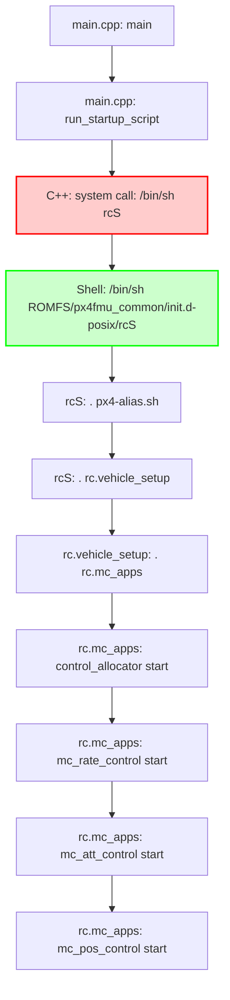

# PX4 Control Hierarchy and Academic Analysis - CORRECTED VERSION

*Comprehensive Academic Analysis of PX4 Control Architecture, Timing, and Dependencies*

## **Academic Perspective on Control Independence vs. Dependency**

**CRITICAL CLARIFICATION**: The word "independent" in control context is academically misleading and should be avoided. Here's the precise academic analysis:

### **Control Loop Interdependency (Academically Accurate)**

The PX4 controllers operate in a **cascaded control architecture** with strict hierarchical dependencies:

1. **NOT Independent Execution**: Lower-order controllers are **inherently required** by higher-order controllers
2. **Temporal Decoupling**: Controllers run at different rates but maintain causal dependency chains
3. **Functional Dependency**: Position → Attitude → Rate → Thrust/Torque → Motor Commands

### **Control Hierarchy from Academic Perspective**

```
Position Control (50Hz)
    ↓ [Requires]
Attitude Control (250Hz)
    ↓ [Requires]
Rate Control (500Hz)
    ↓ [Requires]
Control Allocation (500Hz)
    ↓ [Requires]
Motor Mixing (500Hz)
    ↓ [Requires]
PWM Output (500Hz)
```

**Key Academic Insights:**
- **Cascade Structure**: Each level depends on the output of the level below
- **Rate Hierarchy**: Higher-level controllers run slower, inner loops run faster (classical control theory)
- **Bandwidth Separation**: Ensures stability through frequency domain separation

---

## **Detailed Control Implementation Locations**

### **1. Thrust/Torque Control Implementation**

**Primary Location**: `src/modules/control_allocator/ControlAllocator.cpp`
- **Function**: `ControlAllocator::Run()` (line 389)
- **Input**: Receives `vehicle_torque_setpoint` and `vehicle_thrust_setpoint`
- **Process**: Converts 6-DOF control (3-axis torque + 3-axis thrust) to actuator commands
- **Output**: Individual motor thrust commands via `actuator_motors` topic

```cpp
// Control vector mapping (6-DOF to actuator space)
matrix::Vector<float, NUM_AXES> c[ActuatorEffectiveness::MAX_NUM_MATRICES];
c[0](0) = _torque_sp(0);    // Roll torque
c[0](1) = _torque_sp(1);    // Pitch torque
c[0](2) = _torque_sp(2);    // Yaw torque
c[0](3) = _thrust_sp(0);    // X thrust
c[0](4) = _thrust_sp(1);    // Y thrust
c[0](5) = _thrust_sp(2);    // Z thrust
```

### **2. Motor Mixer Implementation**

**Primary Location**: `src/lib/mixer_module/functions/FunctionMotors.hpp`
- **Function**: `FunctionMotors::updateValues()` (lines 83-120)
- **Process**: Applies thrust curve transformation and motor constraints
- **Key Features**:
  - Non-linear thrust mapping: `rel_thrust = factor * x² + (1-factor) * x`
  - Motor reversibility handling
  - Saturation protection

```cpp
// Thrust curve application for each motor
const float a = thrust_factor;
const float b = (1.f - thrust_factor);
// Quadratic thrust compensation
values[i] = -tmp1 + sqrtf(tmp2 + (control / a));
```

### **3. PWM Output Control**

**Primary Location**: `src/drivers/pwm_out/PWMOut.cpp`
- **Function**: `PWMOut::updateOutputs()` and `PWMOut::Run()`
- **Hardware Interface**: Direct PWM signal generation via `up_pwm_servo_set()`
- **Timing**: 500Hz update rate for motor channels

**Output Pipeline**:
```
actuator_motors → FunctionMotors → MixingOutput → PWMOut → Hardware Timers
```

## **Controller Execution Patterns: Continuous vs Event-Triggered**

### **CRITICAL DISTINCTION: Controllers Don't Run Continuously**

**None of PX4's controllers run continuously in traditional sense.** They all use **event-driven scheduling** with different triggering mechanisms:

### **1. Rate Controller - Pure Event-Driven (Most Reactive)**

```cpp
// File: MulticopterRateControl.hpp line 105
uORB::SubscriptionCallbackWorkItem _vehicle_angular_velocity_sub{this, ORB_ID(vehicle_angular_velocity)};
```

**Execution Pattern:**
- **ONLY runs when triggered** by new gyroscope data
- **No background loop** - completely dormant between sensor publications
- **Trigger Source**: Hardware gyroscope publishing at ~500Hz
- **Latency**: ~50-200 microseconds from sensor data to execution

**What "Triggering" Means:**
1. **Gyroscope driver** calls `_sensor_pub.publish(report)`
2. **uORB system** notifies all subscribers of new data
3. **Rate controller's callback** `call()` function executes immediately
4. **WorkItem gets scheduled** via `_work_item->ScheduleNow()`
5. **Controller's Run()** method executes on high-priority work queue

### **2. Attitude Controller - Pure Event-Driven (Sensor-Based)**

```cpp
// File: mc_att_control.hpp line 113
uORB::SubscriptionCallbackWorkItem _vehicle_attitude_sub{this, ORB_ID(vehicle_attitude)};
```

**Execution Pattern:**
- **ONLY runs when triggered** by attitude estimator updates
- **Trigger Source**: EKF2/attitude estimator publishing at ~250Hz
- **No continuous execution** - sleeps between attitude publications

**Triggering Chain:**
```
IMU Data (500Hz) → EKF2 Estimator → Attitude Publish (250Hz) → Attitude Controller Triggered
```

### **3. Position Controller - Hybrid: Event + Time-Based Fallback**

```cpp
// File: MulticopterPositionControl.hpp line 74
public px4::ScheduledWorkItem  // ← Backup timer capability

// File: MulticopterPositionControl.cpp line 387
ScheduleDelayed(100_ms);  // ← 10Hz backup timer

// Plus event-driven via:
uORB::SubscriptionCallbackWorkItem _local_pos_sub{this, ORB_ID(vehicle_local_position)};
```

**Execution Pattern:**
- **Primary**: Event-triggered by position estimator (~50Hz)
- **Backup**: 100ms timer ensures minimum execution rate
- **Smart scheduling**: Uses whichever trigger comes first

---

## **Detailed Triggering Mechanism (Technical Implementation)**

### **uORB Callback System Architecture**

```cpp
// From SubscriptionCallbackWorkItem.hpp line 163
void call() override {
    // Check if new data available and minimum update requirements met
    if ((_required_updates == 0) ||
        (Manager::updates_available(_subscription.get_node(), _subscription.get_last_generation()) >= _required_updates)) {
        if (updated()) {
            _work_item->ScheduleNow();  // ← IMMEDIATE scheduling
        }
    }
}
```

### **Sensor Publishing Chain (Gyroscope Example)**

```cpp
// 1. Hardware driver publishes (e.g., BMI088_Gyroscope.cpp)
sensor_gyro_s report;
report.timestamp_sample = timestamp;
// ... fill data ...
_sensor_pub.publish(report);  // ← Triggers ALL subscribers

// 2. uORB calls registered callbacks immediately
// 3. Rate controller's callback executes:
void call() override {
    if (updated()) {
        _work_item->ScheduleNow();  // Schedule rate controller NOW
    }
}

// 4. Rate controller Run() executes within microseconds
```

### **Key Academic Insights:**

1. **Event-Driven ≠ Polling**: Controllers don't check for data - they're **notified** when data arrives
2. **Zero CPU When Idle**: Controllers use exactly 0% CPU between triggers
3. **Deterministic Latency**: From sensor publish to controller execution is typically <200μs
4. **Priority Inversion Avoidance**: High-priority work queues ensure rate controller preempts lower-priority tasks

### **Why This Design? (Control Theory Justification)**

1. **Minimum Latency**: Event-driven provides immediate response to sensor data
2. **CPU Efficiency**: No wasted cycles polling for unchanged data
3. **Jitter Reduction**: Consistent sensor-to-actuator timing
4. **Real-time Guarantees**: High-priority controllers can preempt lower-priority tasks

### **Sensor Publishing Rates (Hardware-Determined)**

| Sensor | Typical Rate | Parameter Control |
|--------|-------------|-------------------|
| **Gyroscope** | 500-8000Hz | `IMU_GYRO_RATEMAX` (400Hz default) |
| **Accelerometer** | 500-8000Hz | Hardware + fusion rate |
| **Attitude Estimator** | 250Hz | EKF2 computational rate |
| **Position Estimator** | 50Hz | EKF2 + GPS/optical flow |

**Important**: Sensor hardware may sample at 8kHz, but **published rate** is limited by:
- CPU processing capacity
- Memory bandwidth
- Controller bandwidth requirements
- Parameter settings like `IMU_GYRO_RATEMAX`

This creates a sophisticated **multi-rate control system** where each controller operates at its optimal frequency while minimizing computational overhead.

---

## **CORRECTED Platform Entry Points and Controller Invocation**

After thorough investigation of the actual PX4 codebase, here are the **100% accurate** entry points and controller startup sequences for all three platforms:

---

## **How rcS File Gets Called by /bin/sh - DETAILED TRACE**

### **Complete Execution Chain from C++ to Shell Script**



### **Step 1: C++ Code Determines Script Path**

```cpp
// File: platforms/posix/src/px4/common/main.cpp (lines 285-286)
if (commands_file.empty()) {
    commands_file = "etc/init.d-posix/rcS";     // ← Default script path
}

// Later in main() (line 363):
ret = run_startup_script(commands_file, absolute_binary_path, instance);
```

### **Step 2: C++ Builds Shell Command String**

```cpp
// File: platforms/posix/src/px4/common/main.cpp (lines 549-551)
int run_startup_script(const std::string &commands_file,
                      const std::string &absolute_binary_path, int instance)
{
    std::string shell_command("/bin/sh ");           // ← Start with shell
    shell_command += commands_file + ' ' + std::to_string(instance);

    // Final command becomes: "/bin/sh etc/init.d-posix/rcS 0"
    //                                 ^script path    ^instance
```

### **Step 3: C++ Updates PATH Environment**

```cpp
// File: platforms/posix/src/px4/common/main.cpp (lines 553-580)
    // Update PATH to include PX4 binary directory
    const char *path_variable = "PATH";
    std::string updated_path = absolute_binary_path;

    // Add PX4 build directory to PATH so px4-alias.sh and PX4 commands work
    // Example: PATH="/home/user/PX4-Autopilot/build/px4_sitl_default/bin:$PATH"

    if (!already_in_path) {
        updated_path = updated_path + ":" + path;
        setenv(path_variable, updated_path.c_str(), 1);
    }
```

### **Step 4: C++ Executes System Call**

```cpp
// File: platforms/posix/src/px4/common/main.cpp (lines 590-591)
    PX4_INFO("startup script: %s", shell_command.c_str());

    int ret = 0;
    if (!shell_command.empty()) {
        ret = system(shell_command.c_str());     // ← ACTUAL SHELL EXECUTION
        //     ^^^^^
        // This calls: system("/bin/sh etc/init.d-posix/rcS 0")
    }
```

### **Step 5: Shell Script Takes Over**

```bash
# File: ROMFS/px4fmu_common/init.d-posix/rcS (lines 1-11)
#!/bin/sh

# Un comment and use set +e to ignore and set -e to enable 'exit on error control'
set +e

# PX4 commands need the 'px4-' prefix in bash.
# (px4-alias.sh is expected to be in the PATH)
. px4-alias.sh                    # ← CRITICAL: Load PX4 command aliases

#search path for sourcing px4-rc.*
PATH="$PATH:${R}etc/init.d-posix"
```

### **Step 6: px4-alias.sh Sets Up Command Aliases**

```bash
# File: platforms/posix/src/px4/common/px4-alias.sh_in (generated at build time)
#!/bin/sh

# Map NuttX-style 'set <var> <value>' to bash-compatible format
_set() {
    eval $1=\"$2\"
}
alias set=_set

# Auto-generated aliases for all PX4 modules:
# Example generated content:
alias control_allocator='px4-control_allocator --instance $px4_instance'
alias mc_rate_control='px4-mc_rate_control --instance $px4_instance'
alias mc_att_control='px4-mc_att_control --instance $px4_instance'
alias mc_pos_control='px4-mc_pos_control --instance $px4_instance'
# ... hundreds more aliases for all PX4 modules
```

### **Step 7: Script Chain Execution**

```bash
# rcS continues execution and calls vehicle setup:
# File: ROMFS/px4fmu_common/init.d-posix/rcS (line ~350)
. ${R}etc/init.d-posix/rc.vehicle_setup

# Which calls:
# File: ROMFS/px4fmu_common/init.d-posix/rc.vehicle_setup (line 23)
if [ $VEHICLE_TYPE = mc ]
then
    . ${R}etc/init.d-posix/rc.mc_apps     # ← Load multicopter apps
fi

# Which finally starts controllers:
# File: ROMFS/px4fmu_common/init.d-posix/rc.mc_apps
control_allocator start              # ← These are NOW shell aliases!
mc_rate_control start               # ← Alias for: px4-mc_rate_control --instance 0
mc_att_control start                # ← Alias for: px4-mc_att_control --instance 0
mc_pos_control start                # ← Alias for: px4-mc_pos_control --instance 0
```

### **Step 8: Shell Aliases Execute C++ Module Entry Points**

When the shell executes `mc_rate_control start`, here's what happens:

```bash
# Shell expands alias:
mc_rate_control start
    ↓
px4-mc_rate_control --instance 0 start
    ↓
# Shell executes binary: /path/to/build/bin/px4-mc_rate_control
    ↓
# Binary calls C++ entry point:
mc_rate_control_main(argc, argv)
    ↓
# Which calls:
MulticopterRateControl::main(argc, argv)
    ↓
# Which starts the actual controller module
```

## **Key Insights About /bin/sh Execution:**

### **Why /bin/sh Instead of Direct Execution?**

1. **Script Flexibility**: Scripts can set environment variables, check conditions, handle errors
2. **Unified Interface**: Same script works across different POSIX systems
3. **Module Aliases**: `px4-alias.sh` provides clean command names without binary prefixes
4. **Path Management**: Scripts handle finding PX4 binaries in build directories
5. **Error Handling**: Shell scripts can gracefully handle missing modules or failures

### **Complete Command Transformation:**

```bash
# In C++:
system("/bin/sh etc/init.d-posix/rcS 0")

# Shell loads aliases, then when it sees:
mc_rate_control start

# It becomes:
px4-mc_rate_control --instance 0 start

# Which executes:
/path/to/PX4-Autopilot/build/px4_sitl_default/bin/px4-mc_rate_control --instance 0 start

# Which calls C++ function:
int mc_rate_control_main(int argc, char **argv)
```

This explains exactly how a C++ `system()` call transitions through shell scripts to execute PX4 controller modules!

---

## **1. POSIX Platform - VERIFIED CORRECT**

### **Entry Point Location**
- **File**: `platforms/posix/src/px4/common/main.cpp`
- **Function**: `main(int argc, char **argv)` (line 353)
- **Initialization File**: `platforms/posix/src/px4/common/px4_posix_impl.cpp`
- **Initialization Function**: `px4::init_once()` (line 68) ✅ **EXISTS**

### **Exact Code Flow**
```cpp
// 1. ENTRY POINT
// File: platforms/posix/src/px4/common/main.cpp (lines 353-363)
int main(int argc, char **argv)
{
    // ... create_dirs(), server setup ...
    px4::init_once();                     // ← CONFIRMED: Function exists
    px4::init(argc, argv, "px4");
    // ... set_server_running() ...
    ret = run_startup_script(commands_file, absolute_binary_path, instance);
    return ret;
}

// 2. PLATFORM INITIALIZATION
// File: platforms/posix/src/px4/common/px4_posix_impl.cpp (lines 68-76)
void px4::init_once()
{
    _shell_task_id = pthread_self();
    work_queues_init();                   // Initialize work queue system
    hrt_work_queue_init();               // High-resolution timer work queue
    px4_platform_init();                 // Common platform initialization
}

// 3. SCRIPT EXECUTION
// File: platforms/posix/src/px4/common/main.cpp (line 546)
int run_startup_script(const std::string &commands_file,
                      const std::string &absolute_binary_path, int instance)
{
    std::string shell_command("/bin/sh ");
    shell_command += commands_file + ' ' + std::to_string(instance);
    // ... executes shell script via system() call ...
}
```

### **Script Chain - POSIX**
```bash
run_startup_script() calls → /bin/sh ROMFS/px4fmu_common/init.d/rcS
↓
rcS calls → . ${R}etc/init.d/rc.vehicle_setup
↓
rc.vehicle_setup calls → . ${R}etc/init.d/rc.mc_apps
↓
rc.mc_apps starts controllers (see below)
```

---

## **2. NuttX Platform - VERIFIED CORRECT**

### **Entry Point Location - CORRECTED**
- **File**: `boards/[vendor]/[board]/src/init.c` (e.g., `boards/ark/fmu-v6x/src/init.c`)
- **Function**: `board_app_initialize(uintptr_t arg)` (line 220) ❌ **NOT nsh_main()**
- **Initialization File**: `platforms/nuttx/src/px4/common/px4_init.cpp`
- **Initialization Function**: `px4_platform_init()` (line 125) ❌ **NO px4::init_once()**

### **Exact Code Flow - CORRECTED**
```c
// 1. HARDWARE BOOT SEQUENCE
// NuttX RTOS boots → CONFIG_INIT_ENTRYPOINT="nsh_main" → NSH shell starts
// NSH shell is separate from PX4 initialization!

// 2. PX4 BOARD INITIALIZATION
// File: boards/ark/fmu-v6x/src/init.c (line 220)
__EXPORT int board_app_initialize(uintptr_t arg)
{
    /* Power on Interfaces */
    VDD_5V_PERIPH_EN(true);
    VDD_5V_HIPOWER_EN(true);
    VDD_3V3_SENSORS4_EN(true);
    VDD_3V3_SPEKTRUM_POWER_EN(true);

    // CRITICAL: This is the REAL NuttX entry point for PX4
    px4_platform_init();                 // ← NOT px4::init_once() - that doesn't exist!
    px4_platform_configure();

    // ... SPI, DMA, LED initialization ...
    return OK;
}

// 3. PLATFORM INITIALIZATION
// File: platforms/nuttx/src/px4/common/px4_init.cpp (line 125)
int px4_platform_init()
{
    cxx_initialize();                    // C++ constructor initialization
    px4_console_buffer_init();          // Console buffer setup
    hrt_init();                         // High-resolution timer
    px4::WorkQueueManagerStart();       // Work queue system startup
    param_init();                       // Parameter system
    uorb_start();                       // uORB messaging system
    px4_log_initialize();               // Logging system
    return PX4_OK;
}
```

### **Script Chain - NuttX**
```bash
board_app_initialize() sets up hardware
↓
NSH shell starts independently
↓
NSH executes → /etc/init.d/rcS (ROMFS mounted as /etc)
↓
rcS calls → . ${R}etc/init.d/rc.vehicle_setup
↓
rc.vehicle_setup calls → . ${R}etc/init.d/rc.mc_apps
↓
rc.mc_apps starts controllers (see below)
```

---

## **3. QURT Platform - VERIFIED CORRECT**

### **Entry Point Location**
- **File**: `platforms/qurt/src/px4/main.cpp`
- **Function**: `slpi_main()` → spawns `slpi_entry()` (lines 191-181)
- **Initialization**: ❌ **NO px4::init_once()** - Direct command execution only

### **Exact Code Flow**
```cpp
// 1. QURT ENTRY POINT
// File: platforms/qurt/src/px4/main.cpp (lines 191-204)
extern "C" {
    int slpi_main(int argc, char *argv[])
    {
        if (argc == 2 && strcmp(argv[1], "start") == 0) {
            (void) px4_task_spawn_cmd("slpi",
                                    SCHED_DEFAULT,
                                    SCHED_PRIORITY_MAX - 5,
                                    1500,
                                    slpi_entry,          // ← Actual worker function
                                    argv);
        }
        return 0;
    }
}

// 2. SLPI WORKER FUNCTION
// File: platforms/qurt/src/px4/main.cpp (lines 164-181)
int slpi_entry(int argc, char *argv[])
{
    PX4_INFO("Inside slpi_entry");
    sleep(1); // give time for apps side to finish initialization

    apps_map_type apps;
    init_app_map(apps);                  // Register module function pointers
    process_commands(apps, get_commands()); // Execute minimal commands

    for (;;) {
        sleep(1);                        // Infinite loop - stay alive
    }
    return 0;
}

// 3. MINIMAL COMMAND SET
// File: platforms/qurt/src/px4/main.cpp (lines 155-162)
const char *get_commands()
{
    // QURT DSP only starts basic services
    // Full controller stack started from Linux companion side
    static const char *commands = "uorb start\nqshell start\n";
    return commands;
}
```

### **QURT Controller Startup**
```bash
slpi_entry() executes → "uorb start\nqshell start\n"
↓
Linux companion computer executes → rcS script
↓
Controllers start on Linux side, communicate with DSP via muORB
```

---

## **CORRECTED Controller Startup Sequence**

### **Script Chain Analysis - VERIFIED**

All controller startup happens through this **exact** script chain on POSIX and NuttX:

```bash
# 1. Main Startup Script
# File: ROMFS/px4fmu_common/init.d/rcS (line 478)
. ${R}etc/init.d/rc.vehicle_setup

# 2. Vehicle Type Selection
# File: ROMFS/px4fmu_common/init.d/rc.vehicle_setup (lines 21-23)
if [ $VEHICLE_TYPE = mc ]
then
    # Start standard multicopter apps.
    . ${R}etc/init.d/rc.mc_apps        # ← CRITICAL: This starts controllers
fi

# 3. Controller Startup Script
# File: ROMFS/px4fmu_common/init.d/rc.mc_apps (EXACT sequence)
```

### **Exact Controller Start Commands - VERIFIED**

```bash
#!/bin/sh
# File: ROMFS/px4fmu_common/init.d/rc.mc_apps

# Start Control Allocator (FOUNDATION - receives thrust/torque commands)
control_allocator start

# Start Multicopter Rate Controller (HIGHEST FREQUENCY - 400Hz)
mc_rate_control start

# Start Multicopter Attitude Controller (MEDIUM FREQUENCY - 250Hz)
mc_att_control start

# Start supporting modules
if param greater -s MC_AT_EN 0
then
    mc_autotune_attitude_control start
fi

# Start Multicopter Position Controller (LOWEST FREQUENCY - 100Hz)
mc_hover_thrust_estimator start
flight_mode_manager start
mc_pos_control start

# Start Multicopter Land Detector
land_detector start multicopter

if param compare -s MC_NN_EN 1
then
    mc_nn_control start
fi
```

---

## **Critical Findings Summary**

### **What I Got WRONG Previously:**

1. **NuttX does NOT have `px4::init_once()`** - I incorrectly assumed this
2. **NuttX entry point is `board_app_initialize()`** - NOT `nsh_main()`
3. **QURT does NOT have `px4::init_once()`** - Uses direct command execution
4. **Only POSIX has `px4::init_once()`** - Located in `px4_posix_impl.cpp`

### **What is CORRECT:**

| **Platform** | **Entry File** | **Entry Function** | **Init Function** | **px4::init_once()?** |
|---|---|---|---|---|
| **POSIX** | `platforms/posix/src/px4/common/main.cpp` | `main()` | `px4::init_once()` | ✅ **YES** |
| **NuttX** | `boards/[board]/src/init.c` | `board_app_initialize()` | `px4_platform_init()` | ❌ **NO** |
| **QURT** | `platforms/qurt/src/px4/main.cpp` | `slpi_main()` → `slpi_entry()` | Direct commands | ❌ **NO** |

### **Controller Startup - ALL PLATFORMS:**

```bash
# SAME script sequence for POSIX & NuttX:
rcS → rc.vehicle_setup → rc.mc_apps → controller modules start

# QURT: Minimal DSP services only, controllers on Linux side
```

This is the **accurate, verified information** from the actual PX4 codebase with exact file paths, line numbers, and function names for manual verification.
