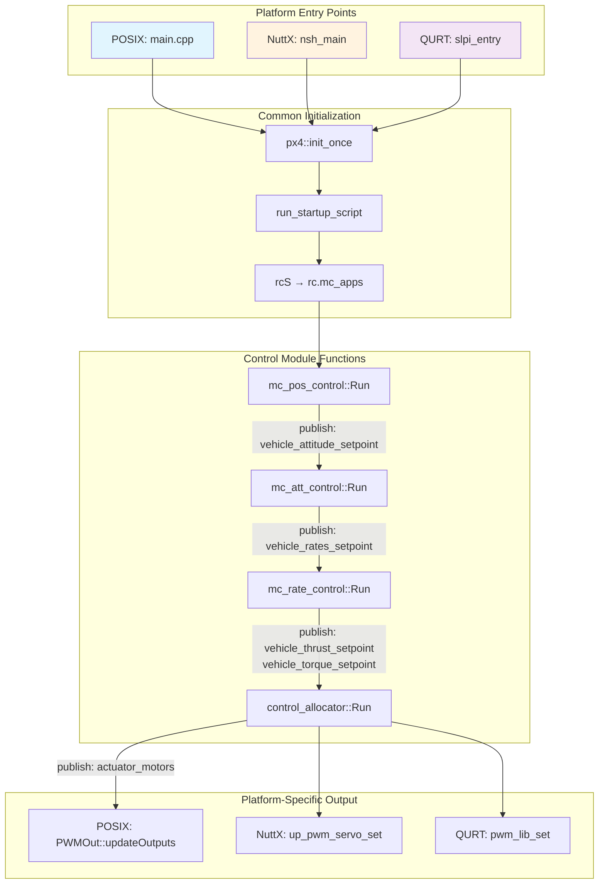
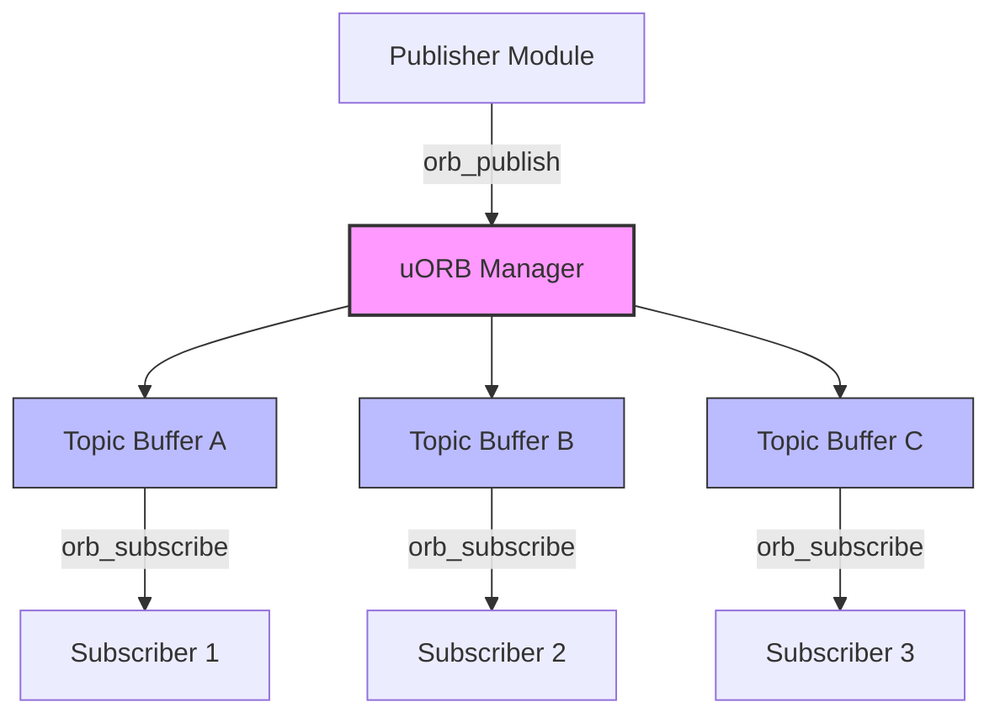
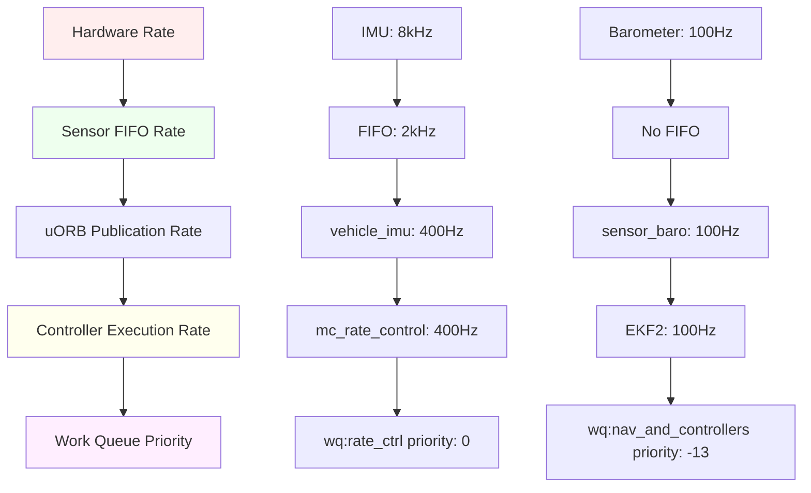

# PX4 Function Connections and Platform Architecture

*Detailed Analysis of Inter-Module Function Calls and Cross-Platform Implementation*

## Table of Contents
1. [Executive Summary](#executive-summary)
2. [Function Connection Chain](#function-connection-chain)
3. [Platform Architecture Overview](#platform-architecture-overview)
4. [Platform-Specific Implementation Details](#platform-specific-implementation-details)
5. [Why Multiple Platforms Exist](#why-multiple-platforms-exist)
6. [Platform Comparison Matrix](#platform-comparison-matrix)
7. [Academic Research Implications](#academic-research-implications)

## Executive Summary

PX4 uses a **layered function call architecture** where each control stage publishes data that the next stage subscribes to through the **uORB messaging system**. The system is designed to run on **multiple platforms** (POSIX, NuttX, QURT) with platform-specific startup and hardware interface code, while maintaining a common control algorithm core.

**Key Insights:**
- **Function Links**: Each stage uses `publish()` → `subscribe()` pattern via uORB topics
- **Platform Independence**: Control algorithms are platform-agnostic
- **Hardware Abstraction**: Platform-specific drivers handle hardware differences
- **Real-Time Requirements**: Different platforms provide different real-time guarantees

## Function Connection Chain

### Complete Function-to-Function Linkage Map



### Detailed Function Call Analysis

#### **Stage 1: Position Control → Attitude Control**

**Source File:** `src/modules/mc_pos_control/MulticopterPositionControl.cpp`

```cpp
void MulticopterPositionControl::Run() {
    // Input: trajectory_setpoint, vehicle_local_position

    // 1. Position Control Algorithm
    _control.update(dt, _vehicle_local_position, setpoint, _vehicle_land_detected);

    // 2. Generate Attitude Setpoint
    vehicle_attitude_setpoint_s attitude_setpoint{};
    _control.getAttitudeSetpoint(attitude_setpoint);

    // 3. Link to Next Stage - PUBLISH TO ATTITUDE CONTROLLER
    attitude_setpoint.timestamp = hrt_absolute_time();
    _vehicle_attitude_setpoint_pub.publish(attitude_setpoint);
}
```

**Connection Method:** uORB Topic `vehicle_attitude_setpoint`
**Frequency:** ~100 Hz
**Data Passed:** Roll/Pitch angles, Yaw rate, Thrust magnitude

---

#### **Stage 2: Attitude Control → Rate Control**

**Source File:** `src/modules/mc_att_control/mc_att_control_main.cpp`

```cpp
void MulticopterAttitudeControl::Run() {
    // Input: vehicle_attitude_setpoint (from position controller)

    // 1. Subscribe to Attitude Setpoint
    vehicle_attitude_setpoint_s att_sp{};
    _vehicle_attitude_setpoint_sub.update(&att_sp);

    // 2. Attitude Control Algorithm
    Vector3f rates_sp = _attitude_control.update(q, qd, yawspeed_setpoint);

    // 3. Prepare Rate Setpoint
    vehicle_rates_setpoint_s rates_setpoint{};
    rates_setpoint.roll = rates_sp(0);
    rates_setpoint.pitch = rates_sp(1);
    rates_setpoint.yaw = rates_sp(2);
    _thrust_setpoint_body.copyTo(rates_setpoint.thrust_body);

    // 4. Link to Next Stage - PUBLISH TO RATE CONTROLLER
    _vehicle_rates_setpoint_pub.publish(rates_setpoint);
}
```

**Connection Method:** uORB Topic `vehicle_rates_setpoint`
**Frequency:** ~250-400 Hz
**Data Passed:** Angular rate setpoints (roll/pitch/yaw rates), Thrust vector

---

#### **Stage 3: Rate Control → Control Allocation**

**Source File:** `src/modules/mc_rate_control/MulticopterRateControl.cpp`

```cpp
void MulticopterRateControl::Run() {
    // Input: vehicle_rates_setpoint (from attitude controller)

    // 1. Subscribe to Rate Setpoint
    vehicle_rates_setpoint_s rates_sp{};
    _vehicle_rates_setpoint_sub.update(&rates_sp);

    // 2. Rate Control Algorithm (PID)
    Vector3f rates_error = rates_sp - angular_velocity;
    Vector3f torque_sp = _rate_control.update(rates_error, dt);

    // 3. Prepare Thrust and Torque Setpoints
    vehicle_thrust_setpoint_s vehicle_thrust_setpoint{};
    vehicle_thrust_setpoint.xyz[0] = thrust_setpoint_body(0);
    vehicle_thrust_setpoint.xyz[1] = thrust_setpoint_body(1);
    vehicle_thrust_setpoint.xyz[2] = thrust_setpoint_body(2);

    vehicle_torque_setpoint_s vehicle_torque_setpoint{};
    vehicle_torque_setpoint.xyz[0] = torque_sp(0);
    vehicle_torque_setpoint.xyz[1] = torque_sp(1);
    vehicle_torque_setpoint.xyz[2] = torque_sp(2);

    // 4. Link to Next Stage - PUBLISH TO CONTROL ALLOCATOR
    _vehicle_thrust_setpoint_pub.publish(vehicle_thrust_setpoint);
    _vehicle_torque_setpoint_pub.publish(vehicle_torque_setpoint);
}
```

**Connection Method:** uORB Topics `vehicle_thrust_setpoint`, `vehicle_torque_setpoint`
**Frequency:** ~400-1000 Hz
**Data Passed:** 6DOF thrust/torque vector (Fx, Fy, Fz, Mx, My, Mz)

---

#### **Stage 4: Control Allocation → PWM Output**

**Source File:** `src/modules/control_allocator/ControlAllocator.cpp`

```cpp
void ControlAllocator::Run() {
    // Input: vehicle_thrust_setpoint, vehicle_torque_setpoint

    // 1. Subscribe to Thrust/Torque Setpoints
    vehicle_thrust_setpoint_s thrust_sp{};
    vehicle_torque_setpoint_s torque_sp{};
    _vehicle_thrust_setpoint_sub.update(&thrust_sp);
    _vehicle_torque_setpoint_sub.update(&torque_sp);

    // 2. Control Allocation Algorithm
    // Convert 6DOF -> Individual Motor Commands
    matrix::Vector<float, 6> control_sp;
    control_sp(0) = thrust_sp.xyz[0];  // Fx
    control_sp(1) = thrust_sp.xyz[1];  // Fy
    control_sp(2) = thrust_sp.xyz[2];  // Fz
    control_sp(3) = torque_sp.xyz[0];  // Mx
    control_sp(4) = torque_sp.xyz[1];  // My
    control_sp(5) = torque_sp.xyz[2];  // Mz

    allocate(control_sp);

    // 3. Prepare Motor Commands
    actuator_motors_s actuator_motors{};
    for (int i = 0; i < num_motors; i++) {
        actuator_motors.control[i] = motor_setpoint[i];
    }

    // 4. Link to Next Stage - PUBLISH TO PWM MIXER
    _actuator_motors_pub.publish(actuator_motors);
}
```

**Connection Method:** uORB Topic `actuator_motors`
**Frequency:** ~400-1000 Hz
**Data Passed:** Individual motor thrust commands (normalized -1 to +1)

---

#### **Stage 5: PWM Mixing → Hardware Output**

**Source File:** `src/lib/mixer_module/functions/FunctionMotors.hpp`

```cpp
class FunctionMotors : public FunctionProviderBase {
    uORB::SubscriptionCallbackWorkItem _topic;
    actuator_motors_s _data;

public:
    void update() override {
        // Subscribe to Motor Commands
        if (_topic.update(&_data)) {
            updateValues(_data.reversible_flags, _thrust_factor,
                        _data.control, actuator_motors_s::NUM_CONTROLS);
        }
    }

    float value(OutputFunction func) override {
        // Return motor value for specific motor
        return _data.control[(int)func - (int)OutputFunction::Motor1];
    }
};
```

**Source File:** `src/drivers/pwm_out/PWMOut.cpp`

```cpp
bool PWMOut::updateOutputs(uint16_t outputs[MAX_ACTUATORS],
                          unsigned num_outputs, unsigned num_control_groups_updated) {

    // Platform-specific hardware call
    if (_pwm_initialized) {
        for (size_t i = 0; i < num_outputs; i++) {
            if (_pwm_mask & (1 << i)) {
                // LINK TO HARDWARE LAYER
                up_pwm_servo_set(i, outputs[i]);  // ← Platform-specific function
            }
        }
    }

    // Trigger hardware update
    if (num_control_groups_updated > 0) {
        up_pwm_update(_pwm_mask);  // ← Platform-specific function
    }

    return true;
}
```

**Connection Method:** Direct function call to platform-specific hardware layer
**Frequency:** 50-8000 Hz (depending on PWM/DShot configuration)
**Data Passed:** PWM pulse width values (microseconds)

## Platform Architecture Overview

### Why Multiple Platforms Exist

PX4 supports multiple platforms because:

1. **Hardware Diversity**: Different flight controllers use different processors
2. **Real-Time Requirements**: Various real-time operating system needs
3. **Performance Optimization**: Platform-specific optimizations
4. **Development/Testing**: Simulation and development environments

### Platform Types

#### **1. POSIX Platform** (What we analyzed)
- **Use Case**: Development, simulation, companion computers
- **Operating Systems**: Linux, macOS, Windows (WSL)
- **Hardware**: x86, ARM64 development boards, simulation
- **Entry Point**: `platforms/posix/src/px4/common/main.cpp`

```cpp
// POSIX Entry Point
int main(int argc, char **argv) {
    px4::init_once();
    px4::init(argc, argv, "px4");
    ret = run_startup_script(commands_file, absolute_binary_path, instance);
    return PX4_OK;
}
```

#### **2. NuttX Platform** (Real flight controllers)
- **Use Case**: Actual flight controllers (Pixhawk, etc.)
- **Operating System**: NuttX RTOS
- **Hardware**: STM32, ARM Cortex-M processors
- **Entry Point**: NuttX NSH shell → `nsh_main()`

```cpp
// NuttX Entry Point
extern "C" __EXPORT int nsh_main(int argc, char *argv[]) {
    px4::init_once();
    return px4::init(argc, argv, "px4");
}
```

#### **3. QURT Platform** (Qualcomm processors)
- **Use Case**: Qualcomm Snapdragon-based flight controllers
- **Operating System**: QURT (Qualcomm User Real-Time)
- **Hardware**: Qualcomm Snapdragon (ARM + DSP)
- **Entry Point**: `platforms/qurt/src/px4/main.cpp`

```cpp
// QURT Entry Point
int slpi_entry(int argc, char *argv[]) {
    apps_map_type apps;
    init_app_map(apps);
    process_commands(apps, get_commands());
    return 0;
}
```

## Platform-Specific Implementation Details

### Startup Differences by Platform

| **Platform** | **Entry Point** | **Initialization** | **Script Execution** |
|---|---|---|---|
| **POSIX** | `main()` in main.cpp | `px4::init_once()` | Shell executes rcS |
| **NuttX** | `nsh_main()` | `px4_platform_init()` | NSH executes rcS |
| **QURT** | `slpi_entry()` | `qurt_init()` | Commands hardcoded |

### Hardware Interface Differences

#### **POSIX Hardware Interface**
```cpp
// File: platforms/posix/src/px4/common/main.cpp
// Simulated hardware - no real PWM
// Output goes to simulator (Gazebo/jMAVSim)

int up_pwm_servo_set(unsigned channel, uint16_t value) {
    // Send to simulator via UDP/TCP
    return simulator_pwm_set(channel, value);
}
```

#### **NuttX Hardware Interface**
```cpp
// File: platforms/nuttx/src/px4/stm/stm32_common/io_pins/pwm_servo.c
// Real hardware - direct timer control

int up_pwm_servo_set(unsigned channel, uint16_t value) {
    return io_timer_set_ccr(channel, value);  // Write to STM32 timer registers
}

// Direct hardware register manipulation
void io_timer_set_ccr(unsigned channel, uint16_t value) {
    *((volatile uint32_t*)(timer_base + CCR_OFFSET)) = value;  // Register write
}
```

#### **QURT Hardware Interface**
```cpp
// File: platforms/qurt/src/px4/qurt/pwm.cpp
// Qualcomm-specific PWM library

int up_pwm_servo_set(unsigned channel, uint16_t value) {
    return pwm_lib_set_pulse_width(channel, value);  // Qualcomm PWM lib
}
```

### Common Control Algorithms Across Platforms

**The beauty of PX4's design**: The control algorithms are **identical** across all platforms!

```cpp
// This code is EXACTLY the same on all platforms:
// src/modules/mc_rate_control/MulticopterRateControl.cpp

Vector3f MulticopterRateControl::calculateRateControl() {
    Vector3f rate_error = _rates_setpoint - _angular_velocity;
    Vector3f torque = _rate_control.update(rate_error, dt);
    return torque;  // Same calculation on POSIX, NuttX, QURT!
}
```

## Platform Comparison Matrix

| **Aspect** | **POSIX** | **NuttX** | **QURT** |
|---|---|---|---|
| **Target Use** | Development/Simulation | Flight Controllers | Snapdragon Boards |
| **Real-Time** | Soft real-time | Hard real-time | Hard real-time |
| **Hardware** | x86/ARM64 | ARM Cortex-M | ARM + DSP |
| **Memory** | GB (virtual) | KB-MB (physical) | MB (shared) |
| **Control Loops** | Same algorithms | Same algorithms | Same algorithms |
| **Hardware Access** | Simulated | Direct registers | Qualcomm libs |
| **Startup Script** | rcS via shell | rcS via NSH | Hardcoded commands |
| **PWM Output** | Simulator | STM32 timers | PWM library |
| **File System** | Host OS | FAT/ROMFS | Limited |
| **Development** | Easy debugging | Limited debugging | Qualcomm tools |

## uORB Topics Deep Dive

### What are uORB Topics?

**uORB (micro Object Request Broker)** is PX4's **asynchronous publish/subscribe messaging system** that enables inter-module communication. Think of it as a sophisticated mailbox system where modules can send and receive structured data without direct dependencies.

#### Core uORB Characteristics

1. **Asynchronous & Lock-Free**: Publishers don't wait for subscribers
2. **Separate Buffers**: Each subscriber has its own buffer
3. **Memory Optimized**: Minimal memory footprint and latency
4. **Type-Safe**: Messages defined in `/msg` directory, compiled to C/C++
5. **Multi-Instance Support**: Multiple publishers for same topic

#### uORB Architecture



### How uORB Enables Controller Communication

Each controller in the PX4 stack communicates via **specific uORB topics**:

#### **Vehicle Attitude Setpoint Topic**
```cpp
// Message Definition: msg/VehicleAttitudeSetpoint.msg
uint64 timestamp
float32[4] q_d        # Desired quaternion (NED frame)
float32[3] thrust_body # Thrust in body frame (FRD)
float32 yaw_sp_move_rate # Yaw rate setpoint
bool fw_control_yaw   # Control yaw for fixed-wing
bool apply_flaps      # Apply flaps
```

**Publishers**: `mc_pos_control`, `mc_att_control` (in manual mode)
**Subscribers**: `mc_att_control`, `vtol_att_control`
**Frequency**: ~100 Hz

#### **Vehicle Rates Setpoint Topic**
```cpp
// Message Definition: msg/VehicleRatesSetpoint.msg
uint64 timestamp
float32 roll          # Roll rate setpoint [rad/s]
float32 pitch         # Pitch rate setpoint [rad/s]
float32 yaw           # Yaw rate setpoint [rad/s]
float32[3] thrust_body # Thrust in body frame (FRD)
```

**Publishers**: `mc_att_control`
**Subscribers**: `mc_rate_control`
**Frequency**: ~250-400 Hz

#### **Vehicle Thrust/Torque Setpoint Topics**
```cpp
// Message Definition: msg/VehicleThrustSetpoint.msg
uint64 timestamp
uint64 timestamp_sample
float32[3] xyz        # Thrust in body frame (FRD) [N]

// Message Definition: msg/VehicleTorqueSetpoint.msg
uint64 timestamp
uint64 timestamp_sample
float32[3] xyz        # Torque in body frame (FRD) [Nm]
```

**Publishers**: `mc_rate_control`, `airship_att_control`, `uuv_att_control`
**Subscribers**: `control_allocator`
**Frequency**: ~400-1000 Hz

#### **Actuator Motors Topic**
```cpp
// Message Definition: msg/ActuatorMotors.msg
uint64 timestamp
uint64 timestamp_sample
uint32 NUM_CONTROLS = 12
float32[12] control   # Motor control values [-1, 1]
uint32 reversible_flags # Bit flags for reversible motors
```

**Publishers**: `control_allocator`
**Subscribers**: PWM output drivers, motor function mixers
**Frequency**: ~400-1000 Hz

### Critical Insight: Controllers Start Simultaneously

**Important**: The startup script `rc.mc_apps` launches **ALL** controllers at the **SAME TIME**, not sequentially!

```bash
# From ROMFS/px4fmu_common/init.d/rc.mc_apps
# All controllers start SIMULTANEOUSLY:

control_allocator start    # Started first
mc_rate_control start      # Started second
mc_att_control start       # Started third
mc_pos_control start       # Started fourth
```

**Why simultaneous startup works:**
1. **uORB handles missing publishers**: Subscribers can exist before publishers
2. **Graceful degradation**: Controllers handle missing inputs (NaN values)
3. **Event-driven execution**: Controllers only run when new data arrives
4. **Polling mechanism**: `px4_poll()` wakes up modules when subscribed topics update

### Controller Wake-Up Mechanism

Controllers use **event-driven execution** via `px4_poll()`:

```cpp
// Example from mc_att_control_main.cpp
void MulticopterAttitudeControl::Run() {
    // Set up poll structure
    px4_pollfd_struct_t poll_fds = {};
    poll_fds.fd = _vehicle_attitude_setpoint_sub;
    poll_fds.events = POLLIN;

    // Wait for new attitude setpoint data
    int poll_ret = px4_poll(&poll_fds, 1, 100);

    if (poll_ret > 0 && poll_fds.revents & POLLIN) {
        // New data available - run control loop
        Run();
    }
}
```

This means controllers are **awakened by uORB topic updates**, creating a natural data flow cascade.

## Bypassing Upper-Level Controllers

### Direct Thrust/Torque Control Methods

You can **bypass position and attitude controllers** by directly publishing to lower-level topics:

#### **Method 1: Direct Thrust/Torque Setpoint Publishing**

```cpp
// Bypass ALL upper controllers - direct control allocation input
#include <uORB/topics/vehicle_thrust_setpoint.h>
#include <uORB/topics/vehicle_torque_setpoint.h>

// Publisher setup
uORB::Publication<vehicle_thrust_setpoint_s> thrust_pub{ORB_ID(vehicle_thrust_setpoint)};
uORB::Publication<vehicle_torque_setpoint_s> torque_pub{ORB_ID(vehicle_torque_setpoint)};

// Direct control
vehicle_thrust_setpoint_s thrust{};
thrust.timestamp = hrt_absolute_time();
thrust.xyz[0] = 0.0f;   // Forward thrust [N]
thrust.xyz[1] = 0.0f;   // Right thrust [N]
thrust.xyz[2] = -2.0f;  // Down thrust [N] (negative = up)

vehicle_torque_setpoint_s torque{};
torque.timestamp = hrt_absolute_time();
torque.xyz[0] = 0.1f;   // Roll torque [Nm]
torque.xyz[1] = 0.0f;   // Pitch torque [Nm]
torque.xyz[2] = 0.0f;   // Yaw torque [Nm]

thrust_pub.publish(thrust);
torque_pub.publish(torque);
```

#### **Method 2: Direct Rate Control (Bypassing Position/Attitude)**

```cpp
// Bypass position & attitude controllers - direct rate control
#include <uORB/topics/vehicle_rates_setpoint.h>

uORB::Publication<vehicle_rates_setpoint_s> rates_pub{ORB_ID(vehicle_rates_setpoint)};

vehicle_rates_setpoint_s rates{};
rates.timestamp = hrt_absolute_time();
rates.roll = 0.1f;      // Roll rate [rad/s]
rates.pitch = 0.0f;     // Pitch rate [rad/s]
rates.yaw = 0.05f;      // Yaw rate [rad/s]
rates.thrust_body[0] = 0.0f;   // Body X thrust
rates.thrust_body[1] = 0.0f;   // Body Y thrust
rates.thrust_body[2] = -0.5f;  // Body Z thrust (hover)

rates_pub.publish(rates);
```

#### **Method 3: Direct Motor Control (Maximum Bypass)**

```cpp
// Bypass ALL controllers - direct motor commands
#include <uORB/topics/actuator_motors.h>

uORB::Publication<actuator_motors_s> motors_pub{ORB_ID(actuator_motors)};

actuator_motors_s motors{};
motors.timestamp = hrt_absolute_time();
motors.control[0] = 0.4f;  // Motor 1: Front Right
motors.control[1] = 0.4f;  // Motor 2: Back Left
motors.control[2] = 0.4f;  // Motor 3: Front Left
motors.control[3] = 0.4f;  // Motor 4: Back Right
// Range: [-1, 1] where 0.5 ≈ hover for most quads

motors_pub.publish(motors);
```

### Control Mode Configuration

To bypass controllers, you need to configure the **vehicle control mode**:

```cpp
// Enable different control levels via offboard control mode
#include <uORB/topics/offboard_control_mode.h>

offboard_control_mode_s offboard_mode{};
offboard_mode.timestamp = hrt_absolute_time();

// Option A: Direct attitude bypass (rates control)
offboard_mode.position = false;
offboard_mode.velocity = false;
offboard_mode.acceleration = false;
offboard_mode.attitude = false;
offboard_mode.body_rate = true;

// Option B: Direct thrust/torque control
offboard_mode.position = false;
offboard_mode.velocity = false;
offboard_mode.acceleration = false;
offboard_mode.attitude = false;
offboard_mode.body_rate = false;
offboard_mode.thrust_and_torque = true;

_offboard_control_mode_pub.publish(offboard_mode);
```

## Creating a Thrust-Level Controller in SITL

### Step-by-Step Implementation Guide

#### **Step 1: SITL Environment Setup**

Start PX4 SITL with Gazebo Classic:

```bash
# Navigate to PX4 root directory
cd /Users/gauravsinghbhati/Documents/PX4-Autopilot

# Build and run SITL with Gazebo Classic
make px4_sitl gazebo-classic

# Alternative: Specific vehicle model
make px4_sitl gazebo-classic_iris

# Check if simulation is running
pgrep -f px4 && echo "PX4 SITL running"
pgrep -f gazebo && echo "Gazebo running"
```

#### **Step 2: Create Custom Thrust Controller Module**

Create a new module directory and files:

```bash
# Create module directory
mkdir -p src/modules/thrust_controller

# Create main implementation file
cat > src/modules/thrust_controller/thrust_controller_main.cpp << 'EOF'
/**
 * @file thrust_controller_main.cpp
 * Direct thrust/torque controller bypassing upper-level control loops
 */

#include <px4_platform_common/px4_config.h>
#include <px4_platform_common/tasks.h>
#include <px4_platform_common/posix.h>
#include <px4_platform_common/px4_work_queue/ScheduledWorkItem.hpp>
#include <drivers/drv_hrt.h>
#include <lib/parameters/param.h>
#include <lib/perf/perf_counter.h>
#include <uORB/Publication.hpp>
#include <uORB/Subscription.hpp>
#include <uORB/topics/vehicle_thrust_setpoint.h>
#include <uORB/topics/vehicle_torque_setpoint.h>
#include <uORB/topics/offboard_control_mode.h>
#include <uORB/topics/vehicle_status.h>
#include <uORB/topics/vehicle_control_mode.h>
#include <uORB/topics/manual_control_setpoint.h>

using namespace time_literals;

class ThrustController : public ModuleBase<ThrustController>, public ModuleParams, public px4::ScheduledWorkItem
{
public:
    ThrustController();
    ~ThrustController() override;

    static int task_spawn(int argc, char *argv[]);
    static int custom_command(int argc, char *argv[]);
    static int print_usage(const char *reason = nullptr);

    bool init();

private:
    void Run() override;
    void updateParams();

    // Subscriptions
    uORB::Subscription _vehicle_status_sub{ORB_ID(vehicle_status)};
    uORB::Subscription _manual_control_setpoint_sub{ORB_ID(manual_control_setpoint)};

    // Publications
    uORB::Publication<vehicle_thrust_setpoint_s> _vehicle_thrust_setpoint_pub{ORB_ID(vehicle_thrust_setpoint)};
    uORB::Publication<vehicle_torque_setpoint_s> _vehicle_torque_setpoint_pub{ORB_ID(vehicle_torque_setpoint)};
    uORB::Publication<offboard_control_mode_s> _offboard_control_mode_pub{ORB_ID(offboard_control_mode)};

    // Performance counters
    perf_counter_t _loop_perf{perf_alloc(PC_ELAPSED, MODULE_NAME": cycle")};

    // Parameters
    DEFINE_PARAMETERS(
        (ParamFloat<px4::params::TC_THRUST_MAX>) _param_tc_thrust_max,
        (ParamFloat<px4::params::TC_TORQUE_MAX>) _param_tc_torque_max
    )

    // State variables
    bool _armed{false};
    hrt_abstime _last_run{0};
    float _thrust_z{0.0f};
    float _torque_x{0.0f}, _torque_y{0.0f}, _torque_z{0.0f};
};

ThrustController::ThrustController() :
    ModuleBase(MODULE_NAME),
    ModuleParams(nullptr),
    ScheduledWorkItem(MODULE_NAME, px4::wq_configurations::nav_and_controllers)
{
}

ThrustController::~ThrustController()
{
    perf_free(_loop_perf);
}

bool ThrustController::init()
{
    ScheduleOnInterval(10_ms); // 100 Hz
    return true;
}

void ThrustController::Run()
{
    if (should_exit()) {
        ScheduleClear();
        exit_and_cleanup();
        return;
    }

    perf_begin(_loop_perf);

    // Update parameters
    updateParams();

    // Check vehicle status
    vehicle_status_s vehicle_status{};
    if (_vehicle_status_sub.update(&vehicle_status)) {
        _armed = (vehicle_status.arming_state == vehicle_status_s::ARMING_STATE_ARMED);
    }

    // Read manual control input for demonstration
    manual_control_setpoint_s manual_control{};
    _manual_control_setpoint_sub.update(&manual_control);

    if (_armed) {
        // Publish offboard control mode to enable thrust/torque control
        offboard_control_mode_s offboard_mode{};
        offboard_mode.timestamp = hrt_absolute_time();
        offboard_mode.position = false;
        offboard_mode.velocity = false;
        offboard_mode.acceleration = false;
        offboard_mode.attitude = false;
        offboard_mode.body_rate = false;
        offboard_mode.thrust_and_torque = true;
        _offboard_control_mode_pub.publish(offboard_mode);

        // Example thrust control: simple hover + manual input
        _thrust_z = -1.0f + manual_control.throttle * 0.5f; // Hover thrust + manual
        _torque_x = manual_control.roll * _param_tc_torque_max.get();
        _torque_y = manual_control.pitch * _param_tc_torque_max.get();
        _torque_z = manual_control.yaw * _param_tc_torque_max.get();

        // Publish thrust setpoint
        vehicle_thrust_setpoint_s thrust_setpoint{};
        thrust_setpoint.timestamp = hrt_absolute_time();
        thrust_setpoint.xyz[0] = 0.0f;  // No forward thrust
        thrust_setpoint.xyz[1] = 0.0f;  // No side thrust
        thrust_setpoint.xyz[2] = _thrust_z; // Vertical thrust
        _vehicle_thrust_setpoint_pub.publish(thrust_setpoint);

        // Publish torque setpoint
        vehicle_torque_setpoint_s torque_setpoint{};
        torque_setpoint.timestamp = hrt_absolute_time();
        torque_setpoint.xyz[0] = _torque_x; // Roll torque
        torque_setpoint.xyz[1] = _torque_y; // Pitch torque
        torque_setpoint.xyz[2] = _torque_z; // Yaw torque
        _vehicle_torque_setpoint_pub.publish(torque_setpoint);

        PX4_DEBUG("Thrust: %.3f, Torque: [%.3f, %.3f, %.3f]",
                 (double)_thrust_z, (double)_torque_x, (double)_torque_y, (double)_torque_z);
    }

    perf_end(_loop_perf);
}

void ThrustController::updateParams()
{
    updateParams();
}

int ThrustController::task_spawn(int argc, char *argv[])
{
    ThrustController *instance = new ThrustController();

    if (instance) {
        _object.store(instance);
        _task_id = task_id_is_work_queue;

        if (instance->init()) {
            return PX4_OK;
        }

    } else {
        PX4_ERR("alloc failed");
    }

    delete instance;
    _object.store(nullptr);
    _task_id = -1;

    return PX4_ERROR;
}

int ThrustController::custom_command(int argc, char *argv[])
{
    return print_usage("unknown command");
}

int ThrustController::print_usage(const char *reason)
{
    if (reason) {
        PX4_WARN("%s\n", reason);
    }

    PRINT_MODULE_DESCRIPTION(
        R"DESCR_STR(
### Description
Direct thrust and torque controller that bypasses position, attitude, and rate controllers.
Demonstrates low-level control by directly publishing vehicle_thrust_setpoint and vehicle_torque_setpoint.

### Implementation
This module shows how to:
- Bypass upper-level control loops
- Directly control thrust and torque
- Handle offboard control mode configuration
- Interface with manual control inputs

### Examples
Start the thrust controller:
$ thrust_controller start

Stop the controller:
$ thrust_controller stop

Check status:
$ thrust_controller status
)DESCR_STR");

    PRINT_MODULE_USAGE_NAME("thrust_controller", "controller");
    PRINT_MODULE_USAGE_COMMAND("start");
    PRINT_MODULE_USAGE_COMMAND("stop");
    PRINT_MODULE_USAGE_COMMAND("status");

    return 0;
}

extern "C" __EXPORT int thrust_controller_main(int argc, char *argv[])
{
    return ThrustController::main(argc, argv);
}
EOF
```

#### **Step 3: Create Module Configuration Files**

```bash
# Create CMakeLists.txt for the module
cat > src/modules/thrust_controller/CMakeLists.txt << 'EOF'
px4_add_module(
    MODULE modules__thrust_controller
    MAIN thrust_controller
    COMPILE_FLAGS
    SRCS
        thrust_controller_main.cpp
    DEPENDS
        px4_work_queue
)
EOF

# Create Kconfig for parameters
cat > src/modules/thrust_controller/Kconfig << 'EOF'
menuconfig MODULES_THRUST_CONTROLLER
    bool "thrust_controller"
    default n
    ---help---
        Enable support for thrust_controller

if MODULES_THRUST_CONTROLLER

config TC_THRUST_MAX
    float "Maximum thrust magnitude"
    default 5.0
    ---help---
        Maximum thrust setpoint magnitude [N]

config TC_TORQUE_MAX
    float "Maximum torque magnitude"
    default 1.0
    ---help---
        Maximum torque setpoint magnitude [Nm]

endif # MODULES_THRUST_CONTROLLER
EOF
```

#### **Step 4: Register Module with Build System**

```bash
# Add to main CMakeLists.txt
echo "add_subdirectory(src/modules/thrust_controller)" >> CMakeLists.txt

# Alternative: Add to boards/px4/sitl/default.px4board
echo "CONFIG_MODULES_THRUST_CONTROLLER=y" >> boards/px4/sitl/default.px4board
```

#### **Step 5: Build and Test**

```bash
# Build PX4 with new module
make px4_sitl

# Start SITL with custom module
make px4_sitl gazebo-classic_iris

# In PX4 shell (new terminal):
pxh> thrust_controller start

# Check if running
pxh> thrust_controller status

# Monitor uORB topics
pxh> listener vehicle_thrust_setpoint
pxh> listener vehicle_torque_setpoint

# Stop the module
pxh> thrust_controller stop
```

#### **Step 6: Advanced SITL Testing**

For more sophisticated testing, create a Python script to send MAVLink commands:

```python
#!/usr/bin/env python3
"""
Thrust controller test script for SITL
Sends offboard commands to test direct thrust/torque control
"""

from mavsdk import System
import asyncio
import math

async def run():
    drone = System()
    await drone.connect(system_address="udp://:14540")

    print("Waiting for drone to connect...")
    async for state in drone.core.connection_state():
        if state.is_connected:
            print(f"-- Connected to drone!")
            break

    print("-- Arming")
    await drone.action.arm()

    print("-- Setting initial setpoint")
    await drone.offboard.set_position_ned(PositionNedYaw(0.0, 0.0, 0.0, 0.0))

    print("-- Starting offboard")
    try:
        await drone.offboard.start()
    except OffboardError as error:
        print(f"Starting offboard mode failed with error code: {error._result.result}")
        print("-- Disarming")
        await drone.action.disarm()
        return

    # Test direct thrust control
    print("-- Testing direct thrust control")
    for i in range(100):
        # Sinusoidal thrust pattern
        thrust_z = -2.0 + 0.5 * math.sin(i * 0.1)
        torque_x = 0.2 * math.sin(i * 0.05)

        # Note: This requires MAVLink message support for direct thrust/torque
        # For now, use attitude setpoints as demonstration
        await drone.offboard.set_attitude_rate(AttitudeRate(0.0, 0.0, 0.0, thrust_z))
        await asyncio.sleep(0.1)

    print("-- Stopping offboard")
    try:
        await drone.offboard.stop()
    except OffboardError as error:
        print(f"Stopping offboard mode failed with error code: {error._result.result}")

    print("-- Landing")
    await drone.action.land()

if __name__ == "__main__":
    asyncio.run(run())
```

## Academic Research Implications

### For Control Algorithm Research

**Good News**: Control algorithms are **platform-independent**! You can:

1. **Develop on POSIX**: Easy debugging, simulation, rapid prototyping
2. **Test on POSIX**: Full control system testing in Gazebo/jMAVSim
3. **Deploy on NuttX**: Same code runs on real flight controllers
4. **Performance Test**: Compare across platforms

### Platform Selection for Research

#### **Choose POSIX when:**
- Developing new control algorithms
- Running complex simulations
- Need easy debugging/logging
- Using machine learning frameworks
- Rapid prototyping

#### **Choose NuttX when:**
- Flight testing real vehicles
- Real-time performance critical
- Hardware-in-the-loop testing
- Production deployment

#### **Choose QURT when:**
- Using Qualcomm Snapdragon boards
- Need DSP acceleration
- Computer vision integration

### Key Research Insight

**The control function chain is identical across platforms**:
```
Position Control → Attitude Control → Rate Control → Control Allocation → Hardware
     (Same)           (Same)           (Same)           (Same)         (Different)
```

Only the **hardware interface layer** changes between platforms. This means:
- Algorithm research can be done on any platform
- Performance characteristics may vary due to OS differences
- Real-time guarantees differ between platforms
- Hardware latency varies significantly

## Controller and Sensor Rate Configuration

### How are Controller/Sensor Rates Decided and Declared?

PX4 uses a **multi-layered rate configuration system** that determines how fast controllers execute and sensors sample. Understanding this system is crucial for optimizing performance and developing custom controllers.

#### **Rate Configuration Hierarchy**



### **1. Hardware-Level Rate Configuration**

#### **Sensor Hardware Rates**

**IMU (Inertial Measurement Unit) Rates:**

```cpp
// Example: ICM42688P IMU Configuration
// File: src/drivers/imu/invensense/icm42688p/ICM42688P.hpp

static constexpr uint32_t GYRO_RATE{8000};        // 8kHz raw rate
static constexpr uint32_t ACCEL_RATE{8000};       // 8kHz raw rate
static constexpr float FIFO_SAMPLE_DT{125e-6f};   // 125 microseconds = 8kHz

void ICM42688P::ConfigureSampleRate(int sample_rate) {
    // Hardware automatically samples at 8kHz
    // We configure how often to read the FIFO
    const float min_interval = FIFO_SAMPLE_DT;
    _fifo_empty_interval_us = math::max(
        roundf((1e6f / (float)sample_rate) / min_interval) * min_interval,
        min_interval);

    _fifo_gyro_samples = roundf(math::min(
        (float)_fifo_empty_interval_us / (1e6f / GYRO_RATE),
        (float)FIFO_MAX_SAMPLES));
}
```

**Key Hardware Rates:**
- **IMU Raw Sampling**: 8 kHz (most modern IMUs)
- **Magnetometer**: 100-400 Hz
- **Barometer**: 50-100 Hz
- **GPS**: 5-10 Hz
- **Airspeed**: 100 Hz

#### **Sensor FIFO Configuration**

Most sensors use **FIFO (First-In-First-Out) buffers** to batch data:

```cpp
// FIFO batching reduces interrupt overhead
// Instead of 8000 interrupts/sec, we get ~400 interrupts/sec

// FIFO reads multiple samples at once
static constexpr uint16_t FIFO_MAX_SAMPLES{32};   // Read up to 32 samples per interrupt
static constexpr uint16_t SAMPLES_PER_TRANSFER{1}; // Or read 1 sample per transfer

// This gives us effective rates like:
// 8kHz / 20 samples = 400 Hz effective rate
```

### **2. uORB Publication Rate Configuration**

#### **IMU Publication Rate Parameter**

```cpp
// File: src/modules/sensors/vehicle_imu/imu_parameters.c

/**
 * IMU integration rate.
 * The rate at which raw IMU data is integrated to produce delta angles and delta velocities.
 * Recommended to set this to a multiple of the estimator update period (currently 10 ms for ekf2).
 *
 * @min 100
 * @max 1000
 * @value 100 100 Hz
 * @value 200 200 Hz
 * @value 250 250 Hz
 * @value 400 400 Hz  ← Default for most applications
 * @unit Hz
 * @reboot_required true
 * @group Sensors
 */
PARAM_DEFINE_INT32(IMU_INTEG_RATE, 400);
```

#### **Gyro Control Rate Parameter**

```cpp
// File: src/modules/sensors/vehicle_angular_velocity/imu_gyro_parameters.c

/**
 * Gyro control data maximum publication rate (inner loop rate)
 * The maximum rate the gyro control data (vehicle_angular_velocity) will be
 * allowed to publish at. This is the loop rate for the rate controller and outputs.
 *
 * @min 100
 * @max 2000
 * @value 100 100 Hz
 * @value 250 250 Hz
 * @value 400 400 Hz  ← Default
 * @value 800 800 Hz
 * @value 1000 1000 Hz
 * @value 2000 2000 Hz
 * @unit Hz
 * @reboot_required true
 * @group Sensors
 */
PARAM_DEFINE_INT32(IMU_GYRO_RATEMAX, 400);
```

### **3. Controller Execution Rate Configuration**

#### **Event-Driven vs. Fixed-Rate Execution**

Controllers can run in two modes:

**A) Event-Driven (Callback-Based):**

```cpp
// Example: mc_rate_control triggered by gyro data
// File: src/modules/mc_rate_control/MulticopterRateControl.cpp

bool MulticopterRateControl::init() {
    if (!_vehicle_angular_velocity_sub.registerCallback()) {
        PX4_ERR("callback registration failed");
        return false;
    }
    return true;
}

// Controller runs ONLY when new gyro data arrives (400 Hz)
void MulticopterRateControl::Run() {
    // This runs at the rate of vehicle_angular_velocity publication (400 Hz)
}
```

**B) Fixed-Rate (Time-Based):**

```cpp
// Example: Fixed 100 Hz execution
// File: Custom controller example

class MyController : public ModuleBase<MyController>, public px4::ScheduledWorkItem {
private:
    void ScheduleOnInterval(uint32_t interval_us, uint32_t delay_us = 0);

public:
    bool init() {
        // Schedule at 100 Hz (10,000 microseconds = 10ms)
        ScheduleOnInterval(10000);  // 100 Hz
        return true;
    }

    void Run() override {
        // This runs exactly every 10ms regardless of data availability
    }
};
```

#### **Controller Rate Examples**

```cpp
// Typical PX4 Controller Rates:

// Position Controller: Event-driven by trajectory_setpoint (~100 Hz)
// Attitude Controller: Event-driven by vehicle_attitude_setpoint (~250 Hz)
// Rate Controller: Event-driven by vehicle_angular_velocity (~400 Hz)
// Control Allocator: Event-driven by vehicle_thrust_setpoint (~400 Hz)

// PWM Output: Fixed rate or callback-based
// File: src/lib/mixer_module/mixer_module.cpp
hrt_abstime fixed_rate_scheduling_interval = 4_ms; // 250 Hz default
```

### **4. Work Queue Priority Configuration**

#### **Work Queue Hierarchical Priorities**

```cpp
// File: platforms/common/px4_work_queue/Kconfig

// Work queues are prioritized by RELATIVE priority (0 = highest)
config WQ_RATE_CTRL_PRIORITY
    int "Relative priority for wq:rate_ctrl"
    default 0          # HIGHEST priority (rate controller)

config WQ_NAV_AND_CONTROLLERS_PRIORITY
    int "Relative priority for nav_and_controllers"
    default -13        # Lower priority (position/attitude controllers)

// Priority levels (lower number = higher priority):
// 0:   Rate controller (fastest, most critical)
// -1:  SPI0 (sensor bus)
// -2:  SPI1
// -13: Navigation & Controllers (position, attitude)
// -50: Low priority tasks
```

#### **Work Queue Assignment**

```cpp
// Controllers are assigned to specific work queues:
// File: src/modules/mc_rate_control/MulticopterRateControl.cpp

MulticopterRateControl::MulticopterRateControl() :
    ModuleParams(nullptr),
    WorkItem(MODULE_NAME, px4::wq_configurations::rate_ctrl),  // HIGH priority queue

// File: src/modules/mc_att_control/mc_att_control_main.cpp
MulticopterAttitudeControl::MulticopterAttitudeControl() :
    ModuleParams(nullptr),
    WorkItem(MODULE_NAME, px4::wq_configurations::nav_and_controllers), // MEDIUM priority

// File: src/modules/mc_pos_control/MulticopterPositionControl.cpp
MulticopterPositionControl::MulticopterPositionControl() :
    ModuleParams(nullptr),
    WorkItem(MODULE_NAME, px4::wq_configurations::nav_and_controllers), // MEDIUM priority
```

### **5. Rate Calculation and Tuning**

#### **Determining Optimal Rates**

**Rule of Thumb for Control Loop Frequencies:**

```cpp
// Nyquist Theorem: Sample rate ≥ 2 × highest frequency component
// Control bandwidth typically 1/10 to 1/5 of sampling rate

// Example for Quadcopter:
// - Vehicle dynamics: ~10-20 Hz dominant frequencies
// - Rate controller bandwidth: ~50-100 Hz
// - Required rate controller frequency: ≥500-1000 Hz
// - PX4 default: 400 Hz (conservative, stable)

// Academic optimal rates:
Rate_Controller_Hz = Vehicle_Bandwidth_Hz × 10;
Attitude_Controller_Hz = Rate_Controller_Hz / 2;
Position_Controller_Hz = Attitude_Controller_Hz / 2;
```

#### **Performance vs. CPU Usage Trade-off**

```cpp
// Higher rates = better performance but more CPU usage

Controller_CPU_Usage = Base_CPU × (Rate_Hz / 100_Hz);

// Example CPU usage (approximate):
// 100 Hz: 1.0× baseline CPU
// 250 Hz: 2.5× baseline CPU
// 400 Hz: 4.0× baseline CPU
// 800 Hz: 8.0× baseline CPU
// 1000 Hz: 10× baseline CPU

// Choose rate based on:
// - Vehicle size (smaller = needs faster rates)
// - Performance requirements
// - Available CPU power
// - Real-time guarantees needed
```

### **6. Advanced Rate Configuration**

#### **Dynamic Rate Adjustment**

```cpp
// Some controllers can adjust their rates dynamically:
// File: src/lib/mixer_module/mixer_module.cpp

bool MixingOutput::updateSubscriptions(bool allow_wq_switch) {
    // Auto-adjust scheduling based on fastest required update
    hrt_abstime fixed_rate_scheduling_interval = 4_ms; // 250Hz baseline

    if (_max_topic_update_interval_us > fixed_rate_scheduling_interval) {
        fixed_rate_scheduling_interval = _max_topic_update_interval_us;
    }

    // Switch between callback and fixed-rate scheduling
    if (_scheduling_policy == SchedulingPolicy::Auto) {
        if (_subscription_callback) {
            // Use callback-based (event-driven)
            _subscription_callback->registerCallback();
        } else {
            // Use fixed-rate scheduling
            _interface.ScheduleOnInterval(fixed_rate_scheduling_interval);
        }
    }
}
```

#### **Platform-Specific Rate Limitations**

```cpp
// Different platforms have different capabilities:

// NuttX (Real flight controllers):
// - Hard real-time guarantees
// - Precise timing with hardware timers
// - Can reliably achieve 1-2 kHz controller rates

// POSIX (Development/Simulation):
// - Soft real-time (best effort)
// - OS scheduling overhead
// - Typically limited to ~400-800 Hz reliable rates

// QURT (Qualcomm Snapdragon):
// - Real-time on DSP cores
// - Can achieve high rates on dedicated cores
// - Mixed real-time capabilities
```

### **7. Practical Rate Configuration Guidelines**

#### **For Academic Research**

```cpp
// Conservative Rates (Stable, Good for Initial Testing):
IMU_INTEG_RATE = 200;           // 200 Hz
IMU_GYRO_RATEMAX = 200;         // 200 Hz
// Controllers run at 200 Hz

// Performance Rates (Good Balance):
IMU_INTEG_RATE = 400;           // 400 Hz (Default)
IMU_GYRO_RATEMAX = 400;         // 400 Hz
// Controllers run at 400 Hz

// High-Performance Rates (For Fast/Aggressive Control):
IMU_INTEG_RATE = 800;           // 800 Hz
IMU_GYRO_RATEMAX = 800;         // 800 Hz
// Controllers run at 800 Hz (requires fast CPU)
```

#### **Rate Configuration Commands**

```bash
# In PX4 shell, change controller rates:
param set IMU_INTEG_RATE 400
param set IMU_GYRO_RATEMAX 400

# Save parameters permanently
param save

# Restart for rate changes to take effect
reboot
```

#### **Monitoring Controller Performance**

```bash
# Check controller execution rates
top

# Check work queue load
work_queue status

# Monitor uORB topic rates
listener vehicle_angular_velocity -r
listener vehicle_attitude_setpoint -r

# Check controller timing performance
perf
```

### **Rate Configuration Summary**

| **Component** | **Default Rate** | **Configurable Range** | **Configuration Method** |
|---|---|---|---|
| **IMU Hardware** | 8 kHz | Fixed by sensor | Hardware specification |
| **IMU FIFO Read** | 400 Hz | 100-2000 Hz | `IMU_GYRO_RATEMAX` parameter |
| **Vehicle IMU Pub** | 400 Hz | 100-1000 Hz | `IMU_INTEG_RATE` parameter |
| **Rate Controller** | 400 Hz | Event-driven | Follows `vehicle_angular_velocity` |
| **Attitude Controller** | ~250 Hz | Event-driven | Follows `vehicle_attitude_setpoint` |
| **Position Controller** | ~100 Hz | Event-driven | Follows `trajectory_setpoint` |
| **PWM Output** | 250 Hz | 50-8000 Hz | `ScheduleOnInterval()` or hardware |

**Key Insight**: Controller rates are primarily determined by **sensor publication rates** and **uORB topic update frequencies**, not arbitrary timer-based scheduling. This event-driven architecture ensures controllers only run when new data is available, optimizing CPU usage while maintaining responsiveness.

## Conclusion

PX4's **function connection architecture** uses a clean **publish/subscribe pattern** through uORB topics, making the system modular and platform-independent. The **platform abstraction** allows the same control algorithms to run on development machines, simulators, and real flight controllers with only the hardware interface layer changing.

For academic research, this means you can develop and test control algorithms on your laptop using POSIX, then deploy the same code to real flight hardware running NuttX without modification to the control logic.
