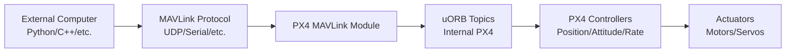
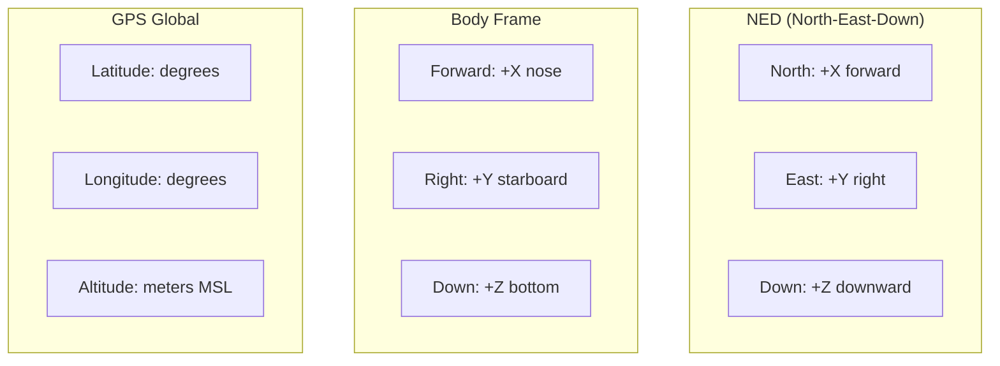

# **PX4 MAVLink External Control & Setpoint Guide**

*Complete guide for external computer control of PX4 vehicles during flight*

---

## **Table of Contents**

1. [Overview](#overview)
2. [MAVLink Communication Architecture](#mavlink-communication-architecture)
3. [Parameter System vs uORB Topics](#parameter-system-vs-uorb-topics)
4. [Available Setpoint Types](#available-setpoint-types)
5. [Working Examples by Setpoint Type](#working-examples-by-setpoint-type)
6. [Complete Flight Control Examples](#complete-flight-control-examples)
7. [Best Practices and Safety](#best-practices-and-safety)
8. [Troubleshooting](#troubleshooting)

---

## **Overview**

This guide provides comprehensive examples for controlling PX4 vehicles from external computers during flight using MAVLink protocol. It covers all possible setpoint types with working code examples in Python, C++, and other languages.

### **Key Concepts**

- **MAVLink**: Primary communication protocol between external computers and PX4
- **Offboard Mode**: PX4 flight mode that accepts external control commands
- **Setpoints**: Desired values for position, attitude, velocity, rates, thrust, etc.
- **uORB Topics**: Internal PX4 message system that MAVLink commands are converted to
- **Parameters**: Configuration values stored persistently (separate from real-time data)

### **Communication Flow**



---

## **MAVLink Communication Architecture**

### **MAVLink to uORB Translation**

**Yes, external communication through MAVLink does happen through uORB!** Here's the complete flow:

```cpp
// Example: MAVLink COMMAND_LONG becomes uORB vehicle_command
void MavlinkReceiver::handle_message_command_long(mavlink_message_t *msg)
{
    // 1. Decode MAVLink message
    mavlink_command_long_t cmd_mavlink;
    mavlink_msg_command_long_decode(msg, &cmd_mavlink);

    // 2. Convert to uORB message
    vehicle_command_s vcmd{};
    vcmd.timestamp = hrt_absolute_time();
    vcmd.param1 = cmd_mavlink.param1;
    vcmd.command = cmd_mavlink.command;
    vcmd.from_external = true;  // Mark as external source

    // 3. Publish to uORB topic
    _vehicle_command_pub.publish(vcmd);
}
```

### **Common MAVLink → uORB Conversions**

| **MAVLink Message** | **uORB Topic** | **Purpose** |
|-------------------|----------------|-------------|
| `SET_POSITION_TARGET_LOCAL_NED` | `trajectory_setpoint` | Position/velocity commands |
| `SET_ATTITUDE_TARGET` | `vehicle_attitude_setpoint` | Attitude/rate commands |
| `COMMAND_LONG` | `vehicle_command` | General commands (arm, mode, etc.) |
| `MISSION_ITEM_INT` | `mission` | Mission waypoints |
| `PARAM_SET` | Parameter system | Configuration changes |

---

## **Parameter System vs uORB Topics**

### **Two Separate Systems**

**Parameters** and **uORB Topics** are completely different systems:

| **Aspect** | **Parameters** | **uORB Topics** |
|------------|----------------|----------------|
| **Purpose** | Configuration storage | Real-time data exchange |
| **Storage** | Persistent (flash/file) | Volatile (RAM only) |
| **Access** | `param_get()`, `param_set()` | `uORB::Subscription`, `uORB::Publication` |
| **Rate** | Slow (~1Hz for changes) | Fast (up to 8kHz) |
| **Examples** | `MC_ROLL_P`, `COM_TAKEOFF_ACT` | `vehicle_attitude`, `sensor_combined` |
| **External Access** | MAVLink Parameter Protocol | MAVLink message streaming |

### **Parameter Access via MAVLink**

```python
# Get/Set parameters (configuration values)
from pymavlink import mavutil

master = mavutil.mavlink_connection('/dev/ttyUSB0')

# Get parameter value
master.mav.param_request_read_send(
    master.target_system, master.target_component,
    b'MC_ROLL_P', -1
)

# Set parameter value
master.mav.param_set_send(
    master.target_system, master.target_component,
    b'MC_ROLL_P', 6.5, mavutil.mavlink.MAV_PARAM_TYPE_REAL32
)
```

---

## **Available Setpoint Types**

PX4 accepts multiple types of setpoints from external computers. Here's a comprehensive list of all possible setpoint types:

### **1. Position Setpoints**

Control where the vehicle goes in 3D space.

| **Setpoint Type** | **MAVLink Message** | **Coordinates** | **Use Case** |
|------------------|-------------------|-----------------|--------------|
| **Local Position** | `SET_POSITION_TARGET_LOCAL_NED` | NED (North-East-Down) | Relative positioning from home |
| **Global Position** | `SET_POSITION_TARGET_GLOBAL_INT` | GPS (Lat/Lon/Alt) | Absolute world coordinates |
| **Position + Velocity** | `SET_POSITION_TARGET_LOCAL_NED` | NED + velocity | Smooth trajectory following |

### **2. Velocity Setpoints**

Control how fast the vehicle moves in each direction.

| **Setpoint Type** | **MAVLink Message** | **Reference Frame** | **Use Case** |
|------------------|-------------------|-------------------|--------------|
| **Body Velocity** | `SET_POSITION_TARGET_LOCAL_NED` | Vehicle body frame | Relative to vehicle orientation |
| **World Velocity** | `SET_POSITION_TARGET_LOCAL_NED` | NED world frame | Independent of vehicle heading |
| **Ground Speed** | `SET_POSITION_TARGET_LOCAL_NED` | Horizontal only | 2D navigation |

### **3. Attitude Setpoints**

Control vehicle orientation (roll, pitch, yaw).

| **Setpoint Type** | **MAVLink Message** | **Format** | **Use Case** |
|------------------|-------------------|------------|--------------|
| **Euler Angles** | `SET_ATTITUDE_TARGET` | Roll/Pitch/Yaw degrees | Simple orientation control |
| **Quaternion** | `SET_ATTITUDE_TARGET` | Quaternion [w,x,y,z] | Precise orientation, no gimbal lock |
| **Attitude + Thrust** | `SET_ATTITUDE_TARGET` | Attitude + normalized thrust | Manual-like control |

### **4. Angular Rate Setpoints**

Control how fast the vehicle rotates around each axis.

| **Setpoint Type** | **MAVLink Message** | **Units** | **Use Case** |
|------------------|-------------------|-----------|--------------|
| **Body Rates** | `SET_ATTITUDE_TARGET` | rad/s in body frame | Acrobatic maneuvers |
| **Angular Velocity** | `SET_ATTITUDE_TARGET` | rad/s [roll, pitch, yaw] | Direct rate control |
| **Rate + Thrust** | `SET_ATTITUDE_TARGET` | Rates + thrust | Rate mode flying |

### **5. Thrust Setpoints**

Control vehicle thrust/power directly.

| **Setpoint Type** | **MAVLink Message** | **Range** | **Use Case** |
|------------------|-------------------|-----------|--------------|
| **Normalized Thrust** | `SET_ATTITUDE_TARGET` | 0.0 to 1.0 | Combined with attitude |
| **Thrust Vector** | `SET_ATTITUDE_TARGET` | 3D thrust vector | Advanced control |
| **Collective Thrust** | Various setpoint messages | Vertical thrust component | Altitude control |

### **6. Actuator Setpoints**

Direct control of motors and servos (advanced use).

| **Setpoint Type** | **MAVLink Message** | **Range** | **Use Case** |
|------------------|-------------------|-----------|--------------|
| **Motor Outputs** | `SET_ACTUATOR_CONTROL_TARGET` | -1.0 to 1.0 | Direct motor control |
| **Servo Outputs** | `SET_ACTUATOR_CONTROL_TARGET` | -1.0 to 1.0 | Direct servo control |
| **PWM Outputs** | `OVERRIDE_RC` | 1000-2000 μs | RC channel override |

### **7. Mission/Navigation Setpoints**

High-level navigation commands.

| **Setpoint Type** | **MAVLink Message** | **Format** | **Use Case** |
|------------------|-------------------|------------|--------------|
| **Waypoints** | `MISSION_ITEM_INT` | GPS coordinates + actions | Autonomous missions |
| **Home Position** | `SET_HOME_POSITION` | GPS + altitude | Return-to-launch point |
| **Geofence** | `FENCE_POINT` | GPS boundary points | Safety boundaries |

### **8. Control Mode Commands**

Switch between different control modes.

| **Command Type** | **MAVLink Message** | **Parameters** | **Use Case** |
|-----------------|-------------------|----------------|--------------|
| **Flight Mode** | `COMMAND_LONG` | Mode ID | Switch to Manual/Auto/Offboard |
| **Arm/Disarm** | `COMMAND_LONG` | Arm parameter | Enable/disable motors |
| **Takeoff** | `COMMAND_LONG` | Altitude | Automatic takeoff |
| **Land** | `COMMAND_LONG` | None | Automatic landing |
| **Return to Launch** | `COMMAND_LONG` | None | Emergency return home |

### **Coordinate Systems**

Understanding coordinate frames is critical:



### **Setpoint Hierarchy**

Different setpoint types have different priorities:

1. **Position Setpoints** (Highest level) → Control where to go
2. **Velocity Setpoints** → Control how fast to get there
3. **Attitude Setpoints** → Control orientation
4. **Rate Setpoints** → Control angular velocity
5. **Thrust Setpoints** → Control raw power
6. **Actuator Setpoints** (Lowest level) → Direct motor control

### **Message Type Masks**

Many MAVLink messages use type masks to specify which fields are active:

```cpp
// Example type masks for SET_POSITION_TARGET_LOCAL_NED
#define POSITION_TARGET_TYPEMASK_X_IGNORE     (1<<0)
#define POSITION_TARGET_TYPEMASK_Y_IGNORE     (1<<1)
#define POSITION_TARGET_TYPEMASK_Z_IGNORE     (1<<2)
#define POSITION_TARGET_TYPEMASK_VX_IGNORE    (1<<3)
#define POSITION_TARGET_TYPEMASK_VY_IGNORE    (1<<4)
#define POSITION_TARGET_TYPEMASK_VZ_IGNORE    (1<<5)
#define POSITION_TARGET_TYPEMASK_AX_IGNORE    (1<<6)
#define POSITION_TARGET_TYPEMASK_AY_IGNORE    (1<<7)
#define POSITION_TARGET_TYPEMASK_AZ_IGNORE    (1<<8)
#define POSITION_TARGET_TYPEMASK_YAW_IGNORE   (1<<11)
#define POSITION_TARGET_TYPEMASK_YAW_RATE_IGNORE (1<<10)

// Common combinations:
// Position only: 0b110111111000 (ignore velocity, acceleration, yaw_rate)
// Velocity only: 0b110111000111 (ignore position, acceleration, yaw_rate)
// Position + Yaw: 0b010111111000 (ignore velocity, acceleration, yaw_rate)
```

**Next Step**: Working code examples for each setpoint type will be added in subsequent steps.

---

## **Working Examples by Setpoint Type**

### **1. Position Setpoints - Complete Working Examples**

#### **A. Local NED Position Control (Python)**

```python
#!/usr/bin/env python3
"""
Complete working example: Local NED position control
This script moves the drone through a square pattern in local coordinates
"""

from pymavlink import mavutil
import time
import math

class PX4PositionController:
    def __init__(self, connection_string='udp:127.0.0.1:14540'):
        """Initialize MAVLink connection"""
        print(f"Connecting to {connection_string}...")
        self.master = mavutil.mavlink_connection(connection_string)

        # Wait for heartbeat
        self.master.wait_heartbeat()
        print(f"Connected to system {self.master.target_system}, component {self.master.target_component}")

        # Flight state
        self.is_armed = False
        self.current_mode = None

    def wait_for_position_aiding(self):
        """Wait for GPS/position fix before flight"""
        print("Waiting for position aiding...")
        while True:
            msg = self.master.recv_match(type='LOCAL_POSITION_NED', blocking=True, timeout=1)
            if msg:
                print(f"Position: x={msg.x:.2f}, y={msg.y:.2f}, z={msg.z:.2f}")
                if abs(msg.x) < 1000 and abs(msg.y) < 1000:  # Valid position
                    print("Position aiding active!")
                    break
            time.sleep(0.1)

    def arm_vehicle(self):
        """Arm the vehicle"""
        print("Arming vehicle...")
        self.master.mav.command_long_send(
            self.master.target_system,
            self.master.target_component,
            mavutil.mavlink.MAV_CMD_COMPONENT_ARM_DISARM,
            0,  # confirmation
            1,  # param1: 1 = arm, 0 = disarm
            0, 0, 0, 0, 0, 0  # unused params
        )

        # Wait for arm confirmation
        while not self.is_armed:
            msg = self.master.recv_match(type='HEARTBEAT', blocking=True, timeout=2)
            if msg:
                self.is_armed = msg.base_mode & mavutil.mavlink.MAV_MODE_FLAG_SAFETY_ARMED
                if self.is_armed:
                    print("Vehicle armed!")
                    break
        return self.is_armed

    def set_mode_offboard(self):
        """Switch to offboard mode"""
        print("Setting OFFBOARD mode...")

        # PX4 mode mapping
        mode_id = self.master.mode_mapping().get('OFFBOARD')
        if mode_id is None:
            print("OFFBOARD mode not available")
            return False

        self.master.mav.set_mode_send(
            self.master.target_system,
            mavutil.mavlink.MAV_MODE_FLAG_CUSTOM_MODE_ENABLED,
            mode_id
        )

        # Wait for mode change
        timeout = time.time() + 5
        while time.time() < timeout:
            msg = self.master.recv_match(type='HEARTBEAT', blocking=True, timeout=1)
            if msg and msg.custom_mode == mode_id:
                print("OFFBOARD mode active!")
                return True

        print("Failed to set OFFBOARD mode")
        return False

    def send_position_setpoint(self, x, y, z, yaw=0.0):
        """
        Send local NED position setpoint
        x: North (meters, positive = north)
        y: East (meters, positive = east)
        z: Down (meters, positive = down, negative = up)
        yaw: Heading (radians, 0 = north)
        """
        self.master.mav.set_position_target_local_ned_send(
            0,  # time_boot_ms (ignored)
            self.master.target_system,
            self.master.target_component,
            mavutil.mavlink.MAV_FRAME_LOCAL_NED,  # coordinate frame
            0b110111111000,  # type_mask: position + yaw (ignore velocity, acceleration, yaw_rate)
            x, y, z,  # position NED
            0, 0, 0,  # velocity NED (ignored)
            0, 0, 0,  # acceleration NED (ignored)
            yaw, 0    # yaw, yaw_rate
        )

    def send_velocity_setpoint(self, vx, vy, vz, yaw_rate=0.0):
        """
        Send local NED velocity setpoint
        vx: North velocity (m/s)
        vy: East velocity (m/s)
        vz: Down velocity (m/s, positive = down)
        yaw_rate: Yaw rate (rad/s)
        """
        self.master.mav.set_position_target_local_ned_send(
            0,  # time_boot_ms
            self.master.target_system,
            self.master.target_component,
            mavutil.mavlink.MAV_FRAME_LOCAL_NED,
            0b110111000111,  # type_mask: velocity + yaw_rate (ignore position, acceleration)
            0, 0, 0,  # position NED (ignored)
            vx, vy, vz,  # velocity NED
            0, 0, 0,  # acceleration NED (ignored)
            0, yaw_rate  # yaw (ignored), yaw_rate
        )

    def get_local_position(self):
        """Get current local position"""
        msg = self.master.recv_match(type='LOCAL_POSITION_NED', blocking=True, timeout=1)
        if msg:
            return msg.x, msg.y, msg.z
        return None, None, None

    def wait_for_position(self, target_x, target_y, target_z, tolerance=0.5, timeout=30):
        """Wait until vehicle reaches target position"""
        print(f"Waiting for position: ({target_x:.1f}, {target_y:.1f}, {target_z:.1f})")
        start_time = time.time()

        while time.time() - start_time < timeout:
            x, y, z = self.get_local_position()
            if x is not None:
                distance = math.sqrt((x - target_x)**2 + (y - target_y)**2 + (z - target_z)**2)
                print(f"Current: ({x:.2f}, {y:.2f}, {z:.2f}), Distance: {distance:.2f}m")

                if distance < tolerance:
                    print(f"Reached target position! (distance: {distance:.2f}m)")
                    return True

            time.sleep(0.5)

        print(f"Timeout waiting for position")
        return False

    def takeoff(self, altitude):
        """Automated takeoff to specified altitude"""
        print(f"Taking off to {altitude}m altitude...")

        # Send takeoff command
        self.master.mav.command_long_send(
            self.master.target_system,
            self.master.target_component,
            mavutil.mavlink.MAV_CMD_NAV_TAKEOFF,
            0,  # confirmation
            0, 0, 0, 0,  # unused params
            0, 0,  # lat, lon (use current)
            altitude  # altitude
        )

        # Send position setpoints during takeoff
        target_z = -altitude  # NED: negative = up
        for i in range(100):  # 10 seconds of setpoints
            self.send_position_setpoint(0, 0, target_z, 0)
            time.sleep(0.1)

            # Check if reached altitude
            x, y, z = self.get_local_position()
            if z is not None and z < target_z + 0.5:
                print(f"Takeoff complete at altitude {-z:.1f}m")
                return True

        return False

    def land(self):
        """Automated landing"""
        print("Landing...")
        self.master.mav.command_long_send(
            self.master.target_system,
            self.master.target_component,
            mavutil.mavlink.MAV_CMD_NAV_LAND,
            0,  # confirmation
            0, 0, 0, 0, 0, 0, 0  # all params unused for simple land
        )

        # Wait for landing
        timeout = time.time() + 30
        while time.time() < timeout:
            msg = self.master.recv_match(type='EXTENDED_SYS_STATE', blocking=True, timeout=1)
            if msg and msg.landed_state == mavutil.mavlink.MAV_LANDED_STATE_ON_GROUND:
                print("Landing complete!")
                return True
            time.sleep(0.5)

        return False

def main():
    """Main flight sequence: Square pattern"""

    # Initialize controller
    controller = PX4PositionController('udp:127.0.0.1:14540')  # SITL
    # controller = PX4PositionController('/dev/ttyUSB0')  # Hardware

    try:
        # Pre-flight checks
        controller.wait_for_position_aiding()

        if not controller.arm_vehicle():
            print("Failed to arm vehicle")
            return

        # Start sending setpoints before switching to offboard
        print("Sending initial setpoints...")
        for i in range(10):
            controller.send_position_setpoint(0, 0, -10, 0)  # 10m altitude
            time.sleep(0.1)

        if not controller.set_mode_offboard():
            print("Failed to set offboard mode")
            return

        # Takeoff
        if not controller.takeoff(10):
            print("Takeoff failed")
            return

        print("\n=== Starting Square Pattern ===")

        # Square pattern waypoints (NED coordinates)
        waypoints = [
            (10, 0, -10, 0),      # North 10m
            (10, 10, -10, 1.57),  # North 10m, East 10m, Yaw 90°
            (0, 10, -10, 3.14),   # East 10m, Yaw 180°
            (0, 0, -10, -1.57),   # Home, Yaw -90°
        ]

        for i, (x, y, z, yaw) in enumerate(waypoints):
            print(f"\n--- Waypoint {i+1}: ({x}, {y}, {z}) ---")

            # Send continuous setpoints to this waypoint
            for _ in range(50):  # 5 seconds at 10Hz
                controller.send_position_setpoint(x, y, z, yaw)
                time.sleep(0.1)

            # Wait for arrival
            controller.wait_for_position(x, y, z, tolerance=1.0, timeout=20)

            print(f"Holding position for 3 seconds...")
            for _ in range(30):
                controller.send_position_setpoint(x, y, z, yaw)
                time.sleep(0.1)

        print("\n=== Square pattern complete! ===")

        # Return to launch
        print("Returning to launch position...")
        for _ in range(50):
            controller.send_position_setpoint(0, 0, -10, 0)
            time.sleep(0.1)

        controller.wait_for_position(0, 0, -10, tolerance=1.0)

        # Land
        controller.land()

    except KeyboardInterrupt:
        print("\nEmergency stop! Landing...")
        controller.land()
    except Exception as e:
        print(f"Error: {e}")
        controller.land()

if __name__ == "__main__":
    main()
```

#### **B. Global GPS Position Control (Python)**

```python
#!/usr/bin/env python3
"""
Global GPS position control example
Navigate between GPS waypoints
"""

from pymavlink import mavutil
import time

class GPSPositionController:
    def __init__(self, connection_string='udp:127.0.0.1:14540'):
        self.master = mavutil.mavlink_connection(connection_string)
        self.master.wait_heartbeat()
        print(f"Connected to system {self.master.target_system}")

    def send_global_position_setpoint(self, lat, lon, alt, yaw=0.0):
        """
        Send global GPS position setpoint
        lat: Latitude (degrees * 1e7)
        lon: Longitude (degrees * 1e7)
        alt: Altitude MSL (meters)
        yaw: Heading (radians)
        """
        self.master.mav.set_position_target_global_int_send(
            0,  # time_boot_ms
            self.master.target_system,
            self.master.target_component,
            mavutil.mavlink.MAV_FRAME_GLOBAL_INT,
            0b110111111000,  # type_mask: position + yaw
            int(lat * 1e7),   # lat_int (degrees * 1e7)
            int(lon * 1e7),   # lon_int (degrees * 1e7)
            alt,              # alt (meters MSL)
            0, 0, 0,          # velocity NED (ignored)
            0, 0, 0,          # acceleration NED (ignored)
            yaw, 0            # yaw, yaw_rate
        )

    def get_global_position(self):
        """Get current GPS position"""
        msg = self.master.recv_match(type='GLOBAL_POSITION_INT', blocking=True, timeout=1)
        if msg:
            return msg.lat / 1e7, msg.lon / 1e7, msg.alt / 1000.0
        return None, None, None

    def fly_gps_waypoints(self, waypoints):
        """Fly through GPS waypoint list"""
        for i, (lat, lon, alt) in enumerate(waypoints):
            print(f"Flying to waypoint {i+1}: {lat:.6f}, {lon:.6f}, {alt}m")

            # Send setpoints for 10 seconds
            for _ in range(100):
                self.send_global_position_setpoint(lat, lon, alt)
                time.sleep(0.1)

            print(f"Waypoint {i+1} complete")

# Example usage
if __name__ == "__main__":
    controller = GPSPositionController()

    # GPS waypoints (lat, lon, altitude_msl)
    waypoints = [
        (47.397742, 8.545594, 500),  # ETH Zurich
        (47.398242, 8.546094, 500),  # 500m north, 500m east
        (47.397742, 8.546094, 600),  # 500m east, higher altitude
        (47.397742, 8.545594, 500),  # Return to start
    ]

    controller.fly_gps_waypoints(waypoints)
```

#### **C. Position + Velocity Control (Smooth Trajectories)**

```python
#!/usr/bin/env python3
"""
Combined position and velocity control for smooth trajectories
"""

import math
import time
from pymavlink import mavutil

class SmoothTrajectoryController:
    def __init__(self, connection_string='udp:127.0.0.1:14540'):
        self.master = mavutil.mavlink_connection(connection_string)
        self.master.wait_heartbeat()

    def send_position_velocity_setpoint(self, x, y, z, vx, vy, vz, yaw=0.0):
        """Send combined position and velocity setpoint"""
        self.master.mav.set_position_target_local_ned_send(
            0,  # time_boot_ms
            self.master.target_system,
            self.master.target_component,
            mavutil.mavlink.MAV_FRAME_LOCAL_NED,
            0b110111000000,  # type_mask: position + velocity + yaw
            x, y, z,         # position NED
            vx, vy, vz,      # velocity NED
            0, 0, 0,         # acceleration (ignored)
            yaw, 0           # yaw, yaw_rate
        )

    def fly_circle(self, radius=10, height=-10, duration=30, angular_velocity=0.5):
        """Fly in a circle with smooth velocity commands"""
        print(f"Flying circle: radius={radius}m, height={-height}m")

        start_time = time.time()
        dt = 0.1  # 10Hz control rate

        while time.time() - start_time < duration:
            elapsed = time.time() - start_time
            angle = angular_velocity * elapsed

            # Circular trajectory
            x = radius * math.cos(angle)
            y = radius * math.sin(angle)
            z = height

            # Circular velocity
            vx = -radius * angular_velocity * math.sin(angle)
            vy = radius * angular_velocity * math.cos(angle)
            vz = 0

            # Yaw points toward center
            yaw = angle + math.pi

            self.send_position_velocity_setpoint(x, y, z, vx, vy, vz, yaw)
            time.sleep(dt)

        print("Circle complete!")

# Example usage
if __name__ == "__main__":
    controller = SmoothTrajectoryController()
    controller.fly_circle(radius=15, height=-20, duration=45)
```

#### **D. C++ Position Control Example**

```cpp
// position_control.cpp - C++ MAVLink position control
#include <iostream>
#include <chrono>
#include <thread>
#include <cmath>
#include <mavlink.h>

class PX4PositionController {
private:
    int sockfd;
    struct sockaddr_in server_addr;
    uint8_t system_id = 1;
    uint8_t component_id = 1;
    uint8_t target_system = 1;
    uint8_t target_component = 1;

public:
    PX4PositionController() {
        // Setup UDP socket for MAVLink
        sockfd = socket(AF_INET, SOCK_DGRAM, 0);
        server_addr.sin_family = AF_INET;
        server_addr.sin_port = htons(14540);
        server_addr.sin_addr.s_addr = inet_addr("127.0.0.1");
    }

    void sendPositionSetpoint(float x, float y, float z, float yaw = 0.0f) {
        mavlink_message_t msg;
        mavlink_set_position_target_local_ned_t pos_setpoint = {};

        pos_setpoint.time_boot_ms = 0;
        pos_setpoint.target_system = target_system;
        pos_setpoint.target_component = target_component;
        pos_setpoint.coordinate_frame = MAV_FRAME_LOCAL_NED;
        pos_setpoint.type_mask = 0b110111111000; // Position + yaw

        pos_setpoint.x = x;
        pos_setpoint.y = y;
        pos_setpoint.z = z;
        pos_setpoint.yaw = yaw;

        mavlink_msg_set_position_target_local_ned_encode(
            system_id, component_id, &msg, &pos_setpoint);

        uint8_t buffer[MAVLINK_MAX_PACKET_LEN];
        int len = mavlink_msg_to_send_buffer(buffer, &msg);

        sendto(sockfd, buffer, len, 0,
               (struct sockaddr*)&server_addr, sizeof(server_addr));
    }

    void armVehicle() {
        mavlink_message_t msg;
        mavlink_command_long_t cmd = {};

        cmd.target_system = target_system;
        cmd.target_component = target_component;
        cmd.command = MAV_CMD_COMPONENT_ARM_DISARM;
        cmd.param1 = 1.0f; // arm

        mavlink_msg_command_long_encode(system_id, component_id, &msg, &cmd);

        uint8_t buffer[MAVLINK_MAX_PACKET_LEN];
        int len = mavlink_msg_to_send_buffer(buffer, &msg);
        sendto(sockfd, buffer, len, 0,
               (struct sockaddr*)&server_addr, sizeof(server_addr));
    }

    void flySquarePattern() {
        std::cout << "Flying square pattern..." << std::endl;

        // Square waypoints
        struct Waypoint { float x, y, z, yaw; };
        Waypoint waypoints[] = {
            {10.0f, 0.0f, -10.0f, 0.0f},
            {10.0f, 10.0f, -10.0f, M_PI/2},
            {0.0f, 10.0f, -10.0f, M_PI},
            {0.0f, 0.0f, -10.0f, -M_PI/2}
        };

        for (auto& wp : waypoints) {
            std::cout << "Flying to: " << wp.x << ", " << wp.y << ", " << wp.z << std::endl;

            // Send setpoint for 5 seconds
            for (int i = 0; i < 50; i++) {
                sendPositionSetpoint(wp.x, wp.y, wp.z, wp.yaw);
                std::this_thread::sleep_for(std::chrono::milliseconds(100));
            }
        }
    }
};

int main() {
    PX4PositionController controller;

    controller.armVehicle();
    std::this_thread::sleep_for(std::chrono::seconds(2));

    controller.flySquarePattern();

    return 0;
}
```

### **2. Velocity Setpoints - Complete Working Examples**

#### **A. Body Frame Velocity Control (Python)**

```python
#!/usr/bin/env python3
"""
Body frame velocity control - move relative to drone orientation
Forward/backward, left/right, up/down relative to drone's current heading
"""

from pymavlink import mavutil
import time
import math

class VelocityController:
    def __init__(self, connection_string='udp:127.0.0.1:14540'):
        """Initialize MAVLink connection for velocity control"""
        self.master = mavutil.mavlink_connection(connection_string)
        self.master.wait_heartbeat()
        print(f"Connected to system {self.master.target_system}")

    def send_body_velocity_setpoint(self, vx_body, vy_body, vz_body, yaw_rate=0.0):
        """
        Send body frame velocity setpoint
        vx_body: Forward velocity (m/s, positive = forward)
        vy_body: Right velocity (m/s, positive = right)
        vz_body: Down velocity (m/s, positive = down, negative = up)
        yaw_rate: Yaw rate (rad/s, positive = clockwise)
        """
        self.master.mav.set_position_target_local_ned_send(
            0,  # time_boot_ms
            self.master.target_system,
            self.master.target_component,
            mavutil.mavlink.MAV_FRAME_BODY_NED,  # Body frame!
            0b110111000111,  # type_mask: velocity + yaw_rate (ignore position, acceleration)
            0, 0, 0,         # position NED (ignored)
            vx_body, vy_body, vz_body,  # velocity in body frame
            0, 0, 0,         # acceleration (ignored)
            0, yaw_rate      # yaw (ignored), yaw_rate
        )

    def send_world_velocity_setpoint(self, vx_world, vy_world, vz_world, yaw_rate=0.0):
        """
        Send world frame velocity setpoint
        vx_world: North velocity (m/s)
        vy_world: East velocity (m/s)
        vz_world: Down velocity (m/s, positive = down)
        yaw_rate: Yaw rate (rad/s)
        """
        self.master.mav.set_position_target_local_ned_send(
            0,  # time_boot_ms
            self.master.target_system,
            self.master.target_component,
            mavutil.mavlink.MAV_FRAME_LOCAL_NED,  # World NED frame
            0b110111000111,  # type_mask: velocity + yaw_rate
            0, 0, 0,         # position (ignored)
            vx_world, vy_world, vz_world,  # velocity in world frame
            0, 0, 0,         # acceleration (ignored)
            0, yaw_rate      # yaw (ignored), yaw_rate
        )

    def get_current_velocity(self):
        """Get current velocity from LOCAL_POSITION_NED"""
        msg = self.master.recv_match(type='LOCAL_POSITION_NED', blocking=True, timeout=1)
        if msg:
            return msg.vx, msg.vy, msg.vz
        return 0, 0, 0

    def get_current_attitude(self):
        """Get current attitude (for body frame calculations)"""
        msg = self.master.recv_match(type='ATTITUDE', blocking=True, timeout=1)
        if msg:
            return msg.roll, msg.pitch, msg.yaw
        return 0, 0, 0

    def body_frame_demo(self):
        """Demonstrate body frame velocity control"""
        print("\n=== Body Frame Velocity Control Demo ===")

        maneuvers = [
            ("Forward 5m/s", 5.0, 0.0, 0.0, 0.0),
            ("Backward 3m/s", -3.0, 0.0, 0.0, 0.0),
            ("Right 4m/s", 0.0, 4.0, 0.0, 0.0),
            ("Left 4m/s", 0.0, -4.0, 0.0, 0.0),
            ("Up 2m/s", 0.0, 0.0, -2.0, 0.0),
            ("Down 1m/s", 0.0, 0.0, 1.0, 0.0),
            ("Forward + Right", 3.0, 3.0, 0.0, 0.0),
            ("Spin right", 0.0, 0.0, 0.0, 0.5),
            ("Stop", 0.0, 0.0, 0.0, 0.0),
        ]

        for name, vx, vy, vz, yaw_rate in maneuvers:
            print(f"\n{name}: vx={vx}, vy={vy}, vz={vz}, yaw_rate={yaw_rate}")

            # Send command for 3 seconds
            for i in range(30):  # 3 seconds at 10Hz
                self.send_body_velocity_setpoint(vx, vy, vz, yaw_rate)

                # Print current velocity every 10 iterations
                if i % 10 == 0:
                    curr_vx, curr_vy, curr_vz = self.get_current_velocity()
                    print(f"  Current velocity: {curr_vx:.1f}, {curr_vy:.1f}, {curr_vz:.1f} m/s")

                time.sleep(0.1)

            # Brief pause between maneuvers
            time.sleep(1)

    def circle_flight_body_frame(self, radius=10, angular_velocity=0.3, duration=20):
        """Fly in circle using body frame velocity"""
        print(f"\n=== Circle Flight (Body Frame) ===")
        print(f"Radius: {radius}m, Angular velocity: {angular_velocity} rad/s")

        start_time = time.time()

        while time.time() - start_time < duration:
            # Constant forward velocity for circular motion
            forward_velocity = radius * angular_velocity

            # Send body frame commands
            self.send_body_velocity_setpoint(
                forward_velocity,  # Forward
                0.0,              # No lateral
                0.0,              # No vertical
                angular_velocity  # Constant turn rate
            )

            elapsed = time.time() - start_time
            if int(elapsed) % 5 == 0 and elapsed - int(elapsed) < 0.1:
                print(f"Circle progress: {elapsed:.1f}/{duration}s")

            time.sleep(0.1)

        # Stop
        for _ in range(10):
            self.send_body_velocity_setpoint(0, 0, 0, 0)
            time.sleep(0.1)

        print("Circle complete!")

# Example usage
if __name__ == "__main__":
    controller = VelocityController()

    # Run body frame demo
    controller.body_frame_demo()

    # Fly circle in body frame
    controller.circle_flight_body_frame(radius=15, angular_velocity=0.2, duration=30)
```

#### **B. World Frame Velocity Control (Python)**

```python
#!/usr/bin/env python3
"""
World frame velocity control - move in fixed world directions (North/East/Down)
Independent of drone orientation
"""

from pymavlink import mavutil
import time
import math

class WorldVelocityController:
    def __init__(self, connection_string='udp:127.0.0.1:14540'):
        self.master = mavutil.mavlink_connection(connection_string)
        self.master.wait_heartbeat()
        print(f"Connected for world velocity control")

    def send_world_velocity(self, north_vel, east_vel, down_vel, yaw_rate=0.0):
        """Send velocity in world NED frame"""
        self.master.mav.set_position_target_local_ned_send(
            0,  # time_boot_ms
            self.master.target_system,
            self.master.target_component,
            mavutil.mavlink.MAV_FRAME_LOCAL_NED,  # World frame
            0b110111000111,  # type_mask: velocity + yaw_rate
            0, 0, 0,         # position (ignored)
            north_vel, east_vel, down_vel,  # velocity NED
            0, 0, 0,         # acceleration (ignored)
            0, yaw_rate      # yaw (ignored), yaw_rate
        )

    def get_position_and_velocity(self):
        """Get current position and velocity"""
        msg = self.master.recv_match(type='LOCAL_POSITION_NED', blocking=True, timeout=1)
        if msg:
            return (msg.x, msg.y, msg.z), (msg.vx, msg.vy, msg.vz)
        return (0, 0, 0), (0, 0, 0)

    def fly_search_pattern(self, leg_length=20, search_speed=5.0):
        """Fly a search pattern using world frame velocities"""
        print(f"\n=== Search Pattern Flight ===")
        print(f"Leg length: {leg_length}m, Speed: {search_speed}m/s")

        # Search pattern: back and forth with offset
        legs = [
            ("North", search_speed, 0, 0),        # North
            ("East", 0, search_speed/2, 0),       # East (shorter)
            ("South", -search_speed, 0, 0),       # South
            ("East", 0, search_speed/2, 0),       # East
            ("North", search_speed, 0, 0),        # North
            ("West to center", 0, -search_speed, 0), # Return west
        ]

        for leg_name, vn, ve, vd in legs:
            print(f"\nFlying {leg_name}: vN={vn}, vE={ve}")

            # Calculate flight time for this leg
            if "East" in leg_name:
                flight_time = (leg_length/2) / abs(ve) if ve != 0 else 2
            elif "West" in leg_name:
                flight_time = leg_length / abs(ve) if ve != 0 else 3
            else:
                flight_time = leg_length / abs(vn) if vn != 0 else 3

            # Fly this leg
            start_time = time.time()
            while time.time() - start_time < flight_time:
                self.send_world_velocity(vn, ve, vd, 0)

                # Status update every 2 seconds
                if int(time.time() - start_time) % 2 == 0:
                    pos, vel = self.get_position_and_velocity()
                    print(f"  Position: ({pos[0]:.1f}, {pos[1]:.1f}, {pos[2]:.1f})")

                time.sleep(0.1)

            # Brief stop between legs
            for _ in range(10):
                self.send_world_velocity(0, 0, 0, 0)
                time.sleep(0.1)

        print("Search pattern complete!")

    def velocity_tracking_demo(self):
        """Demonstrate velocity tracking with changing commands"""
        print(f"\n=== Velocity Tracking Demo ===")

        # Sinusoidal velocity pattern
        duration = 30  # seconds
        start_time = time.time()

        while time.time() - start_time < duration:
            elapsed = time.time() - start_time

            # Sinusoidal velocities
            vn = 3.0 * math.sin(0.2 * elapsed)      # North velocity
            ve = 2.0 * math.cos(0.15 * elapsed)     # East velocity
            vd = 0.5 * math.sin(0.1 * elapsed)      # Vertical velocity
            yaw_rate = 0.2 * math.sin(0.1 * elapsed) # Yaw rate

            self.send_world_velocity(vn, ve, vd, yaw_rate)

            # Print status every 3 seconds
            if int(elapsed) % 3 == 0 and elapsed - int(elapsed) < 0.1:
                pos, curr_vel = self.get_position_and_velocity()
                print(f"Time: {elapsed:.1f}s")
                print(f"  Commanded: vN={vn:.1f}, vE={ve:.1f}, vD={vd:.1f}")
                print(f"  Actual: vN={curr_vel[0]:.1f}, vE={curr_vel[1]:.1f}, vD={curr_vel[2]:.1f}")
                print(f"  Position: N={pos[0]:.1f}, E={pos[1]:.1f}, D={pos[2]:.1f}")

            time.sleep(0.1)

        # Stop
        for _ in range(20):
            self.send_world_velocity(0, 0, 0, 0)
            time.sleep(0.1)

        print("Velocity tracking demo complete!")

# Example usage
if __name__ == "__main__":
    controller = WorldVelocityController()

    # Run search pattern
    controller.fly_search_pattern(leg_length=25, search_speed=4.0)

    # Run velocity tracking demo
    controller.velocity_tracking_demo()
```

#### **C. Gamepad/Joystick Velocity Control (Python)**

```python
#!/usr/bin/env python3
"""
Real-time velocity control using gamepad/joystick input
Requires pygame for joystick input
Install: pip install pygame
"""

import pygame
import time
from pymavlink import mavutil

class GamepadVelocityController:
    def __init__(self, connection_string='udp:127.0.0.1:14540'):
        # Initialize MAVLink
        self.master = mavutil.mavlink_connection(connection_string)
        self.master.wait_heartbeat()
        print("MAVLink connected")

        # Initialize pygame and joystick
        pygame.init()
        pygame.joystick.init()

        if pygame.joystick.get_count() == 0:
            print("No joystick detected!")
            exit(1)

        self.joystick = pygame.joystick.Joystick(0)
        self.joystick.init()
        print(f"Joystick connected: {self.joystick.get_name()}")

        # Control parameters
        self.max_velocity = 10.0  # m/s
        self.max_yaw_rate = 1.0   # rad/s
        self.deadzone = 0.1       # Joystick deadzone

    def apply_deadzone(self, value, deadzone=0.1):
        """Apply deadzone to joystick input"""
        if abs(value) < deadzone:
            return 0.0
        else:
            # Scale to remove deadzone
            sign = 1 if value > 0 else -1
            return sign * (abs(value) - deadzone) / (1.0 - deadzone)

    def send_velocity_from_joystick(self):
        """Convert joystick input to velocity commands"""
        pygame.event.pump()

        # Read joystick axes (Xbox controller layout)
        left_x = self.joystick.get_axis(0)    # Left stick X (lateral)
        left_y = self.joystick.get_axis(1)    # Left stick Y (forward/back)
        right_x = self.joystick.get_axis(3)   # Right stick X (yaw)
        right_y = self.joystick.get_axis(4)   # Right stick Y (up/down)

        # Apply deadzones
        left_x = self.apply_deadzone(left_x, self.deadzone)
        left_y = self.apply_deadzone(left_y, self.deadzone)
        right_x = self.apply_deadzone(right_x, self.deadzone)
        right_y = self.apply_deadzone(right_y, self.deadzone)

        # Convert to velocity commands (body frame)
        vx_body = -left_y * self.max_velocity      # Forward/backward
        vy_body = left_x * self.max_velocity       # Left/right
        vz_body = right_y * self.max_velocity      # Up/down
        yaw_rate = right_x * self.max_yaw_rate     # Yaw rotation

        # Send velocity command
        self.master.mav.set_position_target_local_ned_send(
            0,  # time_boot_ms
            self.master.target_system,
            self.master.target_component,
            mavutil.mavlink.MAV_FRAME_BODY_NED,  # Body frame
            0b110111000111,  # velocity + yaw_rate
            0, 0, 0,         # position (ignored)
            vx_body, vy_body, vz_body,  # velocity
            0, 0, 0,         # acceleration (ignored)
            0, yaw_rate      # yaw (ignored), yaw_rate
        )

        return vx_body, vy_body, vz_body, yaw_rate

    def run_gamepad_control(self):
        """Main control loop"""
        print("\n=== Gamepad Velocity Control ===")
        print("Controls:")
        print("  Left stick: Forward/back, Left/right")
        print("  Right stick: Up/down, Yaw rotation")
        print("  Press Ctrl+C to exit")

        try:
            while True:
                vx, vy, vz, yaw_rate = self.send_velocity_from_joystick()

                # Print velocity commands (throttled)
                if int(time.time() * 2) % 2 == 0:  # Every 0.5 seconds
                    print(f"Velocity: Forward={vx:.1f}, Right={vy:.1f}, "
                          f"Down={vz:.1f}, YawRate={yaw_rate:.2f}")

                time.sleep(0.05)  # 20Hz control rate

        except KeyboardInterrupt:
            print("\nStopping...")
            # Send stop commands
            for _ in range(10):
                self.master.mav.set_position_target_local_ned_send(
                    0, self.master.target_system, self.master.target_component,
                    mavutil.mavlink.MAV_FRAME_BODY_NED, 0b110111000111,
                    0, 0, 0, 0, 0, 0, 0, 0, 0, 0, 0
                )
                time.sleep(0.1)

# Example usage
if __name__ == "__main__":
    controller = GamepadVelocityController()
    controller.run_gamepad_control()
```

#### **D. Velocity with Obstacle Avoidance (Python)**

```python
#!/usr/bin/env python3
"""
Velocity control with simple obstacle avoidance
Uses distance sensor data to modify velocity commands
"""

from pymavlink import mavutil
import time
import math

class ObstacleAvoidanceController:
    def __init__(self, connection_string='udp:127.0.0.1:14540'):
        self.master = mavutil.mavlink_connection(connection_string)
        self.master.wait_heartbeat()

        # Obstacle avoidance parameters
        self.safe_distance = 3.0  # meters
        self.max_velocity = 5.0   # m/s
        self.avoidance_gain = 2.0

    def get_distance_sensor_data(self):
        """Get distance sensor readings"""
        msg = self.master.recv_match(type='DISTANCE_SENSOR', blocking=False)
        if msg:
            return msg.current_distance / 100.0  # Convert cm to meters
        return None

    def get_rangefinder_data(self):
        """Get rangefinder data (downward sensor)"""
        msg = self.master.recv_match(type='RANGEFINDER', blocking=False)
        if msg:
            return msg.distance
        return None

    def calculate_avoidance_velocity(self, desired_vx, desired_vy, obstacle_distance):
        """Calculate modified velocity to avoid obstacles"""
        if obstacle_distance is None or obstacle_distance > self.safe_distance:
            return desired_vx, desired_vy

        # Calculate avoidance force (inverse proportional to distance)
        avoidance_force = self.avoidance_gain / max(obstacle_distance, 0.5)

        # Assume obstacle is in front, apply backward force
        avoidance_vx = -avoidance_force
        avoidance_vy = 0.0

        # Combine desired and avoidance velocities
        final_vx = desired_vx + avoidance_vx
        final_vy = desired_vy + avoidance_vy

        # Limit to maximum velocity
        velocity_mag = math.sqrt(final_vx**2 + final_vy**2)
        if velocity_mag > self.max_velocity:
            scale = self.max_velocity / velocity_mag
            final_vx *= scale
            final_vy *= scale

        return final_vx, final_vy

    def send_safe_velocity(self, desired_vx, desired_vy, desired_vz, yaw_rate=0):
        """Send velocity with obstacle avoidance"""
        # Get obstacle distance
        obstacle_dist = self.get_distance_sensor_data()

        # Calculate safe velocity
        safe_vx, safe_vy = self.calculate_avoidance_velocity(
            desired_vx, desired_vy, obstacle_dist)

        # Check ground clearance for vertical velocity
        ground_dist = self.get_rangefinder_data()
        safe_vz = desired_vz
        if ground_dist is not None and ground_dist < 2.0 and desired_vz > 0:
            safe_vz = 0  # Don't descend if too close to ground

        # Send velocity command
        self.master.mav.set_position_target_local_ned_send(
            0, self.master.target_system, self.master.target_component,
            mavutil.mavlink.MAV_FRAME_BODY_NED, 0b110111000111,
            0, 0, 0, safe_vx, safe_vy, safe_vz, 0, 0, 0, 0, yaw_rate
        )

        # Print status
        if obstacle_dist is not None:
            status = "AVOIDING" if obstacle_dist < self.safe_distance else "CLEAR"
            print(f"Obstacle: {obstacle_dist:.1f}m ({status}), "
                  f"Velocity: {safe_vx:.1f}, {safe_vy:.1f}, {safe_vz:.1f}")

    def explore_with_avoidance(self, duration=60):
        """Explore area with automatic obstacle avoidance"""
        print(f"\n=== Exploration with Obstacle Avoidance ===")
        print(f"Duration: {duration}s, Safe distance: {self.safe_distance}m")

        start_time = time.time()
        exploration_pattern = 0

        while time.time() - start_time < duration:
            elapsed = time.time() - start_time

            # Simple exploration pattern
            if exploration_pattern == 0:  # Forward
                desired_vx, desired_vy = 3.0, 0.0
                if elapsed > 10: exploration_pattern = 1
            elif exploration_pattern == 1:  # Right
                desired_vx, desired_vy = 0.0, 2.0
                if elapsed > 15: exploration_pattern = 2
            elif exploration_pattern == 2:  # Backward
                desired_vx, desired_vy = -2.0, 0.0
                if elapsed > 25: exploration_pattern = 3
            else:  # Left
                desired_vx, desired_vy = 0.0, -2.0
                if elapsed > 35: exploration_pattern = 0

            # Send safe velocity command
            self.send_safe_velocity(desired_vx, desired_vy, 0, 0)
            time.sleep(0.1)

        # Stop
        for _ in range(10):
            self.send_safe_velocity(0, 0, 0, 0)
            time.sleep(0.1)

        print("Exploration complete!")

# Example usage
if __name__ == "__main__":
    controller = ObstacleAvoidanceController()
    controller.explore_with_avoidance(duration=45)
```

#### **E. C++ Velocity Control with Threading**

```cpp
// velocity_control.cpp - Multi-threaded velocity control
#include <iostream>
#include <thread>
#include <chrono>
#include <atomic>
#include <cmath>
#include <mavlink.h>

class VelocityController {
private:
    std::atomic<bool> running{true};
    std::atomic<float> cmd_vx{0}, cmd_vy{0}, cmd_vz{0}, cmd_yaw_rate{0};
    int sockfd;
    struct sockaddr_in server_addr;

public:
    VelocityController() {
        // Setup UDP socket
        sockfd = socket(AF_INET, SOCK_DGRAM, 0);
        server_addr.sin_family = AF_INET;
        server_addr.sin_port = htons(14540);
        server_addr.sin_addr.s_addr = inet_addr("127.0.0.1");
    }

    void sendVelocityCommand(float vx, float vy, float vz, float yaw_rate) {
        mavlink_message_t msg;
        mavlink_set_position_target_local_ned_t vel_cmd = {};

        vel_cmd.target_system = 1;
        vel_cmd.target_component = 1;
        vel_cmd.coordinate_frame = MAV_FRAME_BODY_NED;
        vel_cmd.type_mask = 0b110111000111; // Velocity + yaw_rate

        vel_cmd.vx = vx;
        vel_cmd.vy = vy;
        vel_cmd.vz = vz;
        vel_cmd.yaw_rate = yaw_rate;

        mavlink_msg_set_position_target_local_ned_encode(1, 1, &msg, &vel_cmd);

        uint8_t buffer[MAVLINK_MAX_PACKET_LEN];
        int len = mavlink_msg_to_send_buffer(buffer, &msg);
        sendto(sockfd, buffer, len, 0,
               (struct sockaddr*)&server_addr, sizeof(server_addr));
    }

    void controlLoop() {
        auto last_time = std::chrono::steady_clock::now();

        while (running) {
            auto current_time = std::chrono::steady_clock::now();
            auto dt = std::chrono::duration<float>(current_time - last_time).count();
            last_time = current_time;

            // Send current velocity commands
            sendVelocityCommand(cmd_vx, cmd_vy, cmd_vz, cmd_yaw_rate);

            std::this_thread::sleep_for(std::chrono::milliseconds(50)); // 20Hz
        }
    }

    void setVelocity(float vx, float vy, float vz, float yaw_rate = 0) {
        cmd_vx = vx;
        cmd_vy = vy;
        cmd_vz = vz;
        cmd_yaw_rate = yaw_rate;
    }

    void stop() {
        running = false;
        setVelocity(0, 0, 0, 0);
    }

    void runDemo() {
        // Start control loop in separate thread
        std::thread control_thread(&VelocityController::controlLoop, this);

        std::cout << "Starting velocity control demo..." << std::endl;

        // Demo sequence
        std::vector<std::tuple<std::string, float, float, float, float, int>> sequence = {
            {"Forward", 5.0f, 0.0f, 0.0f, 0.0f, 3},
            {"Right", 0.0f, 3.0f, 0.0f, 0.0f, 3},
            {"Backward", -3.0f, 0.0f, 0.0f, 0.0f, 3},
            {"Left", 0.0f, -3.0f, 0.0f, 0.0f, 3},
            {"Up", 0.0f, 0.0f, -2.0f, 0.0f, 2},
            {"Spin", 0.0f, 0.0f, 0.0f, 1.0f, 4},
            {"Stop", 0.0f, 0.0f, 0.0f, 0.0f, 2}
        };

        for (auto& [name, vx, vy, vz, yaw_rate, duration] : sequence) {
            std::cout << name << ": vx=" << vx << ", vy=" << vy
                     << ", vz=" << vz << ", yaw_rate=" << yaw_rate << std::endl;

            setVelocity(vx, vy, vz, yaw_rate);
            std::this_thread::sleep_for(std::chrono::seconds(duration));
        }

        stop();
        control_thread.join();
    }
};

int main() {
    VelocityController controller;
    controller.runDemo();
    return 0;
}
```

**Compilation:**
```bash
g++ -std=c++17 -pthread -o velocity_control velocity_control.cpp -lmavlink
./velocity_control
```

---

## **Complete Flight Control Examples**

*Complete flight sequences will be added in later steps*

---

## **Best Practices and Safety**

### **Safety Requirements**

1. **Vehicle must be in OFFBOARD mode** to accept external commands
2. **Commands must be sent at minimum 2Hz** for safety timeout
3. **Always monitor vehicle status** and be ready to switch to manual control
4. **Test in simulation first** before real flight
5. **Have a safety pilot ready** to take manual control

### **Connection Setup**

```python
# Basic MAVLink connection setup
from pymavlink import mavutil
import time

# Connect to PX4 (adjust port/baud as needed)
master = mavutil.mavlink_connection('udp:127.0.0.1:14540')  # SITL
# master = mavutil.mavlink_connection('/dev/ttyUSB0', baud=57600)  # Serial

# Wait for heartbeat
master.wait_heartbeat()
print(f"Connected to system {master.target_system}, component {master.target_component}")
```

---

## **Troubleshooting**

*Troubleshooting section will be added in final steps*

---

*This guide will be expanded with detailed working examples in the following steps.*
