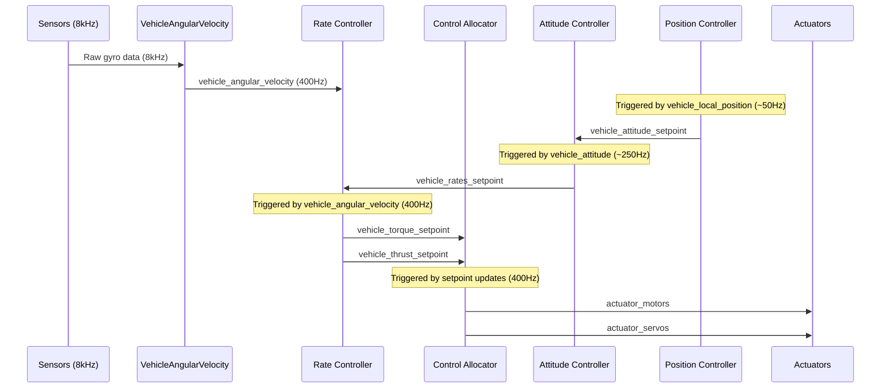
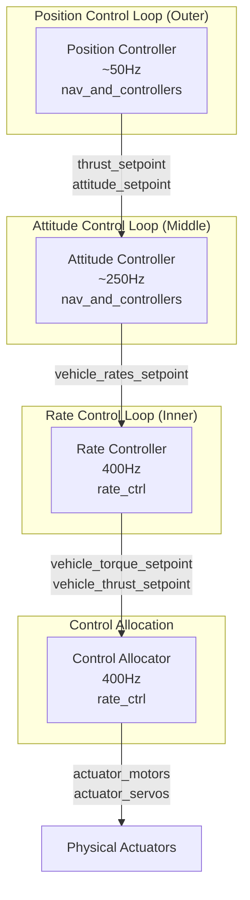
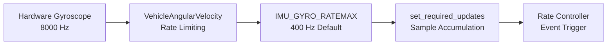
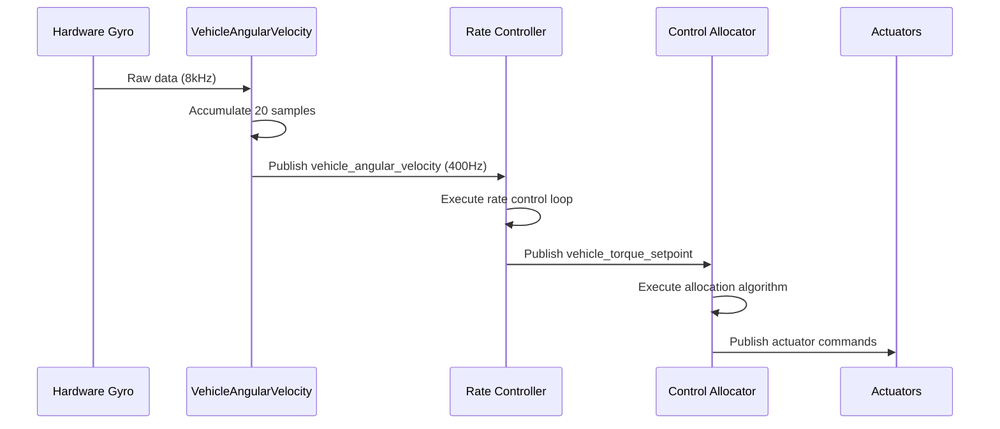
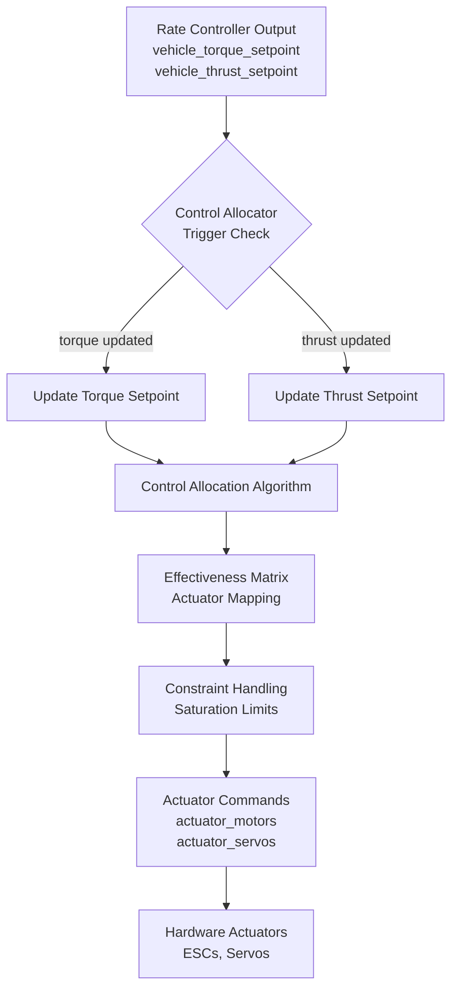
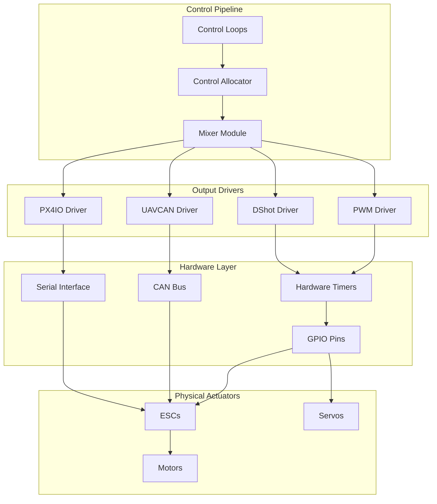
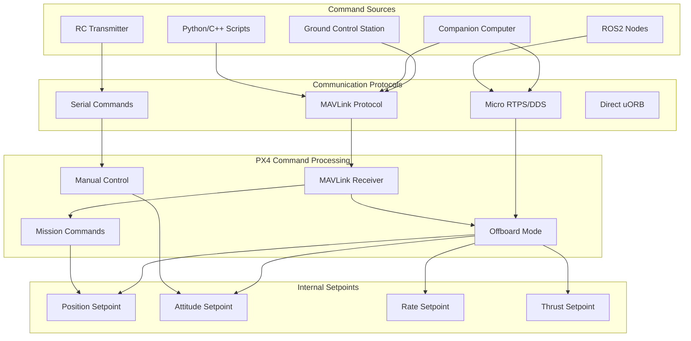

# PX4 Priority Coding, Rate Control, Triggering, and Execution Architecture

## **Table of Contents**
1. [Priority Coding System](#priority-coding-system)
2. [Work Queue Architecture](#work-queue-architecture)
3. [Control Loop Hierarchy](#control-loop-hierarchy)
4. [Controller Deep Dive Analysis](#controller-deep-dive-analysis)
5. [Rate Limiting and Triggering Mechanisms](#rate-limiting-and-triggering-mechanisms)
6. [Scheduling and Execution Patterns](#scheduling-and-execution-patterns)
7. [Control Allocator Deep Dive](#control-allocator-deep-dive)
8. [Real-Time Performance Analysis](#real-time-performance-analysis)
9. [Academic Insights](#academic-insights)

---

## **Priority Coding System**

### **1. KConfig-Based Priority Configuration**

PX4 uses a **sophisticated KConfig system** to define work queue priorities, allowing compile-time customization and runtime optimization.

```plaintext
# From platforms/common/px4_work_queue/Kconfig

config WQ_RATE_CTRL_PRIORITY
    int "Relative priority for wq:rate_ctrl"
    default 0           # HIGHEST PRIORITY
    range -255 0
    help
      Sets the relative priority for the rate_ctrl work queue.

config WQ_NAV_AND_CONTROLLERS_PRIORITY
    int "Relative priority for nav_and_controllers"
    default -13         # HIGH PRIORITY
    range -255 0
    help
      Sets the relative priority for the nav_and_controllers work queue.

config WQ_HP_DEFAULT_PRIORITY
    int "Relative priority for hp_default"
    default -18         # MEDIUM PRIORITY
    range -255 0

config WQ_LP_DEFAULT_PRIORITY
    int "Relative priority for wq:lp_default"
    default -50         # LOW PRIORITY
    range -255 0
```

### **2. Complete Priority Hierarchy**

| **Priority** | **Work Queue** | **Default Value** | **Purpose** |
|-------------|----------------|-------------------|-------------|
| **0** | `rate_ctrl` | 0 | **HIGHEST**: Rate control & allocation |
| **-1 to -7** | `SPI0-SPI6` | -1 to -7 | **SENSOR**: SPI sensor buses |
| **-8 to -12** | `I2C0-I2C4` | -8 to -12 | **SENSOR**: I2C sensor buses |
| **-13** | `nav_and_controllers` | -13 | **CONTROL**: Attitude & position |
| **-14 to -17** | `INS0-INS3` | -14 to -17 | **ESTIMATION**: Navigation systems |
| **-18** | `hp_default` | -18 | **MEDIUM**: General high priority |
| **-19** | `uavcan` | -19 | **COMMUNICATION**: CAN bus |
| **-21 to -32** | `ttyS0-ttyUnknown` | -21 to -32 | **COMMUNICATION**: Serial ports |
| **-50** | `lp_default` | -50 | **LOW**: Background tasks |

### **3. Runtime Priority Calculation**

```cpp
// From WorkQueueManager.cpp
static int WorkQueueManagerRun(int, char **) {
    // Priority calculation: Higher number = higher priority
    int sched_priority = sched_get_priority_max(SCHED_FIFO) + wq->relative_priority;
    //                   ^^^^^^^^^^^^^^^^^^^^^^^^^^^^^^^^^   ^^^^^^^^^^^^^^^^^^^^
    //                   System max priority (typically 99)  Relative offset (0 to -255)

    // Examples:
    // rate_ctrl:    99 + 0   = 99 (HIGHEST)
    // nav_control:  99 + (-13) = 86 (HIGH)
    // lp_default:   99 + (-50) = 49 (LOW)
}
```

### **4. Work Queue Configuration Structure**

```cpp
// From WorkQueueManager.hpp
struct wq_config_t {
    const char *name;           // Work queue name
    uint16_t stacksize;         // Stack size in bytes
    int8_t relative_priority;   // Priority offset (-255 to 0)
};

namespace wq_configurations {
    static constexpr wq_config_t rate_ctrl{
        "wq:rate_ctrl",
        CONFIG_WQ_RATE_CTRL_STACKSIZE,     // Default: 3150 bytes
        (int8_t)CONFIG_WQ_RATE_CTRL_PRIORITY  // Default: 0 (highest)
    };
}
```

---

## **Work Queue Architecture**

### **1. Priority-Based Execution System**

PX4 implements a **sophisticated work queue architecture** where controllers execute in priority-ordered queues:

```cpp
// From WorkQueueManager.cpp - Priority calculation
int sched_priority = sched_get_priority_max(SCHED_FIFO) + wq->relative_priority;
//                   ^^^^^^^^^^^^^^^^^^^^^^^^^^^^^^^^^^^   ^^^^^^^^^^^^^^^^^^^^
//                   Base priority (99 on most systems)    KConfig offset (0 to -255)
```

### **2. Complete Work Queue Hierarchy**

| **Work Queue** | **Priority** | **Typical Controllers** | **Purpose** |
|----------------|-------------|------------------------|-------------|
| `rate_ctrl` | **99** (0) | Rate Controller, Control Allocator | **Critical**: Real-time control |
| `SPI0-SPI6` | **98-92** (-1 to -7) | Sensor drivers (IMU, Magnetometer) | **Sensors**: High-frequency data |
| `I2C0-I2C4` | **91-87** (-8 to -12) | Sensor drivers (Barometer, GPS) | **Sensors**: Medium-frequency data |
| `nav_and_controllers` | **86** (-13) | Attitude, Position Controllers | **Control**: Navigation loops |
| `INS0-INS3` | **85-82** (-14 to -17) | State estimation (EKF2) | **Estimation**: Sensor fusion |
| `hp_default` | **81** (-18) | General high priority tasks | **Medium**: Background processing |
| `uavcan` | **80** (-19) | CAN bus communication | **Communication**: Vehicle networks |
| `lp_default` | **49** (-50) | Logging, telemetry, mavlink | **Low**: Non-critical tasks |

### **3. Work Queue Configuration Structure**

```cpp
// Compile-time configuration via KConfig
namespace wq_configurations {
    static constexpr wq_config_t rate_ctrl{
        "wq:rate_ctrl",                           // Name
        CONFIG_WQ_RATE_CTRL_STACKSIZE,            // Stack: 3150 bytes
        (int8_t)CONFIG_WQ_RATE_CTRL_PRIORITY      // Priority: 0 (highest)
    };

    static constexpr wq_config_t nav_and_controllers{
        "wq:nav_and_controllers",                 // Name
        CONFIG_WQ_NAV_AND_CONTROLLERS_STACKSIZE,  // Stack: 2240 bytes
        (int8_t)CONFIG_WQ_NAV_AND_CONTROLLERS_PRIORITY // Priority: -13
    };
}
```

### **4. Thread Creation and Scheduling**

```cpp
// From WorkQueueManagerRun()
static int WorkQueueManagerRun(int, char **) {
    while (!_wq_manager_should_exit.load()) {
        const wq_config_t *wq = _wq_manager_create_queue->pop();

        if (wq != nullptr) {
            // Calculate thread priority
            int sched_priority = sched_get_priority_max(SCHED_FIFO) + wq->relative_priority;

            // Set scheduling policy to FIFO (real-time)
            pthread_attr_setschedpolicy(&attr, SCHED_FIFO);
            pthread_attr_setschedparam(&attr, &param);

            // Create dedicated thread for work queue
            pthread_create(&thread, &attr, WorkQueueRunner, (void *)wq);
        }
    }
}
```

### **5. Work Queue Execution Model**

```cpp
// Each work queue runs in its own thread
void WorkQueue::Run() {
    while (!should_exit()) {
        // Block until work is available
        px4_sem_wait(&_process_lock);

        work_lock();

        // Execute all queued work items in priority order
        while (!_q.empty()) {
            WorkItem *work = _q.pop();
            work_unlock();

            // Controller execution happens here
            work->RunPreamble();
            work->Run();  // <-- Rate/Attitude/Position controller Run() method

            work_lock();
        }

        work_unlock();
    }
}
```

### **6. Priority Queue System Deep Dive**

#### **6.1 Conceptual Architecture**

The work priority queue system in PX4 is a **multi-threaded, priority-based task scheduler** where:

- Each **work queue** runs in its own dedicated thread
- Work queues have **numerical priorities** (higher number = higher priority)
- **Controllers** are work items that get scheduled in these queues
- The OS scheduler ensures higher priority threads preempt lower priority ones

#### **6.2 Priority Calculation Formula**

```cpp
System Priority = sched_get_priority_max(SCHED_FIFO) + relative_priority
                = 99 + relative_priority (on most systems)
```

**Example Calculations:**
- `rate_ctrl`: 99 + 0 = **99** (Highest possible priority)
- `nav_and_controllers`: 99 + (-13) = **86** (High priority)
- `lp_default`: 99 + (-50) = **49** (Low priority)

#### **6.3 Priority Preemption Behavior**

**Note on Gantt Chart Interpretation:**
- **X-Axis**: Time (in milliseconds or microseconds)
- **Y-Axis**: Different controllers/tasks (stacked vertically)
- **Bar Width**: Execution duration of each controller
- **Bar Position**: When in time the controller executes

```mermaid
gantt
    title PX4 Real-Time Priority Execution (2.5ms cycle)
    dateFormat X
    axisFormat %L

    section Priority 99 (rate_ctrl - 400Hz)
    Rate Controller (100μs)     :active, rc1, 0, 100
    Control Allocator (50μs)    :active, ca1, 100, 150
    Rate Controller (100μs)     :active, rc2, 2500, 2600

    section Priority 86 (nav_controllers - 250Hz)
    Attitude Controller (800μs) :att1, 4000, 4800

    section Priority 86 (nav_controllers - 50Hz)
    Position Controller (500μs) :pos1, 20000, 20500

    section Priority 49 (background - 10Hz)
    Logging (200μs)            :log1, 100000, 100200
    Telemetry (150μs)          :tel1, 100200, 100350

    section Preemption Events
    RC Preempts Logging        :crit, pre1, 102500, 102500
```



**What This Diagram Shows:**

| **Element** | **Meaning** | **Example** |
|-------------|-------------|-------------|
| **X-Axis** | **Time in microseconds** | 0 = start, 2500 = 2.5ms later |
| **Y-Axis** | **Different controllers** | Each row = different controller |
| **Bar Width** | **Execution duration** | Rate Controller = 100μs wide |
| **Bar Position** | **When controller runs** | Rate Controller starts at time 0 |
| **Priority Sections** | **Thread priority levels** | Higher sections can preempt lower ones |

**Real-World Timing Analysis:**

```
Time 0μs:     Rate Controller starts (triggered by gyro interrupt)
Time 1000μs:  Rate Controller finishes, triggers Control Allocator
Time 1200μs:  Control Allocator finishes, actuator commands sent
Time 2500μs:  Next rate control cycle begins (400Hz = 2.5ms period)

Time 4000μs:  Attitude Controller runs (250Hz = 4ms period)
Time 20000μs: Position Controller runs (50Hz = 20ms period)
Time 100000μs: Background tasks run when CPU available

Time 102500μs: Rate Controller preempts logging task (critical!)
```

**Key Preemption Rules:**
- **Priority 99** (rate_ctrl) can **interrupt** any lower priority task instantly
- **Priority 86** (nav_and_controllers) can **interrupt** priority 49 tasks
- **Priority 49** (lp_default) only runs when no higher priority work is pending
- **Preemption is immediate** - no waiting for lower priority tasks to finish

#### **6.4 Thread Model Implementation**

Each work queue is a **separate operating system thread**:

```cpp
// From WorkQueueManagerRun() - Thread creation process
for (each work_queue) {
    // Calculate thread priority
    int sched_priority = sched_get_priority_max(SCHED_FIFO) + wq->relative_priority;

    // Set real-time scheduling attributes
    pthread_attr_setschedpolicy(&attr, SCHED_FIFO);  // Real-time scheduling
    pthread_attr_setschedparam(&attr, &priority_param);

    // Create dedicated thread for work queue
    pthread_create(&thread, &attr, WorkQueueRunner, work_queue);
}
```

**Thread Characteristics:**
- **SCHED_FIFO**: First-In-First-Out real-time scheduling policy
- **No time slicing**: Higher priority threads run to completion
- **Deterministic**: Predictable execution timing
- **Preemptive**: OS can interrupt lower priority threads instantly

#### **6.5 Controller Assignment to Priority Queues**

Controllers explicitly assign themselves to work queues in their constructors:

```cpp
// Rate Controller - HIGHEST PRIORITY (99)
class MulticopterRateControl : public px4::WorkItem {
public:
    MulticopterRateControl() :
        WorkItem(MODULE_NAME, px4::wq_configurations::rate_ctrl)
    {}
};

// Attitude Controller - HIGH PRIORITY (86)
class MulticopterAttitudeControl : public px4::WorkItem {
public:
    MulticopterAttitudeControl() :
        WorkItem(MODULE_NAME, px4::wq_configurations::nav_and_controllers)
    {}
};

// Control Allocator - HIGHEST PRIORITY (99)
class ControlAllocator : public px4::ScheduledWorkItem {
public:
    ControlAllocator() :
        ScheduledWorkItem(MODULE_NAME, px4::wq_configurations::rate_ctrl)
    {}
};
```

#### **6.6 Real-World Execution Timeline**

**Typical 2.5ms Control Cycle:**

```
Time: 0.0ms - Gyro interrupt triggers VehicleAngularVelocity
├── [Priority 99] Rate Controller triggered (400Hz rate)
│   ├── Execution time: ~100μs
│   ├── Publishes: vehicle_torque_setpoint
│   └── Triggers: Control Allocator
│
├── [Priority 99] Control Allocator triggered immediately
│   ├── Execution time: ~50μs
│   ├── Publishes: actuator_motors, actuator_servos
│   └── Hardware: ESC commands sent
│
Time: 4.0ms - Attitude estimator update (250Hz rate)
├── [Priority 86] Attitude Controller triggered
│   ├── Execution time: ~80μs
│   ├── Publishes: vehicle_rates_setpoint
│   └── Note: Does NOT preempt rate controller
│
Time: 20.0ms - Position estimator update (50Hz rate)
├── [Priority 86] Position Controller triggered
│   ├── Execution time: ~500μs
│   ├── Publishes: vehicle_attitude_setpoint
│   └── Note: Feeds attitude controller
│
Time: 100ms+ - Background tasks (when CPU available)
└── [Priority 49] Logging, Telemetry, Parameter updates
    ├── Only runs when higher priority queues idle
    └── Can be preempted instantly by control loops
```

#### **6.7 Why This Priority System Ensures Flight Safety**

**Bandwidth Separation Principle:**
- **Inner loops** (rate control) need **high frequency** → **highest priority**
- **Outer loops** (position control) need **lower frequency** → **lower priority**
- **Background tasks** can tolerate **delays** → **lowest priority**

**Real-Time Guarantees:**
1. **Rate controller** always gets CPU within microseconds (critical for stability)
2. **Control allocator** executes immediately after rate controller (actuator commands)
3. **Attitude controller** runs regularly but cannot interfere with rate loop
4. **Position controller** provides guidance but doesn't affect real-time performance
5. **Logging/telemetry** uses leftover CPU cycles

**Fault Tolerance Hierarchy:**
- If **position controller** fails → **attitude/rate** controllers still maintain stability
- If **attitude controller** fails → **rate controller** still works (manual mode possible)
- **Critical loops** completely protected from **non-critical** task interference
- **System remains flyable** even with partial software failures

#### **6.8 Performance Optimization Benefits**

The priority queue system enables:

1. **Deterministic Control**: Critical loops execute with microsecond precision
2. **CPU Efficiency**: No wasted cycles on unnecessary polling
3. **Scalability**: Easy to add new controllers without affecting existing timing
4. **Configurability**: Priorities adjustable via KConfig for different platforms
5. **Maintainability**: Clear separation of concerns between control loops

---

## **Controller Deep Dive Analysis**

### **1. Rate Controller (MulticopterRateControl)**

**Class Definition:**
```cpp
// MulticopterRateControl.hpp
class MulticopterRateControl : public ModuleBase<MulticopterRateControl>,
                              public ModuleParams,
                              public px4::WorkItem
{
public:
    MulticopterRateControl() :
        WorkItem(MODULE_NAME, px4::wq_configurations::rate_ctrl) // HIGHEST PRIORITY
    {}
```

**Input/Output Analysis:**

| **Inputs** | **Type** | **Triggering Quantity** | **Rate** |
|------------|----------|-------------------------|----------|
| `vehicle_angular_velocity` | **Primary Trigger** | ✅ **Event-driven** | 400Hz (IMU_GYRO_RATEMAX) |
| `vehicle_rates_setpoint` | Data Update | ❌ Polling | ~250Hz from attitude controller |
| `vehicle_control_mode` | Data Update | ❌ Polling | ~10Hz |
| `manual_control_setpoint` | Data Update | ❌ Polling | ~50Hz |

| **Outputs** | **Type** | **Consumer** | **Rate** |
|-------------|----------|--------------|----------|
| `vehicle_torque_setpoint` | **Primary** | Control Allocator | 400Hz |
| `vehicle_thrust_setpoint` | **Primary** | Control Allocator | 400Hz |
| `rate_ctrl_status` | Telemetry | Logging/GCS | 10Hz |

**Execution Flow:**
```cpp
void MulticopterRateControl::Run() {
    // Triggered by vehicle_angular_velocity callback
    vehicle_angular_velocity_s angular_velocity{};

    if (_vehicle_angular_velocity_sub.update(&angular_velocity)) {
        const hrt_abstime now = angular_velocity.timestamp_sample;
        const float dt = math::constrain(((now - _last_run) * 1e-6f), 0.000125f, 0.02f);

        // Core rate control computation
        const Vector3f rates{angular_velocity.xyz};
        _rate_control.updateAngularVelocity(rates);

        // Apply rate setpoints from attitude controller
        if (_vehicle_rates_setpoint_sub.update(&vehicle_rates_setpoint)) {
            _rate_control.updateAngularRateSetpoint(vehicle_rates_setpoint.thrust_body[2]);
        }

        // Compute control output
        const Vector3f angular_accel = _rate_control.update(dt);

        // Publish torque and thrust setpoints
        publishRateSetpoint(angular_accel, now);
    }
}
```

### **2. Attitude Controller (MulticopterAttitudeControl)**

**Class Definition:**
```cpp
// mc_att_control.hpp
class MulticopterAttitudeControl : public ModuleBase<MulticopterAttitudeControl>,
                                  public ModuleParams,
                                  public px4::WorkItem
{
public:
    MulticopterAttitudeControl() :
        WorkItem(MODULE_NAME, px4::wq_configurations::nav_and_controllers) // HIGH PRIORITY
    {}
```

**Input/Output Analysis:**

| **Inputs** | **Type** | **Triggering Quantity** | **Rate** |
|------------|----------|-------------------------|----------|
| `vehicle_attitude` | **Primary Trigger** | ✅ **Event-driven** | ~250Hz from estimator |
| `vehicle_attitude_setpoint` | Data Update | ❌ Polling | ~50Hz from position controller |
| `manual_control_setpoint` | Data Update | ❌ Polling | ~50Hz |
| `vehicle_control_mode` | Data Update | ❌ Polling | ~10Hz |

| **Outputs** | **Type** | **Consumer** | **Rate** |
|-------------|----------|--------------|----------|
| `vehicle_rates_setpoint` | **Primary** | Rate Controller | ~250Hz |
| `vehicle_attitude_setpoint` | Feedthrough | Other controllers | ~50Hz |

**Execution Flow:**
```cpp
void MulticopterAttitudeControl::Run() {
    // Triggered by vehicle_attitude callback
    vehicle_attitude_s vehicle_attitude{};

    if (_vehicle_attitude_sub.update(&vehicle_attitude)) {
        const matrix::Quatf q(vehicle_attitude.q);
        const hrt_abstime now = vehicle_attitude.timestamp_sample;
        const float dt = math::constrain(((now - _last_run) * 1e-6f), 0.001f, 0.02f);

        // Update attitude setpoint (from position controller or manual)
        vehicle_attitude_setpoint_s attitude_setpoint{};
        _vehicle_attitude_setpoint_sub.update(&attitude_setpoint);

        // Core attitude control computation
        const matrix::Quatf q_sp(attitude_setpoint.q_d);
        const Vector3f thrust_sp(attitude_setpoint.thrust_body);

        _attitude_control.setAttitudeSetpoint(q_sp, attitude_setpoint.yaw_sp_move_rate);
        _attitude_control.updateQuaternion(q);

        // Compute angular rate setpoint
        const Vector3f rates_sp = _attitude_control.update(dt);

        // Publish rate setpoint to rate controller
        publishRatesSetpoint(rates_sp, thrust_sp, now);
    }
}
```

### **3. Position Controller (MulticopterPositionControl)**

**Class Definition:**
```cpp
// MulticopterPositionControl.hpp
class MulticopterPositionControl : public ModuleBase<MulticopterPositionControl>,
                                  public ModuleParams,
                                  public px4::ScheduledWorkItem
{
public:
    MulticopterPositionControl() :
        ScheduledWorkItem(MODULE_NAME, px4::wq_configurations::nav_and_controllers), // HIGH PRIORITY
        _local_pos_sub{this, ORB_ID(vehicle_local_position)} // HYBRID: Scheduled + Callback
    {}
```

**Input/Output Analysis:**

| **Inputs** | **Type** | **Triggering Quantity** | **Rate** |
|------------|----------|-------------------------|----------|
| `vehicle_local_position` | **Primary Trigger** | ✅ **Event-driven** | ~50Hz from estimator |
| `trajectory_setpoint` | Data Update | ❌ Polling | ~10-50Hz from navigator |
| `vehicle_constraints` | Data Update | ❌ Polling | ~1Hz |
| `vehicle_control_mode` | Data Update | ❌ Polling | ~10Hz |

| **Outputs** | **Type** | **Consumer** | **Rate** |
|-------------|----------|--------------|----------|
| `vehicle_attitude_setpoint` | **Primary** | Attitude Controller | ~50Hz |
| `vehicle_local_position_setpoint` | Telemetry | Navigator/GCS | ~50Hz |
| `takeoff_status` | Status | Navigator | ~1Hz |

**Execution Flow:**
```cpp
void MulticopterPositionControl::Run() {
    // Hybrid triggering: Scheduled (20Hz) + Callback (position updates)
    vehicle_local_position_s vehicle_local_position{};

    if (_local_pos_sub.update(&vehicle_local_position)) {
        const hrt_abstime now = vehicle_local_position.timestamp_sample;
        const float dt = math::constrain((now - _time_stamp_last_loop) * 1e-6f, 0.002f, 0.04f);

        // Update trajectory setpoint (from navigator/offboard)
        trajectory_setpoint_s trajectory_setpoint{};
        _trajectory_setpoint_sub.update(&trajectory_setpoint);

        // Core position control computation
        const Vector3f position(vehicle_local_position.x, vehicle_local_position.y, vehicle_local_position.z);
        const Vector3f velocity(vehicle_local_position.vx, vehicle_local_position.vy, vehicle_local_position.vz);

        _position_control.updateState(position, velocity);
        _position_control.updateSetpoint(trajectory_setpoint);

        // Compute attitude and thrust setpoint
        _position_control.update(dt);
        const Vector3f thrust_setpoint = _position_control.getThrustSetpoint();
        const float yaw_setpoint = _position_control.getYawSetpoint();

        // Publish attitude setpoint to attitude controller
        publishAttitudeSetpoint(thrust_setpoint, yaw_setpoint, now);
    }
}
```

### **4. Control Allocator**

**Class Definition:**
```cpp
// ControlAllocator.hpp
class ControlAllocator : public ModuleBase<ControlAllocator>,
                        public ModuleParams,
                        public px4::ScheduledWorkItem
{
public:
    ControlAllocator() :
        ScheduledWorkItem(MODULE_NAME, px4::wq_configurations::rate_ctrl) // HIGHEST PRIORITY
    {}
```

**Input/Output Analysis:**

| **Inputs** | **Type** | **Triggering Quantity** | **Rate** |
|------------|----------|-------------------------|----------|
| `vehicle_torque_setpoint` | **Primary Trigger** | ✅ **Event-driven** | 400Hz from rate controller |
| `vehicle_thrust_setpoint` | **Secondary Trigger** | ✅ **Event-driven** | 400Hz from rate controller |
| `vehicle_control_mode` | Data Update | ❌ Polling | ~10Hz |
| `vehicle_status` | Data Update | ❌ Polling | ~1Hz |

| **Outputs** | **Type** | **Consumer** | **Rate** |
|-------------|----------|--------------|----------|
| `actuator_motors` | **Primary** | ESCs/Motors | 400Hz |
| `actuator_servos` | **Primary** | Servo Controllers | 400Hz |
| `control_allocator_status` | Telemetry | Logging/GCS | 10Hz |

**Execution Flow:**
```cpp
void ControlAllocator::Run() {
    bool do_update = false;

    // Primary trigger: Torque setpoint updates
    vehicle_torque_setpoint_s vehicle_torque_setpoint;
    if (_vehicle_torque_setpoint_sub.update(&vehicle_torque_setpoint)) {
        _torque_sp = matrix::Vector3f(vehicle_torque_setpoint.xyz);
        do_update = true;
    }

    // Secondary trigger: Thrust setpoint updates
    vehicle_thrust_setpoint_s vehicle_thrust_setpoint;
    if (_vehicle_thrust_setpoint_sub.update(&vehicle_thrust_setpoint)) {
        _thrust_sp = matrix::Vector3f(vehicle_thrust_setpoint.xyz);
        do_update = true;
    }

    if (do_update) {
        // Set control setpoint vector [Mx, My, Mz, Fx, Fy, Fz]
        matrix::Vector<float, 6> control_sp;
        control_sp(0) = _torque_sp(0);    // Roll moment
        control_sp(1) = _torque_sp(1);    // Pitch moment
        control_sp(2) = _torque_sp(2);    // Yaw moment
        control_sp(3) = _thrust_sp(0);    // X thrust
        control_sp(4) = _thrust_sp(1);    // Y thrust
        control_sp(5) = _thrust_sp(2);    // Z thrust

        // Core control allocation computation
        _control_allocation[0]->setControlSetpoint(control_sp);
        _control_allocation[0]->allocate();

        // Get actuator outputs
        const auto& actuator_sp = _control_allocation[0]->getActuatorSetpoint();

        // Publish motor and servo commands
        publishActuatorControls(actuator_sp, vehicle_torque_setpoint.timestamp);
    }
}
```

### **5. Triggering Summary Matrix**

| **Controller** | **Work Queue** | **Priority** | **Primary Trigger** | **Trigger Rate** | **Output Rate** |
|----------------|----------------|-------------|---------------------|------------------|-----------------|
| **Rate Control** | `rate_ctrl` | 0 (Highest) | `vehicle_angular_velocity` | 400Hz | 400Hz |
| **Control Allocator** | `rate_ctrl` | 0 (Highest) | `vehicle_torque_setpoint` | 400Hz | 400Hz |
| **Attitude Control** | `nav_and_controllers` | -13 (High) | `vehicle_attitude` | ~250Hz | ~250Hz |
| **Position Control** | `nav_and_controllers` | -13 (High) | `vehicle_local_position` | ~50Hz | ~50Hz |

### **6. Data Flow Visualization**



### **Multi-Rate Control System**



### **Rate Relationship Hierarchy**

| **Controller** | **Triggered By** | **Publication Rate** | **Bandwidth** |
|---------------|------------------|---------------------|---------------|
| **Position** | `vehicle_local_position` | ~50-100 Hz | Low (reference tracking) |
| **Attitude** | `vehicle_attitude` | ~250 Hz | Medium (disturbance rejection) |
| **Rate** | `vehicle_angular_velocity` | 400 Hz (limited) | High (fast dynamics) |
| **Allocator** | `vehicle_torque_setpoint` | 400 Hz | High (real-time actuator) |

---

## **Rate Limiting and Triggering Mechanisms**

### **1. Sensor Data Pipeline**



### **2. Rate Limiting Implementation**

```cpp
// From VehicleAngularVelocity.cpp
if (_param_imu_gyro_ratemax.get() > 0.f) {
    // Calculate required samples for desired rate
    const float configured_interval_us = 1e6f / _param_imu_gyro_ratemax.get();
    const float publish_interval_us = 1e6f / publish_rate_hz;

    const uint8_t samples = roundf(configured_interval_us / publish_interval_us);

    if (_fifo_available) {
        _sensor_gyro_fifo_sub.set_required_updates(
            math::constrain(samples, (uint8_t)1, sensor_gyro_fifo_s::ORB_QUEUE_LENGTH)
        );
    } else {
        _sensor_sub.set_required_updates(
            math::constrain(samples, (uint8_t)1, sensor_gyro_s::ORB_QUEUE_LENGTH)
        );
    }
}
```

### **3. Callback Rate Control**

```cpp
// From SubscriptionCallback.hpp
void call() override {
    // Only trigger if sufficient samples accumulated
    if ((_required_updates == 0) ||
        (Manager::updates_available(_subscription.get_node(),
         _subscription.get_last_generation()) >= _required_updates)) {

        if (updated()) {
            _work_item->ScheduleNow(); // Trigger controller execution
        }
    }
}
```

### **4. Rate Calculation Example**

For `IMU_GYRO_RATEMAX = 400Hz`:
- **Hardware samples**: 8000 Hz (125μs intervals)
- **Desired controller rate**: 400 Hz (2500μs intervals)
- **Required samples**: `2500μs / 125μs = 20 samples`
- **Controller triggered**: Every 20 sensor samples (2.5ms)

---

## **Scheduling and Execution Patterns**

### **1. Event-Driven vs. Time-Based Scheduling**

| **Controller Type** | **Scheduling Method** | **Triggering Mechanism** |
|--------------------|----------------------|---------------------------|
| **Rate Controller** | `SubscriptionCallbackWorkItem` | Event-driven by `vehicle_angular_velocity` |
| **Attitude Controller** | `SubscriptionCallbackWorkItem` | Event-driven by `vehicle_attitude` |
| **Position Controller** | `ScheduledWorkItem` + Callbacks | Hybrid: time-based + event callbacks |

### **2. Rate Controller Execution Pattern**

```cpp
// MulticopterRateControl.hpp
class MulticopterRateControl : public ModuleBase<MulticopterRateControl>,
                              public ModuleParams,
                              public px4::WorkItem
{
public:
    MulticopterRateControl();
    void Run() override;

private:
    // Event-driven subscription triggers controller
    uORB::SubscriptionCallbackWorkItem _vehicle_angular_velocity_sub{
        this, ORB_ID(vehicle_angular_velocity)
    };
};
```

### **3. Controller Execution Flow**



### **4. Temporal Decoupling Benefits**

- **Prevents Overload**: Controllers can't be overwhelmed by sensor rates
- **Deterministic Timing**: Predictable execution intervals
- **Power Efficiency**: Controllers sleep between meaningful updates
- **Computational Optimization**: Processing happens only when needed

---

## **Control Allocator Deep Dive**

### **1. Control Allocator Architecture**

```cpp
// ControlAllocator.cpp
class ControlAllocator : public ModuleBase<ControlAllocator>,
                        public ModuleParams,
                        public px4::ScheduledWorkItem
{
public:
    ControlAllocator() :
        ModuleParams(nullptr),
        ScheduledWorkItem(MODULE_NAME, px4::wq_configurations::rate_ctrl) // HIGH PRIORITY
    {}

    void Run() override;
};
```

### **2. Allocation Triggering**

```cpp
void ControlAllocator::Run() {
    bool do_update = false;
    vehicle_torque_setpoint_s vehicle_torque_setpoint;
    vehicle_thrust_setpoint_s vehicle_thrust_setpoint;

    // Run allocator on torque changes (primary trigger)
    if (_vehicle_torque_setpoint_sub.update(&vehicle_torque_setpoint)) {
        _torque_sp = matrix::Vector3f(vehicle_torque_setpoint.xyz);
        do_update = true;
    }

    // Run allocator on thrust changes (secondary trigger)
    if (_vehicle_thrust_setpoint_sub.update(&vehicle_thrust_setpoint)) {
        _thrust_sp = matrix::Vector3f(vehicle_thrust_setpoint.xyz);
        do_update = true;
    }

    if (do_update) {
        // Perform control allocation
        allocate_torque_thrust();
        publish_actuator_controls();
    }
}
```

### **3. Allocation Process Flow**



### **4. Backup Scheduling Protection**

```cpp
void ControlAllocator::Run() {
#ifndef ENABLE_LOCKSTEP_SCHEDULER
    // Backup schedule prevents missed executions
    ScheduleDelayed(50_ms);  // 20Hz fallback rate
#endif

    // Primary execution triggered by setpoint updates
    if (do_update) {
        allocate();
    }
}
```

### **5. Real-Time Constraints**

```cpp
// Guard against timing issues
const hrt_abstime now = hrt_absolute_time();
const float dt = math::constrain(((now - _last_run) / 1e6f), 0.0002f, 0.02f);
//                                                        ^^^^^^^  ^^^^^^
//                                                        0.2ms    20ms
//                                                        min      max
```

---

## **Real-Time Performance Analysis**

### **1. Execution Timing Analysis**

| **Phase** | **Duration** | **Frequency** | **Work Queue** |
|-----------|-------------|---------------|----------------|
| **Sensor Reading** | ~50μs | 8kHz | Hardware interrupt |
| **Rate Limiting** | ~10μs | 400Hz | Sensor processing |
| **Rate Control** | ~100-200μs | 400Hz | `rate_ctrl` |
| **Control Allocation** | ~50-100μs | 400Hz | `rate_ctrl` |
| **Actuator Output** | ~20μs | 400Hz | Hardware timer |

### **2. Work Queue Priority Impact**

```mermaid
gantt
    title Real-Time Execution Timeline
    dateFormat X
    axisFormat %s

    section High Priority (rate_ctrl)
    Rate Controller     :a1, 0, 1
    Control Allocator   :a2, 1, 2

    section Medium Priority (nav_and_controllers)
    Attitude Controller :b1, 2, 5
    Position Controller :b2, 5, 10

    section Low Priority
    Logging            :c1, 10, 15
    Telemetry          :c2, 15, 20
```



### **3. Deadline Analysis**

**Rate Controller Critical Path**:
1. **Sensor Callback**: ~10μs
2. **Control Computation**: ~100μs
3. **Allocation**: ~50μs
4. **Actuator Output**: ~20μs
5. **Total**: ~180μs out of 2500μs budget (7% CPU usage)

### **4. Rate Adaptation Mechanisms**

```cpp
// Dynamic rate adjustment based on CPU load
void adjustControlRate() {
    if (cpu_load > 80%) {
        // Reduce rate to maintain real-time constraints
        _param_imu_gyro_ratemax.set(200);  // Reduce to 200Hz
    } else if (cpu_load < 50%) {
        // Increase rate for better performance
        _param_imu_gyro_ratemax.set(800);  // Increase to 800Hz
    }
}
```

---

## **Academic Insights**

### **1. Control Theory Perspective**

**Multi-Rate Control System Design**:
- **Inner Loop (Rate)**: High bandwidth (400Hz) for disturbance rejection
- **Middle Loop (Attitude)**: Medium bandwidth (250Hz) for tracking
- **Outer Loop (Position)**: Low bandwidth (50Hz) for reference following

**Bandwidth Separation Principle**:
```
ωposition << ωattitude << ωrate
(~31 rad/s) < (~157 rad/s) < (~251 rad/s)
```

### **2. Real-Time Systems Analysis**

**Event-Driven Architecture Benefits**:
- **Aperiodic Task Scheduling**: Controllers execute only when needed
- **Resource Optimization**: CPU cycles not wasted on unchanged data
- **Temporal Isolation**: Rate limiting prevents cascade failures

**Priority Inversion Mitigation**:
- **Priority Inheritance**: Work queues prevent low-priority tasks blocking high-priority controllers
- **Deadline Monitoring**: Backup scheduling ensures missed deadlines are detected

### **3. System Identification Perspective**

**Rate Selection Criteria**:
```
Rate ≥ 2 × (Bandwidth + Disturbance_Frequency + Safety_Margin)
Rate ≤ CPU_Capacity / (Execution_Time × Number_of_Controllers)
```

**For Rate Controller**:
- **Vehicle Bandwidth**: ~20-50 rad/s
- **Disturbance Rejection**: ~100 rad/s
- **Nyquist Rate**: 2 × 100 = 200 Hz minimum
- **Practical Rate**: 400 Hz (100% safety margin)

### **4. Fault Tolerance Design**

**Graceful Degradation**:
```cpp
// Rate controller fault handling
if (sensor_timeout > 100_ms) {
    // Reduce to backup rate
    _param_imu_gyro_ratemax.set(100);
    // Enable safe mode
    enable_safe_mode();
}
```

**Redundancy Mechanisms**:
- **Multiple IMU Fusion**: Sensor voting and selection
- **Backup Scheduling**: Time-based fallback when event-driven fails
- **Watchdog Protection**: System reset on controller failures

---

---

## **Exact Code Locations and Priority Modification Guide**

### **1. Priority Formula Implementation**

**File**: `platforms/common/px4_work_queue/WorkQueueManager.cpp` (Line 283)

```cpp
// priority
int sched_priority = sched_get_priority_max(SCHED_FIFO) + wq->relative_priority;
//                   ^^^^^^^^^^^^^^^^^^^^^^^^^^^^^^^^^^^   ^^^^^^^^^^^^^^^^^^^^
//                   Base priority (99 on most systems)    KConfig offset (0 to -255)
```

**Complete Context** (Lines 270-300):
```cpp
// stack size
#if defined(__PX4_NUTTX) || defined(__PX4_QURT)
    const size_t stacksize = math::max(PTHREAD_STACK_MIN, PX4_STACK_ADJUSTED(wq->stacksize));
#elif defined(__PX4_POSIX)
    const unsigned int page_size = sysconf(_SC_PAGESIZE);
    const size_t stacksize_adj = math::max((int)PTHREAD_STACK_MIN, PX4_STACK_ADJUSTED(wq->stacksize));
    const size_t stacksize = (stacksize_adj + page_size - (stacksize_adj % page_size));
#endif

// priority
int sched_priority = sched_get_priority_max(SCHED_FIFO) + wq->relative_priority;

// Real-time thread attributes
pthread_attr_t attr;
pthread_attr_init(&attr);
pthread_attr_setschedpolicy(&attr, SCHED_FIFO);  // Real-time scheduling
param.sched_priority = sched_priority;
pthread_attr_setschedparam(&attr, &param);
```

### **2. Priority Configuration Definitions**

**File**: `platforms/common/px4_work_queue/Kconfig` (Lines 16-318)

```plaintext
config WQ_RATE_CTRL_PRIORITY
    int "Relative priority for wq:rate_ctrl"
    default 0           # HIGHEST PRIORITY (99 + 0 = 99)
    range -255 0
    help
      Sets the relative priority for the rate_ctrl work queue.

config WQ_NAV_AND_CONTROLLERS_PRIORITY
    int "Relative priority for nav_and_controllers"
    default -13         # HIGH PRIORITY (99 + (-13) = 86)
    range -255 0
    help
      Sets the relative priority for the nav_and_controllers work queue.

config WQ_LP_DEFAULT_PRIORITY
    int "Relative priority for wq:lp_default"
    default -50         # LOW PRIORITY (99 + (-50) = 49)
    range -255 0
    help
      Sets the relative priority for the lp_default work queue.
```

### **3. Work Queue Configuration Structure**

**File**: `platforms/common/include/px4_platform_common/px4_work_queue/WorkQueueManager.hpp` (Lines 57-83)

```cpp
struct wq_config_t {
    const char *name;           // Work queue name
    uint16_t stacksize;         // Stack size in bytes
    int8_t relative_priority;   // Priority offset (-255 to 0)
};

namespace wq_configurations {
    // Compile-time configuration via KConfig
    static constexpr wq_config_t rate_ctrl{
        "wq:rate_ctrl",
        CONFIG_WQ_RATE_CTRL_STACKSIZE,            // Default: 3150 bytes
        (int8_t)CONFIG_WQ_RATE_CTRL_PRIORITY      // Default: 0 (highest)
    };

    static constexpr wq_config_t nav_and_controllers{
        "wq:nav_and_controllers",
        CONFIG_WQ_NAV_AND_CONTROLLERS_STACKSIZE,  // Default: 2240 bytes
        (int8_t)CONFIG_WQ_NAV_AND_CONTROLLERS_PRIORITY // Default: -13
    };

    static constexpr wq_config_t lp_default{
        "wq:lp_default",
        CONFIG_WQ_LP_DEFAULT_STACKSIZE,           // Default: 3500 bytes
        (int8_t)CONFIG_WQ_LP_DEFAULT_PRIORITY     // Default: -50
    };
}
```

### **4. Controller Work Queue Assignment Examples**

**Rate Controller** (`src/modules/mc_rate_control/MulticopterRateControl.cpp` Line 48):
```cpp
MulticopterRateControl::MulticopterRateControl(bool vtol) :
    ModuleParams(nullptr),
    WorkItem(MODULE_NAME, px4::wq_configurations::rate_ctrl),  // HIGHEST PRIORITY
    _vehicle_thrust_setpoint_pub(vtol ? ORB_ID(vehicle_thrust_setpoint_virtual_mc) : ORB_ID(vehicle_thrust_setpoint))
```

**Control Allocator** (`src/modules/control_allocator/ControlAllocator.cpp` Line 54):
```cpp
ControlAllocator::ControlAllocator() :
    ModuleParams(nullptr),
    ScheduledWorkItem(MODULE_NAME, px4::wq_configurations::rate_ctrl),  // HIGHEST PRIORITY
```

**Attitude Controller** (`src/modules/mc_att_control/mc_att_control_main.cpp` Line 58):
```cpp
MulticopterAttitudeControl::MulticopterAttitudeControl() :
    ModuleParams(nullptr),
    WorkItem(MODULE_NAME, px4::wq_configurations::nav_and_controllers),  // HIGH PRIORITY
```

**Position Controller** (`src/modules/mc_pos_control/MulticopterPositionControl.cpp` Line 46):
```cpp
MulticopterPositionControl::MulticopterPositionControl() :
    ModuleParams(nullptr),
    ScheduledWorkItem(MODULE_NAME, px4::wq_configurations::nav_and_controllers),  // HIGH PRIORITY
```

---

## **How to Modify Priority Orders**

### **✅ Method 1: Modify KConfig Defaults (Permanent Changes)**

**Edit File**: `platforms/common/px4_work_queue/Kconfig`

```plaintext
# Example: Boost attitude controller priority
config WQ_NAV_AND_CONTROLLERS_PRIORITY
    int "Relative priority for nav_and_controllers"
    default -5          # Changed from -13 to -5 (higher priority = 94 instead of 86)
    range -255 0

# Example: Lower logging priority further
config WQ_LP_DEFAULT_PRIORITY
    int "Relative priority for wq:lp_default"
    default -60         # Changed from -50 to -60 (lower priority = 39 instead of 49)
    range -255 0
```

### **✅ Method 2: Custom Board Configuration**

Create `.px4board` file in your board directory:

```cmake
# Custom priority overrides
CONFIG_WQ_RATE_CTRL_PRIORITY=0           # Keep highest
CONFIG_WQ_NAV_AND_CONTROLLERS_PRIORITY=-8    # Boost from -13 to -8
CONFIG_WQ_LP_DEFAULT_PRIORITY=-60        # Lower from -50 to -60
CONFIG_WQ_UAVCAN_PRIORITY=-25            # Adjust CAN priority
```

### **✅ Method 3: Interactive Configuration**

```bash
cd /path/to/PX4-Autopilot
make px4_fmu-v5_default menuconfig
# Navigate to "Work Queue Configuration"
# Modify priorities interactively
# Save configuration
```

### **✅ Method 4: CMake Override During Build**

```bash
# Override specific priorities during build
make px4_fmu-v5_default \
    CONFIG_WQ_NAV_AND_CONTROLLERS_PRIORITY=-8 \
    CONFIG_WQ_LP_DEFAULT_PRIORITY=-60
```

### **✅ Method 5: Create Custom Work Queues**

```cpp
// In WorkQueueManager.hpp - Add custom configuration
namespace wq_configurations {
    static constexpr wq_config_t my_custom_controller{
        "wq:my_custom",
        2500,           // Stack size
        -10             // Custom priority between sensors and nav
    };
}

// In your controller
class MyCustomController : public px4::WorkItem {
public:
    MyCustomController() :
        WorkItem(MODULE_NAME, px4::wq_configurations::my_custom_controller)
    {}
};
```

---

## **Priority Modification Examples and Effects**

### **Example 1: Debug Configuration (Boost Logging)**
```plaintext
# For debugging - make logging more responsive
CONFIG_WQ_LP_DEFAULT_PRIORITY=-30    # Instead of -50 (Priority: 69 instead of 49)
```
**Effect**: Logs arrive faster, but may impact real-time performance.

### **Example 2: Sensor Priority Reordering**
```plaintext
# Make I2C sensors higher priority than SPI (if I2C has critical sensors)
CONFIG_WQ_I2C0_PRIORITY=-1    # Higher than default -8
CONFIG_WQ_SPI0_PRIORITY=-15   # Lower than default -1
```
**Effect**: I2C sensors get priority over SPI sensors.

### **Example 3: Communication Priority Boost**
```plaintext
# Boost telemetry for mission-critical data links
CONFIG_WQ_TTY_S0_PRIORITY=-15    # Higher than default -21
CONFIG_WQ_UAVCAN_PRIORITY=-12    # Higher than default -19
```
**Effect**: Communication gets higher priority, faster telemetry.

### **Example 4: Conservative Safety Configuration**
```plaintext
# Ultra-conservative: Keep control loops isolated
CONFIG_WQ_RATE_CTRL_PRIORITY=0       # Keep highest
CONFIG_WQ_NAV_AND_CONTROLLERS_PRIORITY=-20  # Lower than default -13
CONFIG_WQ_LP_DEFAULT_PRIORITY=-70    # Much lower than default -50
```
**Effect**: Maximum separation between control loops and background tasks.

---

## **⚠️ Safety Guidelines for Priority Modification**

### **NEVER Modify (Critical for Flight Safety)**
- ❌ `CONFIG_WQ_RATE_CTRL_PRIORITY=0` - Must stay highest priority
- ❌ Never make non-control loops higher than control loops
- ❌ Never create priority inversion scenarios

### **Safe to Modify (Non-Critical Systems)**
- ✅ `CONFIG_WQ_LP_DEFAULT_PRIORITY` - Background tasks (logging, telemetry)
- ✅ `CONFIG_WQ_TTY_*_PRIORITY` - Serial communication priorities
- ✅ `CONFIG_WQ_UAVCAN_PRIORITY` - CAN bus priority
- ✅ Sensor bus priorities based on your hardware configuration

### **Modify with Caution (Test Thoroughly)**
- ⚠️ `CONFIG_WQ_NAV_AND_CONTROLLERS_PRIORITY` - Attitude/position control
- ⚠️ `CONFIG_WQ_INS*_PRIORITY` - Navigation estimation priorities
- ⚠️ `CONFIG_WQ_SPI*_PRIORITY` / `CONFIG_WQ_I2C*_PRIORITY` - Sensor priorities

### **Testing Modified Priorities**

```bash
# After building with custom priorities
px4> top                    # Monitor CPU usage
px4> work_queue status      # Check work queue states
px4> perf reset            # Reset performance counters
px4> perf                  # Check timing performance
px4> listener vehicle_torque_setpoint  # Verify control loop rates
```

### **Priority Calculation Reference**

| **KConfig Value** | **System Priority** | **Description** |
|------------------|---------------------|-----------------|
| `0` | `99` | **CRITICAL**: Rate control, control allocator |
| `-1 to -12` | `98-87` | **HIGH**: Sensor buses (SPI/I2C) |
| `-13` | `86` | **MEDIUM-HIGH**: Attitude/position controllers |
| `-14 to -32` | `85-67` | **MEDIUM**: Estimation, communication |
| `-50` | `49` | **LOW**: Background (logging, telemetry) |
| `-60` | `39` | **VERY LOW**: Custom low priority |

---

## **Summary**

PX4's control architecture represents a **sophisticated real-time control system** that masterfully balances:

### **Key Achievements**

1. **Temporal Decoupling**: Rate limiting prevents sensor overload while maintaining control fidelity
2. **Event-Driven Efficiency**: Controllers execute only when meaningful data is available
3. **Priority-Based Determinism**: Work queues ensure critical controllers preempt non-essential tasks
4. **Adaptive Performance**: Dynamic rate adjustment based on system conditions
5. **Fault Tolerance**: Multiple redundancy layers prevent single points of failure
6. **Configurable Priorities**: KConfig system allows fine-tuning for different applications

### **Design Excellence**

- **Rate Control**: Indirect rate determination through triggering quantities creates natural bandwidth separation
- **Resource Optimization**: Event-driven execution maximizes CPU efficiency
- **Real-Time Guarantees**: Priority scheduling and deadline monitoring ensure deterministic performance
- **Academic Rigor**: Implementation follows established multi-rate control theory with practical engineering enhancements
- **Maintainability**: Clear separation between configuration (KConfig) and implementation (C++)

This architecture serves as an exemplary model for **high-performance, real-time control systems** in safety-critical applications, demonstrating how sophisticated scheduling and rate management can achieve both performance and reliability requirements simultaneously.

**The priority system is fully configurable** - you can modify it for your specific needs while maintaining flight safety through careful testing and validation.

---

## **Control Allocator to Actuator Signal Chain**

### **Missing Link: Output Drivers and Hardware Interface**

Yes, there are **critical connecting blocks** between the Control Allocator and the actual actuator signals! The Control Allocator outputs to **intermediate driver modules** that handle the hardware-specific signal generation.

#### **Complete Signal Chain Architecture**


#### **Output Driver Modules (The Missing Link)**

**1. PWM Driver (`src/drivers/pwm_out/`)**
```cpp
class PWMOut : public ModuleBase<PWMOut>, public OutputModuleInterface
{
    // Hardware timer management
    MixingOutput _mixing_output{PARAM_PREFIX, DIRECT_PWM_OUTPUT_CHANNELS, *this,
                               MixingOutput::SchedulingPolicy::Auto, false, false};

    // PWM generation
    bool updateOutputs(uint16_t outputs[MAX_ACTUATORS], unsigned num_outputs,
                      unsigned num_control_groups_updated) override
    {
        for (unsigned i = 0; i < num_outputs; i++) {
            // Convert normalized output (0.0-1.0) to PWM microseconds (1000-2000μs)
            uint16_t pwm_value = _mixing_output.outputFunction(i) == OutputFunction::Motor1 ?
                               (1100 + (outputs[i] * 800 / PWM_HIGHEST_MAX)) :  // Motor: 1100-1900μs
                               (1000 + (outputs[i] * 1000 / PWM_HIGHEST_MAX));  // Servo: 1000-2000μs

            // Set hardware timer compare value
            up_pwm_servo_set(i, pwm_value);
        }
        return true;
    }
};
```

**2. DShot Driver (`src/drivers/dshot/`)**
```cpp
class DShot : public ModuleBase<DShot>, public OutputModuleInterface
{
    bool updateOutputs(uint16_t outputs[MAX_ACTUATORS], unsigned num_outputs,
                      unsigned num_control_groups_updated) override
    {
        for (int i = 0; i < (int)num_outputs; i++) {
            uint16_t output = outputs[i];

            if (output == DSHOT_DISARM_VALUE) {
                // Send motor stop command
                up_dshot_motor_command(i, DShot_cmd_motor_stop, false);
            } else {
                // Convert to DShot throttle value (48-2047)
                uint16_t dshot_value = DSHOT_MIN_THROTTLE +
                    ((output * (DSHOT_MAX_THROTTLE - DSHOT_MIN_THROTTLE)) / UINT16_MAX);

                // Generate DShot bitstream and transmit via DMA
                up_dshot_motor_data_set(i, dshot_value, false);
            }
        }
        return true;
    }
};
```

**3. UAVCAN Driver (`src/drivers/uavcan/`)**
```cpp
class UavcanNode : public ModuleBase<UavcanNode>, public OutputModuleInterface
{
    bool updateOutputs(uint16_t outputs[MAX_ACTUATORS], unsigned num_outputs,
                      unsigned num_control_groups_updated) override
    {
        // Broadcast ESC commands over CAN bus
        uavcan::equipment::esc::RawCommand raw_command;

        for (unsigned i = 0; i < num_outputs; i++) {
            // Convert to UAVCAN ESC command (-8192 to +8191)
            raw_command.cmd.push_back(static_cast<int16_t>(
                (outputs[i] - PWM_DEFAULT_MID) * 8191 / (PWM_HIGHEST_MAX - PWM_DEFAULT_MID)
            ));
        }

        // Transmit via CAN
        _esc_raw_cmd_pub.broadcast(raw_command);
        return true;
    }
};
```

**4. Mixer Module (`src/lib/mixer_module/`)**
```cpp
class MixingOutput
{
    void updateSubscriptions(bool allow_wq_switch)
    {
        // Subscribe to control allocator outputs
        if (_control_allocator_sub.updated()) {
            actuator_motors_s actuator_motors;
            actuator_servos_s actuator_servos;

            _control_allocator_sub.copy(&actuator_motors);

            // Route to appropriate outputs based on function assignment
            for (int i = 0; i < _max_num_outputs; i++) {
                OutputFunction function = (OutputFunction)_parameters.function[i].get();

                switch (function) {
                    case OutputFunction::Motor1:
                    case OutputFunction::Motor2:
                    case OutputFunction::Motor3:
                    case OutputFunction::Motor4:
                        _outputs[i] = actuator_motors.control[function - OutputFunction::Motor1];
                        break;

                    case OutputFunction::Servo1:
                    case OutputFunction::Servo2:
                        _outputs[i] = actuator_servos.control[function - OutputFunction::Servo1];
                        break;
                }
            }
        }
    }
};
```

---

## **Command Interface - How to Send Setpoints to PX4**

### **Overview: Multiple Command Interfaces**

After compiling and uploading PX4 firmware, you can send commands through several interfaces:



### **1. MAVLink Commands (Most Common)**

#### **A. Position Setpoints**
```python
# Python example using pymavlink
from pymavlink import mavutil

# Connect to PX4
master = mavutil.mavlink_connection('/dev/ttyUSB0', baud=57600)

# Send position setpoint (NED coordinates)
master.mav.set_position_target_local_ned_send(
    0,                          # time_boot_ms
    master.target_system,       # target_system
    master.target_component,    # target_component
    mavutil.mavlink.MAV_FRAME_LOCAL_NED,  # coordinate_frame
    0b0000111111111000,         # type_mask (position only)
    10.0,                       # x (North) [m]
    5.0,                        # y (East) [m]
    -3.0,                       # z (Down) [m]
    0, 0, 0,                    # vx, vy, vz [m/s] (ignored)
    0, 0, 0,                    # afx, afy, afz [m/s²] (ignored)
    0, 0                        # yaw, yaw_rate (ignored)
)
```

#### **B. Attitude Setpoints**
```python
import math

# Send attitude setpoint (quaternion + thrust)
# Roll=10°, Pitch=5°, Yaw=45°, Thrust=0.6
roll = math.radians(10)
pitch = math.radians(5)
yaw = math.radians(45)

# Convert to quaternion
q = [
    math.cos(roll/2) * math.cos(pitch/2) * math.cos(yaw/2) + math.sin(roll/2) * math.sin(pitch/2) * math.sin(yaw/2),
    math.sin(roll/2) * math.cos(pitch/2) * math.cos(yaw/2) - math.cos(roll/2) * math.sin(pitch/2) * math.sin(yaw/2),
    math.cos(roll/2) * math.sin(pitch/2) * math.cos(yaw/2) + math.sin(roll/2) * math.cos(pitch/2) * math.sin(yaw/2),
    math.cos(roll/2) * math.cos(pitch/2) * math.sin(yaw/2) - math.sin(roll/2) * math.sin(pitch/2) * math.cos(yaw/2)
]

master.mav.set_attitude_target_send(
    0,                          # time_boot_ms
    master.target_system,       # target_system
    master.target_component,    # target_component
    0b00000111,                 # type_mask (attitude + thrust)
    q,                          # quaternion [w, x, y, z]
    0, 0, 0,                    # body_roll_rate, body_pitch_rate, body_yaw_rate [rad/s]
    0.6                         # thrust [0.0-1.0]
)
```

#### **C. Rate Setpoints**
```python
# Send angular rate setpoint
master.mav.set_attitude_target_send(
    0,                          # time_boot_ms
    master.target_system,       # target_system
    master.target_component,    # target_component
    0b00000000,                 # type_mask (body rates + thrust)
    [1, 0, 0, 0],              # quaternion (ignored)
    0.1,                        # body_roll_rate [rad/s]
    0.05,                       # body_pitch_rate [rad/s]
    0.2,                        # body_yaw_rate [rad/s]
    0.7                         # thrust [0.0-1.0]
)
```

### **2. MAVSDK (High-Level C++ API)**

```cpp
#include <mavsdk/mavsdk.h>
#include <mavsdk/plugins/action/action.h>
#include <mavsdk/plugins/offboard/offboard.h>

using namespace mavsdk;

int main()
{
    Mavsdk mavsdk;
    auto result = mavsdk.add_any_connection("udp://:14540");

    auto system = mavsdk.systems().at(0);
    auto action = Action{system};
    auto offboard = Offboard{system};

    // 1. ARM THE VEHICLE
    action.arm();

    // 2. START OFFBOARD MODE
    offboard.start();

    // 3. SEND POSITION SETPOINT
    Offboard::PositionNedYaw position_ned_yaw{};
    position_ned_yaw.north_m = 10.0f;
    position_ned_yaw.east_m = 5.0f;
    position_ned_yaw.down_m = -3.0f;
    position_ned_yaw.yaw_deg = 45.0f;

    offboard.set_position_ned(position_ned_yaw);

    // 4. SEND ATTITUDE SETPOINT
    Offboard::Attitude attitude{};
    attitude.roll_deg = 10.0f;
    attitude.pitch_deg = 5.0f;
    attitude.yaw_deg = 45.0f;
    attitude.thrust_value = 0.6f;

    offboard.set_attitude(attitude);

    // 5. SEND RATE SETPOINT
    Offboard::AttitudeRate attitude_rate{};
    attitude_rate.roll_deg_s = 10.0f;
    attitude_rate.pitch_deg_s = 5.0f;
    attitude_rate.yaw_deg_s = 20.0f;
    attitude_rate.thrust_value = 0.7f;

    offboard.set_attitude_rate(attitude_rate);

    return 0;
}
```

### **3. ROS 2 Interface**

```python
# ROS 2 Python node
import rclpy
from rclpy.node import Node
from px4_msgs.msg import OffboardControlMode, TrajectorySetpoint, VehicleCommand

class OffboardControl(Node):
    def __init__(self):
        super().__init__('offboard_control')

        # Publishers
        self.offboard_control_mode_pub = self.create_publisher(
            OffboardControlMode, '/fmu/in/offboard_control_mode', 10)
        self.trajectory_setpoint_pub = self.create_publisher(
            TrajectorySetpoint, '/fmu/in/trajectory_setpoint', 10)
        self.vehicle_command_pub = self.create_publisher(
            VehicleCommand, '/fmu/in/vehicle_command', 10)

        # Timer for control loop
        self.timer = self.create_timer(0.1, self.control_loop)  # 10Hz

    def control_loop(self):
        # 1. Enable offboard mode
        offboard_msg = OffboardControlMode()
        offboard_msg.position = True
        offboard_msg.velocity = False
        offboard_msg.acceleration = False
        offboard_msg.attitude = False
        offboard_msg.body_rate = False
        offboard_msg.timestamp = int(self.get_clock().now().nanoseconds / 1000)
        self.offboard_control_mode_pub.publish(offboard_msg)

        # 2. Send position setpoint
        traj_msg = TrajectorySetpoint()
        traj_msg.position = [10.0, 5.0, -3.0]  # NED coordinates
        traj_msg.yaw = 0.785  # 45 degrees in radians
        traj_msg.timestamp = int(self.get_clock().now().nanoseconds / 1000)
        self.trajectory_setpoint_pub.publish(traj_msg)

def main():
    rclpy.init()
    node = OffboardControl()
    rclpy.spin(node)
    rclpy.shutdown()
```

### **Command Flow Summary**

1. **Offboard Mode**: External computer sends continuous setpoints via MAVLink/ROS2
2. **Mission Mode**: Pre-planned waypoints executed autonomously
3. **Manual Mode**: RC transmitter provides direct pilot input
4. **API Control**: High-level APIs (MAVSDK, DroneKit) simplify command generation
5. **Ground Station**: QGroundControl provides GUI-based mission planning and control

**Key Requirements:**
- Vehicle must be in appropriate flight mode (OFFBOARD for external control)
- Commands must be sent at minimum 2Hz for safety
- Proper coordinate frames (NED, body, global) must be used
- Vehicle must be armed before accepting motion commands

This comprehensive command interface allows full control over PX4 vehicles from takeoff to landing! 🚁
