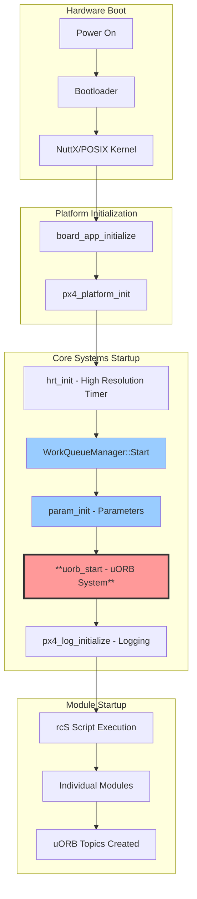
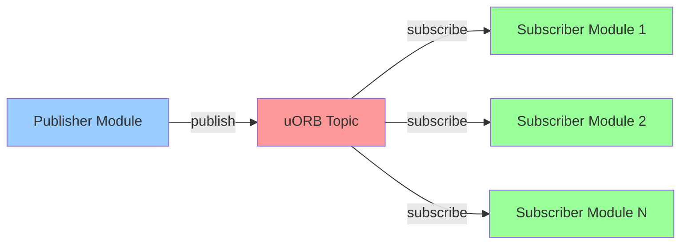
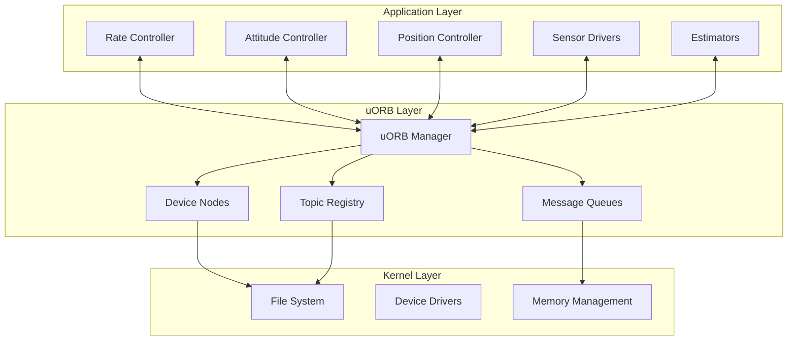
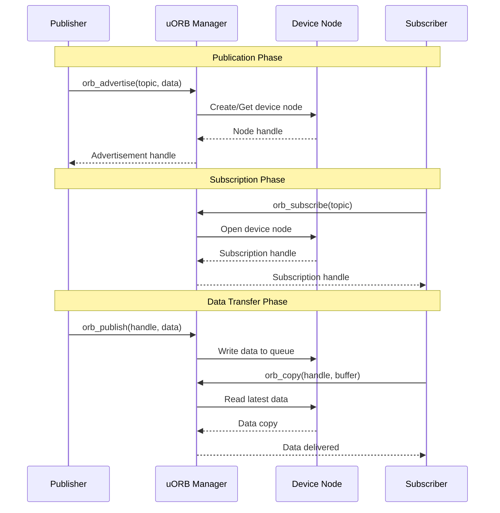
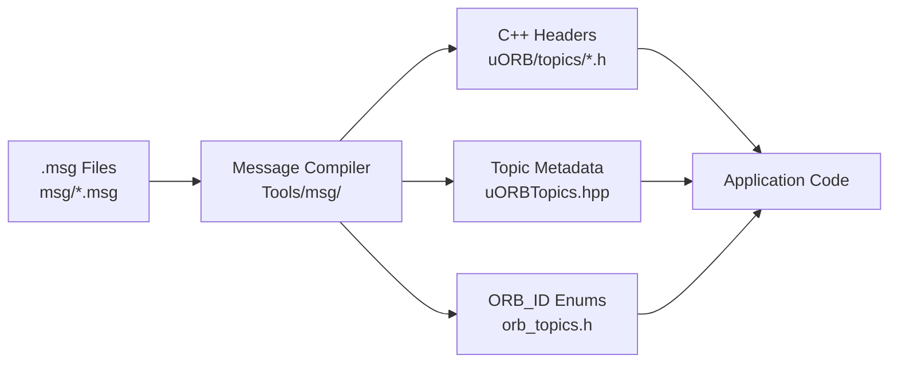
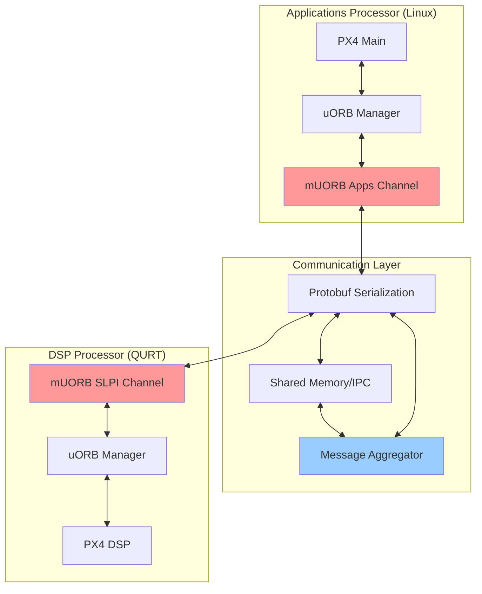
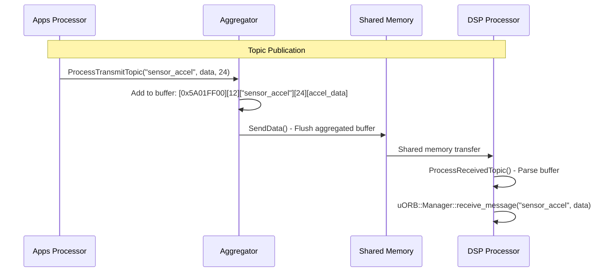
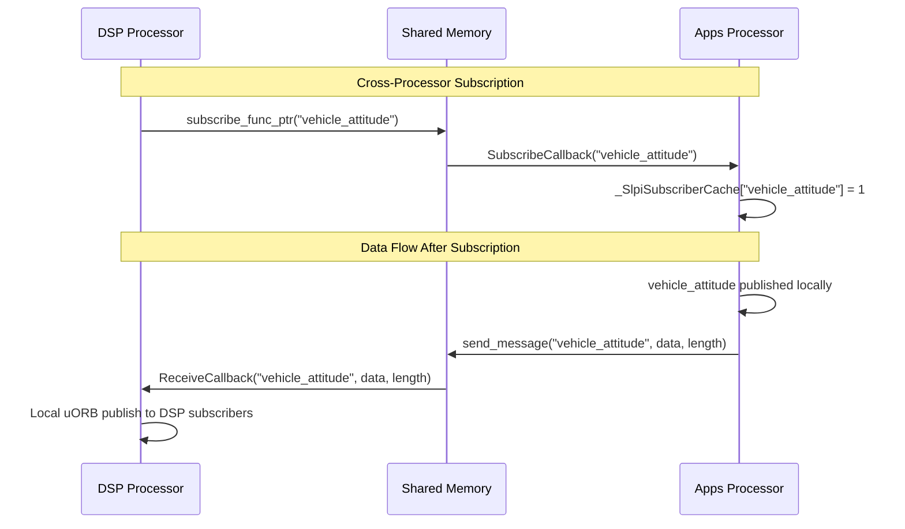

# PX4 uORB: Intramodular Communications Architecture

## **Table of Contents**
1. [What is uORB?](#what-is-uorb)
2. [uORB Architecture Overview](#uorb-architecture-overview)
3. [Message Definition System](#message-definition-system)
4. [Publication and Subscription Mechanisms](#publication-and-subscription-mechanisms)
5. [uORB Manager and Device Nodes](#uorb-manager-and-device-nodes)
6. [Real-World Implementation Examples](#real-world-implementation-examples)
7. [Performance and Threading Model](#performance-and-threading-model)
8. [Advanced uORB Features](#advanced-uorb-features)
9. [uORB vs Other Communication Systems](#uorb-vs-other-communication-systems)
10. [Best Practices and Patterns](#best-practices-and-patterns)

---

---

## **uORB Startup and Initialization Sequence**

### **1. uORB Boot Sequence Overview**



### **2. Exact Startup File Locations**

#### **Platform-Specific Entry Points**

| **Platform** | **Entry Point** | **File Location** | **Function** |
|-------------|----------------|-------------------|--------------|
| **NuttX** | Board initialization | `boards/[board]/src/init.c` | `board_app_initialize()` |
| **POSIX** | Main function | `platforms/posix/src/px4/common/main.cpp` | `main()` |
| **QURT** | Main function | `platforms/qurt/src/px4/main.cpp` | `main()` |

#### **Core Platform Initialization**
**File**: `platforms/nuttx/src/px4/common/px4_init.cpp` (Lines 189-195)

```cpp
int px4_platform_init()
{
    // ... hardware initialization ...

    px4::WorkQueueManagerStart();    // Start work queue system

    param_init();                    // Initialize parameter system

    uorb_start();                    // ← uORB STARTS HERE!

    px4_log_initialize();            // Initialize logging

    return PX4_OK;
}
```

### **3. uORB Initialization Deep Dive**

#### **Step 1: uorb_start() Function**
**File**: `platforms/common/uORB/uORB.cpp` (Lines 56-78)

```cpp
int uorb_start(void)
{
    // Check if already running
    if (g_dev != nullptr) {
        PX4_WARN("already loaded");
        return 0;  // Already started, no error
    }

    // Initialize uORB Manager singleton
    if (!uORB::Manager::initialize()) {
        PX4_ERR("uorb manager alloc failed");
        return -ENOMEM;
    }

#if !defined(__PX4_NUTTX) || defined(CONFIG_BUILD_FLAT) || defined(__KERNEL__)
    // Create the device master
    g_dev = uORB::Manager::get_instance()->get_device_master();

    if (g_dev == nullptr) {
        return -errno;
    }
#endif

    return OK;
}
```

#### **Step 2: Manager::initialize() Implementation**
**File**: `platforms/common/uORB/uORBManager.cpp` (Lines 57-67)

```cpp
bool uORB::Manager::initialize()
{
    // Create singleton Manager instance
    if (_Instance == nullptr) {
        _Instance = new uORB::Manager();
    }

#if defined(__PX4_NUTTX) && !defined(CONFIG_BUILD_FLAT) && defined(__KERNEL__)
    // Register board control IOCTL for kernel mode
    px4_register_boardct_ioctl(_ORBIOCDEVBASE, orb_ioctl);
#endif

    return _Instance != nullptr;
}
```

#### **Step 3: Manager Constructor**
**File**: `platforms/common/uORB/uORBManager.cpp` (Lines 81-99)

```cpp
uORB::Manager::Manager()
{
#ifdef ORB_USE_PUBLISHER_RULES
    // Load publisher rules from file system (optional)
    const char *file_name = PX4_STORAGEDIR"/orb_publisher.rules";
    int ret = readPublisherRulesFromFile(file_name, _publisher_rule);

    if (ret == PX4_OK) {
        _has_publisher_rules = true;
        PX4_INFO("Using orb rules from %s", file_name);
    } else {
        PX4_ERR("Failed to read publisher rules file %s", file_name);
    }
#endif

    // Device master is created on-demand, not here
    _device_master = nullptr;
}
```

#### **Step 4: DeviceMaster Creation (On-Demand)**
**File**: `platforms/common/uORB/uORBManager.cpp` (Lines 105-119)

```cpp
uORB::DeviceMaster *uORB::Manager::get_device_master()
{
    if (!_device_master) {
        // Create device master on first access
        _device_master = new DeviceMaster();

        if (_device_master == nullptr) {
            PX4_ERR("Failed to allocate DeviceMaster");
            errno = ENOMEM;
        }
    }

    return _device_master;
}
```

### **4. Complete Boot Flow Timeline**

#### **Hardware Boot (0-500ms)**
```cpp
// System powers on
Power On → Bootloader → NuttX/POSIX Kernel Load
```

#### **Board Initialization (500-800ms)**
```cpp
// Board-specific hardware setup
board_app_initialize(uintptr_t arg)
{
    VDD_5V_PERIPH_EN(true);          // Power on peripherals
    VDD_5V_HIPOWER_EN(true);         // Power on high-power rail

    px4_platform_init();             // ← CALLS PLATFORM INIT

    board_determine_hw_info();       // Hardware detection
    stm32_spiinitialize();           // SPI bus initialization
    board_spi_reset(10, 0xffff);     // Reset SPI devices
}
```

#### **Platform Initialization (800-1000ms)**
```cpp
// Core PX4 systems startup
px4_platform_init()
{
    hrt_init();                      // High-resolution timer (critical!)

    px4::WorkQueueManagerStart();    // Work queue system

    param_init();                    // Parameter system

    uorb_start();                    // ← uORB INITIALIZATION

    px4_log_initialize();            // Logging system
}
```

#### **uORB System Startup (1000-1100ms)**
```cpp
// uORB becomes operational
uorb_start()
{
    uORB::Manager::initialize();     // Singleton manager
    ├── new uORB::Manager()         // Manager instance
    ├── _device_master = nullptr    // Device master (lazy init)
    └── _Instance = manager         // Store singleton
}
```

#### **Module Startup (1100ms+)**
```bash
# rcS script execution - modules start using uORB
/etc/init.d/rcS
├── dataman start                   # First uORB user
├── load_mon start                  # System monitor
├── battery_simulator start        # Virtual sensors
├── commander start                 # Flight mode management
├── sensors start                   # Sensor framework
├── ekf2 start                      # State estimation
├── mc_rate_control start          # Rate controller
├── mc_att_control start           # Attitude controller
├── mc_pos_control start           # Position controller
└── control_allocator start        # Actuator allocation
```

### **5. First uORB Topic Creation**

When the **first module** tries to publish or subscribe, the **DeviceMaster** is created:

```cpp
// Example: When 'dataman start' creates first topic
class DataManager {
    uORB::Publication<dataman_response_s> _response_pub{ORB_ID(dataman_response)};

    void advertise() {
        // This triggers the first real uORB activity
        _response_pub.advertise();
        //     ↓
        // orb_advertise(ORB_ID(dataman_response), nullptr)
        //     ↓
        // Manager::get_device_master()  ← CREATES DEVICE MASTER
        //     ↓
        // new DeviceMaster()  ← FIRST DEVICE MASTER CREATION
    }
};
```

### **6. Runtime uORB State**

#### **After Full Startup (2000ms+)**
```cpp
// uORB is fully operational with:
g_dev = DeviceMaster instance        // Global device master
├── Topic Registry                   // All advertised topics
├── Device Nodes                     // Per-topic device nodes
│   ├── /dev/uorb/vehicle_attitude
│   ├── /dev/uorb/sensor_combined
│   ├── /dev/uorb/actuator_outputs
│   └── [400+ topics possible]
├── Subscriber Lists                 // Per-topic subscriber tracking
└── Message Queues                   // Buffered topics
```

#### **uORB Command Line Interface**
Once uORB is running, you can interact with it:

```bash
# Check uORB status
px4> uorb status

# List active topics
px4> uorb top

# Monitor specific topic
px4> listener vehicle_attitude

# Print topic info
px4> uorb print vehicle_attitude
```

### **7. Error Conditions and Recovery**

#### **Startup Failures**
```cpp
// If uORB fails to start
if (!uORB::Manager::initialize()) {
    PX4_ERR("uorb manager alloc failed");
    return -ENOMEM;  // System won't continue - CRITICAL FAILURE
}

// If DeviceMaster allocation fails
if (_device_master == nullptr) {
    PX4_ERR("Failed to allocate DeviceMaster");
    errno = ENOMEM;  // Modules will fail to advertise/subscribe
}
```

#### **Runtime Protection**
```cpp
// uORB checks if it's already running
if (g_dev != nullptr) {
    PX4_WARN("already loaded");
    return 0;  // Safe to call uorb_start() multiple times
}
```

### **8. Platform-Specific Differences**

#### **NuttX Platform**
- **Entry**: `board_app_initialize()` in board-specific `init.c`
- **Timing**: Hardware-dependent, typically 500-1000ms after power-on
- **Context**: Runs in system initialization context
- **Memory**: Static allocation, deterministic

#### **POSIX Platform (SITL)**
- **Entry**: `main()` in `platforms/posix/src/px4/common/main.cpp`
- **Timing**: Immediate after process start
- **Context**: User-space process
- **Memory**: Dynamic allocation, virtual memory

#### **QURT Platform (Snapdragon)**
- **Entry**: `main()` in `platforms/qurt/src/px4/main.cpp`
- **Timing**: After DSP processor initialization
- **Context**: Real-time OS context
- **Memory**: Shared memory with applications processor

---

## **What is uORB?**

**uORB** (micro Object Request Broker) is PX4's **lightweight, high-performance messaging system** that enables **intramodular communication** between different components within the PX4 flight stack.

### **Core Concept**



**Key Characteristics**:
- **Asynchronous**: Publishers don't wait for subscribers
- **One-to-Many**: Single publisher, multiple subscribers
- **Type-Safe**: Strong typing through message definitions
- **Zero-Copy**: Efficient memory usage in critical paths
- **Real-Time**: Deterministic performance for flight-critical data

### **What uORB Stands For**

| **Term** | **Meaning** | **Purpose** |
|----------|-------------|-------------|
| **micro** | Lightweight, minimal overhead | Real-time performance |
| **Object** | Structured data messages | Type safety |
| **Request** | Subscribe/publish operations | Communication interface |
| **Broker** | Message routing system | Decoupled architecture |

---

## **uORB Architecture Overview**

### **1. System-Level Architecture**



### **2. Core Components**

#### **uORB Manager**
**File**: `platforms/common/uORB/uORBManager.hpp`

```cpp
class Manager {
public:
    // Core operations
    static orb_advert_t orb_advertise(const orb_metadata *meta, const void *data);
    static int orb_subscribe(const orb_metadata *meta);
    static int orb_publish(const orb_metadata *meta, orb_advert_t handle, const void *data);
    static int orb_copy(const orb_metadata *meta, int handle, void *buffer);

    // Advanced operations
    static int orb_check(int handle, bool *updated);
    static int orb_set_interval(int handle, unsigned interval);
    static int orb_get_interval(int handle, unsigned *interval);
};
```

#### **Device Nodes**
Each uORB topic becomes a **virtual device node** in the file system:

```plaintext
/dev/uorb/
├── vehicle_angular_velocity
├── vehicle_attitude
├── vehicle_local_position
├── actuator_outputs
├── sensor_combined
└── ...
```

### **3. Message Flow Architecture**



---

## **Message Definition System**

### **1. Message File Structure**

uORB uses **`.msg` files** to define message structures. These are compiled into C++ headers and topic metadata.

**Example**: `msg/VehicleTorqueSetpoint.msg`
```plaintext
uint64 timestamp        # time since system start (microseconds)
uint64 timestamp_sample # timestamp of the data sample on which this message is based (microseconds)

float32[3] xyz          # torque setpoint about X, Y, Z body axis (normalized)

# TOPICS vehicle_torque_setpoint
# TOPICS vehicle_torque_setpoint_virtual_fw vehicle_torque_setpoint_virtual_mc
```

**Compiled Output**: `build/*/uORB/topics/vehicle_torque_setpoint.h`
```cpp
struct vehicle_torque_setpoint_s {
    uint64_t timestamp;        // time since system start (microseconds)
    uint64_t timestamp_sample; // timestamp of the data sample
    float xyz[3];              // torque setpoint about X, Y, Z body axis

    static constexpr uint8_t ORB_QUEUE_LENGTH = 1;
};
```

### **2. Message Compilation Pipeline**



### **3. Supported Data Types**

| **Type** | **Size** | **Example** | **Usage** |
|----------|----------|-------------|-----------|
| `bool` | 1 byte | `bool armed` | Boolean flags |
| `int8/uint8` | 1 byte | `uint8 flight_mode` | Small integers |
| `int16/uint16` | 2 bytes | `uint16 rpm` | Medium integers |
| `int32/uint32` | 4 bytes | `uint32 error_flags` | Large integers |
| `int64/uint64` | 8 bytes | `uint64 timestamp` | Timestamps, large values |
| `float32` | 4 bytes | `float32 temperature` | Single precision |
| `float64` | 8 bytes | `float64 latitude` | High precision |
| `float32[N]` | 4×N bytes | `float32[3] xyz` | Vector data |
| `char[N]` | N bytes | `char[50] name` | String data |

### **4. Message Metadata System**

Each message generates **metadata** for runtime operations:

```cpp
// Generated metadata for vehicle_torque_setpoint
const orb_metadata vehicle_torque_setpoint_meta = {
    .o_name = "vehicle_torque_setpoint",
    .o_size = sizeof(vehicle_torque_setpoint_s),
    .o_id = ORB_ID::vehicle_torque_setpoint,
    .o_fields = vehicle_torque_setpoint_fields,
    .o_fields_num = sizeof(vehicle_torque_setpoint_fields) / sizeof(orb_field_t)
};
```

---

## **Publication and Subscription Mechanisms**

### **1. Publication Classes**

#### **Basic Publication**
**File**: `platforms/common/uORB/Publication.hpp`

```cpp
template<typename T>
class Publication : public PublicationBase {
public:
    Publication(ORB_ID id) : PublicationBase(id) {}

    bool advertise() {
        if (!advertised()) {
            _handle = orb_advertise(get_topic(), nullptr);
        }
        return advertised();
    }

    bool publish(const T& data) {
        if (advertised()) {
            return (orb_publish(get_topic(), _handle, &data) == PX4_OK);
        }
        return false;
    }
};
```

#### **Multi-Instance Publication**
```cpp
template<typename T>
class PublicationMulti : public PublicationBase {
public:
    PublicationMulti(ORB_ID id) : PublicationBase(id) {}

    bool advertise() {
        if (!advertised()) {
            _handle = orb_advertise_multi(get_topic(), nullptr, &_instance);
        }
        return advertised();
    }

private:
    int _instance{-1};  // Automatically assigned instance number
};
```

### **2. Subscription Classes**

#### **Basic Subscription**
**File**: `platforms/common/uORB/Subscription.hpp`

```cpp
class Subscription {
public:
    Subscription(ORB_ID id, uint8_t instance = 0) : _orb_id(id), _instance(instance) {
        subscribe();
    }

    bool update(void *dst) {
        if (updated()) {
            return copy(dst);
        }
        return false;
    }

    bool updated() const {
        bool updated = false;
        orb_check(_handle, &updated);
        return updated;
    }

private:
    void subscribe() {
        if (_orb_id != ORB_ID::INVALID) {
            _handle = orb_subscribe(get_topic());
        }
    }
};
```

#### **Callback-Based Subscription**
```cpp
class SubscriptionCallbackWorkItem : public SubscriptionCallback {
public:
    SubscriptionCallbackWorkItem(WorkItem *work_item, ORB_ID id, uint8_t instance = 0) :
        SubscriptionCallback(id, instance), _work_item(work_item) {}

    void call() override {
        // Trigger work item when new data arrives
        if (updated()) {
            _work_item->ScheduleNow();
        }
    }

private:
    WorkItem *_work_item{nullptr};
};
```

### **3. Real-World Usage Examples**

#### **Rate Controller Publication**
**File**: `src/modules/mc_rate_control/MulticopterRateControl.cpp`

```cpp
class MulticopterRateControl : public px4::WorkItem {
private:
    // Publishers
    uORB::Publication<vehicle_thrust_setpoint_s> _vehicle_thrust_setpoint_pub;
    uORB::Publication<vehicle_torque_setpoint_s> _vehicle_torque_setpoint_pub;

public:
    void publishTorqueSetpoint(const Vector3f& torque, hrt_abstime timestamp) {
        vehicle_torque_setpoint_s torque_setpoint{};
        torque_setpoint.timestamp = timestamp;
        torque_setpoint.timestamp_sample = timestamp;
        torque_setpoint.xyz[0] = torque(0);
        torque_setpoint.xyz[1] = torque(1);
        torque_setpoint.xyz[2] = torque(2);

        _vehicle_torque_setpoint_pub.publish(torque_setpoint);
    }
};
```

#### **Control Allocator Subscription**
**File**: `src/modules/control_allocator/ControlAllocator.cpp`

```cpp
class ControlAllocator : public px4::ScheduledWorkItem {
private:
    // Subscribers
    uORB::Subscription _vehicle_torque_setpoint_sub{ORB_ID(vehicle_torque_setpoint)};
    uORB::Subscription _vehicle_thrust_setpoint_sub{ORB_ID(vehicle_thrust_setpoint)};

public:
    void Run() override {
        // Check for new torque setpoint
        vehicle_torque_setpoint_s torque_setpoint;
        if (_vehicle_torque_setpoint_sub.update(&torque_setpoint)) {
            // Process new torque commands
            updateTorqueAllocation(torque_setpoint);
        }

        // Check for new thrust setpoint
        vehicle_thrust_setpoint_s thrust_setpoint;
        if (_vehicle_thrust_setpoint_sub.update(&thrust_setpoint)) {
            // Process new thrust commands
            updateThrustAllocation(thrust_setpoint);
        }
    }
};
```

---

## **uORB Manager and Device Nodes**

### **1. uORB Manager Implementation**

**File**: `platforms/common/uORB/uORBManager.hpp`

```cpp
class Manager {
public:
    // Topic registration and management
    static orb_advert_t orb_advertise(const orb_metadata *meta, const void *data) {
        return orb_advertise_multi(meta, data, nullptr, ORB_PRIO_DEFAULT);
    }

    static orb_advert_t orb_advertise_multi(const orb_metadata *meta, const void *data,
                                          int *instance, int priority) {
        // Get or create device node for topic
        DeviceNode *node = getDeviceNode(meta, instance, priority);
        if (node != nullptr) {
            return node->advertise(data);
        }
        return nullptr;
    }

    static int orb_publish(const orb_metadata *meta, orb_advert_t handle, const void *data) {
        DeviceNode *node = static_cast<DeviceNode*>(handle);
        return node->publish(data);
    }

    static int orb_subscribe(const orb_metadata *meta) {
        return orb_subscribe_multi(meta, 0);
    }

    static int orb_subscribe_multi(const orb_metadata *meta, unsigned instance) {
        DeviceNode *node = getDeviceNode(meta, instance);
        if (node != nullptr) {
            return node->open();
        }
        return PX4_ERROR;
    }
};
```

### **2. Device Node Architecture**

```cpp
class DeviceNode {
private:
    const orb_metadata *_meta;           // Topic metadata
    uint8_t _queue_size;                 // Queue depth
    SubscriberData *_subscriber_data;    // Subscriber list
    void *_data;                         // Current message data
    hrt_abstime _last_update;           // Last publish timestamp

public:
    orb_advert_t advertise(const void *data) {
        // Initialize topic with first data
        if (_data == nullptr) {
            _data = malloc(_meta->o_size);
        }
        memcpy(_data, data, _meta->o_size);
        _last_update = hrt_absolute_time();
        return this;
    }

    int publish(const void *data) {
        // Update topic data and notify subscribers
        memcpy(_data, data, _meta->o_size);
        _last_update = hrt_absolute_time();

        // Wake up waiting subscribers
        notify_subscribers();
        return PX4_OK;
    }

    int open() {
        // Create new subscription handle
        return create_subscriber();
    }
};
```

### **3. Memory Management**

#### **Zero-Copy Optimization**
```cpp
// Publishers write directly to shared memory
int DeviceNode::publish(const void *data) {
    // Direct memory copy - no intermediate buffers
    memcpy(_data, data, _meta->o_size);

    // Atomic update of timestamp
    _last_update = hrt_absolute_time();

    // Notify without copying data
    notify_subscribers();
    return PX4_OK;
}

// Subscribers read directly from shared memory
int DeviceNode::read(void *buffer) {
    // Direct copy from shared storage
    memcpy(buffer, _data, _meta->o_size);
    return _meta->o_size;
}
```

#### **Queue Management**
```cpp
// Topics can have configurable queue depths
struct vehicle_torque_setpoint_s {
    // Data fields...
    static constexpr uint8_t ORB_QUEUE_LENGTH = 1;  // Single message queue
};

struct sensor_accel_s {
    // Data fields...
    static constexpr uint8_t ORB_QUEUE_LENGTH = 8;  // Buffered for high-rate data
};
```

---

## **Performance and Threading Model**

### **1. Threading Integration**

uORB integrates seamlessly with PX4's work queue system:

```cpp
// Event-driven subscription (most common)
class MulticopterRateControl : public px4::WorkItem {
private:
    // Subscription automatically triggers work item
    uORB::SubscriptionCallbackWorkItem _vehicle_angular_velocity_sub{this, ORB_ID(vehicle_angular_velocity)};

public:
    MulticopterRateControl() : WorkItem(MODULE_NAME, px4::wq_configurations::rate_ctrl) {
        // Register callback - Run() will be called when new data arrives
        _vehicle_angular_velocity_sub.registerCallback();
    }

    void Run() override {
        // This executes automatically when vehicle_angular_velocity is published
        vehicle_angular_velocity_s angular_velocity;
        if (_vehicle_angular_velocity_sub.update(&angular_velocity)) {
            // Process new angular velocity data
            processAngularVelocity(angular_velocity);
        }
    }
};
```

### **2. Performance Characteristics**

#### **Latency Analysis**
```cpp
// Typical publish-to-subscribe latency chain
void measureLatency() {
    hrt_abstime t1 = hrt_absolute_time();

    // Publisher side (~2-5 microseconds)
    vehicle_torque_setpoint_s msg{};
    msg.timestamp = t1;
    _torque_pub.publish(msg);  // Memory copy + notification

    // Subscriber side (~1-3 microseconds)
    vehicle_torque_setpoint_s received{};
    if (_torque_sub.update(&received)) {
        hrt_abstime t2 = hrt_absolute_time();
        printf("uORB latency: %llu μs\n", t2 - received.timestamp);
        // Typical result: 3-8 microseconds total latency
    }
}
```

#### **Memory Footprint**
```cpp
// Per-topic memory usage
sizeof(DeviceNode) +                    // ~200 bytes node overhead
sizeof(message_data) +                  // Message size (varies)
(num_subscribers * sizeof(subscriber))  // ~50 bytes per subscriber

// Example for vehicle_torque_setpoint (24 bytes message):
// 200 + 24 + (3 subscribers * 50) = 374 bytes total
```

### **3. Rate Limiting and Flow Control**

#### **Subscription Rate Limiting**
```cpp
class Subscription {
public:
    void set_required_updates(uint8_t required_updates) {
        _required_updates = required_updates;
    }

    bool updated() const {
        if (_required_updates > 0) {
            // Only trigger after N updates accumulated
            return (get_updates_available() >= _required_updates);
        }
        return check_updated();
    }

private:
    uint8_t _required_updates{0};
};
```

#### **Publication Rate Control**
```cpp
class Publication {
public:
    bool publish(const T& data) {
        hrt_abstime now = hrt_absolute_time();

        // Optional rate limiting
        if (_min_interval > 0) {
            if ((now - _last_publish) < _min_interval) {
                return false;  // Skip publish - too frequent
            }
        }

        _last_publish = now;
        return orb_publish(get_topic(), _handle, &data) == PX4_OK;
    }

    void set_min_interval(hrt_abstime interval) {
        _min_interval = interval;
    }

private:
    hrt_abstime _min_interval{0};
    hrt_abstime _last_publish{0};
};
```

---

## **Advanced uORB Features**

### **1. Multi-Instance Topics**

Some topics support **multiple instances** for redundancy or multiple devices:

```cpp
// Multi-instance subscription
class EstimatorSelector {
private:
    static constexpr int MAX_ESTIMATORS = 4;
    uORB::Subscription _estimator_status_subs[MAX_ESTIMATORS] {
        {ORB_ID(estimator_status), 0},  // Instance 0
        {ORB_ID(estimator_status), 1},  // Instance 1
        {ORB_ID(estimator_status), 2},  // Instance 2
        {ORB_ID(estimator_status), 3}   // Instance 3
    };

public:
    void selectBestEstimator() {
        for (int i = 0; i < MAX_ESTIMATORS; i++) {
            estimator_status_s status;
            if (_estimator_status_subs[i].update(&status)) {
                evaluateEstimator(status, i);
            }
        }
    }
};

// Multi-instance publication
class SensorDriver {
private:
    uORB::PublicationMulti<sensor_accel_s> _sensor_pub{ORB_ID(sensor_accel)};

public:
    void publishSensorData() {
        sensor_accel_s data{};
        // Fill data...

        // Automatically gets unique instance number
        _sensor_pub.publish(data);
    }
};
```

### **2. Queued Topics**

High-rate topics can use **message queues** to prevent data loss:

```cpp
// Message definition with queue
struct sensor_accel_s {
    uint64_t timestamp;
    float x, y, z;

    static constexpr uint8_t ORB_QUEUE_LENGTH = 8;  // Buffer 8 messages
};

// Subscriber can read all queued messages
class DataLogger {
public:
    void logAccelData() {
        sensor_accel_s accel_data;

        // Read all available messages from queue
        while (_accel_sub.update(&accel_data)) {
            writeToLog(accel_data);
        }
    }

private:
    uORB::Subscription _accel_sub{ORB_ID(sensor_accel)};
};
```

### **3. Priority-Based Publishing**

Topics can have **publication priorities** for arbitration:

```cpp
// Higher priority publisher takes precedence
class ManualControl {
public:
    void publishSetpoint() {
        vehicle_attitude_setpoint_s setpoint{};
        // Fill setpoint from pilot input...

        // Advertise with high priority
        orb_advert_t handle = orb_advertise_multi(
            ORB_ID(vehicle_attitude_setpoint),
            &setpoint,
            &_instance,
            ORB_PRIO_HIGH  // Takes precedence over autopilot
        );
    }
};

class AttitudeController {
public:
    void publishSetpoint() {
        vehicle_attitude_setpoint_s setpoint{};
        // Fill setpoint from autopilot...

        // Advertise with default priority
        orb_advert_t handle = orb_advertise_multi(
            ORB_ID(vehicle_attitude_setpoint),
            &setpoint,
            &_instance,
            ORB_PRIO_DEFAULT  // Lower than manual control
        );
    }
};
```

### **4. Topic Introspection**

uORB provides **runtime introspection** capabilities:

```cpp
// List all active topics
void listTopics() {
    for (int i = 0; i < ORB_TOPICS_COUNT; i++) {
        const orb_metadata *meta = get_orb_meta(static_cast<ORB_ID>(i));
        if (meta != nullptr) {
            printf("Topic: %s, Size: %u bytes\n", meta->o_name, meta->o_size);

            // Check if topic is advertised
            if (Manager::orb_exists(meta, 0)) {
                printf("  Status: Active\n");
                printf("  Subscribers: %d\n", Manager::orb_group_count(meta));
            }
        }
    }
}

// Monitor topic update rates
void monitorTopicRates() {
    uORB::Subscription status_sub{ORB_ID(vehicle_status)};

    hrt_abstime last_time = hrt_absolute_time();
    int update_count = 0;

    while (true) {
        if (status_sub.updated()) {
            update_count++;

            hrt_abstime now = hrt_absolute_time();
            if ((now - last_time) >= 1_s) {
                printf("vehicle_status rate: %d Hz\n", update_count);
                update_count = 0;
                last_time = now;
            }
        }

        px4_usleep(1000);  // 1ms poll interval
    }
}
```

---

---

## **mUORB: Multi-Processor uORB Extension**

### **1. What is mUORB?**

**mUORB** (multi-processor uORB) is a **specialized extension** of PX4's uORB system that enables **cross-processor communication** on heterogeneous multi-core platforms, particularly **Qualcomm Snapdragon Flight** boards.

**Developed by**: ModalAI, Inc. (2022)



### **2. mUORB Architecture Overview**

#### **Core Components**

| **Component** | **Location** | **Purpose** | **Platform** |
|---------------|-------------|-------------|--------------|
| **Apps Channel** | `src/modules/muorb/apps/` | Applications processor interface | POSIX/Linux |
| **SLPI Channel** | `src/modules/muorb/slpi/` | DSP processor interface | QURT/Hexagon |
| **Aggregator** | `src/modules/muorb/aggregator/` | Message batching/optimization | Both |
| **Test Framework** | `src/modules/muorb/test/` | Cross-processor validation | Both |

#### **File Structure Deep Dive**

```plaintext
src/modules/muorb/
├── Kconfig                           # Top-level configuration
├── apps/                             # Applications Processor Side
│   ├── CMakeLists.txt               # Build configuration
│   ├── Kconfig                      # Apps-specific config
│   ├── muorb_main.cpp              # Main entry point
│   ├── uORBAppsProtobufChannel.cpp # Protocol implementation
│   └── uORBAppsProtobufChannel.hpp # Apps interface
├── slpi/                            # DSP Processor Side (SLPI = Sensors Low Power Island)
│   ├── CMakeLists.txt              # QURT build configuration
│   ├── Kconfig                     # SLPI-specific config
│   ├── uORBProtobufChannel.cpp     # DSP protocol implementation
│   └── uORBProtobufChannel.hpp     # DSP interface & function pointers
├── aggregator/                      # Message Optimization
│   ├── mUORBAggregator.cpp         # Batching implementation
│   └── mUORBAggregator.hpp         # Aggregator interface
└── test/                           # Cross-Processor Testing
    ├── MUORBTest.cpp               # Test implementation
    └── MUORBTest.hpp               # Test definitions
```

### **3. Platform-Specific Implementations**

#### **Applications Processor (Apps) - Linux/POSIX Side**

**File**: `src/modules/muorb/apps/uORBAppsProtobufChannel.hpp`

```cpp
class uORB::AppsProtobufChannel : public uORBCommunicator::IChannel
{
public:
    static uORB::AppsProtobufChannel *GetInstance() {
        if (_InstancePtr == nullptr) {
            _InstancePtr = new uORB::AppsProtobufChannel();
        }
        return _InstancePtr;
    }

    // Cross-processor communication interface
    int16_t topic_advertised(const char *messageName);
    int16_t add_subscription(const char *messageName, int32_t msgRateInHz);
    int16_t remove_subscription(const char *messageName);
    int16_t send_message(const char *messageName, int length, uint8_t *data);

    // Callback handlers for remote processor events
    static void ReceiveCallback(const char *topic, const uint8_t *data, uint32_t length);
    static void AdvertiseCallback(const char *topic);
    static void SubscribeCallback(const char *topic);
    static void UnsubscribeCallback(const char *topic);

private:
    static uORB::AppsProtobufChannel *_InstancePtr;
    static mUORB::Aggregator _Aggregator;           // Message batching
    static std::map<std::string, int> _SlpiSubscriberCache;  // Track DSP subscriptions
    static pthread_mutex_t _tx_mutex, _rx_mutex;    // Thread safety
};
```

#### **DSP Processor (SLPI) - QURT/Hexagon Side**

**File**: `src/modules/muorb/slpi/uORBProtobufChannel.hpp`

```cpp
class uORB::ProtobufChannel : public uORBCommunicator::IChannel
{
public:
    static uORB::ProtobufChannel *GetInstance() {
        return &(_Instance);  // Singleton instance
    }

    // Hardware abstraction function pointers
    typedef struct {
        int (*advertise_func_ptr)(const char *topic_name);
        int (*subscribe_func_ptr)(const char *topic_name);
        int (*unsubscribe_func_ptr)(const char *topic_name);
        int (*topic_data_func_ptr)(const char *name, const uint8_t *data, int data_len);

        // Hardware interface function pointers
        int (*_config_spi_bus_func_t)();
        int (*_spi_transfer_func_t)(int, const uint8_t *, uint8_t *, const unsigned);
        int (*_config_i2c_bus_func_t)(uint8_t, uint8_t, uint32_t);
        int (*_set_i2c_address_func_t)(int, uint8_t);
        int (*_i2c_transfer_func_t)(int, const uint8_t *, const unsigned, uint8_t *, const unsigned);
        int (*open_uart_func_t)(uint8_t, speed_t);
        int (*write_uart_func_t)(int, const void *, size_t);
        int (*read_uart_func_t)(int, void *, size_t);
        int (*register_interrupt_callback)(int (*)(int, void *, void *), void *arg);
    } fc_func_ptrs;

private:
    static uORB::ProtobufChannel _Instance;         // Static singleton
    static mUORB::Aggregator _Aggregator;          // Message optimization
    static std::map<std::string, int> _AppsSubscriberCache;  // Track Apps subscriptions
};
```

### **4. Message Aggregation System**

**File**: `src/modules/muorb/aggregator/mUORBAggregator.hpp`

```cpp
namespace mUORB {
class Aggregator {
public:
    typedef int (*sendFuncPtr)(const char *, const uint8_t *, int);

    void RegisterSendHandler(sendFuncPtr func) { sendFunc = func; }
    void RegisterHandler(uORBCommunicator::IChannelRxHandler *handler) { _RxHandler = handler; }

    // Batch multiple topics into single transmission
    int16_t ProcessTransmitTopic(const char *topic, const uint8_t *data, uint32_t length);
    void ProcessReceivedTopic(const char *topic, const uint8_t *data, uint32_t length);
    int16_t SendData();  // Send aggregated buffer

private:
    static const uint32_t numBuffers = 2;          // Double buffering
    static const uint32_t bufferSize = 2048;       // 2KB per buffer
    const uint32_t syncFlag = 0x5A01FF00;          // Buffer sync marker

    uint32_t bufferId;                              // Current buffer ID
    uint32_t bufferWriteIndex;                      // Write position
    uint8_t buffer[numBuffers][bufferSize];         // Circular buffers

    // Message format: [SyncFlag][TopicNameLength][DataLength][TopicName][Data]
    const uint32_t headerSize = 12;  // syncFlag(4) + nameLen(4) + dataLen(4)
};
}
```

### **5. Cross-Processor Communication Flow**

#### **Publication Flow**


#### **Subscription Flow**


### **6. Hardware Abstraction Layer**

mUORB provides **hardware abstraction** for the DSP processor to access sensors directly:

#### **SPI Interface Abstraction**
```cpp
// DSP can access SPI sensors through function pointers
fc_func_ptrs muorb_func_ptrs = {
    .advertise_func_ptr = apps_advertise_function,
    .subscribe_func_ptr = apps_subscribe_function,

    // SPI hardware access
    ._config_spi_bus_func_t = configure_spi_bus_hardware,
    ._spi_transfer_func_t = spi_transfer_hardware,
    //     ↓
    // DSP can directly: spi_transfer_hardware(bus, tx_data, rx_data, length)
};
```

#### **I2C Interface Abstraction**
```cpp
// I2C sensor access from DSP
._config_i2c_bus_func_t = configure_i2c_bus_hardware,
._set_i2c_address_func_t = set_i2c_device_address,
._i2c_transfer_func_t = i2c_transfer_hardware,
//     ↓
// DSP can directly: i2c_transfer_hardware(bus, tx_data, tx_len, rx_data, rx_len)
```

#### **UART Interface Abstraction**
```cpp
// UART communication from DSP
.open_uart_func_t = open_uart_hardware,
.write_uart_func_t = write_uart_hardware,
.read_uart_func_t = read_uart_hardware,
//     ↓
// DSP can directly: write_uart_hardware(fd, data, length)
```

### **7. Initialization and Startup**

#### **Apps Processor Initialization**
**File**: `src/modules/muorb/apps/muorb_main.cpp`

```cpp
int muorb_init()
{
    // Get singleton instance
    uORB::AppsProtobufChannel *channel = uORB::AppsProtobufChannel::GetInstance();

    PX4_INFO("Got muorb init command");

    if (channel && channel->Initialize(enable_debug)) {
        // Register with uORB manager as communicator
        uORB::Manager::get_instance()->set_uorb_communicator(channel);

        if (channel->Test()) {
            return OK;
        }
    }

    return -EINVAL;
}
```

#### **DSP Processor Initialization**
**File**: `src/modules/muorb/slpi/uORBProtobufChannel.cpp`

```cpp
int px4muorb_orb_initialize(fc_func_ptrs *func_ptrs, int32_t clock_offset_us)
{
    if (!px4muorb_orb_initialized) {
        // Store hardware abstraction function pointers
        muorb_func_ptrs = *func_ptrs;

        // Initialize timing synchronization
        if (clock_offset_us != 0) {
            hrt_set_absolute_time_offset(clock_offset_us);
        }

        // Initialize uORB manager on DSP
        uORB::Manager::initialize();

        // Register mUORB communicator
        uORB::Manager::get_instance()->set_uorb_communicator(
            uORB::ProtobufChannel::GetInstance()
        );

        // Start aggregator thread for batched sends
        qurt_thread_attr_init(&aggregator_attr);
        qurt_thread_attr_set_stack_size(&aggregator_attr, aggregator_stack_size);
        qurt_thread_attr_set_priority(&aggregator_attr, aggregator_thread_priority);

        int status = qurt_thread_create(&aggregator_tid, &aggregator_attr,
                                      aggregator_thread_func, nullptr);

        px4muorb_orb_initialized = true;
        PX4_INFO("px4muorb_orb_initialize called");
    }

    return 0;
}
```

### **8. Testing Framework**

**File**: `src/modules/muorb/test/MUORBTest.hpp`

```cpp
// Test types for cross-processor validation
typedef enum {
    ADVERTISE_TEST_TYPE,      // Test topic advertisement across processors
    SUBSCRIBE_TEST_TYPE,      // Test subscription propagation
    TOPIC_TEST_TYPE,          // Test data transmission
    UNSUBSCRIBE_TEST_TYPE     // Test unsubscription cleanup
} MUORBTestType;

// Common test topic between DSP and Apps processors
extern char muorb_test_topic_name[];

// Test data validation
#define IS_MUORB_TEST(x) (strcmp(x, muorb_test_topic_name) == 0)
#define MUORB_TEST_DATA_LEN 8

// Test data pattern: [0x00, 0x01, 0x02, 0x03, 0x04, 0x05, 0x06, 0x07]
```

#### **Test Execution Flow**
```cpp
// Apps processor sends test data
uint8_t test_data[MUORB_TEST_DATA_LEN];
for (uint32_t i = 0; i < MUORB_TEST_DATA_LEN; i++) {
    test_data[i] = (uint8_t)i;  // Pattern: 0,1,2,3,4,5,6,7
}

// Send to DSP
channel->send_message(muorb_test_topic_name, MUORB_TEST_DATA_LEN, test_data);

// DSP validates received data
bool test_passed = true;
for (uint32_t i = 0; i < length_in_bytes; i++) {
    if ((uint8_t)i != data[i]) {
        test_passed = false;
        break;
    }
}
```

### **9. Performance Optimizations**

#### **Message Aggregation Benefits**
```cpp
// Without aggregation: 4 separate IPC calls
send_topic("sensor_accel", accel_data, 24);      // IPC call 1
send_topic("sensor_gyro", gyro_data, 24);        // IPC call 2
send_topic("sensor_mag", mag_data, 24);          // IPC call 3
send_topic("sensor_baro", baro_data, 16);        // IPC call 4
// Total: 4 × IPC overhead + 88 bytes data

// With aggregation: 1 IPC call
Aggregator.ProcessTransmitTopic("sensor_accel", accel_data, 24);
Aggregator.ProcessTransmitTopic("sensor_gyro", gyro_data, 24);
Aggregator.ProcessTransmitTopic("sensor_mag", mag_data, 24);
Aggregator.ProcessTransmitTopic("sensor_baro", baro_data, 16);
Aggregator.SendData();  // Single IPC call with: Header + 4 topics + data
// Total: 1 × IPC overhead + 88 bytes data + aggregation headers
```

#### **Timing Synchronization**
```cpp
// Clock synchronization between processors
int32_t clock_offset_us = calculate_clock_offset();
px4muorb_orb_initialize(&func_ptrs, clock_offset_us);

// Result: Both processors use synchronized timestamps
hrt_set_absolute_time_offset(clock_offset_us);  // DSP adjusts its timebase
// Now: Apps timestamp = DSP timestamp (within microseconds)
```

### **10. Use Cases and Applications**

#### **Typical Deployment Scenario**
```plaintext
Qualcomm Snapdragon Flight Board:
├── Applications Processor (ARM Cortex-A53)
│   ├── Linux OS
│   ├── PX4 main flight stack
│   ├── Navigation algorithms
│   ├── Mission planning
│   └── mUORB Apps Channel
│
└── DSP Processor (Hexagon 680)
    ├── QuRT RTOS
    ├── Sensor processing
    ├── Computer vision
    ├── Real-time filtering
    └── mUORB SLPI Channel
```

#### **Workload Distribution**
| **Processor** | **Workload** | **mUORB Usage** |
|--------------|--------------|-----------------|
| **Apps (ARM)** | Flight control, navigation, mission planning | Publishes control commands, receives sensor data |
| **DSP (Hexagon)** | Sensor fusion, computer vision, signal processing | Publishes processed sensors, receives control state |

#### **Communication Patterns**
```cpp
// Apps → DSP: Control state and commands
Apps publishes: vehicle_attitude, vehicle_local_position, vehicle_command
DSP subscribes: vehicle_attitude, vehicle_local_position, vehicle_command

// DSP → Apps: High-rate sensor data
DSP publishes: sensor_combined, optical_flow, distance_sensor
Apps subscribes: sensor_combined, optical_flow, distance_sensor

// Result: Optimal processor utilization with seamless data sharing
```

---

## **uORB vs Other Communication Systems**

### **1. uORB vs ROS**

| **Aspect** | **uORB** | **ROS** |
|------------|----------|---------|
| **Latency** | 3-8 μs | 50-500 μs |
| **Memory** | ~400 bytes/topic | ~50 KB/node |
| **Real-Time** | Deterministic | Best-effort |
| **Scope** | Intra-process | Inter-process/network |
| **Type Safety** | Compile-time | Runtime |
| **Overhead** | Minimal | High |

### **2. uORB vs DDS**

| **Aspect** | **uORB** | **DDS** |
|------------|----------|---------|
| **Complexity** | Simple | Complex |
| **Features** | Basic pub/sub | QoS, discovery, etc. |
| **Performance** | Optimized | Configurable |
| **Memory** | Low | High |
| **Real-Time** | Hard RT | Configurable RT |
| **Standards** | PX4-specific | OMG standard |

### **3. uORB vs Shared Memory**

| **Aspect** | **uORB** | **Raw Shared Memory** |
|------------|----------|--------------------|
| **Type Safety** | Strong | None |
| **Synchronization** | Built-in | Manual |
| **Discovery** | Automatic | Manual |
| **Versioning** | Supported | Manual |
| **Debug Tools** | Rich | Minimal |
| **Development** | Easy | Complex |

---

## **Best Practices and Patterns**

### **1. Message Design Guidelines**

#### **✅ Good Message Design**
```cpp
// Efficient: POD struct, aligned fields
struct vehicle_attitude_s {
    uint64_t timestamp;        // 8 bytes, aligned
    float q[4];               // 16 bytes, aligned
    float rollspeed;          // 4 bytes
    float pitchspeed;         // 4 bytes
    float yawspeed;           // 4 bytes
    // Total: 36 bytes, well-aligned
};
```

#### **❌ Poor Message Design**
```cpp
// Inefficient: Mixed sizes, poor alignment
struct bad_message_s {
    bool flag1;               // 1 byte
    double big_value;         // 8 bytes - misaligned!
    bool flag2;               // 1 byte
    int32_t counter;          // 4 bytes - misaligned!
    // Total: 22 bytes, but 32 with padding
};
```

### **2. Publication Patterns**

#### **Event-Driven Publishing**
```cpp
class SensorDriver : public px4::WorkItem {
public:
    void Run() override {
        // Only publish when new data arrives
        if (hasNewSensorData()) {
            sensor_combined_s data = readSensorData();
            _sensor_pub.publish(data);
        }
    }

private:
    uORB::Publication<sensor_combined_s> _sensor_pub{ORB_ID(sensor_combined)};
};
```

#### **Time-Based Publishing**
```cpp
class StatusReporter : public px4::ScheduledWorkItem {
public:
    StatusReporter() : ScheduledWorkItem(MODULE_NAME, px4::wq_configurations::lp_default) {
        ScheduleOnInterval(100_ms);  // 10 Hz status updates
    }

    void Run() override {
        vehicle_status_s status = generateStatus();
        _status_pub.publish(status);
    }

private:
    uORB::Publication<vehicle_status_s> _status_pub{ORB_ID(vehicle_status)};
};
```

### **3. Subscription Patterns**

#### **Callback-Driven Processing**
```cpp
// Most efficient for real-time control loops
class RateController : public px4::WorkItem {
public:
    RateController() : WorkItem(MODULE_NAME, px4::wq_configurations::rate_ctrl) {
        _gyro_sub.registerCallback();  // Automatic triggering
    }

private:
    uORB::SubscriptionCallbackWorkItem _gyro_sub{this, ORB_ID(vehicle_angular_velocity)};
};
```

#### **Polling-Based Processing**
```cpp
// Suitable for lower-rate, scheduled tasks
class NavigationController : public px4::ScheduledWorkItem {
public:
    void Run() override {
        // Check multiple topics in one cycle
        vehicle_local_position_s pos;
        if (_position_sub.update(&pos)) {
            processPosition(pos);
        }

        trajectory_setpoint_s traj;
        if (_trajectory_sub.update(&traj)) {
            processTrajectory(traj);
        }
    }
};
```

### **4. Error Handling Patterns**

#### **Robust Subscription**
```cpp
class SafeController {
public:
    void Run() override {
        vehicle_control_mode_s control_mode;

        // Always check subscription validity
        if (_control_mode_sub.valid() && _control_mode_sub.update(&control_mode)) {
            if (validateControlMode(control_mode)) {
                processControlMode(control_mode);
            } else {
                PX4_ERR("Invalid control mode received");
                enterSafeMode();
            }
        } else {
            // Handle missing data gracefully
            if ((hrt_absolute_time() - _last_control_mode) > 500_ms) {
                PX4_WARN("Control mode timeout");
                enterSafeMode();
            }
        }
    }

private:
    bool validateControlMode(const vehicle_control_mode_s& mode) {
        // Sanity check received data
        return (mode.timestamp > 0) &&
               (mode.timestamp <= hrt_absolute_time()) &&
               (hrt_absolute_time() - mode.timestamp < 100_ms);
    }
};
```

### **5. Performance Optimization**

#### **Minimize Allocations**
```cpp
class OptimizedController {
public:
    void Run() override {
        // Reuse stack-allocated structures
        static vehicle_attitude_s attitude{};  // Persistent storage

        if (_attitude_sub.update(&attitude)) {
            // Process without additional allocations
            processAttitude(attitude);
        }
    }
};
```

#### **Batch Processing**
```cpp
class BatchProcessor {
public:
    void Run() override {
        // Process all available sensor data in one cycle
        sensor_accel_s accel;
        int processed = 0;

        while (_accel_sub.update(&accel) && processed < MAX_BATCH_SIZE) {
            processSensorData(accel);
            processed++;
        }

        if (processed > 0) {
            publishBatchResults();
        }
    }

private:
    static constexpr int MAX_BATCH_SIZE = 10;
};
```

---

## **Summary**

**uORB** is the **backbone of PX4's communication architecture**, providing:

### **Key Strengths**

1. **Ultra-Low Latency**: 3-8 microsecond publish-to-subscribe latency
2. **Real-Time Determinism**: Predictable performance for flight-critical operations
3. **Type Safety**: Compile-time message validation prevents runtime errors
4. **Zero-Copy Efficiency**: Direct memory access minimizes overhead
5. **Seamless Integration**: Native work queue triggering for event-driven architecture
6. **Scalable Design**: Handles hundreds of topics with minimal resource impact

### **Architecture Excellence**

- **Decoupled Modules**: Publishers and subscribers are completely independent
- **Flexible Patterns**: Supports both event-driven and time-based communication
- **Rich Features**: Multi-instance, queuing, priorities, and introspection
- **Developer Friendly**: Simple API with powerful debugging capabilities
- **Performance Optimized**: Designed specifically for real-time embedded systems

### **Real-World Impact**

uORB enables PX4 to achieve:
- **400 Hz control loops** with microsecond-level timing precision
- **Modular architecture** where any module can be replaced without affecting others
- **Rich ecosystem** of sensors, estimators, and controllers working together
- **Debugging capability** with real-time topic monitoring and analysis
- **Scalable development** where teams can work on independent modules

**uORB demonstrates how a well-designed communication system can be both simple to use and extremely powerful**, serving as an excellent example of **embedded systems architecture** that prioritizes **performance, safety, and maintainability** simultaneously.
