# PX4 Autopilot Control Architecture Analysis for Quadcopter Vehicles

*Academic Perspective: Understanding Control Hierarchies, Rates, and Low-Level Implementation*

## Table of Contents
1. [Executive Summary](#executive-summary)
2. [Control Architecture Overview](#control-architecture-overview)
3. [Control Hierarchy Levels](#control-hierarchy-levels)
4. [Control Loop Frequencies and Sensor Rates](#control-loop-frequencies-and-sensor-rates)
5. [Module Architecture and Data Flow](#module-architecture-and-data-flow)
6. [Low-Level Control Implementation Points](#low-level-control-implementation-points)
7. [Academic Implementation Considerations](#academic-implementation-considerations)
8. [Performance Characteristics](#performance-characteristics)
9. [References and Key Files](#references-and-key-files)

## Executive Summary

PX4 Autopilot implements a **4-level cascaded control architecture** for quadcopter vehicles, ranging from high-level mission planning down to low-level actuator control. The system operates with different control rates at each level, optimized for real-time performance while maintaining stability and precision.

**Key Control Levels:**
- **Level 1**: Position Control (~100 Hz)
- **Level 2**: Attitude Control (~250-400 Hz)
- **Level 3**: Rate Control (~400-1000 Hz)
- **Level 4**: Control Allocation/Mixer (~400-1000 Hz)

**Sensor Rates:**
- IMU: 2-8 kHz (raw), 200-1000 Hz (processed)
- Attitude Estimation: ~100-250 Hz
- Position Sensors: 5-100 Hz

## Control Architecture Overview

PX4 employs a **cascaded control structure** where each level generates setpoints for the level below it:


### Control Loop Hierarchy with Frequencies


This architecture provides:
- **Modularity**: Each controller can be tuned independently
- **Flexibility**: Different vehicle types share common lower-level controllers
- **Performance**: High-frequency inner loops ensure fast disturbance rejection
- **Safety**: Multiple levels of constraint enforcement

## Control Hierarchy Levels

### Detailed Control Chain with Module Dependencies


### Level 1: Position Control (`mc_pos_control`)
**Location**: `src/modules/mc_pos_control/`
**Frequency**: ~100 Hz (10ms intervals)
**Purpose**: Translates position commands to attitude setpoints


**Key Characteristics:**
- Implements 3D position control (X, Y, Z)
- Generates thrust and attitude setpoints
- Handles velocity and acceleration constraints
- Contains anti-windup and saturation logic

**Control Law**: PID-based position and velocity control
```cpp
// From MulticopterPositionControl.cpp
_sample_interval_s.update(0.01f); // 100 Hz default
```

**Inputs/Outputs:**
- **Inputs**: Position setpoints, current position/velocity, vehicle status
- **Outputs**: `vehicle_attitude_setpoint`, thrust setpoint

### Level 2: Attitude Control (`mc_att_control`)
**Location**: `src/modules/mc_att_control/`
**Frequency**: Triggered by attitude updates (~250-400 Hz)
**Purpose**: Converts attitude setpoints to angular rate setpoints


**Key Characteristics:**
- Quaternion-based attitude control
- P-controller for angular error
- Implements nonlinear quadrocopter attitude control
- Handles manual flight mode inputs

**Control Law**: Based on research by Brescianini et al. (ETH Zurich)
- *"Nonlinear Quadrocopter Attitude Control (2013)"*

**Inputs/Outputs:**
- **Inputs**: `vehicle_attitude_setpoint`, current attitude
- **Outputs**: `vehicle_rates_setpoint`

### Level 3: Rate Control (`mc_rate_control`)
**Location**: `src/modules/mc_rate_control/`
**Frequency**: ~400-1000 Hz (triggered by gyro updates)
**Purpose**: Innermost control loop - converts rate setpoints to torque commands


**Key Characteristics:**
- **Highest frequency control loop** for fast disturbance rejection
- PID controller with feed-forward terms
- Direct gyroscope feedback for minimal latency
- Battery voltage compensation

**Control Law**: PID with feed-forward
```cpp
// From MulticopterRateControl.cpp
// Runs in rate_ctrl work queue for high priority
WorkItem(MODULE_NAME, px4::wq_configurations::rate_ctrl)
```

**Inputs/Outputs:**
- **Inputs**: `vehicle_rates_setpoint`, `vehicle_angular_velocity`
- **Outputs**: `vehicle_torque_setpoint`, `vehicle_thrust_setpoint`

### Level 4: Control Allocation (`control_allocator`)
**Location**: `src/modules/control_allocator/`
**Frequency**: ~400-1000 Hz (same as rate control)
**Purpose**: Maps control torques/thrust to individual actuator commands


**Key Characteristics:**
- **Lowest level before hardware interface**
- Implements mixing algorithms for different vehicle configurations
- Handles actuator constraints and saturation
- Provides failure handling and redundancy

**Algorithms:**
- Quadratic Programming optimization
- Pseudo-inverse allocation
- Sequential desaturation

**Inputs/Outputs:**
- **Inputs**: Torque/thrust setpoints from rate controller
- **Outputs**: Individual actuator commands (`actuator_outputs`)

## Control Loop Frequencies and Sensor Rates

### IMU and Sensor Rates

**Raw Sensor Rates:**
```cpp
// From various IMU drivers
static constexpr uint32_t GYRO_RATE{8000}; // 8 kHz for ICM42688P
static constexpr uint32_t RATE{2000};      // 2 kHz for BMI085
```

**Processed Sensor Rates:**
- **IMU Integration Rate**: 100-1000 Hz (configurable)
  ```c
  // From imu_parameters.c
  // @value 100 100 Hz
  // @value 200 200 Hz
  // @value 400 400 Hz
  PARAM_DEFINE_INT32(IMU_INTEG_RATE, 200);
  ```

- **Angular Velocity Publication**: 100-2000 Hz
  ```c
  // From imu_gyro_parameters.c
  // @value 400 400 Hz (default)
  // @value 800 800 Hz
  // @value 1000 1000 Hz
  PARAM_DEFINE_INT32(IMU_GYRO_RATEMAX, 400);
  ```

### Control Loop Scheduling

**Work Queue Priorities:**
1. `rate_ctrl` - Highest priority (Rate control)
2. `nav_and_controllers` - Medium priority (Position/Attitude control)
3. `hp_default` - Standard priority

**Typical Frequencies in Practice:**
- **Rate Control**: 400-1000 Hz (limited by IMU_GYRO_RATEMAX)
- **Attitude Control**: 250-400 Hz (triggered by attitude updates)
- **Position Control**: 100 Hz (fixed scheduling)
- **Control Allocation**: Same as rate control

## Module Architecture and Data Flow

### uORB Message System Architecture


### Complete Data Flow with Message Types


### Work Queue Priority Architecture


### Sensor Processing Pipeline


PX4 uses uORB (micro Object Request Broker) for inter-module communication with the key message types shown above.

### Real-Time Scheduling
- **Rate Controller**: Triggered by `vehicle_angular_velocity` updates (callback-based)
- **Attitude Controller**: Triggered by `vehicle_attitude` updates
- **Position Controller**: Fixed 100 Hz scheduling
- **Control Allocator**: Triggered by torque/thrust updates

## Low-Level Control Implementation Points

### Academic Implementation Strategy Decision Tree

```mermaid
flowchart TD
    A[Academic Control Implementation Goal] --> B{Implementation Depth Required?}

    B -->|High-Level Research<br/>Path Planning, Navigation| C[Position Controller<br/>Modification]
    B -->|Mid-Level Research<br/>Attitude Dynamics| D[Attitude Controller<br/>Modification]
    B -->|Low-Level Research<br/>Fast Control, Observers| E[Rate Controller<br/>Modification]
    B -->|Hardware-Level Research<br/>Actuator Control| F[Control Allocator<br/>or Direct Output]

    C --> G[Edit mc_pos_control/<br/>MulticopterPositionControl.cpp<br/>• Custom trajectory tracking<br/>• Advanced path planning<br/>• Obstacle avoidance]

    D --> H[Edit mc_att_control/<br/>MulticopterAttitudeControl.cpp<br/>• Nonlinear attitude control<br/>• Adaptive control<br/>• Robust control methods]

    E --> I[Edit mc_rate_control/<br/>MulticopterRateControl.cpp<br/>• Custom PID variants<br/>• State observers<br/>• Disturbance rejection]

    F --> J[Edit control_allocator/<br/>ControlAllocator.cpp<br/>• Custom mixing laws<br/>• Fault-tolerant allocation<br/>• Actuator dynamics]

    style E fill:#ffcdd2
    style I fill:#ffcdd2
    style F fill:#f8bbd9
    style J fill:#f8bbd9
```



### For Academic Low-Level Control Implementation

**1. Rate Controller Modification** (Recommended Entry Point)


- **File**: `src/modules/mc_rate_control/MulticopterRateControl.cpp`
- **Advantages**:
  - Highest frequency control loop
  - Direct access to gyro measurements
  - Minimal system integration required
- **Access Points**:
  ```cpp
  void MulticopterRateControl::Run() {
      // Custom rate control algorithm here
      // Input: _rates_setpoint, vehicle_angular_velocity
      // Output: vehicle_torque_setpoint
  }
  ```

**2. Control Allocation Bypass**


- **File**: `src/modules/control_allocator/ControlAllocator.cpp`
- **Purpose**: Direct actuator control
- **Considerations**: Requires understanding of actuator dynamics

**3. Custom Control Module Architecture**


- Create new module in `src/modules/`
- Subscribe to `vehicle_angular_velocity`
- Publish to `actuator_outputs` directly
- Bypass existing control hierarchy

### Hardware Interface Points

**Direct Hardware Access Architecture**


**PWM Output Interface:**
```cpp
// From mixer_module.cpp
bool updateOutputs(uint16_t outputs[MAX_ACTUATORS],
                   unsigned num_outputs,
                   unsigned num_control_groups_updated)
```

**ESC/Motor Interface:**
- PWM range: 1000-2000 μs (standard)
- Update rates: 50-400 Hz (PWM), up to 8 kHz (DShot)
- Hardware timer groups limit independent control

### Implementation Complexity Matrix

```mermaid
graph TD
    subgraph "Implementation Complexity vs Control Authority"
        A[Low Complexity<br/>High Level] --> B[Position Controller<br/>• Easy integration<br/>• Limited bandwidth<br/>• Trajectory control]

        C[Medium Complexity<br/>Mid Level] --> D[Attitude Controller<br/>• Moderate integration<br/>• Good bandwidth<br/>• Orientation control]

        E[High Complexity<br/>Low Level] --> F[Rate Controller<br/>• Complex integration<br/>• High bandwidth<br/>• Fast dynamics]

        G[Very High Complexity<br/>Hardware Level] --> H[Direct Hardware<br/>• System-level changes<br/>• Maximum bandwidth<br/>• Motor-level control]
    end

    style F fill:#ffcdd2
    style H fill:#f8bbd9
```



## Academic Implementation Considerations

### 1. Real-Time Constraints
- **Hard Real-Time**: Rate control must complete within ~1-2.5ms (400-1000 Hz)
- **Soft Real-Time**: Position control has 10ms budget
- **Priority Inversion**: Use proper work queue assignments

### 2. Computational Limitations
- **ARM Cortex-M processors**: Limited floating-point performance
- **Memory Constraints**: Embedded SRAM limitations
- **Power Consumption**: CPU frequency vs. battery life trade-offs

### 3. Control Theory Implementation
- **Discrete-Time Controllers**: All controllers run in discrete time
- **Anti-Windup**: Essential for integral terms with saturation
- **Actuator Constraints**: Must handle saturation gracefully
- **Sensor Noise**: Proper filtering without excessive delay

### 4. Safety and Fault Tolerance
- **Graceful Degradation**: System must handle sensor failures
- **Bounds Checking**: All control outputs must be bounded
- **Emergency States**: Failsafe behaviors for control saturation

## Performance Characteristics

### Latency Analysis Architecture

```mermaid
gantt
    title PX4 Control Loop Latency Analysis
    dateFormat X
    axisFormat %L ms

    section Sensor-to-Actuator Path
    IMU Sampling           :0, 0.125
    IMU Processing         :0.125, 0.5
    Rate Control           :0.5, 2.5
    Control Allocation     :2.5, 3.5
    PWM Output             :3.5, 4.0

    section Full Position Path
    Position Estimation    :0, 4
    Position Control       :4, 14
    Attitude Control       :14, 16
    Rate Control           :16, 18.5
    Control Allocation     :18.5, 19.5
    PWM Output             :19.5, 20
```

### Control System Bandwidth Characteristics


**Sensor-to-Actuator Latency** (typical):
- Rate Control Path: 2-4 ms
- Full Position Control Path: 10-15 ms

**Computational Load** (typical ARM Cortex-M7 @ 216 MHz):
- Rate Control: ~50-100 μs per cycle
- Attitude Control: ~100-200 μs per cycle
- Position Control: ~200-500 μs per cycle

### Control Bandwidth
**Achievable Bandwidths** (with proper tuning):
- Rate Control: 50-100 Hz (limited by structural modes)
- Attitude Control: 10-30 Hz
- Position Control: 2-10 Hz

### Real-Time Performance Monitoring


## References and Key Files

### PX4 Source Code Architecture

```mermaid
graph TD
    subgraph "Primary Control Modules"
        A[src/modules/mc_pos_control/<br/>📁 Position Control<br/>• MulticopterPositionControl.hpp/cpp<br/>• PositionControl library<br/>• Control math utilities]

        B[src/modules/mc_att_control/<br/>📁 Attitude Control<br/>• mc_att_control.hpp<br/>• mc_att_control_main.cpp<br/>• AttitudeControl library]

        C[src/modules/mc_rate_control/<br/>📁 Rate Control<br/>• MulticopterRateControl.hpp/cpp<br/>• PID rate controllers<br/>• Battery compensation]

        D[src/modules/control_allocator/<br/>📁 Control Allocation<br/>• ControlAllocator.hpp/cpp<br/>• ActuatorEffectiveness classes<br/>• Mixing algorithms]
    end

    subgraph "Supporting Libraries"
        E[src/lib/mixer_module/<br/>📁 Actuator Interface<br/>• mixer_module.hpp/cpp<br/>• OutputModuleInterface<br/>• PWM/ESC drivers]

        F[src/lib/matrix/<br/>📁 Math Library<br/>• Vector/Matrix operations<br/>• Quaternion math<br/>• Control utilities]

        G[src/lib/mathlib/<br/>📁 Mathematical Functions<br/>• Filters (LPF, HPF, Notch)<br/>• Control theory utilities<br/>• Signal processing]

        H[src/lib/pid/<br/>📁 PID Controller<br/>• PID implementation<br/>• Anti-windup logic<br/>• Parameter management]

        I[src/lib/rate_control/<br/>📁 Rate Control Utilities<br/>• Rate limiting<br/>• Feedforward control<br/>• Rate controller base]
    end

    subgraph "Hardware Interfaces"
        J[src/drivers/imu/<br/>📁 IMU Drivers<br/>• invensense/ (ICM series)<br/>• bosch/ (BMI series)<br/>• st/ (LSM series)]

        K[src/drivers/actuators/<br/>📁 Actuator Drivers<br/>• PWM output drivers<br/>• DShot ESC protocols<br/>• UAVCAN actuators]

        L[src/modules/sensors/<br/>📁 Sensor Processing<br/>• vehicle_imu/<br/>• vehicle_angular_velocity/<br/>• Sensor fusion and filtering]
    end

    subgraph "System Integration"
        M[src/modules/ekf2/<br/>📁 State Estimation<br/>• Extended Kalman Filter<br/>• Attitude/Position estimation<br/>• Sensor fusion]

        N[src/modules/mavlink/<br/>📁 Communication<br/>• MAVLink protocol<br/>• Ground station interface<br/>• Telemetry streaming]

        O[platforms/<br/>📁 Hardware Abstraction<br/>• NuttX RTOS interface<br/>• Hardware-specific code<br/>• Board configurations]
    end

    A --> E
    B --> E
    C --> E
    D --> E

    E --> K

    F --> A
    F --> B
    F --> C

    G --> A
    G --> B
    G --> C

    H --> C
    I --> C

    J --> L
    L --> C
    L --> B

    M --> A
    M --> B

    style A fill:#e3f2fd
    style B fill:#fff3e0
    style C fill:#ffcdd2
    style D fill:#f8bbd9
    style E fill:#f1f8e9
```

### File Structure for Academic Implementation

```mermaid
graph LR
    subgraph "Quick Reference: Key Files for Modification"
        A[🎯 Rate Controller<br/>Entry Point<br/>src/modules/mc_rate_control/<br/>MulticopterRateControl.cpp<br/>Line ~85: Run() function]

        B[🎯 Attitude Controller<br/>Mid-level Entry<br/>src/modules/mc_att_control/<br/>mc_att_control_main.cpp<br/>Line ~200: Run() function]

        C[🎯 Position Controller<br/>High-level Entry<br/>src/modules/mc_pos_control/<br/>MulticopterPositionControl.cpp<br/>Line ~400: Run() function]

        D[🎯 Control Allocation<br/>Hardware Interface<br/>src/modules/control_allocator/<br/>ControlAllocator.cpp<br/>Line ~150: update() function]
    end

    style A fill:#ffcdd2
    style B fill:#fff3e0
    style C fill:#e3f2fd
    style D fill:#f8bbd9
```

### Academic References
1. **Nonlinear Quadrocopter Attitude Control** (Brescianini et al., ETH Zurich, 2013)
   - Implemented in: `src/modules/mc_att_control/AttitudeControl/`
   - Paper: https://www.research-collection.ethz.ch/handle/20.500.11850/154099

2. **PX4 Technical Documentation**: https://docs.px4.io/main/en/
   - Developer Guide: Flight stack implementation details
   - Module Reference: Complete API documentation

3. **Control System Implementation**: Rate-limited cascaded control theory
   - Real-time systems design principles
   - Embedded control system constraints

### Build System Integration

```mermaid
graph TD
    subgraph "PX4 Build System"
        A[CMakeLists.txt<br/>Top-level build] --> B[boards/<br/>Hardware configurations]
        A --> C[src/modules/<br/>Module definitions]

        B --> D[boards/px4/fmu-v5/<br/>default.px4board<br/>Module selection]

        C --> E[Module CMakeLists.txt<br/>Dependencies & sources]
        E --> F[module.yaml<br/>Parameters & metadata]

        G[Custom Module<br/>Integration Points] --> C
        G --> D
    end

    style G fill:#ffcdd2
```

### Parameter System Architecture

```mermaid
graph LR
    subgraph "Parameter Management"
        A[Parameter Definition<br/>*_params.c files] --> B[Parameter Metadata<br/>module.yaml]
        B --> C[Ground Station<br/>QGroundControl]
        C --> D[Runtime Updates<br/>parameter_update topic]
        D --> E[Module Parameter<br/>Refresh]

        F[Custom Parameters<br/>Academic Implementation] --> A
    end

    style F fill:#ffcdd2
```

---

*This document provides a comprehensive academic perspective on PX4's control architecture for quadcopter vehicles, with detailed Mermaid diagrams illustrating the hierarchical control structure, data flow, and implementation points relevant to researchers seeking to implement low-level control algorithms.*
