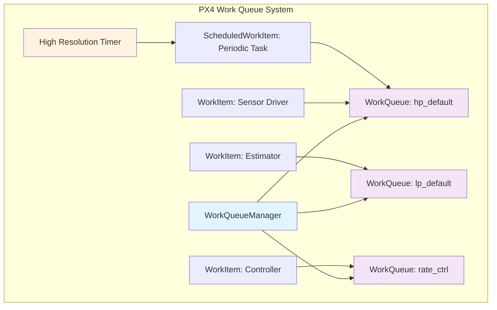
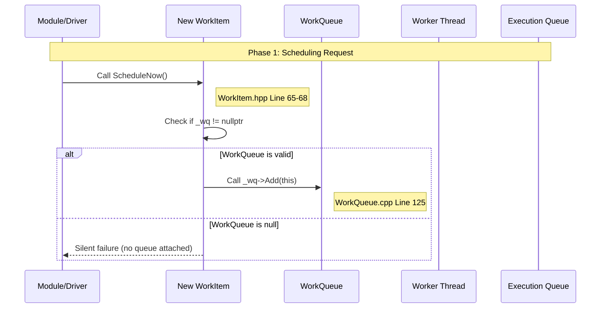
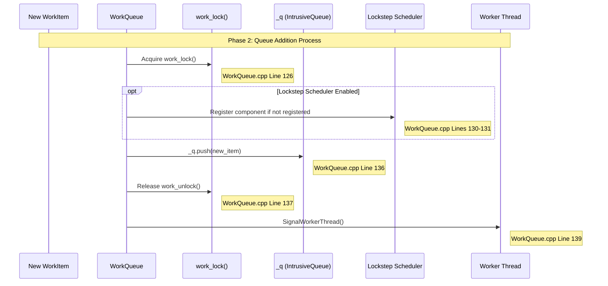
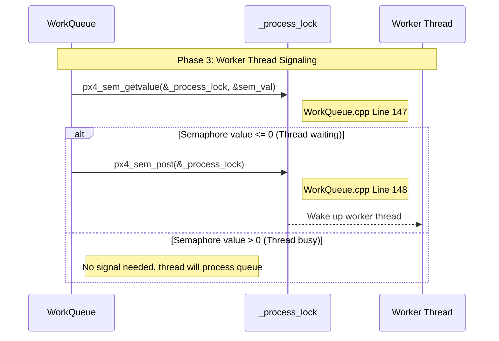
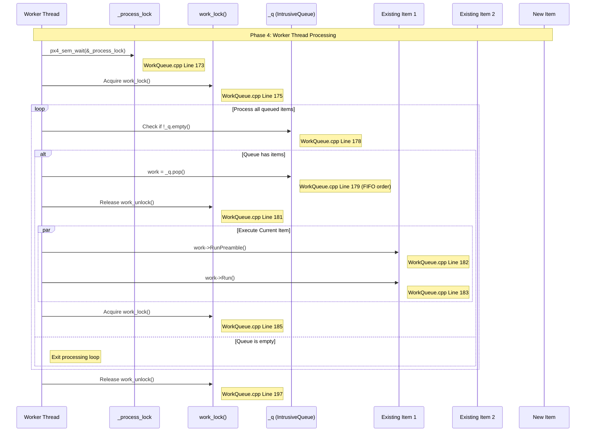
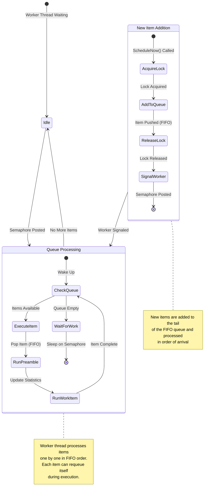
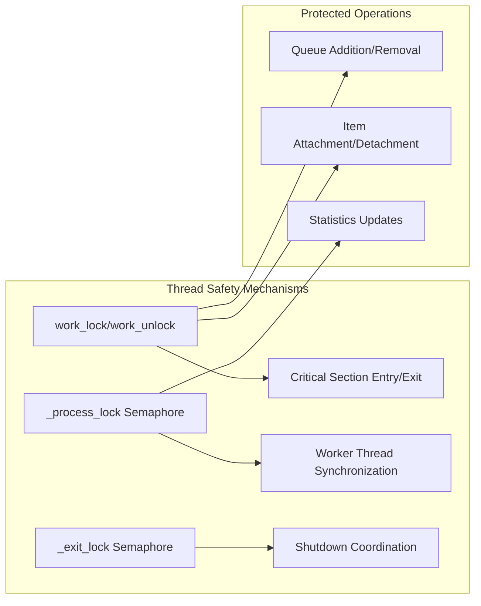

# PX4 Work Item Scheduling Flow Documentation

## Overview

This document demonstrates how a new work item gets scheduled in the PX4 work queue system when there are already items in the queue. The analysis is based on the actual PX4 source code functions and provides detailed flow diagrams showing the complete scheduling process.

## Table of Contents

1. [System Architecture](#system-architecture)
2. [Work Item Types](#work-item-types)
3. [Scheduling Scenarios](#scheduling-scenarios)
4. [Detailed Flow Analysis](#detailed-flow-analysis)
5. [Code References](#code-references)
6. [Performance Considerations](#performance-considerations)

## System Architecture

The PX4 work queue system consists of several key components:



## Work Item Types

### 1. Regular WorkItem
- **Purpose**: One-time or manual scheduling
- **Key Function**: `ScheduleNow()`
- **File**: `WorkItem.hpp` (Line 65-68)

### 2. ScheduledWorkItem
- **Purpose**: Periodic or timed execution
- **Key Functions**: `ScheduleDelayed()`, `ScheduleOnInterval()`, `ScheduleAt()`
- **File**: `ScheduledWorkItem.hpp` (Lines 50-70)

## Scheduling Scenarios

### Scenario: Adding a New Work Item to an Active Queue

**Initial State:**
- WorkQueue "hp_default" is running with 2 items already queued
- Worker thread is currently executing an item
- New item needs to be scheduled immediately

## Detailed Flow Analysis

### Phase 1: Work Item Scheduling Request



### Phase 2: Work Queue Addition Process



### Phase 3: Worker Thread Signaling



### Phase 4: Worker Thread Processing



### Complete System State Flow



## Code References

### Key Functions and Their Locations

| Function | File | Lines | Purpose |
|----------|------|-------|---------|
| `WorkItem::ScheduleNow()` | `WorkItem.hpp` | 65-68 | Entry point for immediate scheduling |
| `WorkQueue::Add()` | `WorkQueue.cpp` | 125-142 | Add item to execution queue |
| `WorkQueue::SignalWorkerThread()` | `WorkQueue.cpp` | 144-149 | Wake worker thread |
| `WorkQueue::Run()` | `WorkQueue.cpp` | 170-201 | Main worker thread loop |
| `ScheduledWorkItem::ScheduleDelayed()` | `ScheduledWorkItem.cpp` | 51-54 | Schedule with timer |

### Data Structures

1. **IntrusiveQueue<WorkItem *> _q**
   - **Type**: FIFO queue
   - **Location**: `WorkQueue.hpp` Line 90
   - **Purpose**: Stores work items waiting for execution

2. **px4_sem_t _process_lock**
   - **Type**: Semaphore (counting)
   - **Location**: `WorkQueue.hpp` Line 91
   - **Purpose**: Worker thread synchronization

3. **List<WorkItem *> _work_items**
   - **Type**: List of attached items
   - **Purpose**: Track all items attached to this queue

## Thread Safety Analysis

### Critical Sections



### Lock Hierarchy
1. **work_lock()** - Protects queue operations
2. **_process_lock** - Coordinates worker thread
3. **_exit_lock** - Manages shutdown synchronization

## Performance Considerations

### Timing Analysis

| Operation | Complexity | Time Cost |
|-----------|------------|-----------|
| Add to Queue | O(1) | ~1-2 μs |
| Signal Worker | O(1) | ~0.5-1 μs |
| Pop from Queue | O(1) | ~1-2 μs |
| Context Switch | O(1) | ~5-10 μs |

### Real-Time Characteristics

1. **Deterministic Scheduling**: FIFO order ensures predictable execution
2. **Priority Inheritance**: Work queues have different priorities
3. **Lockstep Support**: Optional deterministic simulation support
4. **Minimal Latency**: Direct semaphore signaling reduces delays

## Scheduling Examples

### Example 1: Sensor Driver Scheduling

```cpp
// From a sensor driver module
class SensorDriver : public WorkItem {
public:
    SensorDriver() : WorkItem("sensor_driver", wq_configurations::hp_default) {}

    void trigger_read() {
        ScheduleNow();  // Adds to hp_default queue immediately
    }

    void Run() override {
        // Read sensor data
        // Process data
        // Publish to uORB
    }
};
```

### Example 2: Periodic Controller

```cpp
// From a control module
class AttitudeController : public ScheduledWorkItem {
public:
    AttitudeController() :
        ScheduledWorkItem("mc_att_control", wq_configurations::rate_ctrl) {}

    void start() {
        ScheduleOnInterval(4000);  // 250 Hz = 4000 μs interval
    }

    void Run() override {
        // Read attitude estimates
        // Compute control outputs
        // Send actuator commands
    }
};
```

## Queue State Visualization

### Before New Item Addition
```
WorkQueue "hp_default" State:
┌─────────────────────────────────────┐
│ Worker Thread: [EXECUTING Item_A]  │
│                                     │
│ Execution Queue: [Item_B] [Item_C]  │
│                  ↑ head   ↑ tail    │
│                                     │
│ Attached Items: [Item_A, Item_B,   │
│                  Item_C, Item_D]    │
└─────────────────────────────────────┘
```

### After New Item Addition
```
WorkQueue "hp_default" State:
┌─────────────────────────────────────┐
│ Worker Thread: [EXECUTING Item_A]  │
│                                     │
│ Execution Queue: [Item_B] [Item_C]  │
│                           [Item_D]  │ ← New item added
│                  ↑ head   ↑ tail    │
│                                     │
│ Attached Items: [Item_A, Item_B,   │
│                  Item_C, Item_D]    │
└─────────────────────────────────────┘
```

## Conclusion

The PX4 work queue scheduling system provides:

1. **Thread-Safe Operations**: All queue modifications are protected by locks
2. **FIFO Ordering**: Items execute in the order they were scheduled
3. **Efficient Signaling**: Minimal overhead worker thread coordination
4. **Real-Time Guarantees**: Deterministic behavior for time-critical operations
5. **Scalable Design**: Multiple work queues with different priorities

The scheduling flow ensures that new work items are seamlessly integrated into the execution pipeline without disrupting ongoing operations, maintaining the real-time characteristics essential for flight control systems.
