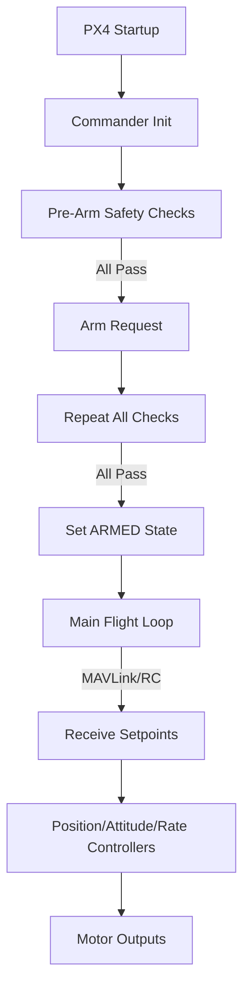
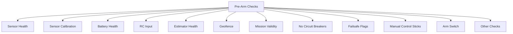
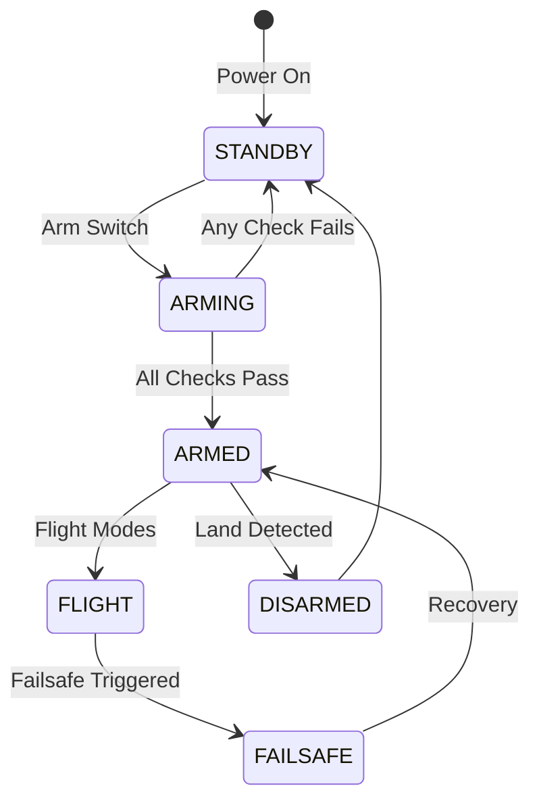
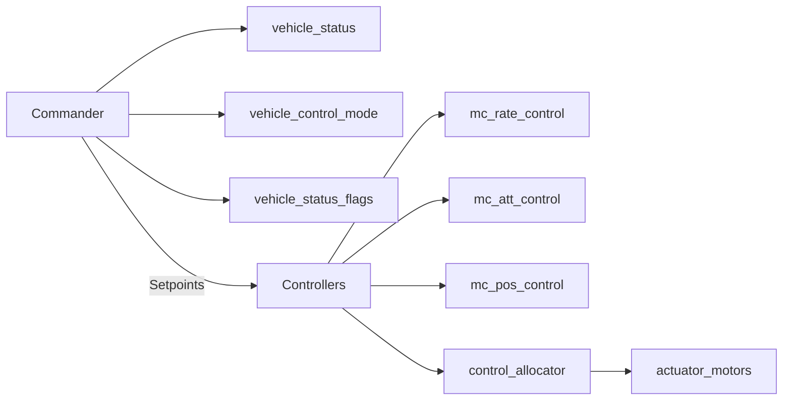
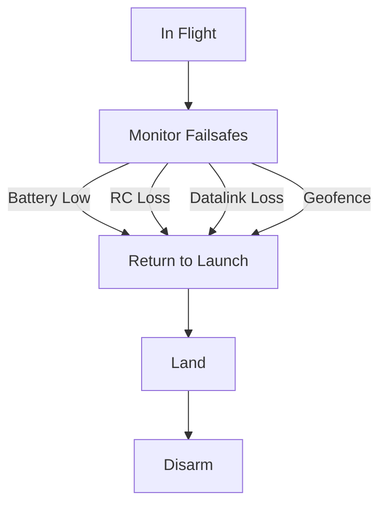
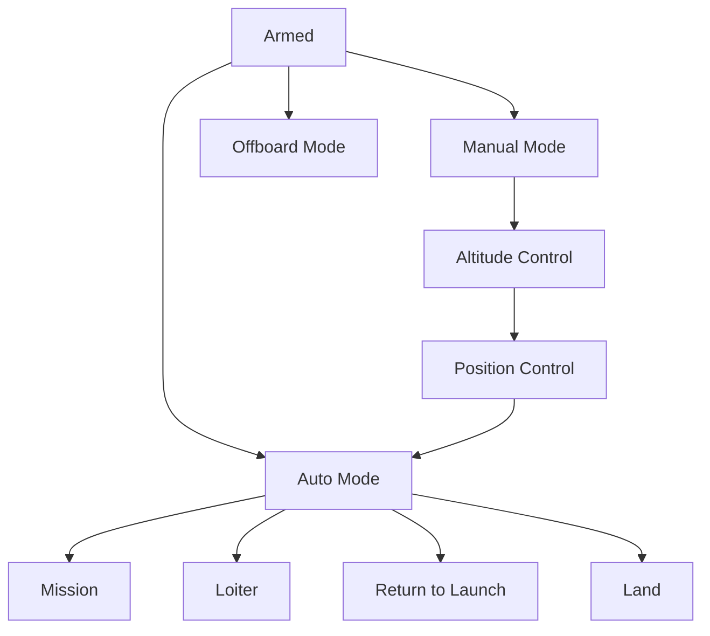

# PX4 Commander.cpp Hierarchy – Pictorial Representation

## 1. High-Level Commander Flow



---

## 2. Commander Pre-Arm Safety Checks (Expanded)



---

## 3. Commander State Machine (Simplified)



---

## 4. Commander to Controller Data Flow



---

## 5. Commander Arming Sequence (Detailed)

```mermaid
flowchart TD
    ARMREQ[Arm Request] --> CHECKS[Run All Pre-Arm Checks]
    CHECKS -->|Pass| SETARM[Set ARMED State]
    CHECKS -->|Fail| REJECT[Reject Arming]
    SETARM --> PUB[Publish vehicle_status]
    SETARM --> PUBMODE[Publish vehicle_control_mode]
    PUB --> CONTROLLERS
    REJECT --> []
```

---

## 6. Commander Failsafe Handling



---

## 7. Commander Mode Switching


