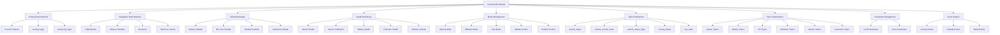

# PX4 Commander Module Hierarchy (Organizational Tree)

## Commander.cpp – Module/Submodule Hierarchy

```mermaid
graph TD
    CMD[Commander Module]
    CMD --> ARM[Arming State Machine]
    CMD --> NAV[Navigation State Machine]
    CMD --> FAILSAFE[Failsafe Manager]
    CMD --> HEALTH[Health Monitoring]
    CMD --> MODE[Mode Management]
    CMD --> PUBS[Topic Publications]
    CMD --> SUBS[Topic Subscriptions]
    CMD --> PARAMS[Parameter Management]
    CMD --> EVENTS[Event System]

    ARM --> PREARM[Pre-Arm Checks]
    ARM --> ARMLOGIC[Arming Logic]
    ARM --> DISARMLOGIC[Disarming Logic]

    NAV --> FLIGHTMODES[Flight Modes]
    NAV --> MISSION[Mission Handling]
    NAV --> GEOFENCE[Geofence]
    NAV --> RTL[Return to Launch]

    FAILSAFE --> BATFAIL[Battery Failsafe]
    FAILSAFE --> RCFAIL[RC Loss Failsafe]
    FAILSAFE --> LINKFAIL[Datalink Failsafe]
    FAILSAFE --> GEOFENCEFAIL[Geofence Failsafe]

    HEALTH --> SENSORS[Sensor Health]
    HEALTH --> CALIB[Sensor Calibration]
    HEALTH --> BATTERY[Battery Health]
    HEALTH --> ESTIMATOR[Estimator Health]
    HEALTH --> AIRFRAME[Airframe Checks]

    MODE --> MANUAL[Manual Mode]
    MODE --> OFFBOARD[Offboard Mode]
    MODE --> AUTO[Auto Mode]
    MODE --> ALTCTL[Altitude Control]
    MODE --> POSCTL[Position Control]

    PUBS --> VEHICLE_STATUS[vehicle_status]
    PUBS --> VEHICLE_CONTROL_MODE[vehicle_control_mode]
    PUBS --> FAILSAFE_FLAGS[vehicle_status_flags]
    PUBS --> ARMING_STATUS[arming_status]
    PUBS --> NAV_STATE[nav_state]

    SUBS --> SENSORSUB[Sensor Topics]
    SUBS --> BATTERYSUB[Battery Topics]
    SUBS --> RCSUB[RC Topics]
    SUBS --> ESTIMATORSUB[Estimator Topics]
    SUBS --> MISSION_SUB[Mission Topics]
    SUBS --> PARAMSUB[Parameter Topics]

    PARAMS --> LOADPARAMS[Load Parameters]
    PARAMS --> SAVEPARAMS[Save Parameters]

    EVENTS --> ARM_EVENT[Arming Events]
    EVENTS --> FAILSAFE_EVENT[Failsafe Events]
    EVENTS --> MODE_EVENT[Mode Events]
```
