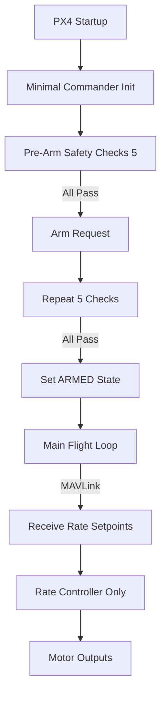
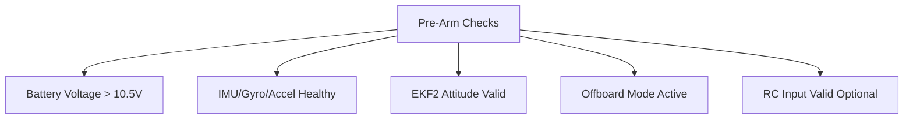
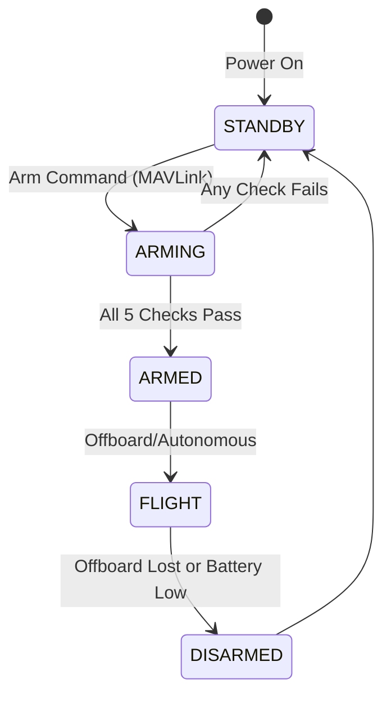
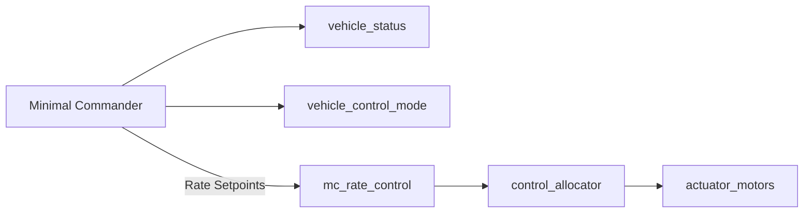

# Minimal Commander Hierarchy – Pictorial Representation




---

## 2. Minimal Commander Pre-Arm Safety Checks (Expanded)



---

## 3. Minimal Commander State Machine (Simplified)



---

## 4. Minimal Commander to Controller Data Flow



---

## 5. Minimal Commander Arming Sequence (Detailed)

```mermaid
flowchart TD
    ARMREQ[Arm Request] --> CHECKS[Run 5 Pre-Arm Checks]
    CHECKS -->|Pass| SETARM[Set ARMED State]
    CHECKS -->|Fail| REJECT[Reject Arming]
    SETARM --> PUB[Publish vehicle_status]
    SETARM --> PUBMODE[Publish vehicle_control_mode]
    PUB --> RATECTRL
    REJECT --> [*]
```

---

## 6. Minimal Commander Offboard/Autonomous Handling

```mermaid
flowchart TD
    ARMED[Armed] --> OFFBOARD[Offboard Mode]
    ARMED --> AUTONOMOUS[Autonomous Mode (if implemented)]
    OFFBOARD --> RATECTRL[mc_rate_control]
    AUTONOMOUS --> RATECTRL
    RATECTRL --> MOTORS[Motor Outputs]
```
