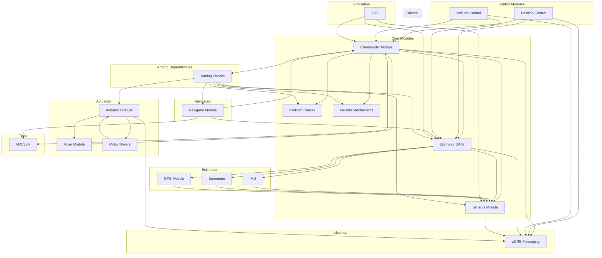

# PX4 Interdependencies Map

This document provides a complete map of interdependencies between modules, libraries, and drivers in the PX4 Autopilot system. The diagram below illustrates the relationships and dependencies between various components.

## Explanation

### Core Modules
- **Commander**: Manages the system state, including arming and disarming. Relies on preflight checks, sensors, and the estimator.
- **Preflight Checks**: Ensures all required modules are functional before arming.
- **Failsafe Mechanisms**: Triggered by missing or invalid data from other modules.

### Control Modules
- **Position Control**: Handles position stabilization and navigation.
- **Attitude Control**: Manages attitude stabilization.

### Estimation
- **EKF2**: Provides state estimation (position, velocity, attitude) using data from sensors.

### Actuation
- **Actuator Outputs**: Sends commands to motors/servos via the mixer.
- **Mixer**: Converts control commands into actuator outputs.

### Navigation
- **Navigator**: Handles mission planning and navigation.

### Drivers
- **IMU, Barometer, GPS**: Provide raw sensor data to the sensors module.
- **Motor Drivers**: Interface with the motors.

### Libraries
- **uORB Messaging**: Facilitates communication between modules.

### Tools
- **MAVLink**: Communication protocol for telemetry and control.

### Simulation
- **SITL**: Software-In-The-Loop simulation for testing.

### Arming Dependencies
- **Arming Checks**: A critical component that ensures all systems are ready for flight. It depends on:
  - **Preflight Checks**: Verifies the readiness of sensors, estimators, and other modules.
  - **Sensors**: Provides raw data required for state estimation and control.
  - **EKF2**: Supplies state estimation data (position, velocity, attitude).
  - **Failsafe Mechanisms**: Ensures the system can handle failures gracefully.
  - **Actuator Outputs**: Confirms that motors and servos are functional.
  - **Navigator**: Ensures mission planning and navigation systems are operational.

## Next Steps
- Use this map to identify and modify specific modules.
- Follow the interdependencies to ensure changes do not break the system.
